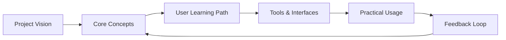
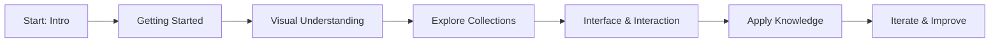
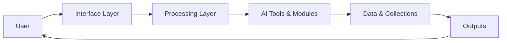

# 🌟 Laegna AI Basics — Intro / Overview

Welcome to the **Intro** folder of the *Laegna AI Basics* project.  
This directory provides a structured, user‑friendly entry point into the project’s learning materials.  

Two documents serve as “paired versions” of the same conceptual introduction:

- **This file** → `README.md` (current, polished, structured version)  
- **Original planning document** → [`../about.md`](../about.md) (historical, conceptual outline)

Together, they frame the purpose, scope, and structure of the project.  
Below, each file in this folder is introduced in the same order and conceptual flow as in the original `about.md`, but with a clearer, more accessible presentation.

---

## 📘 1. Introductory Documents  
These two files form the conceptual foundation of the project.

### 🔹 [`../about.md`](/about.md)  
A high‑level introduction to the entire Laegna AI Basics project.  
It explains the motivation, goals, and the general learning path.

### 🔹 `README.md` (this file)  
A refined, structured, user‑oriented version of the introduction.  
It acts as the **Table of Contents**, **navigator**, and **orientation guide** for the folder.

---

## 🚀 2. [`gettingstarted.md`](gettingstarted.md)  
A practical, hands‑on guide to begin using the tools and concepts in the project.  
Includes:

- 🛠️ Setup steps  
- 🧭 First interactions  
- 🧪 Simple examples  
- 🧩 How the pieces fit together  

This is the best place to start after reading the introduction.

---

## 🎨 3. [`visual.md`](visual.md)  
A visual‑first explanation of AI concepts and workflows.  
Uses diagrams, metaphors, and illustrations to make abstract ideas intuitive.

Covers:

- 🧠 How AI “sees” information  
- 🔄 Flow of data through tools  
- 🗺️ Conceptual maps of the system  

---

## 📚 4. [`collections.md`](collections.md)  
A structured set of grouped concepts, examples, and reusable patterns.  
Think of it as a **knowledge library**:

- 📦 Bundled examples  
- 🧱 Reusable building blocks  
- 🔗 Cross‑referenced concepts  

This file helps you navigate the project’s conceptual landscape.

---

## 🖥️ 5. [`interface.md`](interface.md)  
A user‑level and system‑level view of how interfaces work in the project:

- 🖱️ User interactions  
- 🧩 Tool integration  
- 🔌 How components communicate  
- 🧭 Interaction flows  

This file connects the conceptual and practical sides of the project.

---

# 🧩 How These Files Fit Together

The structure of this folder mirrors the conceptual flow of the project:

```
Intro (folder)
├── README.md          ← You are here
├── gettingstarted.md
├── visual.md
├── collections.md
├── interface.md
└── ../about.md        ← Original conceptual outline
```

---

# 🧠 Conceptual Flow Diagram



---

# 🔄 User‑Level Learning Path



---

# 🧩 System‑Level / Tool‑Level Structure



---

# 🎯 Summary

This folder provides:

- A **clear entry point** (`README.md`)  
- A **historical reference** (`../about.md`)  
- A **step‑by‑step onboarding path** (`gettingstarted.md`)  
- A **visual explanation layer** (`visual.md`)  
- A **concept library** (`collections.md`)  
- A **system/interface overview** (`interface.md`)  

Together, they form the foundation of the Laegna AI Basics learning experience.

