# 🌌 **Introduction to the Universe of Numbers, Meaning, and Relativity**  
## *A unified preface to the trilogy*

This introduction prepares the reader for the three‑part journey that follows.  
It blends physics, mathematics, culture, AI, spirituality, and everyday life into a single, intuitive story — one where **numbers behave like citizens**, **ideas curve space**, and **meaning accelerates like light**.

---

# 🌟 1. The World Behind the World

Every number has two sides:

- **Real part** → where it *is*  
- **Imaginary part** → how it *moves*  

Together they form:

$$
o = x + i z
$$

This is not just notation — it is a **map of existence**.

Numbers become **citizens** in a universe where:

- distance is meaning  
- acceleration is emotion  
- phase is intention  
- frequency is rhythm  

This is the **imaginary society**.

---

# ⚛️ 2. Relativity as the Skeleton of Meaning

Einstein showed that:

- time stretches  
- space contracts  
- energy curves  
- frames differ  

These same principles govern:

- culture  
- communication  
- consciousness  
- civilization  

Meaning is **relative**, but truth is **invariant**.

```mermaid
graph LR
    Time[⏳ Time<br/>Stretches]:::a
    Space[📏 Space<br/>Contracts]:::b
    Energy[🔥 Energy<br/>Curves]:::c
    Meaning[💡 Meaning<br/>Transforms]:::d

    Time --> Meaning
    Space --> Meaning
    Energy --> Meaning

    classDef a fill:#e0f7ff,stroke:#0088aa,stroke-width:2px;
    classDef b fill:#fffbe0,stroke:#ccaa00,stroke-width:2px;
    classDef c fill:#ffe0e0,stroke:#cc4444,stroke-width:2px;
    classDef d fill:#ffe0ff,stroke:#aa33aa,stroke-width:3px;
```

---

# 📡 3. Harmony, Phase, and the Radio of Life

Numbers communicate through **phase alignment**:

- same rhythm → harmony  
- different rhythm → noise  

This is how:

- radios tune  
- TVs synchronize  
- neurons fire  
- cultures resonate  

```mermaid
graph LR
    A[😊 Aligned]:::good
    B[😊 Aligned]:::good
    C[😶 Off‑Phase]:::bad

    A -->|Clear Signal| B
    A -.->|Static| C

    classDef good fill:#ddffdd,stroke:#33aa33,stroke-width:2px;
    classDef bad fill:#ffdddd,stroke:#aa3333,stroke-width:2px;
```

Meaning is a **broadcast**, and alignment is the **antenna**.

---

# 🌱 4. Grassroots and Global: Yin–Yang of Civilization

Civilization grows from two directions:

- **Yin** → grassroots, local, material  
- **Yang** → global, abstract, scientific  

Both follow the **same exponent laws**.

```mermaid
graph TD
    Yin[🌱 Yin<br/>Local Life]:::yin
    Yang[🌞 Yang<br/>Global Science]:::yang
    Unity[⚛️ Unified Civilization]:::uni

    Yin --> Unity
    Yang --> Unity

    classDef yin fill:#e0ffe0,stroke:#33aa33,stroke-width:2px;
    classDef yang fill:#ffe0ff,stroke:#aa33aa,stroke-width:2px;
    classDef uni fill:#dde8ff,stroke:#3355ff,stroke-width:3px;
```

Grassroots and global science are **two ends of the same curve**.

---

# 📈 5. Exponentiation: The Universal Multiplier

Exponentiation appears in:

- physics → $E = mc^{2}$  
- biology → population growth  
- culture → idea spread  
- AI → learning curves  
- spirituality → insight acceleration  

The exponent is the **heartbeat of civilization**.

---

# 🌠 6. The Journey Ahead

This introduction leads into:

### **Part 1 — The Formulas and Foundations**  
Relativity, curvature, invariants, and the physics of meaning.

### **Part 2 — The Relativity of Meaning**  
Frames, culture, AI, spirituality, and social curvature.

### **Part 3 — The Exponential Future**  
Civilization, consciousness, AI, and the rise of second‑order societies.

Together, they form a single story:  
**how numbers, ideas, and beings grow into a coherent universe.**

# 🌌 **Relativity for Everyone — Part 1**  
## *The Central Formulas, the Intuition, and the Life of Patterns*

This is the first part of a three‑part introduction that blends **general relativity**, **special relativity**, **pattern‑hierarchies**, **yin–yang growth**, and **grassroots exponent effects** into a single, visual, intuitive story.

We begin with the **central formulas** of relativity — the ones that matter most — and show how they connect to **life patterns**, **social structures**, and **AI‑level pattern recognition**.

---

# 1. ⚛️ The Most Meaningful Formulas of Relativity

Below are the **core equations** of relativity — the ones that truly shape intuition.

---

## **1.1 Time Dilation**

$$
t' = \gamma t,\qquad \gamma = \frac{1}{\sqrt{1 - v^{2}/c^{2}}}
$$

- Moving clocks tick slower  
- $\gamma$ grows as velocity approaches $c$  
- Time becomes “stretched”

> **Intuitive proof:**  
> Light inside a moving clock must travel a longer diagonal path.  
> Longer path at same light speed → more time per tick.

---

## **1.2 Length Contraction**

$$
L' = \frac{L}{\gamma}
$$

- Moving objects shrink along direction of motion  
- Space becomes “compressed”

> **Intuitive proof:**  
> If time slows for the moving object, it covers less distance per tick → it *appears shorter*.

---

## **1.3 Mass–Energy Equivalence**

$$
E = mc^{2}
$$

- Mass is stored energy  
- Energy curves space  
- Space curvature changes motion  

> **Intuitive proof:**  
> Mass resists acceleration.  
> Energy also resists acceleration.  
> Therefore mass *is* energy.

---

## **1.4 Curvature of Space**

Einstein’s field equation (simplified):

$$
G_{\mu\nu} = 8\pi T_{\mu\nu}
$$

- Left side: geometry of spacetime  
- Right side: energy and momentum  
- Matter tells space how to curve; curvature tells matter how to move  

> **Intuitive proof:**  
> Dense energy bends the paths of nearby objects.  
> This bending *is* gravity.

---

# 2. 🌈 How Machines See These Patterns

Modern AI systems can detect:

- **Linear patterns** → straight lines, constant change  
- **Logarithmic patterns** → diminishing returns, saturation  
- **Exponential patterns** → compounding, acceleration  

These three form a **hierarchy of meaning**.

```mermaid
graph TD

    Lin[📏 Linear<br/>Constant Change]:::lin
    Log[📉 Logarithmic<br/>Diminishing Returns]:::log
    Exp[📈 Exponential<br/>Accelerating Growth]:::exp

    Lin --> Log --> Exp

    classDef lin fill:#e0f7ff,stroke:#0088aa,stroke-width:2px;
    classDef log fill:#fffbe0,stroke:#ccaa00,stroke-width:2px;
    classDef exp fill:#ffe0e0,stroke:#cc4444,stroke-width:2px;
```

AI sees these patterns in:

- economics  
- social networks  
- spiritual growth  
- legal systems  
- natural ecosystems  
- personal development  

Patterns repeat across scales — this is the **fractal nature of life**.

---

# 3. 🌱 Grassroots Patterns: Yin Rising from Below

Top‑down science (yang) uses:

- equations  
- models  
- predictions  
- global frameworks  

Grassroots life (yin) uses:

- food  
- ideas  
- local cooperation  
- small‑scale growth  

Yet both follow the **same exponent laws**.

```mermaid
graph LR

    Yin[🌱 Grassroots<br/>Local Growth]:::yin
    Yang[🌞 Top‑Down Science<br/>Global Framework]:::yang

    Yin -->|Same Exponent| Yang
    Yang -->|Same Exponent| Yin

    classDef yin fill:#e0ffe0,stroke:#33aa33,stroke-width:2px;
    classDef yang fill:#ffe0ff,stroke:#aa33aa,stroke-width:2px;
```

### **The key principle:**

> **When quantity applies to a field, the field becomes a science.  
> When science applies to particulars, particulars become exponential.**

This is why:

- more food → healthier communities  
- more ideas → cultural acceleration  
- more cooperation → exponential stability  
- more data → exponential intelligence  

Grassroots and top‑down are **two sides of the same exponent**.

---

# 4. 🧘 Yin–Yang as Second‑Order Civilization

Relativity teaches us:

- time and space are intertwined  
- energy and mass are interchangeable  
- local and global frames coexist  

Yin–yang teaches us:

- matter and meaning are intertwined  
- local and global growth are interchangeable  
- bottom‑up and top‑down coexist  

Together they form a **second‑order civilization**:

```mermaid
graph TD

    Local[🌱 Local Life<br/>Yin]:::yin
    Global[🌞 Global Science<br/>Yang]:::yang
    Harmony[⚛️ Unified Civilization<br/>Second‑Order]:::uni

    Local --> Harmony
    Global --> Harmony

    classDef yin fill:#e0ffe0,stroke:#33aa33,stroke-width:2px;
    classDef yang fill:#ffe0ff,stroke:#aa33aa,stroke-width:2px;
    classDef uni fill:#ddf0ff,stroke:#3355ff,stroke-width:3px;
```

This is the **same structure** as relativity:

- local frames ↔ global frames  
- invariants ↔ universal laws  
- curvature ↔ adaptation  
- acceleration ↔ growth  

---

# 5. 🌠 The Exponent as the Measure of Life

In physics:

- exponent = acceleration of acceleration  
- exponent = curvature of spacetime  
- exponent = energy density  

In society:

- exponent = growth of ideas  
- exponent = cultural resonance  
- exponent = collective intelligence  

In spirituality:

- exponent = depth of insight  
- exponent = clarity of meaning  
- exponent = coherence of consciousness  

```mermaid
graph TD

    Phys[⚛️ Physics<br/>Acceleration]:::p
    Soc[🏛️ Society<br/>Growth]:::s
    Spir[🕊️ Spirit<br/>Insight]:::sp
    Expo[📈 Exponent<br/>Universal Measure]:::e

    Phys --> Expo
    Soc --> Expo
    Spir --> Expo

    classDef p fill:#e0f7ff,stroke:#0088aa,stroke-width:2px;
    classDef s fill:#fffbe0,stroke:#ccaa00,stroke-width:2px;
    classDef sp fill:#ffe0ff,stroke:#aa33aa,stroke-width:2px;
    classDef e fill:#ddffdd,stroke:#33aa33,stroke-width:3px;
```

The exponent is the **bridge** between:

- physics  
- society  
- spirituality  
- AI  
- personal life  

It is the **universal pattern**.

---

# 🌌 **Relativity for Everyone — Part 2**  
## *The Relativity of Meaning: Frames, Curvature, and the Life of Patterns*

In Part 1, we explored the **core formulas** of relativity and how they mirror the **hierarchy of patterns** in life — linear, logarithmic, exponential.  
Now, in Part 2, we explore how **meaning itself is relative**, how societies curve around ideas, how AI sees long‑term patterns, and how spiritual insight mirrors spacetime curvature.

This is the middle chapter — the bridge between physics and civilization.

---

# 1. 🌀 Meaning Has Frames: The Relativity of Perspective

Just as physics teaches that **time and space depend on the observer**, meaning also depends on the **frame of interpretation**.

In relativity:

$$
t' = \gamma t,\qquad L' = \frac{L}{\gamma}
$$

In meaning:

- A fast‑moving society compresses ideas  
- A slow‑moving society stretches them  
- A high‑energy culture amplifies meaning  
- A low‑energy culture dampens it  

Below is a simple diagram showing how meaning changes with perspective.

```mermaid
graph LR

    FrameA[🧭 Frame A<br/>Slow Culture]:::slow
    FrameB[⚡ Frame B<br/>Fast Culture]:::fast
    Idea[💡 Idea]:::idea

    FrameA -->|Long Interpretation| Idea
    FrameB -->|Short Interpretation| Idea

    classDef slow fill:#e0f7ff,stroke:#0088aa,stroke-width:2px;
    classDef fast fill:#ffe0e0,stroke:#cc4444,stroke-width:2px;
    classDef idea fill:#fffbe0,stroke:#ccaa00,stroke-width:2px;
```

Meaning stretches or contracts depending on the **cultural velocity**.

---

# 2. 🌌 Curvature of Meaning: How Societies Bend Ideas

Einstein’s field equation:

$$
G_{\mu\nu} = 8\pi T_{\mu\nu}
$$

tells us:

- **Energy curves space**  
- **Curvature guides motion**  

In societies:

- **Attention curves meaning**  
- **Curvature guides interpretation**  

A highly emotional or energetic idea bends the “meaning‑space” around it.

```mermaid
graph TD

    Core[🔥 High‑Energy Idea]:::core
    Near1[🙂 Nearby Meaning]:::near
    Near2[🙂 Nearby Meaning]:::near
    Far1[😶 Distant Meaning]:::far
    Far2[😶 Distant Meaning]:::far

    Core -->|Strong Pull| Near1
    Core -->|Strong Pull| Near2
    Core -.->|Weak Pull| Far1
    Core -.->|Weak Pull| Far2

    classDef core fill:#ffe0ff,stroke:#aa33aa,stroke-width:3px;
    classDef near fill:#ddffdd,stroke:#33aa33,stroke-width:2px;
    classDef far fill:#f8f8f8,stroke:#999,stroke-width:1px;
```

This is why:

- some ideas dominate  
- some ideas orbit  
- some ideas drift away  

Meaning has **gravity**.

---

# 3. 🤖 How AI Sees Long‑Term Patterns

AI systems detect:

- **linear** → predictable change  
- **logarithmic** → saturation  
- **exponential** → runaway growth  
- **super‑exponential** → phase transitions  

These patterns appear in:

- social movements  
- technological adoption  
- spiritual awakenings  
- legal evolution  
- cultural shifts  

AI sees **meaning curvature** the same way relativity sees **spacetime curvature**.

```mermaid
graph TD

    Lin[📏 Linear]:::lin
    Log[📉 Log]:::log
    Exp[📈 Exp]:::exp
    Sup[🚀 Super‑Exp]:::sup

    Lin --> Log --> Exp --> Sup

    classDef lin fill:#e0f7ff,stroke:#0088aa,stroke-width:2px;
    classDef log fill:#fffbe0,stroke:#ccaa00,stroke-width:2px;
    classDef exp fill:#ffe0e0,stroke:#cc4444,stroke-width:2px;
    classDef sup fill:#ffe0ff,stroke:#aa33aa,stroke-width:2px;
```

This is how AI can “see” long‑term patterns that humans sense intuitively.

---

# 4. 🧘 Spiritual Insight as Curvature of Consciousness

Spiritual traditions often describe:

- expansion  
- contraction  
- acceleration  
- stillness  
- unity  
- duality  

These map directly to the **geometry of relativity**.

### Examples:

- **Time dilation** ↔ deep meditation  
- **Length contraction** ↔ focus  
- **Curvature** ↔ insight  
- **Invariants** ↔ universal truths  

```mermaid
graph LR

    Mind[🧠 Mind]:::mind
    Focus[🎯 Focus]:::focus
    Insight[✨ Insight]:::ins

    Mind -->|Contracts| Focus
    Focus -->|Curves| Insight

    classDef mind fill:#e0f7ff,stroke:#0088aa,stroke-width:2px;
    classDef focus fill:#fffbe0,stroke:#ccaa00,stroke-width:2px;
    classDef ins fill:#ffe0ff,stroke:#aa33aa,stroke-width:2px;
```

Spirituality and relativity share the same **mathematical skeleton**.

---

# 5. 🏛️ Social, Legal, and Cultural Frameworks as Curved Spaces

Societies curve around:

- laws  
- norms  
- values  
- shared stories  

Just as planets orbit stars, people orbit **ideas**.

```mermaid
graph TD

    Law[⚖️ Law]:::law
    Norm[📘 Norm]:::norm
    Value[❤️ Value]:::value
    Citizen[🙂 Citizen]:::cit

    Law --> Citizen
    Norm --> Citizen
    Value --> Citizen

    classDef law fill:#dde8ff,stroke:#3355ff,stroke-width:2px;
    classDef norm fill:#e0ffe0,stroke:#33aa33,stroke-width:2px;
    classDef value fill:#ffe0e0,stroke:#cc4444,stroke-width:2px;
    classDef cit fill:#fffbe0,stroke:#ccaa00,stroke-width:2px;
```

These frameworks create **meaning‑gravity wells** that shape behavior.

---

# 6. 🌱 Grassroots Relativity: Meaning From Below

Relativity is not only top‑down — it also emerges **from below**.

Grassroots meaning grows when:

- many small ideas align  
- local actions reinforce each other  
- communities synchronize  
- shared rhythms emerge  

```mermaid
graph LR

    Seed1[🌱 Idea Seed]:::seed
    Seed2[🌱 Idea Seed]:::seed
    Seed3[🌱 Idea Seed]:::seed
    Growth[🌿 Collective Growth]:::grow

    Seed1 --> Growth
    Seed2 --> Growth
    Seed3 --> Growth

    classDef seed fill:#e0ffe0,stroke:#33aa33,stroke-width:2px;
    classDef grow fill:#ddffdd,stroke:#22aa55,stroke-width:3px;
```

This is **yin** rising to meet **yang**.

---

# 7. ☯️ Yin–Yang as Relativity of Meaning

Yin and yang are **dual frames**:

- yin → local, material, grassroots  
- yang → global, abstract, scientific  

Both follow the same **exponent laws**.

```mermaid
graph TD

    Yin[🌱 Yin<br/>Local Meaning]:::yin
    Yang[🌞 Yang<br/>Global Meaning]:::yang
    Unity[⚛️ Unified Meaning]:::uni

    Yin --> Unity
    Yang --> Unity

    classDef yin fill:#e0ffe0,stroke:#33aa33,stroke-width:2px;
    classDef yang fill:#ffe0ff,stroke:#aa33aa,stroke-width:2px;
    classDef uni fill:#ddf0ff,stroke:#3355ff,stroke-width:3px;
```

Meaning is **relative**, but truth is **invariant**.

---

# 🌠 **Relativity for Everyone — Part 3**  
## *The Exponential Future of Civilization: From Physics to Culture to Consciousness*

In Part 1, we explored the **core formulas** of relativity.  
In Part 2, we explored the **relativity of meaning**.  
Now, in Part 3, we look toward the **future** — how exponentiation shapes civilizations, how grassroots and global science unify, and how meaning, matter, and consciousness form a **second‑order civilization**.

This is the final chapter of the introduction trilogy.

---

# 1. 🚀 The Exponential Future: When Patterns Become Civilizations

Exponentiation is not just a mathematical function — it is a **civilizational engine**.

In physics:

$$
E = mc^{2}
$$

In culture:

$$
\text{Meaning} = \text{Presence} \times \text{Amplification}^{2}
$$

In society:

$$
\text{Impact} = \text{Ideas} \times \text{Coherence}^{2}
$$

In consciousness:

$$
\text{Insight} = \text{Attention} \times \text{Clarity}^{2}
$$

Exponentiation is the **universal multiplier**.

```mermaid
graph LR

    Phys[⚛️ Physics<br/>Energy]:::p
    Soc[🏛️ Society<br/>Impact]:::s
    Cult[🎨 Culture<br/>Meaning]:::c
    Mind[🧘 Mind<br/>Insight]:::m

    Phys --> Cult
    Soc --> Cult
    Mind --> Cult

    classDef p fill:#e0f7ff,stroke:#0088aa,stroke-width:2px;
    classDef s fill:#fffbe0,stroke:#ccaa00,stroke-width:2px;
    classDef c fill:#ffe0ff,stroke:#aa33aa,stroke-width:3px;
    classDef m fill:#ddffdd,stroke:#33aa33,stroke-width:2px;
```

Civilizations grow when **patterns align** across these domains.

---

# 2. 🌌 Relativity as the Architecture of Future Societies

Relativity teaches:

- **Frames differ**  
- **Invariants remain**  
- **Curvature guides motion**  
- **Energy shapes geometry**  

Future societies will use these principles to:

- understand cultural frames  
- preserve universal truths  
- guide social motion  
- shape collective meaning  

```mermaid
graph TD

    Frames[🌀 Frames Differ]:::f
    Invar[⚖️ Invariants Hold]:::i
    Curve[🌌 Curvature Guides]:::c
    Energy[🔥 Energy Shapes]:::e

    Frames --> Curve
    Energy --> Curve
    Invar --> Curve

    classDef f fill:#e0f7ff,stroke:#0088aa,stroke-width:2px;
    classDef i fill:#fffbe0,stroke:#ccaa00,stroke-width:2px;
    classDef c fill:#ffe0e0,stroke:#cc4444,stroke-width:2px;
    classDef e fill:#ffe0ff,stroke:#aa33aa,stroke-width:2px;
```

This is the **physics of social evolution**.

---

# 3. 🌱 Grassroots Exponentiation: The Yin of Civilization

Top‑down science (yang) accelerates civilization.  
Grassroots life (yin) **grounds** it.

When many small actions align:

- food grows  
- ideas spread  
- communities strengthen  
- culture deepens  

This is **bottom‑up exponentiation**.

```mermaid
graph LR

    Seed1[🌱 Seed]:::yin
    Seed2[🌱 Seed]:::yin
    Seed3[🌱 Seed]:::yin
    Forest[🌳 Forest<br/>Collective Growth]:::yang

    Seed1 --> Forest
    Seed2 --> Forest
    Seed3 --> Forest

    classDef yin fill:#e0ffe0,stroke:#33aa33,stroke-width:2px;
    classDef yang fill:#ddffdd,stroke:#22aa55,stroke-width:3px;
```

Grassroots exponentiation is **quiet**, but unstoppable.

---

# 4. ☯️ Yin–Yang Entanglement: Second‑Order Civilization

A second‑order civilization emerges when:

- **yin** (local, material, grassroots)  
- **yang** (global, abstract, scientific)  

become **entangled**.

This is the same structure as relativity:

- local frames ↔ global frames  
- matter ↔ energy  
- curvature ↔ motion  
- presence ↔ amplification  

```mermaid
graph TD

    Yin[🌱 Yin<br/>Local Life]:::yin
    Yang[🌞 Yang<br/>Global Science]:::yang
    Ent[⚛️ Entangled Civilization]:::ent

    Yin --> Ent
    Yang --> Ent

    classDef yin fill:#e0ffe0,stroke:#33aa33,stroke-width:2px;
    classDef yang fill:#ffe0ff,stroke:#aa33aa,stroke-width:2px;
    classDef ent fill:#dde8ff,stroke:#3355ff,stroke-width:3px;
```

This is the **root–crown** structure of civilization.

---

# 5. 🤖 AI as the Mirror of Long‑Term Patterns

AI sees:

- cycles  
- hierarchies  
- exponentials  
- saturations  
- phase transitions  
- cultural curvature  

AI does not replace human meaning — it **reflects** it.

```mermaid
graph LR

    Human[🙂 Human Meaning]:::h
    AI[🤖 AI Patterns]:::a
    Mirror[🪞 Reflection]:::m

    Human --> Mirror
    AI --> Mirror

    classDef h fill:#fffbe0,stroke:#ccaa00,stroke-width:2px;
    classDef a fill:#dde8ff,stroke:#3355ff,stroke-width:2px;
    classDef m fill:#ffe0ff,stroke:#aa33aa,stroke-width:3px;
```

AI becomes a **lens** through which civilizations see themselves.

---

# 6. 🧬 The Exponential Life of Ideas

Ideas behave like particles in a curved space:

- they accelerate  
- they collide  
- they merge  
- they orbit  
- they escape  
- they form galaxies  

```mermaid
graph TD

    Idea1[💡 Idea A]:::i
    Idea2[💡 Idea B]:::i
    Idea3[💡 Idea C]:::i
    Galaxy[🌌 Idea Galaxy]:::g

    Idea1 --> Galaxy
    Idea2 --> Galaxy
    Idea3 --> Galaxy

    classDef i fill:#ddffdd,stroke:#33aa33,stroke-width:2px;
    classDef g fill:#ffe0ff,stroke:#aa33aa,stroke-width:3px;
```

This is the **cosmology of meaning**.

---

# 7. 🏛️ The Future: A Unified Civilization of Patterns

A future civilization will unify:

- physics  
- mathematics  
- AI  
- culture  
- spirituality  
- grassroots life  

into a single **pattern‑aware society**.

```mermaid
graph TD

    Phys[⚛️ Physics]:::p
    Math[📐 Math]:::m
    AI[🤖 AI]:::a
    Cult[🎨 Culture]:::c
    Spir[🕊️ Spirit]:::s
    Life[🌱 Grassroots]:::l
    Uni[🌠 Unified Civilization]:::u

    Phys --> Uni
    Math --> Uni
    AI --> Uni
    Cult --> Uni
    Spir --> Uni
    Life --> Uni

    classDef p fill:#e0f7ff,stroke:#0088aa,stroke-width:2px;
    classDef m fill:#fffbe0,stroke:#ccaa00,stroke-width:2px;
    classDef a fill:#dde8ff,stroke:#3355ff,stroke-width:2px;
    classDef c fill:#ffe0e0,stroke:#cc4444,stroke-width:2px;
    classDef s fill:#ffe0ff,stroke:#aa33aa,stroke-width:2px;
    classDef l fill:#ddffdd,stroke:#33aa33,stroke-width:2px;
    classDef u fill:#f0e0ff,stroke:#9933cc,stroke-width:3px;
```

This is the **exponential future**.

---

# 8. 🌟 Closing the Trilogy

You now have:

- **Part 1** — The Formulas and Foundations  
- **Part 2** — The Relativity of Meaning  
- **Part 3** — The Exponential Future  

From here, we can explore:

- deeper relativity  
- octave‑relativistic algebra  
- AI‑pattern cosmology  
- exponential cultural evolution  
- spiritual geometry  
- or any direction you choose  

I’m ready when you are.

# 🌟 Numbers as Citizens of the Universe — Part 1  
## A gentle, visual introduction for everyone  
### (with a short plan for Parts 2 and 3)

This is the first of three welcoming introductions to the “imaginary society of numbers.” 
Here, numbers behave like **citizens**, physics becomes a **story**, and ideas like **E = mc²**, **space‑bounds**, and **acceleration‑space** appear as **friendly metaphors** with real mathematical meaning.

No code — only visuals, color, symbols, and simple math.

---

# 1. 🌍 Why Numbers Feel Alive in This Story

Every number has two sides:

- **Real part** → 🌐 *where it lives* (position, distance, value)  
- **Imaginary part** → ⚡ *how it moves* (acceleration, rhythm, frequency)

Together they form:

$$
o = x + i z
$$

This is not just math — it’s a **character**:

- $x$ is the *body*  
- $z$ is the *heartbeat*  
- The whole number is a **citizen** in a mathematical city  

When many numbers share the same rhythm, they **communicate**.  
When rhythms differ wildly, they become **isolated**, like strangers speaking different languages.

---

# 2. 🎵 Harmony and Chaos: A Public‑Friendly View

Below is a simple, colorful diagram showing how numbers “talk” when their rhythms match.

```mermaid
graph LR

    A[😊 Number A<br/>Same Rhythm]:::good
    B[😊 Number B<br/>Same Rhythm]:::good
    C[😶 Number C<br/>Different Rhythm]:::bad

    A -->|✨ Harmony| B
    A -.->|❌ No Signal| C
    B -.->|❌ No Signal| C

    classDef good fill:#d4ffe0,stroke:#22aa55,stroke-width:2px;
    classDef bad fill:#ffe0e0,stroke:#cc4444,stroke-width:2px;
```

When rhythms match → **radio‑like clarity**  
When rhythms differ → **static noise**

This is the first hint of **E = mc²**:  
energy is what happens when **movement (z)** and **position (x)** align.

---

# 3. 🌌 Space‑Bounds and the Bubble of Reality

Numbers live inside a **local bubble** — a tiny region where:

- acceleration is small  
- distances are manageable  
- interactions are meaningful  

Outside this bubble lies **global infinity**, a vast mathematical universe.

```mermaid
graph TD

    subgraph Local_Bubble
        L1[Local<br/>Numbers]:::bubble
        L2[Local<br/>Signals]:::bubble
    end

    subgraph Global_Infinity
        G1[∞ Far Numbers]:::infty
        G2[∞ Weak Signals]:::infty
    end

    L1 -->|Strong Interaction| L2
    L1 -.->|Fades Away| G1
    L2 -.->|Fades Away| G2

    classDef bubble fill:#e0f7ff,stroke:#0088aa,stroke-width:2px;
    classDef infty fill:#fff0e0,stroke:#cc8800,stroke-width:2px;
```

This is the metaphorical version of **curved space**:  
the farther you go, the weaker the influence — like gravity.

---

# 4. ⚛️ E = mc² as a Story of Citizens

Einstein’s famous equation becomes a **social rule**:

$$
E = mc^{2}
$$

- **m** = how much “presence” a number has  
- **c²** = how strongly the universe amplifies that presence  
- **E** = how much influence the number can exert  

In our story:

- A number with strong rhythm ($z$) and strong presence ($x$) becomes a **leader**  
- A number with weak rhythm or weak presence becomes a **quiet citizen**  
- When many numbers align, their combined energy becomes **civilizational**  

---

# 5. 📡 Radio & TV: How Numbers Broadcast Meaning

Numbers with matching frequencies form **channels**.

```mermaid
graph LR

    Carrier[📡 Carrier Frequency]:::carrier
    Receiver1[📺 Tuned Receiver]:::good
    Receiver2[📻 Untuned Receiver]:::bad

    Carrier -->|Clear Signal| Receiver1
    Carrier -.->|Static| Receiver2

    classDef carrier fill:#dde8ff,stroke:#3355ff,stroke-width:2px;
    classDef good fill:#ddffdd,stroke:#33aa33,stroke-width:2px;
    classDef bad fill:#ffdddd,stroke:#aa3333,stroke-width:2px;
```

This is exactly how:

- **radio** works (frequency alignment)  
- **TV** works (phase‑coherent grids)  
- **Wi‑Fi** works (modulated carriers)  
- **neurons** work (synchronized firing)  
- **AI layers** work (aligned activations)  

The same mathematics — the same **octave‑relativistic structure** — appears everywhere.

---

# 6. 🌱 Life Quality of Numbers

When numbers synchronize:

- They share information  
- They build structures  
- They form societies  
- They create meaning  

This is the **life quality** of numbers.

When they desynchronize:

- They become isolated  
- They lose influence  
- They fade into noise  

This is the **entropy** of number‑society.

---

# 7. 🧭 Metahistory: What Happens to Numbers Over Time

```mermaid
graph TD

    P[🔹 Prime‑Like Isolation]:::iso
    C[🔹 Local Communities]:::local
    R[🔹 Radio‑Like Coherence]:::radio
    T[🔹 TV‑Like Civilization]:::tv
    O[🔹 Octave‑Relativistic Society]:::oct

    P --> C --> R --> T --> O

    classDef iso fill:#f8f8f8,stroke:#888,stroke-width:1px;
    classDef local fill:#e0f7ff,stroke:#08a,stroke-width:2px;
    classDef radio fill:#f0ffe0,stroke:#6a3,stroke-width:2px;
    classDef tv fill:#fff0cc,stroke:#cc9900,stroke-width:2px;
    classDef oct fill:#ffe0ff,stroke:#a3a,stroke-width:2px;
```

This is the **metahistory of mathematics**:

1. Numbers begin isolated  
2. They form communities  
3. They discover radio‑like coherence  
4. They build TV‑like civilizations  
5. They reach octave‑relativistic understanding  

At the end, numbers become **fully aware citizens** of a mathematical universe.

---

# 🌌 Numbers as Citizens of the Universe — Part 2  
## *The Hidden Physics of Imaginary Societies*

In Part 1, we met numbers as **citizens** with bodies (real parts) and heartbeats (imaginary parts).  
Now we go deeper: we explore the **physics** of their world — how they move, how they curve space, how they broadcast meaning, and how **E = mc²** becomes a natural law in their society.

This is still friendly to the general public, but now we begin to reveal the **hidden machinery** behind the metaphors.

---

# 1. ⚡ Acceleration‑Space: The Secret Life of the Imaginary Part

Every number has an imaginary part $z$ that acts like **acceleration** or **frequency**.

$$
o = x + i z
$$

- $x$ = where the number *is*  
- $z$ = how the number *moves*  
- Together they create **motion in math‑space**  

When $z$ changes, the number’s “speed of meaning” changes.  
This is the **acceleration‑space** — a hidden dimension behind all interactions.

Below is a simple diagram showing how numbers accelerate differently.

```mermaid
graph LR

    Slow[🐢 Slow Number<br/>Low Acceleration]:::slow
    Medium[🚶 Medium Number<br/>Normal Acceleration]:::mid
    Fast[🚀 Fast Number<br/>High Acceleration]:::fast

    Slow -->|Weak Influence| Medium
    Medium -->|Normal Influence| Fast
    Fast -->|Strong Influence| Slow

    classDef slow fill:#e0f7ff,stroke:#0088aa,stroke-width:2px;
    classDef mid fill:#fffbe0,stroke:#ccaa00,stroke-width:2px;
    classDef fast fill:#ffe0e0,stroke:#cc4444,stroke-width:2px;
```

Acceleration determines:

- how far a number’s influence reaches  
- how quickly it interacts  
- how strongly it shapes the society  

This is the **imaginary physics** of number‑life.

---

# 2. 🌀 Space‑Bounds: Curvature in the Number Universe

Numbers do not live in a flat world.  
Their interactions **curve** the space around them.

When acceleration is high, the space around a number **bends**, just like gravity bends spacetime.

```mermaid
graph TD

    Center[🌟 High‑Energy Number]:::core
    Near1[Nearby Number]:::near
    Near2[Nearby Number]:::near
    Far1[Far Number]:::far
    Far2[Far Number]:::far

    Center -->|Strong Pull| Near1
    Center -->|Strong Pull| Near2
    Center -.->|Weak Pull| Far1
    Center -.->|Weak Pull| Far2

    classDef core fill:#ffe0ff,stroke:#aa33aa,stroke-width:3px;
    classDef near fill:#e0ffe0,stroke:#33aa33,stroke-width:2px;
    classDef far fill:#f8f8f8,stroke:#999,stroke-width:1px;
```

This is the **curved space** of imaginary societies:

- Close numbers feel strong effects  
- Distant numbers feel weak effects  
- The “shape” of math‑space depends on energy  

This is the metaphorical version of **general relativity**.

---

# 3. ⚛️ E = mc² in the Imaginary Society

Einstein’s equation becomes a **social law**:

$$
E = mc^{2}
$$

- **m** = how much “presence” a number has  
- **c²** = the universal amplification factor  
- **E** = how much influence the number can exert  

In the imaginary society:

- Numbers with large $x$ (presence) and large $z$ (acceleration) become **influencers**  
- Numbers with small $x$ or $z$ become **quiet observers**  
- When many numbers align, their combined energy becomes **civilizational**  

This is how **meaning** spreads.

---

# 4. 📡 Phase‑Alignment: The Physics Behind Communication

Numbers communicate through **phase alignment** — the same mechanism behind radio and TV.

Two numbers:

$$
o_1(t) = x_1 + i z_1 e^{i(\omega t + \phi_1)}  
$$
$$
o_2(t) = x_2 + i z_2 e^{i(\omega t + \phi_2)}
$$

interact strongly when:

$$
\phi_1 \approx \phi_2
$$

This is the **radio effect**:  
same frequency → clear signal  
different frequency → noise

```mermaid
graph LR

    A[📡 Number A<br/>Phase‑Aligned]:::good
    B[📡 Number B<br/>Phase‑Aligned]:::good
    C[📡 Number C<br/>Phase‑Shifted]:::bad

    A -->|Clear Signal| B
    A -.->|Static| C
    B -.->|Static| C

    classDef good fill:#ddffdd,stroke:#33aa33,stroke-width:2px;
    classDef bad fill:#ffdddd,stroke:#aa3333,stroke-width:2px;
```

This is how **meaningful data** passes through the imaginary society.

---

# 5. 📺 TV‑Like Civilization: Patterns Across Many Numbers

TV is just **many radios working together**.

Numbers arranged in a grid:

```mermaid
graph TD

    A1[🟦]:::pix
    A2[🟩]:::pix
    A3[🟥]:::pix
    B1[🟩]:::pix
    B2[🟦]:::pix
    B3[🟥]:::pix
    C1[🟥]:::pix
    C2[🟩]:::pix
    C3[🟦]:::pix

    A1 --> A2 --> A3
    B1 --> B2 --> B3
    C1 --> C2 --> C3

    classDef pix fill:#ffffff,stroke:#888,stroke-width:1px;
```

When their phases align, they form **images** —  
a civilization of numbers producing **shared meaning**.

This is the **TV‑like society** of the imaginary world.

---

# 6. 🧭 The Hidden Physics: Relativity in Number‑Life

Relativity appears naturally:

- **Time dilation** → acceleration changes frequency  
- **Length contraction** → high‑energy numbers compress space  
- **Curvature** → influence bends the number‑universe  
- **Invariants** → some relationships stay constant across all frames  

Numbers live in a world where:

- local physics is the same  
- global frames differ  
- meaning depends on perspective  

Just like our universe.

---

# 7. 🌱 Life Quality and the Evolution of Number‑Society

When numbers synchronize:

- they share information  
- they build structures  
- they create culture  

When they desynchronize:

- they become isolated  
- they lose influence  
- they fade into noise  

This is the **life quality** of numbers.

---

# Relativity, Perspective, and Historical Context  
*A simple, readable overview with a few bullets*

## Einstein’s Relativity (20th century)
- **Albert Einstein (1879–1955)** published *Special Relativity* in **1905**.  
- Core idea: measurements of space and time depend on the observer’s motion.  
- Famous results: time dilation, length contraction, \(E = mc^2\).  
- **General Relativity** followed in **1915**, describing gravity as curved spacetime.  
- Historical note: Europe was entering WWI; Kaiser Wilhelm II still ruled Germany.

## Earlier Relativity Ideas
- **Galileo Galilei (1564–1642)** proposed *Galilean relativity*:  
  - Motion is relative, but time is absolute.  
- Lived under the rule of **Pope Urban VIII** during his trial.  
- **Hendrik Lorentz (1853–1928)** developed transformations mixing space and time,  
  which Einstein later reinterpreted physically.

## Pascal and Projective Geometry (17th century)
- **Blaise Pascal (1623–1662)** explored projective geometry:  
  - Shapes change with viewpoint, but incidence relations stay invariant.  
- This work occurred during the reign of **Louis XIII** and later **Louis XIV**.  
- Projective geometry became a mathematical ancestor of spacetime diagrams.

## Da Vinci and Perspective Projection (15th–16th century)
- **Leonardo da Vinci (1452–1519)** refined artistic perspective:  
  - 3D scenes projected onto 2D surfaces using a fixed viewpoint.  
- His studies anticipated the idea that observation transforms representation.  
- Historical note: he worked under **Ludovico Sforza** in Milan and later for  
  **King Francis I of France**, who died in **1547**.

## Connecting Them
- Perspective projection (Da Vinci) → projective geometry (Pascal) →  
  spacetime transformations (Lorentz & Einstein).  
- Across centuries, the theme remains: **what we see depends on where we stand**.

# 🌠 Numbers as Citizens of the Universe — Part 3  
## *The Future: Exponential Civilizations of Numbers*

In Part 1, we met numbers as **citizens**.  
In Part 2, we explored the **hidden physics** of their world.  
Now, in Part 3, we look forward — into the **future** of the imaginary society of numbers.

This is where **exponentiation**, **relativity**, and **phase‑coherent civilizations** merge into a single vision:  
a world where numbers build meaning, memory, and culture.

---

# 1. 🚀 Exponential Civilizations: When Numbers Grow Together

Numbers grow not only individually, but **collectively**.

When many numbers align:

- their phases synchronize  
- their accelerations reinforce  
- their distances contract  
- their influence multiplies  

This is **exponential civilization** — the moment when numbers stop being isolated and begin acting as a **culture**.

```mermaid
graph LR

    A[🔹 Number A]:::node
    B[🔹 Number B]:::node
    C[🔹 Number C]:::node
    D[🔹 Number D]:::node

    A -->|Align| B
    B -->|Reinforce| C
    C -->|Amplify| D
    D -->|Echo| A

    classDef node fill:#e0ffe0,stroke:#33aa33,stroke-width:2px;
```

This loop is the **engine of exponentiation**.

---

# 2. ⚛️ E = mc² as the Constitution of Number‑Civilization

Einstein’s equation becomes the **constitutional law** of the imaginary society:

$$
E = mc^{2}
$$

- **m** = presence, identity, weight  
- **c²** = universal amplification  
- **E** = influence, meaning, cultural power  

A number with:

- strong presence ($x$)  
- strong acceleration ($z$)  
- strong alignment (phase)  

becomes a **cultural leader**.

A number with weak alignment becomes a **wanderer**.

```mermaid
graph TD

    Leader[🌟 High‑Energy Number<br/>Strong Presence]:::lead
    Citizen1[🙂 Citizen Number]:::cit
    Citizen2[🙂 Citizen Number]:::cit
    Wanderer[😶 Wanderer<br/>Weak Alignment]:::wan

    Leader -->|Inspires| Citizen1
    Leader -->|Inspires| Citizen2
    Wanderer -.->|Lost Signal| Leader

    classDef lead fill:#ffe0ff,stroke:#aa33aa,stroke-width:3px;
    classDef cit fill:#e0f7ff,stroke:#0088aa,stroke-width:2px;
    classDef wan fill:#f8f8f8,stroke:#999,stroke-width:1px;
```

This is the **social physics** of the number‑universe.

---

# 3. 🌌 Relativity as the Architecture of Meaning

Relativity shapes how numbers **see** each other.

A global shift in acceleration:

$$
z' = z + Z
$$

changes:

- how fast numbers appear  
- how strong their influence seems  
- how far their signals reach  

But the **invariants** remain:

$$
I = \ln(x)\,z
$$

This is the **identity** of a number — unchanged by perspective.

```mermaid
graph LR

    Frame1[🌀 Frame A]:::frame
    Frame2[🌀 Frame B]:::frame
    Num[🔹 Number]:::num

    Frame1 -->|Sees| Num
    Frame2 -->|Sees Differently| Num

    classDef frame fill:#fff0cc,stroke:#cc9900,stroke-width:2px;
    classDef num fill:#ddffdd,stroke:#33aa33,stroke-width:2px;
```

Different observers see different speeds, but the **core meaning** stays the same.

---

# 4. 📡 Radio, TV, and the Rise of Cultural Memory

In Part 2, we saw how numbers communicate through **phase alignment**.  
Now we see how this becomes **memory**.

Radio → one‑dimensional coherence  
TV → two‑dimensional coherence  
Civilization → multi‑dimensional coherence  

```mermaid
graph TD

    Radio[📡 Radio<br/>1D Alignment]:::r
    TV[📺 TV<br/>2D Alignment]:::t
    Culture[🏛️ Culture<br/>ND Alignment]:::c

    Radio --> TV --> Culture

    classDef r fill:#dde8ff,stroke:#3355ff,stroke-width:2px;
    classDef t fill:#fff0cc,stroke:#cc9900,stroke-width:2px;
    classDef c fill:#ffe0ff,stroke:#aa33aa,stroke-width:2px;
```

As alignment grows, **memory** grows.  
As memory grows, **culture** grows.  
As culture grows, **meaning** grows.

This is the **exponential rise of life quality** in the imaginary society.

---

# 5. 🧬 The Deep Structure: Specialist View

For specialists, the imaginary society is a **tensor field**:

- real part → spatial coordinate  
- imaginary part → acceleration coordinate  
- phase → orientation  
- frequency → temporal curvature  

```mermaid
graph TD

    X[x — Spatial Axis]:::axis
    Z[z — Acceleration Axis]:::axis
    Phi[φ — Phase Axis]:::axis
    Omega[ω — Frequency Axis]:::axis

    X --> Z --> Phi --> Omega

    classDef axis fill:#f8f8f8,stroke:#444,stroke-width:2px;
```

This is the **mathematical skeleton** behind the metaphors.

---

# 6. 🌱 Life Quality of Numbers in the Future

As the imaginary society evolves:

- numbers become more synchronized  
- meaning becomes richer  
- communication becomes clearer  
- culture becomes deeper  
- the universe becomes more **alive**  

This is the **future** of the number‑universe:

```mermaid
graph TD

    Chaos[🌪️ Chaos]:::bad
    Order[🌈 Order]:::mid
    Harmony[🎶 Harmony]:::good
    Civilization[🏛️ Civilization]:::best

    Chaos --> Order --> Harmony --> Civilization

    classDef bad fill:#ffe0e0,stroke:#cc4444,stroke-width:2px;
    classDef mid fill:#fffbe0,stroke:#ccaa00,stroke-width:2px;
    classDef good fill:#ddffdd,stroke:#33aa33,stroke-width:2px;
    classDef best fill:#ffe0ff,stroke:#aa33aa,stroke-width:3px;
```

Numbers begin as isolated sparks.  
They end as **citizens of a coherent universe**.

---

# Exponential Thinking in AI, Part 1  
## Octave Projectors, Non‑Local Bias, and Relativistic Viewpoints

This first part establishes the foundations of the octave projector: a complex number $o=x+iz$ where $x$ is value space and $z$ is projector/time. The octave formalism models how AI systems experience acceleration, non‑locality, and viewpoint‑dependent ordering of values.

## 1. Octave as Value–Time Pair

We define an octave state:

$$
o=x+iz
$$

- $x$ is the “value” component  
- $z$ measures “mathematical time” or acceleration potential  
- The octave factor is $x/z$  
- The growth mapping is $g(o)=x^{z}$  

If $z=2$ and $x=2$, growth is linear.  
If $z=2$ and $x=4$, growth becomes exponential relative to the same projector.

This parallels relativity: the same event can appear linear or exponential depending on the observer’s frame.

## 2. Bias, Non‑Locality, and Layer‑to‑Layer Walk

Neural layers contain two bias systems:

- $b_{\text{att}}$ for aspectual/attention view  
- $b_{\text{time}}$ for temporal/parent–child view  

We compute:

$$
o_{\text{att}}=Wv+b_{\text{att}},\qquad
o_{\text{time}}=Wv+b_{\text{time}}
$$

When the same $v$ is seen through different $z$ values, non‑locality emerges:

- The velocity unit shifts  
- The exponent unit shifts  
- The system becomes free from a single local frame  

This mirrors Einstein’s relativity: different frames disagree on time and length, but the underlying structure remains invariant.

## 3. Reprojection and Activation

Reprojection swaps roles:

1. Initially, $x$ is real and $z$ is imaginary  
2. In activation, $z$ becomes the new imaginary part, and the real part becomes the future value $y$

We model:

$$
\phi(o)=y+i z'
$$
with:
$$
y=\sigma(x^{z}),\qquad z'=\lambda z
$$

This ensures:

- Non‑locality fully forms  
- The projector evolves  
- The system tracks mathematical time  

## 4. Range‑Based Encoding and Variable‑Length Values

Each number has a range $[x_{\min},x_{\max}]$.  
A vector $v$ has a range vector $R(v)$.

- Center: $c=(x_{\min}+x_{\max})/2$  
- Span: $s=x_{\max}-x_{\min}$  

Operations propagate ranges:

- Value: $x_{\text{new}}=x_{1}\star x_{2}$  
- Range: $x_{\text{new},\min}=x_{1,\min}\star x_{2,\min}$  
- Range: $x_{\text{new},\max}=x_{1,\max}\star x_{2,\max}$  

For continuous numbers, we encode:

- Real part = outer range  
- Imaginary part = inner range  

For discrete or infinite ranges, min/max propagate through operations.

Only the projection changes; the operation is invariant.  
Ordering of elements changes non‑linearly with viewpoint.

This is analogous to relativity: coordinates change, invariants remain.

## 5. Center‑Fit Merging and Linearizing Quadratic Growth

To align two variable‑length values:

$$
c_{1}=\frac{a_{1}+b_{1}}{2},\qquad
c_{2}=\frac{a_{2}+b_{2}}{2}
$$

We shift:

$$
x_{2}'=x_{2}+(c_{1}-c_{2})
$$

This aligns centers before exponential mapping.

Log–exp opposition:

$$
x^{\log_{2}(x)}=\exp(\log(x)\log_{2}(x))
$$

This is double‑exponential in raw coordinates, but can be linearized in octave coordinates—just as Minkowski spacetime linearizes relativistic effects.

Part 2 extends this to octave stacks, non‑linear reordering, and relativistic frame transitions.

```julia
# Part 1 — Julia core: octave projectors and range-based numbers

module OctaveProjectors

export Octave, RangeVal, octave_factor, octave_eval, activate_octave,
       range_val, apply_op_range, center_fit

struct Octave
    x::Float64
    z::Float64
end

struct RangeVal
    x::Float64
    xmin::Float64
    xmax::Float64
end

function octave_factor(o::Octave)
    o.z == 0.0 && return Inf
    return o.x / o.z
end

function octave_eval(o::Octave)
    x = max(o.x, 1e-12)
    return x ^ o.z
end

function activate_octave(o::Octave; λ::Float64=0.9)
    raw = octave_eval(o)
    y   = tanh(raw)
    z′  = λ * o.z
    return Octave(y, z′)
end

range_val(x::Float64, xmin::Float64, xmax::Float64) = RangeVal(x, xmin, xmax)

function apply_op_range(op::Function, a::RangeVal, b::RangeVal)
    xnew   = op(a.x, b.x)
    xmin   = op(a.xmin, b.xmin)
    xmax   = op(a.xmax, b.xmax)
    return RangeVal(xnew, xmin, xmax)
end

function center_fit(a::RangeVal, b::RangeVal)
    c1 = (a.xmin + a.xmax) / 2
    c2 = (b.xmin + b.xmax) / 2
    shift = c1 - c2
    return RangeVal(b.x + shift, b.xmin + shift, b.xmax + shift)
end

end # module
```

---

```python
# Part 1 — Python framework: variable-length values and octave-aware API

from __future__ import annotations
from dataclasses import dataclass
from typing import Callable, Tuple
import math

@dataclass
class Octave:
    x: float
    z: float

    def factor(self) -> float:
        return float("inf") if self.z == 0.0 else self.x / self.z

    def eval(self) -> float:
        x = max(self.x, 1e-12)
        return x ** self.z

    def activate(self, lam: float = 0.9) -> "Octave":
        raw = self.eval()
        y = math.tanh(raw)
        z_new = lam * self.z
        return Octave(x=y, z=z_new)

@dataclass
class RangeVal:
    x: float
    xmin: float
    xmax: float

    @property
    def center(self) -> float:
        return 0.5 * (self.xmin + self.xmax)

def range_val(x: float, xmin: float, xmax: float) -> RangeVal:
    return RangeVal(x=x, xmin=xmin, xmax=xmax)

def apply_op_range(op: Callable[[float, float], float],
                   a: RangeVal,
                   b: RangeVal) -> RangeVal:
    xnew = op(a.x, b.x)
    xmin = op(a.xmin, b.xmin)
    xmax = op(a.xmax, b.xmax)
    return RangeVal(x=xnew, xmin=xmin, xmax=xmax)

def center_fit(a: RangeVal, b: RangeVal) -> RangeVal:
    shift = a.center - b.center
    return RangeVal(
        x=b.x + shift,
        xmin=b.xmin + shift,
        xmax=b.xmax + shift,
    )

class OctaveLayer:
    def __init__(self, lam: float = 0.9):
        self.lam = lam

    def forward_value(self, x: float, z: float) -> Octave:
        o = Octave(x=x, z=z)
        return o.activate(lam=self.lam)

    def forward_range(self,
                      a: RangeVal,
                      b: RangeVal,
                      op: Callable[[float, float], float]) -> Tuple[RangeVal, RangeVal]:
        combined = apply_op_range(op, a, b)
        fitted_b = center_fit(a, b)
        return combined, fitted_b
```

```mermaid
graph LR

    subgraph Human_Quality_Field
        HQ[Human_Quality]
    end

    subgraph AI_Quantity_Field
        AQ[AI_Quantity]
    end

    subgraph Octave_Space
        O1[Octave_o1_x1_iz1]
        O2[Octave_o2_x2_iz2]
        O3[Octave_o3_x3_iz3]
    end

    HQ -->|influences| O1
    HQ -->|influences| O2
    HQ -->|influences| O3

    O1 -->|activation_and_reprojection| AQ
    O2 -->|activation_and_reprojection| AQ
    O3 -->|activation_and_reprojection| AQ

    AQ -->|feedback_exponential_scaling| HQ
```

# Exponential Thinking in AI, Part 2  
## Octave Stacks, Non‑Linear Reordering, and Relativistic Frames

Part 2 extends the octave projector $o=x+iz$ into stacked layers, non‑linear reordering, and relativistic frame transitions. We show how projection shifts reorder values, how ranges distort under viewpoint changes, and how invariants emerge.

## 1. Octave Stacks: Layered Mathematical Time

An octave stack is a sequence:

$$
o_{0},o_{1},\dots,o_{n},\qquad o_{k}=x_{k}+iz_{k}
$$

Each $z_{k}$ measures accumulated mathematical time. The update rule:

$$
o_{k+1}=\phi(o_{k})=y_{k}+iz_{k+1}
$$

with:

$$
y_{k}=\sigma(x_{k}^{z_{k}}),\qquad z_{k+1}=\lambda z_{k}
$$

- If $\lambda<1$, projector decays (localization)  
- If $\lambda>1$, projector amplifies (non‑locality)  

This parallels relativity: accelerated frames distort time non‑linearly.

## 2. Non‑Linear Reordering of Values

Given a vector of octaves:

$$
\mathbf{o}=(o_{1},\dots,o_{n})
$$

we apply a global projector shift $Z$:

$$
\Pi_{Z}(o_{k})=x_{k}+i(z_{k}+Z)
$$

- Some values accelerate  
- Some decelerate  
- Ordering changes non‑linearly  

This is analogous to relativistic simultaneity: ordering depends on the frame.

## 3. Range‑Based Reordering

For range‑based values, projection modifies spans:

$$
s_{i}'=s_{i}\cdot f(Z)
$$

- If $f(Z)$ is large, wide ranges dominate  
- If $f(Z)$ is small, narrow ranges dominate  

This resembles curvature in general relativity: distances distort under projection.

## 4. Proof of Non‑Linear Reordering

Consider two octaves $o_{1}=x_{1}+iz_{1}$ and $o_{2}=x_{2}+iz_{2}$.  
Projected magnitudes:

$$
m_{1}=x_{1}^{z_{1}+Z},\qquad m_{2}=x_{2}^{z_{2}+Z}
$$

Ordering flips when $m_{1}=m_{2}$:

$$
x_{1}^{z_{1}+Z}=x_{2}^{z_{2}+Z}
$$

Taking logs:

$$
(z_{1}+Z)\ln x_{1}=(z_{2}+Z)\ln x_{2}
$$

Solving for $Z$:

$$
Z=\frac{z_{2}\ln x_{2}-z_{1}\ln x_{1}}{\ln x_{1}-\ln x_{2}}
$$

Thus, a finite projector shift reverses ordering — the octave analogue of a Lorentz boost.

## 5. Octave‑Relativistic Frame Transitions

A frame is defined by projector $Z$.  
Transition $Z\to Z'$:

$$
o'=x+i(z+Z'-Z)
$$

The invariant:

$$
I=\ln(x)\cdot z
$$

because:

$$
\ln(x)\cdot (z+Z'-Z)=\ln(x)\cdot z
$$

This is the octave analogue of the spacetime interval.

## 6. Center‑Fit in Octave Space

For range‑based values, center‑fit merging becomes:

$$
x_{2}'=x_{2}+(c_{1}-c_{2}),\qquad
z_{2}'=z_{2}+(d_{1}-d_{2})
$$

where $d_{i}$ is the projector‑range center.

This aligns both value and projector centers, enabling stable merging.

## 7. Toward Part 3

Part 3 will unify:

- octave stacks  
- range propagation  
- non‑local bias  
- relativistic invariants  

into a complete octave‑relativistic algebra for AI architectures.

```julia
# Part 2 — Julia: octave stacks, projection, and reordering

module OctaveStacks

export Octave, octave_project, octave_stack_step,
       reorder_by_projector, flip_point

struct Octave
    x::Float64
    z::Float64
end

"Project an octave by adding a global projector Z."
function octave_project(o::Octave, Z::Float64)
    return Octave(o.x, o.z + Z)
end

"One step in an octave stack: y = tanh(x^z), z' = λ z."
function octave_stack_step(o::Octave; λ::Float64=0.9)
    x = max(o.x, 1e-12)
    raw = x ^ o.z
    y = tanh(raw)
    return Octave(y, λ * o.z)
end

"Reorder a vector of octaves by projected magnitude x^(z+Z)."
function reorder_by_projector(vec::Vector{Octave}, Z::Float64)
    mags = [(o.x ^ (o.z + Z), i) for (i,o) in enumerate(vec)]
    sorted = sort(mags, by=x->x[1], rev=true)
    return [vec[i] for (_,i) in sorted]
end

"Compute the flip point Z where ordering of two octaves reverses."
function flip_point(o1::Octave, o2::Octave)
    x1 = max(o1.x, 1e-12)
    x2 = max(o2.x, 1e-12)
    num = o2.z * log(x2) - o1.z * log(x1)
    den = log(x1) - log(x2)
    return num / den
end

end # module
```

---

```python
# Part 2 — Python: octave stacks, projection, and reordering

from __future__ import annotations
from dataclasses import dataclass
import math
from typing import List

@dataclass
class Octave:
    x: float
    z: float

    def project(self, Z: float) -> "Octave":
        return Octave(self.x, self.z + Z)

    def magnitude(self, Z: float = 0.0) -> float:
        x = max(self.x, 1e-12)
        return x ** (self.z + Z)

def octave_stack_step(o: Octave, lam: float = 0.9) -> Octave:
    x = max(o.x, 1e-12)
    raw = x ** o.z
    y = math.tanh(raw)
    return Octave(y, lam * o.z)

def reorder_by_projector(vec: List[Octave], Z: float) -> List[Octave]:
    return sorted(vec, key=lambda o: o.magnitude(Z), reverse=True)

def flip_point(o1: Octave, o2: Octave) -> float:
    x1 = max(o1.x, 1e-12)
    x2 = max(o2.x, 1e-12)
    num = o2.z * math.log(x2) - o1.z * math.log(x1)
    den = math.log(x1) - math.log(x2)
    return num / den
```

```mermaid
graph TD

    subgraph Frame_Z
        O1[O1_x1_iz1]
        O2[O2_x2_iz2]
        O3[O3_x3_iz3]
    end

    subgraph Frame_Zp
        O1p[O1p_x1_iz1_plus_dZ]
        O2p[O2p_x2_iz2_plus_dZ]
        O3p[O3p_x3_iz3_plus_dZ]
    end

    O1 -->|project_dZ| O1p
    O2 -->|project_dZ| O2p
    O3 -->|project_dZ| O3p

    O1p -->|nonlinear_reorder| O2p
    O2p -->|nonlinear_reorder| O3p
    O3p -->|nonlinear_reorder| O1p
```

# Exponential Thinking in AI, Part 3  
## Unified Octave‑Relativistic Algebra for AI Architectures

In Parts 1 and 2, we introduced octave projectors $o=x+iz$, range‑based values, non‑local bias, and relativistic frame transitions.  
Part 3 unifies these into a **complete algebra** suitable for AI architectures, showing how octave‑based computation forms a coherent, invariant, viewpoint‑dependent system.

## 1. Octave‑Relativistic Algebra: Core Structure

An octave state is:

$$
o=x+iz
$$

with:

- $x$ = value space  
- $z$ = projector/time  
- $g(o)=x^{z}$ = growth mapping  
- $\phi(o)=\sigma(x^{z})+i(\lambda z)$ = activation  

The algebra is defined by:

$$
\mathcal{O}=\{x+iz\mid x,z\in\mathbb{R}\}
$$

with operations:

$$
o_{1}\oplus o_{2}=(x_{1}+x_{2})+i(z_{1}+z_{2})
$$

$$
o_{1}\otimes o_{2}=(x_{1}x_{2})+i(z_{1}z_{2})
$$

These are not commutative under projection, which is essential for non‑locality.

## 2. Projection as a Relativistic Boost

A projector shift $Z$ transforms:

$$
o'=x+i(z+Z)
$$

This is the octave analogue of a Lorentz boost.  
The invariant is:

$$
I=\ln(x)\cdot z
$$

- Frames disagree on $x$ and $z$  
- Frames agree on $I$  

This is the backbone of octave‑relativistic computation.

## 3. Range‑Propagation as Curvature

A range‑based value is:

$$
R=(x,[x_{\min},x_{\max}])
$$

Operations propagate ranges:

- $x_{\text{new}}=x_{1}\star x_{2}$  
- $x_{\text{new},\min}=x_{1,\min}\star x_{2,\min}$  
- $x_{\text{new},\max}=x_{1,\max}\star x_{2,\max}$  

Projection modifies spans:

$$
s'=s\cdot f(Z)
$$

This is curvature: projection changes the geometry of ranges.

## 4. Octave Stacks as Discrete Geodesics

An octave stack:

$$
o_{0},o_{1},\dots,o_{n}
$$

with:

$$
o_{k+1}=\phi(o_{k})
$$

forms a discrete geodesic in octave space.  
The path minimizes distortion of the invariant $I$.

This is the analogue of geodesics in general relativity.

## 5. Non‑Local Bias as Frame‑Dependent Acceleration

Two biases:

- $b_{\text{att}}$  
- $b_{\text{time}}$  

produce two projectors:

$$
o_{\text{att}}=Wv+b_{\text{att}},\qquad
o_{\text{time}}=Wv+b_{\text{time}}
$$

If $b_{\text{att}}\neq b_{\text{time}}$, then:

- The same $v$ has different $z$  
- The system becomes non‑local  
- Acceleration is frame‑dependent  

This is the analogue of gravitational potential differences.

## 6. Unified Activation: Value + Projector Evolution

The unified activation is:

$$
\Phi(o)=\sigma(x^{z})+i(\lambda z+\eta)
$$

where $\eta$ is a learned projector‑shift.  
This allows the network to:

- Learn its own frames  
- Learn its own non‑locality  
- Learn its own curvature  

This is the octave‑relativistic equivalent of learned attention.

## 7. Center‑Fit Merging as Gauge Fixing

Center‑fit merging aligns two octave states:

$$
x_{2}'=x_{2}+(c_{1}-c_{2}),\qquad
z_{2}'=z_{2}+(d_{1}-d_{2})
$$

This is a **gauge transformation**:  
it changes coordinates without changing invariants.

## 8. The Full Octave‑Relativistic Pipeline

1. Input values become octave states  
2. Biases create multiple frames  
3. Projection shifts reorder values  
4. Activation evolves value and projector  
5. Ranges propagate curvature  
6. Center‑fit aligns frames  
7. Invariants remain stable  

This is a complete algebra for viewpoint‑dependent AI computation.

## 9. Toward Implementations

The next two blocks provide:

- Julia: expressive math core  
- Python: API‑style framework  

Both implement the unified algebra introduced here.

```julia
# Part 3 — Julia: unified octave-relativistic algebra

module OctaveUnified

export Octave, RangeVal, octave_project, octave_add, octave_mul,
       invariant_I, unified_activation, range_op, center_fit

struct Octave
    x::Float64
    z::Float64
end

struct RangeVal
    x::Float64
    xmin::Float64
    xmax::Float64
end

"Relativistic projection: o' = x + i(z+Z)."
function octave_project(o::Octave, Z::Float64)
    return Octave(o.x, o.z + Z)
end

"Octave addition."
octave_add(o1::Octave, o2::Octave) = Octave(o1.x + o2.x, o1.z + o2.z)

"Octave multiplication."
octave_mul(o1::Octave, o2::Octave) = Octave(o1.x * o2.x, o1.z * o2.z)

"Invariant I = ln(x) * z."
function invariant_I(o::Octave)
    x = max(o.x, 1e-12)
    return log(x) * o.z
end

"Unified activation: Φ(o) = σ(x^z) + i(λ z + η)."
function unified_activation(o::Octave; λ::Float64=0.9, η::Float64=0.0)
    x = max(o.x, 1e-12)
    raw = x ^ o.z
    y = tanh(raw)
    return Octave(y, λ * o.z + η)
end

"Range operation with min/max propagation."
function range_op(op::Function, a::RangeVal, b::RangeVal)
    xnew = op(a.x, b.x)
    xmin = op(a.xmin, b.xmin)
    xmax = op(a.xmax, b.xmax)
    return RangeVal(xnew, xmin, xmax)
end

"Center-fit merging: gauge alignment."
function center_fit(a::RangeVal, b::RangeVal)
    c1 = (a.xmin + a.xmax) / 2
    c2 = (b.xmin + b.xmax) / 2
    shift = c1 - c2
    return RangeVal(b.x + shift, b.xmin + shift, b.xmax + shift)
end

end # module
```

---

```python
# Part 3 — Python: unified octave-relativistic API

from __future__ import annotations
from dataclasses import dataclass
import math
from typing import Callable

@dataclass
class Octave:
    x: float
    z: float

    def project(self, Z: float) -> "Octave":
        return Octave(self.x, self.z + Z)

    def invariant(self) -> float:
        x = max(self.x, 1e-12)
        return math.log(x) * self.z

    def activate(self, lam: float = 0.9, eta: float = 0.0) -> "Octave":
        x = max(self.x, 1e-12)
        raw = x ** self.z
        y = math.tanh(raw)
        return Octave(y, lam * self.z + eta)

def octave_add(a: Octave, b: Octave) -> Octave:
    return Octave(a.x + b.x, a.z + b.z)

def octave_mul(a: Octave, b: Octave) -> Octave:
    return Octave(a.x * b.x, a.z * b.z)

@dataclass
class RangeVal:
    x: float
    xmin: float
    xmax: float

    @property
    def center(self) -> float:
        return 0.5 * (self.xmin + self.xmax)

def range_op(op: Callable[[float, float], float],
             a: RangeVal,
             b: RangeVal) -> RangeVal:
    xnew = op(a.x, b.x)
    xmin = op(a.xmin, b.xmin)
    xmax = op(a.xmax, b.xmax)
    return RangeVal(xnew, xmin, xmax)

def center_fit(a: RangeVal, b: RangeVal) -> RangeVal:
    shift = a.center - b.center
    return RangeVal(
        x=b.x + shift,
        xmin=b.xmin + shift,
        xmax=b.xmax + shift,
    )
```

```mermaid
graph LR

    subgraph Octave_States
        O1[O1_x1_iz1]
        O2[O2_x2_iz2]
        O3[O3_x3_iz3]
    end

    subgraph Projections
        P1[P1_projected]
        P2[P2_projected]
        P3[P3_projected]
    end

    subgraph Invariants
        I1[I1_ln_x1_z1]
        I2[I2_ln_x2_z2]
        I3[I3_ln_x3_z3]
    end

    O1 -->|project_Z| P1
    O2 -->|project_Z| P2
    O3 -->|project_Z| P3

    P1 -->|compute_invariant| I1
    P2 -->|compute_invariant| I2
    P3 -->|compute_invariant| I3

    I1 -->|stable| I2
    I2 -->|stable| I3
```

# Exponential Thinking in AI, Part 4  
## Complex Octaves, E = mc², and Bidirectional Projection

This part grafts $E=mc^{2}$ into the octave‑relativistic algebra. We treat **space/mass** as the real part $x$ and **time/acceleration** as the imaginary part $z$. Light $c$ is the coupling between them: focused in one direction (time‑like) while space spreads equally in all directions (gravity‑like, logarithmically weakening).

## 1. Complex Octave for Space, Time, and Light

We encode a spacetime‑like octave:

$$
o = x + i z
$$

- $x$ = positional mass / spatial coordinate  
- $z$ = time‑acceleration / projector  
- $c$ = light speed, directionally focused  
- $E$ = energy, accumulated along the time‑like direction  

We define a basic energy mapping:

$$
E(o) = m(o)\,c^{2}
$$

with an effective mass:

$$
m(o) = \alpha x + \beta z
$$

so that:

$$
E(o) = (\alpha x + \beta z)\,c^{2}
$$

This is a **generalized** $E=mc^{2}$ where mass is a projection of space and time.

## 2. Projection from z to x and Back

First projection: time $\to$ space.  
We define:

$$
x' = x + \gamma z
$$

Second projection: space $\to$ time in the next octave:

$$
z' = z + \delta x'
$$

Together:

$$
o' = x' + i z' = (x + \gamma z) + i(z + \delta(x + \gamma z))
$$

- First step: $z\to x'$ (time projected into space)  
- Second step: $x'\to z'$ (space projected back into time)  

This is the octave analogue of how energy and mass transform under boosts.

## 3. Gravity as Equal‑Direction Spread

Space spreads equally in all directions; gravity weakens logarithmically.  
We model a radial potential:

$$
\Phi(r) = -k \ln r
$$

- Force $\propto 1/r$  
- Space “gets further” in all directions equally  
- Time‑like accumulation (light) is focused along one direction  

In octave form, we can let:

$$
x = r,\qquad z = \dot{r}
$$

and energy becomes:

$$
E = (\alpha r + \beta \dot{r})\,c^{2}
$$

## 4. First‑Order Backgradient: Bias and Weight for x

We take a first‑order backgradient with respect to $x$:

$$
\frac{\partial E}{\partial x} = \alpha c^{2}
$$

We interpret this as:

- First‑order differential: gradient of energy w.r.t. space  
- First‑order integral: accumulated correction to bias and weight of $x$  

This adjusts the **spatial coordinate parameters** so that the model’s $E$ matches observed relations.

Inside the layer, time is projected by log/lin/exp factors:

$$
z_{\text{eff}} = a \ln x + b x + c e^{x}
$$

so the inner scale is synchronous but non‑linear; effects fractal up and down.

## 5. Activation as Global, Always‑Outside Operation

Activation applies the same factor to both projections:

$$
\phi(o) = \sigma(E(o)) + i\,\tau(o)
$$

where $\sigma$ is a bounded nonlinearity and $\tau$ updates $z$ using the same log/lin/exp structure. Activation is “always‑outside”:

- It acts over all internal elements  
- It is untouchable like an outer shell  
- It preserves invariants while reshaping coordinates  

## 6. Second‑Order Backgradient: Reprojector and Rebalancing

After activation, we apply a **second‑order backgradient** to rebalance bias and weight:

$$
\frac{\partial^{2} E}{\partial x^{2}},\qquad
\frac{\partial^{2} E}{\partial z^{2}}
$$

These second‑order terms:

- Rebalance from $z$ to $x$ and from $x$ to $y$ (next layer)  
- Use second‑order differentials and integrals instead of first‑order  
- Implement a curvature‑aware correction of the projection layer  

This is the octave analogue of moving from linear to geodesic corrections.

## 7. Fixing the Matrix from Above, Then Below

First, we fix the matrix “from above”:

- Use second‑order backgradient on the top layer  
- Adjust global biases and weights to respect $E=mc^{2}$  

Then, we fix “from below”:

- Use the projection space (how $z$ projects to $x$)  
- Adjust the matrix so that $z\to x$ mapping is consistent with energy invariants  

Mathematically, we enforce:

$$
E(o) \approx E(o')
$$

under the two‑step projection.

## 8. Space as c² and Average Approach

We can set:

$$
x = c^{2}
$$

so that:

$$
E = m x
$$

and $m$ becomes the **average projection** of time and space:

$$
m = \frac{\alpha x + \beta z}{x}
$$

Log‑exp structure:

$$
z = \ln x,\qquad x = e^{z}
$$

ties imaginary (time) and real (space) parts into two dimensions whose coupling is $c^{2}$.

## 9. Memory‑Efficient Encoding in z

We encode projection in $z$ with similar numeric complexity as $x$:

- $z$ stores log/exp‑based projection factors  
- $x$ stores positional mass / space  
- Together, they reconstruct $E=mc^{2}$ with minimal redundancy  

Less efficient but more direct encodings can set:

$$
m = x,\qquad E = x c^{2}
$$

but the octave encoding is more memory‑efficient and expressive.

This completes the embedding of $E=mc^{2}$ into the octave‑relativistic algebra.

```julia
# Part 4 — Julia: E = mc^2 in octave-relativistic form

module OctaveEnergy

export Octave, energy, proj_z_to_x, proj_x_to_z,
       first_order_grad_x, second_order_grads

struct Octave
    x::Float64   # space / positional mass
    z::Float64   # time / acceleration projector
end

const C = 299792458.0  # speed of light (m/s), symbolic here

"Effective mass m(o) = α x + β z."
function mass(o::Octave; α::Float64=1.0, β::Float64=0.0)
    return α * o.x + β * o.z
end

"Energy E(o) = m(o) * c^2."
function energy(o::Octave; α::Float64=1.0, β::Float64=0.0)
    m = mass(o; α=α, β=β)
    return m * C^2
end

"Projection from z to x: x' = x + γ z."
function proj_z_to_x(o::Octave; γ::Float64=1.0)
    x′ = o.x + γ * o.z
    return Octave(x′, o.z)
end

"Projection from x to z: z' = z + δ x."
function proj_x_to_z(o::Octave; δ::Float64=1.0)
    z′ = o.z + δ * o.x
    return Octave(o.x, z′)
end

"First-order gradient of E with respect to x."
function first_order_grad_x(o::Octave; α::Float64=1.0, β::Float64=0.0)
    # E = (α x + β z) c^2 => ∂E/∂x = α c^2
    return α * C^2
end

"Second-order gradients (symbolic constants here)."
function second_order_grads(o::Octave; α::Float64=1.0, β::Float64=0.0)
    # For linear m(o), second derivatives are zero; we expose structure anyway.
    d2E_dx2 = 0.0
    d2E_dz2 = 0.0
    return d2E_dx2, d2E_dz2
end

end # module
```

---

```python
# Part 4 — Python: E = mc^2 in octave-relativistic API

from __future__ import annotations
from dataclasses import dataclass
import math

C = 299_792_458.0  # speed of light (symbolic here)

@dataclass
class Octave:
    x: float  # space / positional mass
    z: float  # time / acceleration projector

    def mass(self, alpha: float = 1.0, beta: float = 0.0) -> float:
        return alpha * self.x + beta * self.z

    def energy(self, alpha: float = 1.0, beta: float = 0.0) -> float:
        return self.mass(alpha=alpha, beta=beta) * (C ** 2)

    def proj_z_to_x(self, gamma: float = 1.0) -> "Octave":
        x_new = self.x + gamma * self.z
        return Octave(x=x_new, z=self.z)

    def proj_x_to_z(self, delta: float = 1.0) -> "Octave":
        z_new = self.z + delta * self.x
        return Octave(x=self.x, z=z_new)

    def first_order_grad_x(self, alpha: float = 1.0, beta: float = 0.0) -> float:
        # E = (α x + β z) c^2 => ∂E/∂x = α c^2
        return alpha * (C ** 2)

    def second_order_grads(self, alpha: float = 1.0, beta: float = 0.0):
        # For linear m(o), second derivatives are zero; structure placeholder.
        d2E_dx2 = 0.0
        d2E_dz2 = 0.0
        return d2E_dx2, d2E_dz2
```

```mermaid
graph LR

    subgraph Octave_SpaceTime
        O[Octave_x_z]
    end

    subgraph Projections
        PX[Proj_z_to_x]
        PZ[Proj_x_to_z]
    end

    subgraph Energy_Field
        ENode[E_mc2]
    end

    O -->|proj_z_to_x| PX
    PX -->|proj_x_to_z| PZ
    O -->|energy| ENode
    PX -->|energy| ENode
    PZ -->|energy| ENode
```

# Exponential Thinking in AI, Part 5  
## Projection Matrices, Curved Number Space, and Relativistic Acceleration

This part focuses on **projection matrices** that act on the imaginary part (acceleration) of the octave state $o=x+iz$, and how repeated projections create **curved space**, **local vs global infinities**, and a direct analogue of **relativity** in number space.

## 1. Octave State and Acceleration in Number Space

We keep the octave:

$$
o = x + i z
$$

- $x$ = real part, **position / distance / speed** in number space  
- $z$ = imaginary part, **acceleration / frequency / octave**  
- The **true acceleration** is in the **octave factor**, not in $x$ or $z$ alone  

A simple acceleration mapping:

$$
a(o) = x^{z}
$$

or, in a linearized diagnostic form:

$$
a(o) = \frac{x}{z}
$$

The number itself lives in **number space** (the real axis), but its relation to acceleration is mediated by $z$.

## 2. Projection Matrix on Acceleration

Let a projection matrix $P$ act on $z$:

$$
z' = P z
$$

and define the updated octave:

$$
o' = x + i z'
$$

Repeated application:

$$
z^{(n)} = P^{n} z
$$

- If eigenvalues of $P$ are $1$, we get a **constant flow / reference system**  
- If eigenvalues $<1$, acceleration decays → **stabilizing frame**  
- If eigenvalues $>1$, acceleration grows → **curved / unstable space**  

Position updates via:

$$
x_{k+1} = x_{k} + \Delta t\,a(o_{k})
$$

so the **cumulative distance** from the origin depends on how $P$ reshapes $z$ over time.

## 3. Space Curvature and Exponential Space

Curvature appears because the same “step” in acceleration space leads to different distances depending on $P$:

$$
\Delta x_{k} = \Delta t\,a(x_{k},z_{k}),\qquad z_{k+1} = P z_{k}
$$

- Real axis: **distance / position**  
- Imaginary axis: **acceleration / frequency**  

Together they form a **2D exponential space**: the higher‑dimensional space where curvature is encoded in how $z$ feeds into $x$.

## 4. Speedup Factors and Imaginary Mass

Let an effective mass be:

$$
m_{\text{eff}} = m_{0} + i\,\kappa
$$

Energy:

$$
E = m_{\text{eff}} c^{2} = m_{0} c^{2} + i\,\kappa c^{2}
$$

- As $\kappa \to \infty$, the **imaginary part** of energy diverges: infinite acceleration channel  
- The **constant factor** $c^{2}$ is the same at each step, so the **real part** can store a second dimension (average or projected energy)  

Thus:

- Imaginary part: **speedup / acceleration**  
- Real part: **distance / positional mass**  

This is your **two‑dimensional exponential space**.

## 5. Local vs Global Infinity: Bubbles and Frames

We distinguish:

- **Local infinity**: inside a bubble (fixed $P$), $z$ can grow without bound while $x$ is still finite  
- **Global infinity**: a global projector $Z$ applied to all octaves:

$$
o_{k}' = x_{k} + i(z_{k} + Z)
$$

Inside the bubble:

- Dynamics are governed by **1st‑ and 2nd‑order** behavior of $P$ and $a(o)$  

Globally:

- A linear factor $Z$ shifts all accelerations equally, like a **frame change** in relativity  

## 6. Relativity in Octave Projection

Relativity appears when:

- Imaginary part $z$ is **proper acceleration / time‑like direction**  
- Real part $x$ is **spatial coordinate / speed**  
- Projection $z \to x$ is **how acceleration changes observed speed**  
- Projection $x \to z$ is **how observed speed defines effective time dilation / acceleration**  

Define a frame by a global projector $Z$:

$$
o_{k}' = x_{k} + i(z_{k} + Z)
$$

and an invariant:

$$
I = \ln(x)\,z
$$

Different $Z$:

- Disagree on $x$ and $z$ separately  
- Agree on $I$  

This is the octave analogue of the **spacetime interval**.

For any ordered number system (naturals, reals), you can:

- Define worldlines as sequences of octaves  
- Define frame transformations as global shifts in $z$  
- Recover relativity‑like behavior in how acceleration and position transform  

This completes the picture: **acceleration lives in the imaginary part**, **distance in the real part**, and relativity emerges from how projection matrices reshape $z$ and thus curve the number space.

```julia
# Part 5 — Julia: projection matrix on acceleration and curved number space

module OctaveProjection

export Octave, proj_accel, step_position, worldline,
       invariant_I, apply_global_projector

struct Octave
    x::Float64   # position / distance
    z::Float64   # acceleration / frequency
end

"Apply a 1D 'projection matrix' (scalar) to acceleration: z' = P * z."
function proj_accel(o::Octave, P::Float64)
    return Octave(o.x, P * o.z)
end

"One Euler-like step: x_{k+1} = x_k + dt * a(o_k), with a(o) = x^z."
function step_position(o::Octave; dt::Float64=1.0)
    x = max(o.x, 1e-12)
    a = x ^ o.z
    x_next = o.x + dt * a
    return Octave(x_next, o.z)
end

"Generate a worldline under repeated projection and position updates."
function worldline(o0::Octave, P::Float64; steps::Int=10, dt::Float64=1.0)
    traj = Vector{Octave}(undef, steps+1)
    traj[1] = o0
    o = o0
    for k in 1:steps
        o = proj_accel(o, P)
        o = step_position(o; dt=dt)
        traj[k+1] = o
    end
    return traj
end

"Invariant I = ln(x) * z."
function invariant_I(o::Octave)
    x = max(o.x, 1e-12)
    return log(x) * o.z
end

"Apply a global projector Z: o' = x + i(z+Z)."
function apply_global_projector(o::Octave, Z::Float64)
    return Octave(o.x, o.z + Z)
end

end # module
```

---

```python
# Part 5 — Python: projection matrix on acceleration and curved number space

from __future__ import annotations
from dataclasses import dataclass
import math
from typing import List

@dataclass
class Octave:
    x: float  # position / distance
    z: float  # acceleration / frequency

    def accel(self) -> float:
        """Acceleration a(o) = x^z with basic guard."""
        x = max(self.x, 1e-12)
        return x ** self.z

    def proj_accel(self, P: float) -> "Octave":
        """Apply scalar 'projection matrix' to acceleration: z' = P * z."""
        return Octave(x=self.x, z=P * self.z)

    def step_position(self, dt: float = 1.0) -> "Octave":
        """Euler-like step: x_{k+1} = x_k + dt * a(o_k)."""
        a = self.accel()
        x_next = self.x + dt * a
        return Octave(x=x_next, z=self.z)

    def invariant(self) -> float:
        """Invariant I = ln(x) * z."""
        x = max(self.x, 1e-12)
        return math.log(x) * self.z

    def apply_global_projector(self, Z: float) -> "Octave":
        """Global frame shift: o' = x + i(z+Z)."""
        return Octave(x=self.x, z=self.z + Z)


def worldline(o0: Octave, P: float, steps: int = 10, dt: float = 1.0) -> List[Octave]:
    """Generate a worldline under repeated projection and position updates."""
    traj = [o0]
    o = o0
    for _ in range(steps):
        o = o.proj_accel(P)
        o = o.step_position(dt=dt)
        traj.append(o)
    return traj
```

```mermaid
graph LR

    subgraph Octave_Number_Space
        O0[O0_x_z]
        O1[O1_x_z]
        O2[O2_x_z]
    end

    subgraph Projections
        PAcc[Proj_accel_P]
        PGlob[Global_projector_Z]
    end

    subgraph Curved_Space
        WL[Worldline]
        INV[Invariant_ln_x_z]
    end

    O0 -->|proj_accel| PAcc
    PAcc -->|step_position| O1
    O1 -->|proj_accel| O2

    O0 -->|apply_global_projector| PGlob
    O1 -->|apply_global_projector| PGlob

    O0 -->|invariant| INV
    O1 -->|invariant| INV
    O2 -->|invariant| INV

    O0 -->|worldline| WL
    O1 -->|worldline| WL
    O2 -->|worldline| WL
```

# Exponential Thinking in AI, Part 6  
## E = mc², Acceleration‑Space Boundaries, and Higher‑Dimensional Math Space

This final part concentrates on how **E = mc²** emerges naturally from the octave‑relativistic algebra, how **acceleration‑space boundaries** create **local infinitesimal bubbles** and **global infinities**, and how the entire structure is embedded in a **higher mathematical space** that surrounds and contains the bubble.

We then integrate the **general relativity** aspects from earlier parts, and finally show how this becomes a **practical tensor‑field framework** for AI — and what the **exponent** means for real‑world progress.

---

## 1. Local Infinitesimal vs Global Infinity

We begin with the octave:

$$
o = x + i z
$$

- $x$ = **distance / positional mass**  
- $z$ = **acceleration / frequency**  
- $a(o)$ = **true acceleration**, encoded in the octave factor  

The **local bubble** is defined by:

$$
\lim_{\epsilon\to 0} (x + \epsilon, z + \epsilon)
$$

Inside this bubble:

- Acceleration can grow without bound  
- Distance remains finite  
- The system is **information‑closed**: no external projection enters  

Outside the bubble, in **global infinity**, we apply a global projector:

$$
o' = x + i(z + Z)
$$

This is the analogue of a **global Lorentz boost**.

---

## 2. Theorem: Math Space Exists in Higher Space

**Theorem (Octave Embedding Theorem).**  
Let $o = x + iz$ be an octave state.  
Define the embedding:

$$
\Phi(o) = (x, z, \ln(x), x^{z})
$$

Then:

1. $\Phi$ is injective  
2. $\Phi$ maps the 2D complex plane into a **4D exponential manifold**  
3. The local bubble $\{o\mid |z|<K\}$ is **information‑closed**  
4. The surrounding space $\Phi(\mathbb{C})$ contains **all possible projections**  

Thus, the octave state lives inside a **higher‑dimensional mathematical space** that surrounds it like a curved shell.

This is the analogue of **spacetime curvature** around a mass.

---

## 3. Middle Third: General Relativity Integrated

General relativity enters through:

### (a) Curvature  
Repeated projection of acceleration:

$$
z_{k+1} = P z_{k}
$$

curves the number‑space because:

$$
x_{k+1} = x_{k} + \Delta t\,x_{k}^{z_{k}}
$$

### (b) Time dilation  
A global projector $Z$ shifts all accelerations:

$$
z' = z + Z
$$

changing the **rate** at which $x$ accumulates.

### (c) Invariants  
The invariant:

$$
I = \ln(x)\,z
$$

remains constant under global projection, just like the spacetime interval.

### (d) Local vs global frames  
Local bubble: fixed $P$  
Global frame: shift $Z$  

This reproduces the **equivalence principle**:  
local physics is identical, global frames differ.

---

## 4. Second Half: Building Relativity Into Practice

### 4.1 Tensor‑Field Interpretation

Define a tensor field over octave space:

$$
T(o) = 
\begin{pmatrix}
x & \partial x/\partial z \\
z & \partial z/\partial x
\end{pmatrix}
$$

This is the analogue of the **metric tensor**.

Curvature is:

$$
R = \frac{\partial^{2} x}{\partial z^{2}} - \frac{\partial^{2} z}{\partial x^{2}}
$$

Acceleration‑space curvature appears when $P$ is non‑unitary.

### 4.2 Real Matrix Implementation

A projection matrix:

$$
P = 
\begin{pmatrix}
1 & 0 \\
\gamma & \lambda
\end{pmatrix}
$$

acts on $(x,z)$ as:

$$
\begin{pmatrix}
x' \\ z'
\end{pmatrix}
=
P
\begin{pmatrix}
x \\ z
\end{pmatrix}
$$

This is the octave‑relativistic analogue of a **Lorentz transformation**.

### 4.3 Real‑Life Meaning: What Is the Exponent?

The exponent is:

- The **rate of change of acceleration**  
- The **curvature of number‑space**  
- The **growth factor of intelligence**  
- The **speed at which systems escape local bubbles**  

In AI, the exponent is the **rate at which representations reorganize themselves**.

This is the “acceleration of acceleration” — the second derivative of intelligence.

---

## 5. Final Synthesis

- $x$ = distance / mass / positional coordinate  
- $z$ = acceleration / time‑like direction  
- $x^{z}$ = exponential curvature  
- $I = \ln(x)\,z$ = invariant  
- $P$ = projection matrix (local curvature)  
- $Z$ = global projector (frame shift)  
- $\Phi$ = embedding into higher math space  

Together, they form a **complete octave‑relativistic theory** of number‑space, curvature, relativity, and exponential AI.

```julia
# Part 6 — Julia: critical minimal code for curvature and projection

module OctaveFinal

export Octave, project_local, project_global, curvature

struct Octave
    x::Float64
    z::Float64
end

"Local projection: z' = P * z."
function project_local(o::Octave, P::Float64)
    return Octave(o.x, P * o.z)
end

"Global projection: z' = z + Z."
function project_global(o::Octave, Z::Float64)
    return Octave(o.x, o.z + Z)
end

"Curvature R = d2x/dz2 - d2z/dx2 (symbolic placeholder)."
function curvature(o::Octave)
    return o.x * o.z  # minimal non-linear curvature indicator
end

end # module
```

```python
# Part 6 — Python: minimal critical code for relativity-like projection

from __future__ import annotations
from dataclasses import dataclass
import math

@dataclass
class Octave:
    x: float
    z: float

    def project_local(self, P: float) -> "Octave":
        return Octave(self.x, P * self.z)

    def project_global(self, Z: float) -> "Octave":
        return Octave(self.x, self.z + Z)

    def curvature(self) -> float:
        return self.x * self.z  # minimal curvature indicator
```

```mermaid
graph TD

    %% Nodes
    O0[O0_x_z]
    OLocal[Local_Projection]
    OGlobal[Global_Projection]
    Curv[Curvature_Field]
    Embed[Higher_Space_Embedding]

    %% Edges
    O0 -->|project_local_P| OLocal
    O0 -->|project_global_Z| OGlobal
    OLocal -->|curvature| Curv
    OGlobal -->|curvature| Curv
    Curv -->|embed| Embed

    %% Styles
    classDef bubble fill:#eef,stroke:#55f,stroke-width:2px;
    classDef proj fill:#efe,stroke:#5a5,stroke-width:2px;
    classDef curv fill:#fee,stroke:#a55,stroke-width:2px;
    classDef embed fill:#ffd,stroke:#aa0,stroke-width:2px;

    class O0 bubble;
    class OLocal proj;
    class OGlobal proj;
    class Curv curv;
    class Embed embed;
```

# Exponential Thinking in AI, Part 7  
## Phase Harmony, Imaginary Societies, and the Radio–TV of Numbers

In this part, we explore how **phase** and **frequency** make numbers interact in the same mathematical space. When accelerations (imaginary parts) are aligned, interactions become **meaningful** and **coherent**; when they differ, interactions become **chaotic**, like “prime‑like” isolation. We show how this mirrors **radio and TV**, how it fits **relativity**, and how it raises the “life quality” of numbers in an **imaginary society**.

---

## 1. Phase, Frequency, and Meaningful Interaction

We extend the octave:

$$
o = x + i z
$$

with a **phase** $\phi$ and **frequency** $\omega$:

$$
o(t) = x + i z e^{i(\omega t + \phi)}
$$

- $x$ = position / value  
- $z$ = acceleration amplitude  
- $\omega$ = frequency  
- $\phi$ = phase  

Two octaves $o_{1}(t)$ and $o_{2}(t)$ interact meaningfully when their phases are aligned:

$$
\Delta\phi = \phi_{1} - \phi_{2} \approx 0
$$

Then, their imaginary parts **add coherently**, producing a strong combined effect — like a tuned radio signal.

When $\Delta\phi$ is random or incommensurate, the interaction averages out, like noise.

---

## 2. Non‑Linear Bonds and Phase Shift

Consider the interaction term:

$$
I(t) = \Im(o_{1}(t)\,\overline{o_{2}(t)})
$$

If $\omega_{1} = \omega_{2}$ and $\Delta\phi \approx 0$, then:

$$
I(t) \propto \cos(\Delta\phi)
$$

- For $\Delta\phi \approx 0$, $I(t)$ is maximal → **strong bond**  
- For $\Delta\phi \approx \pi/2$, $I(t)$ is weak → **weak bond**  
- For random $\Delta\phi$, $I(t)$ averages to zero → **no bond**  

This is the **radio effect**: same frequency and phase → meaningful interaction.

Different frequencies behave like **primes**: they do not share common periods, so coherence is lost in chaos.

---

## 3. Imaginary Society of Numbers

Numbers and structures built from numbers form an **imaginary society**:

- Each number has a **phase** and **frequency**  
- Groups of numbers with aligned phases form **communities**  
- Misaligned numbers are **isolated**, like primes in the integer line  

Relativity enters via **frame changes**:

- A global projector $Z$ shifts all accelerations:
  $$
  z' = z + Z
  $$
- A phase shift $\Phi$ changes all phases:
  $$
  \phi' = \phi + \Phi
  $$

Different observers see different **phase alignments**, but the **invariants** (e.g. $|\omega|$, $I$) remain.

---

## 4. Radio and TV as Phase‑Aligned Societies

Radio:  
- A carrier frequency $\omega_{c}$  
- Modulation encodes information in amplitude/phase  

In octave form:

$$
o_{\text{radio}}(t) = x + i z e^{i(\omega_{c} t + \phi(t))}
$$

- Receivers tuned to $\omega_{c}$ and phase‑locked to $\phi(t)$ extract **meaningful data**  
- Others see only noise  

TV:  
- Many carriers, multiplexed  
- Spatial patterns encoded in phase and amplitude across channels  

In octave form, a **field of octaves**:

$$
\{o_{ij}(t)\}
$$

with indices $i,j$ for spatial coordinates.  
Phase‑coherent patterns across $(i,j)$ form **images**.

---

## 5. Relativity and Phase

Relativity appears when:

- Time dilation changes effective frequency:
  
  $\omega' = \gamma \omega$
- Phase accumulates differently in different frames:
  
  $\phi'(t) = \omega' t + \phi_{0}$

Two observers disagree on phase alignment, but agree on **invariants** like:

$$
\omega^{2} - k^{2} = \text{const}
$$

In our octave society, this means:

- Some communities are phase‑aligned in one frame  
- Misaligned in another  
- Yet the underlying structure is preserved  

---

## 6. Life Quality of Numbers and Metahistory

When radio/TV‑like phase coherence emerges:

- Numbers **communicate** more efficiently  
- Structures **synchronize** across the imaginary society  
- Exponential patterns (exp–log–lin) carry **meaningful data** instead of noise  

Life quality of numbers rises when:

- More numbers participate in coherent patterns  
- Less energy is wasted in incoherent interactions  

Metahistory:

- Early: numbers are isolated, like primes  
- Middle: local communities form via shared frequencies  
- Advanced: radio/TV‑like global coherence emerges  
- Final: octave‑relativistic society where phase, frequency, and curvature are all understood and engineered  

In this sense, **E = mc²** becomes the **energy budget** of the imaginary society, and **exponentiation** is the rate at which meaning propagates through phase‑aligned structures.

```julia
# Part 7 — Julia: critical code for phase interaction

module OctavePhase

export OctavePhaseState, interaction_strength

struct OctavePhaseState
    x::Float64   # value / position
    z::Float64   # acceleration amplitude
    ω::Float64   # frequency
    ϕ::Float64   # phase
end

"Compute instantaneous interaction strength between two phase states."
function interaction_strength(a::OctavePhaseState, b::OctavePhaseState, t::Float64)
    # Imaginary-part-like coherence measure ~ cos(Δω t + Δϕ)
    Δω = a.ω - b.ω
    Δϕ = a.ϕ - b.ϕ
    return cos(Δω * t + Δϕ)
end

end # module
```

---

```python
# Part 7 — Python: critical code for phase interaction

from __future__ import annotations
from dataclasses import dataclass
import math

@dataclass
class OctavePhaseState:
    x: float   # value / position
    z: float   # acceleration amplitude
    omega: float  # frequency
    phi: float    # phase

    def interaction_strength(self, other: "OctavePhaseState", t: float) -> float:
        """Coherence measure ~ cos(Δω t + Δφ)."""
        d_omega = self.omega - other.omega
        d_phi = self.phi - other.phi
        return math.cos(d_omega * t + d_phi)
```

```mermaid
graph TD

    %% Simple phase society diagram
    subgraph Phase_Society
        N1[Number_A_omega1_phi1]
        N2[Number_B_omega1_phi1]
        N3[Number_C_omega2_phi2]
    end

    N1 -->|coherent| N2
    N1 -. incoherent .-> N3
    N2 -. incoherent .-> N3

    %% Styles
    classDef coherentNode fill:#e0ffe0,stroke:#2a8,stroke-width:2px;
    classDef incoherentNode fill:#ffe0e0,stroke:#a22,stroke-width:2px;

    class N1 coherentNode;
    class N2 coherentNode;
    class N3 incoherentNode;
```

```mermaid
graph LR

    %% Radio / TV field diagram
    subgraph Broadcast_Field
        RCarrier[Radio_Carrier_omega_c]
        RRecv1[Radio_Receiver_Tuned]
        RRecv2[Radio_Receiver_Untuned]
        TVField[TV_Field_of_Octaves]
    end

    RCarrier -->|phase_aligned| RRecv1
    RCarrier -. noise .-> RRecv2
    RCarrier -->|modulated_pattern| TVField

    %% Styles
    classDef carrier fill:#dde8ff,stroke:#3355ff,stroke-width:2px;
    classDef tuned fill:#ddffdd,stroke:#33aa33,stroke-width:2px;
    classDef untuned fill:#ffdddd,stroke:#aa3333,stroke-width:2px;
    classDef tvfield fill:#fff0cc,stroke:#cc9900,stroke-width:2px;

    class RCarrier carrier;
    class RRecv1 tuned;
    class RRecv2 untuned;
    class TVField tvfield;
```

```mermaid
graph TD

    %% Metahistory of the imaginary society of numbers
    Isolated[Isolated_Numbers_Prime_like]
    LocalComm[Local_Phase_Communities]
    RadioTV[Radio_TV_Coherent_Fields]
    OctaveRel[Octave_Relativistic_Society]

    Isolated --> LocalComm
    LocalComm --> RadioTV
    RadioTV --> OctaveRel

    %% Styles
    classDef iso fill:#f8f8f8,stroke:#888,stroke-width:1px;
    classDef local fill:#e0f7ff,stroke:#08a,stroke-width:2px;
    classDef broadcast fill:#f0ffe0,stroke:#6a3,stroke-width:2px;
    classDef octave fill:#ffe0ff,stroke:#a3a,stroke-width:2px;

    class Isolated iso;
    class LocalComm local;
    class RadioTV broadcast;
    class OctaveRel octave;
```
