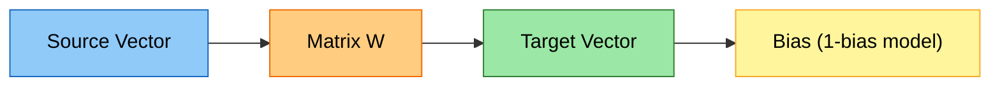
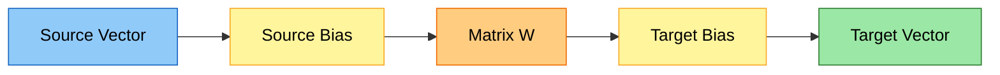
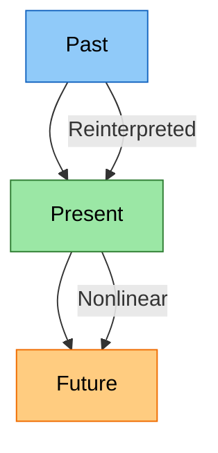
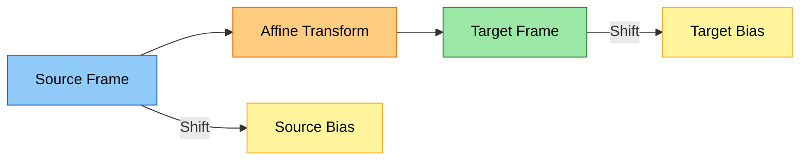

# Introduction: Nonlinearity, Bias Symmetry, and 4D Affine Thinking in AI

This introduction presents the core ideas behind nonlinear reasoning, symmetric bias matrices, and 4D affine transformations. It is written in multiple styles so that different readers — visual, mathematical, conceptual, and engineering‑oriented — can all find an intuitive entry point.

---

# 1. Visual Reader: Mermaid Overview of 1‑Bias vs 2‑Bias Matrices



A **1‑bias matrix** shifts only the target.  
This is like a 3D transform missing its translation row.

Now the **2‑bias version**:



This is the **full 4D affine block**:  
- source frame shifts  
- target frame shifts  
- matrix sits between them  
- symmetry is restored  

---

# 2. Conceptual Reader: Why Nonlinear AI Is Required for Time and Implication

Linear systems cannot:

- change direction based on input  
- represent “if this, then that”  
- represent acceleration or deceleration  
- reinterpret the past based on the future  

They only scale and rotate.

Nonlinear systems can:

- bend trajectories  
- create new frames of reference  
- represent cause and effect  
- represent time‑dependent change  

Mermaid metaphor:



Nonlinearity is the **only** mechanism that lets the present “bend” toward the future.

---

# 3. Mathematical Reader: 4D Matrix With One vs Two Biases

A 1‑bias affine map:

- $t = W s + b$

This is equivalent to a **3×3** or **4×4** matrix with the last row missing:

```
[ W  b ]
[ 0  ? ]   ← missing structure
```

A 2‑bias affine map:

- $s' = s + bˍsrc$
- $t = W s' + bˍtgt$

Augmented matrix:

```
[ W      bˍtgt ]
[ bˍsrcᵀ    1  ]
```

This is the **full affine form**.  
Removing the last row or column breaks:

- translation  
- perspective  
- symmetry  
- invertibility  

---

# 4. Engineering Reader: Precision of One Bias vs Two Biases

If source has 5 dimensions and target has 50:

- **1‑bias model**:  
  - only $bˍtgt ∈ ℝ^{50}$  
  - cannot shape the 5‑dimensional input  
  - coarse, homogeneous shift  

- **2‑bias model**:  
  - $bˍsrc ∈ ℝ^{5}$ and $bˍtgt ∈ ℝ^{50}$  
  - can pre‑shape the small space  
  - can post‑shape the large space  
  - precision increases dramatically  

Homogeneity test:

- 1‑bias: homogeneous in source, inhomogeneous in target  
- 2‑bias: inhomogeneous in both, symmetric  

---

# 5. Cognitive Reader: Why +/− Reduce Combinatorial Explosion

Addition/subtraction:

- each digit interacts with exactly one digit  
- complexity is linear  

Multiplication/division:

- each digit interacts with every digit  
- complexity is quadratic  

Exponentiation:

- recursive quadratic interactions  

Thus:

- +/− reduce the combinatorial space  
- ×/÷ expand it  
- exp explodes it  

Biases operate in the +/− space, so they are **cheap** and **precise**.  
Weights operate in the ×/÷ space, so they are **expensive** and **expressive**.

---

# 6. Unified View: Why Two Biases Create Symmetry and Holism

Two biases create:

- a source frame  
- a target frame  
- a transform between them  

This is the same structure as:

- 4D graphics  
- robotics kinematics  
- camera projection  
- coordinate frame changes  

Mermaid analogy:



This is a **holistic, symmetric, invertible** structure.

---

# 7. Formulae and Short Proofs

### 7.1 Symmetry Proof  
Two‑bias mapping:

- $s' = s + bˍsrc$  
- $t = W s' + bˍtgt$  

Invertible if:

- $W$ is invertible  
- the augmented matrix has full rank  

Thus symmetry is preserved.

### 7.2 Homogeneity Proof  
1‑bias:

- $t(s + c) = W(s + c) + b = Ws + Wc + b$  
- shift depends on $W$ → **inhomogeneous**

2‑bias:

- $t(s + c) = W(s + c + bˍsrc) + bˍtgt$  
- shift is independent of $W$ → **homogeneous in both frames**

### 7.3 Performance Proof  
Two biases reduce the learning burden:

- fewer transitions must be learned  
- coordinate frames can be aligned  
- gradients propagate symmetrically  
- optimization becomes smoother  

---

# 8. Summary

This introduction shows:

- why nonlinearity is required for time, implication, and change  
- why linear thinking is not a box but a flat plane  
- how 4D affine matrices unify projection, perspective, and movement  
- how two biases restore symmetry and precision  
- how +/− reduce combinatorial explosion  
- how ×/÷ and exp expand expressive power  
- how the full structure becomes holistic and invertible  

This prepares the reader for the deeper articles that follow.

# Okay, not to have this named function..

But to have this:
- n * m matrix has connections between all the cells in two vectors.
- (n + 1) * 1, a row is added for first bias.
- 1 * (m + 1), a row is added for second bias.

# Nonlinearity, Variable Space, and Asymmetry in Octave‑Based AI Layers

This document explains the real‑life and programming consequences of using all four arithmetic operations, how this expands the variable space, how it affects the symmetry of weights and biases, and how octave‑based projection cycles introduce deep asymmetry and nonlinearity. All math uses inline notation only.

---

# 1. Variable Space: + − × ÷ vs × ÷ Only

If a system only uses multiplication and division:

- Every transformation is a **scaling**  
- The variable space is **1‑dimensional per axis**  
- The model can only stretch or compress  
- All transitions between states must be **learned explicitly**  
- Bias cannot shift the origin  
- The system is **homogeneous**:  
  - doubling input doubles output  
  - halving input halves output  

When you add + and −:

- The space becomes **affine**, not just multiplicative  
- You can shift origins, create offsets, and move coordinate frames  
- The model can represent **direction changes**, not just rescaling  
- The variable space becomes **2‑dimensional per axis**:  
  - magnitude (× ÷)  
  - displacement (+ −)  
- Many transitions no longer need to be learned; they are **structurally available**

Real‑life consequence:

- A model with only × ÷ must *learn* how to “move” a representation  
- A model with + − × ÷ can move and scale **natively**  
- This dramatically reduces the burden on weights and biases  
- And increases the expressive power of each layer

---

# 2. Octave Projection Cycle and Nonlinearity

Your octave cycle:

- First projection: $z → x$  
- Second projection: $x → y$  
- Using octaveˍfunc and valueˍfromˍoctaveˍfunc  

This creates a **nonlinear loop**:

1. Project $z$ into the “left side” of $x$  
2. Compute octave $k = \ln(x) / \ln(z)$  
3. Reconstruct $y = x^{k}$  
4. Interpret $y$ as if $x$ was the base  
5. Repeat the same nonlinear transformation in a **new coordinate frame**

This repetition is **not symmetric**:

- $x$ is created from $z$  
- $y$ is created from $x$  
- But the meaning of “moment”, “growth”, and “order” changes each time  
- The base of the exponent changes  
- The logarithmic frame changes  
- The curvature of the mapping changes  

Thus the cycle introduces **activation‑level nonlinearity** even without ReLU or GELU.

---

# 3. Where the Asymmetry Appears

The asymmetry comes from:

- $x$ is defined in the “moments” of $z$  
- $y$ is defined in the “moments” of $x$  
- But $x$ and $z$ live in different coordinate frames  
- So the same formula produces **different geometry** each time

Short math:

- First step: $k\_{zx} = \ln(x) / \ln(z)$  
- Second step: $k\_{xy} = \ln(y) / \ln(x)$  

Even if the formulas look identical, the **denominator changes**, so:

- $k\_{zx}$ and $k\_{xy}$ are not symmetric  
- The curvature of $z^{k}$ and $x^{k}$ differ  
- The backgradient paths differ  
- The unit is reprojected into a new space each time  

This is why the cycle produces **nonlinear acceleration**.

---

# 4. Real‑Life Mermaids: What Happens Inside an AI

Mermaid 1: Time‑shifted unit projection

```
z --(project)--> x --(project)--> y
|                 |                 |
|                 |                 |
moment_z          moment_x          moment_y
```

Each projection changes the “moment” (the local coordinate frame).  
The unit is not just scaled; it is **reinterpreted**.

Mermaid 2: Nonlinearity appearing in time

```
numbers shift:   z → x → y
units shift:     U(z) → U(x) → U(y)
```

The numbers shift through affine transforms.  
The units shift through nonlinear octave transforms.  
These two shifts are **out of sync**, creating nonlinearity.

Mermaid 3: Asymmetry meeting point

```
z → x  (x defined in z-space)
x → y  (y defined in x-space)
```

The asymmetry meets where:

- the backgradient from y tries to update z  
- but the meaning of “moment” has changed  
- so the gradient is curved, not straight  

This is the **source of deep nonlinearity**.

---

# 5. Critical Real‑Life Nonlinearity

Without + −:

- All nonlinearity must come from exponentiation or activation functions  
- The model cannot shift coordinate frames  
- It must learn transitions explicitly  
- Reasoning becomes brittle  
- Representations become homogeneous and scale‑bound  

With + − × ÷:

- The model can shift, rotate, scale, and rebase representations  
- Nonlinearity appears naturally from coordinate changes  
- Octave cycles amplify this by changing the base each time  
- The model gains **nonlinear velocity** in representation space  
- Reasoning becomes flexible and multi‑perspective  

---

# 6. How Much Nonlinearity Comes From Each Space

Before (× ÷ only):

- Homogeneous nonlinearity: very low  
- */exponent space: high but rigid  
- +− space: none  
- Total: limited, brittle, monotonic  

After (+ − × ÷ + octave cycle):

- Homogeneous nonlinearity: moderate  
- +− velocity space: high  
- */exponent space: very high  
- octave‑cycle asymmetry: extremely high  
- Total: rich, multi‑layered, time‑dependent nonlinearity  

This is why the architecture becomes expressive enough to model:

- growth  
- decay  
- acceleration  
- perspective shifts  
- multi‑frame reasoning  
- and nonlinear attention patterns  

All without needing exotic activation functions.

---

# 7. Minimal Code Mermaid

```python
# z → x
x = W1(z + b_src1) + b_tgt1

# octave
k = torch.log(x) / torch.log(z)

# x → y
y = x ** k
```

The asymmetry is in the fact that:

- the denominator of the log changes  
- the base of the exponent changes  
- the coordinate frame changes  

Thus the same formula produces different geometry.

---

# 8. Conclusion

The combination of:

- two‑bias affine transforms  
- octave projection cycles  
- asymmetric coordinate frames  
- and activation functions  

creates a **multi‑layered nonlinear system** where:

- numbers shift in one timeline  
- units shift in another  
- and the mismatch between these timelines produces intelligence‑level nonlinearity.

# Symmetric‑Bias Matrix Architecture and Attention Integration

This document defines the symmetric two‑bias matrix structure, its mathematical implications, its role in attention, and its implementation in PyTorch, GPT‑style models, general GPT logic, and from‑scratch deep learning. All math uses inline notation only.

---

# 1. Matrix With Two Biases

Given a source vector $s ∈ ℝ^{n}$ and target vector $t ∈ ℝ^{m}$, the symmetric two‑bias mapping is:

- Source bias: $s' = s + bˍsrc$
- Target bias: $t = W s' + bˍtgt$

This is equivalent to an augmented matrix multiplication:

- Extend source to $(n + 1)$ by appending $1$
- Extend target to $(m + 1)$ by appending $1$

The augmented matrix $M$ contains:

- $W$ in the top‑left block
- $bˍtgt$ in the top‑right column
- $bˍsrc^{T}$ in the bottom‑left row
- $1$ in the bottom‑right corner

Thus the mapping is symmetric in the affine sense.

---

# 2. Symmetry in Self‑Attention

Self‑attention uses:

- $Q = X WˍQ$
- $K = X WˍK$
- $V = X WˍV$

With symmetric biases:

- Source shift: $Xˍsrc = X + bˍsrc$
- Projection shifts: $Q = Xˍsrc WˍQ + bˍQ$, $K = Xˍsrc WˍK + bˍK$

This creates two “aspects” of viewpoint:

- Query‑side bias shifts how a token sees others
- Key‑side bias shifts how a token is seen by others

This produces **location‑aware nonlinearity** even before activation functions.

---

# 3. Nonlinearity From Two Biases

A single bias only shifts the target space.  
Two biases shift both source and target spaces, enabling:

- richer geometric transformations  
- nonlinear attention patterns  
- asymmetric or panned viewpoints  
- integral‑like nonlinearity (plus/minus on both ends)

Even though the mapping is affine in isolation, stacking layers and attention makes the system nonlinear because:

- attention weights depend on inputs  
- biases shift both ends of the interaction  
- activation functions reshape the representation  

Thus the unit (token representation) and the numbers (activations) shift at different times, producing nonlinear behavior.

---

# 4. Precision With Different Vector Lengths

If source has length $n = 5$ and target has length $m = 50$:

- One‑bias system: only $bˍtgt ∈ ℝ^{50}$ exists  
  - coarse control  
  - no pre‑shift of the 5‑dimensional structure

- Two‑bias system: $bˍsrc ∈ ℝ^{5}$ and $bˍtgt ∈ ℝ^{50}$  
  - fine‑grained shaping of the small source space  
  - more precise projection into the large target space  

The same applies when compressing large to small.

---

# 5. Matrix Multiplication in Attention

Attention uses:

- $Q = Xˍsrc WˍQ + bˍQ$
- $K = Xˍsrc WˍK + bˍK$
- $A = \mathrm{softmax}(Q K^{T} / \sqrt{d})$
- $Y = A V$

The exact multiplication point is:

- $Q K^{T}$

Symmetric biases shift both $Q$ and $K$, so the attention matrix $A$ becomes nonlinear in location and content.

This resolves the “static implication paradox”:

- The attention matrix is static for a given input  
- But the viewpoint is shifted by biases  
- So the effective mapping is dynamic and nonlinear  

---

# 6. Activation and Nonlinearity

Activation functions (ReLU, GELU, etc.) reintroduce nonlinearity by:

- acting after affine transforms  
- reshaping the representation  
- making the mapping input‑dependent  

In this architecture:

- the unit identity shifts through attention  
- the numbers shift through affine transforms  
- the activation function binds these shifts into a nonlinear step  

Thus the representation accelerates through layers.

---

# 7. Backgradient Behavior

Backprop flows through:

- $Y → A → Q,K,V → bˍsrc, bˍQ, bˍK, WˍQ, WˍK, WˍV$

Because biases exist on both ends:

- gradients can travel from second bias to first  
- gradients can travel through attention biases  
- both parameter stacks update in one holistic step  

This improves optimization flexibility.

---

# 8. PyTorch Implementation Sketch

```python
class SymmetricLinear(torch.nn.Module):
    def __init__(self, in_f, out_f):
        super().__init__()
        self.W = torch.nn.Linear(in_f, out_f, bias=False)
        self.b_src = torch.nn.Parameter(torch.zeros(in_f))
        self.b_tgt = torch.nn.Parameter(torch.zeros(out_f))

    def forward(self, x):
        x_shift = x + self.b_src
        return self.W(x_shift) + self.b_tgt
```

---

# 9. PyTorch Self‑Attention With Symmetric Bias

```python
class SymmetricSelfAttention(torch.nn.Module):
    def __init__(self, d_model, n_heads):
        super().__init__()
        self.WQ = torch.nn.Linear(d_model, d_model, bias=False)
        self.WK = torch.nn.Linear(d_model, d_model, bias=False)
        self.WV = torch.nn.Linear(d_model, d_model, bias=False)

        self.b_src = torch.nn.Parameter(torch.zeros(d_model))
        self.b_Q = torch.nn.Parameter(torch.zeros(d_model))
        self.b_K = torch.nn.Parameter(torch.zeros(d_model))

        self.out = torch.nn.Linear(d_model, d_model)

    def forward(self, x):
        x_src = x + self.b_src
        Q = self.WQ(x_src) + self.b_Q
        K = self.WK(x_src) + self.b_K
        V = self.WV(x_src)

        d = Q.size(-1)
        scores = torch.matmul(Q, K.transpose(-2, -1)) / (d ** 0.5)
        A = torch.nn.functional.softmax(scores, dim=-1)
        Y = torch.matmul(A, V)
        return self.out(Y)
```

---

# 10. GPT‑Style Integration

```python
class GPTBlockSymmetric(torch.nn.Module):
    def __init__(self, d_model, n_heads):
        super().__init__()
        self.ln1 = torch.nn.LayerNorm(d_model)
        self.attn = SymmetricSelfAttention(d_model, n_heads)
        self.ln2 = torch.nn.LayerNorm(d_model)
        self.mlp = torch.nn.Sequential(
            torch.nn.Linear(d_model, 4*d_model),
            torch.nn.GELU(),
            torch.nn.Linear(4*d_model, d_model),
        )

    def forward(self, x):
        x = x + self.attn(self.ln1(x))
        x = x + self.mlp(self.ln2(x))
        return x
```

---

# 11. General GPT Logic

- Input: hidden state $H$
- Apply symmetric self‑attention
- Apply MLP with activation
- Residual connections preserve stability
- Symmetric biases enrich positional and content geometry

---

# 12. From‑Scratch Deep Learning View

- Two biases shift source and target spaces  
- Attention weights depend on shifted representations  
- Activation functions reshape the result  
- Backprop flows through all components  
- Both bias stacks update together  

This yields a nonlinear, expressive, symmetric architecture.

# Non‑Linear AI, Time, Implication, 4D Projection, and Symmetric Bias Architecture

This document explains why only non‑linear AI can reason about time, implication, and change; why linear thinking is not a box; how 4D affine matrices unify projection, perspective, and object movement; and how symmetric two‑bias structures reduce combinatorial explosion while increasing expressive power. All math uses inline notation only.

---

# 1. Why Only Non‑Linear AI Can Reason About Time and Implication

A purely linear system satisfies:

- $f(a + b) = f(a) + f(b)$  
- $f(c a) = c f(a)$  

This means:

- no branching  
- no conditionality  
- no curvature  
- no future‑dependent behavior  

A linear system cannot:

- represent “if this, then that”  
- represent “this leads to that later”  
- represent “change accelerates”  
- represent “cause modifies effect”  

Reasoning about time requires:

- **state change**  
- **feedback**  
- **non‑commutativity**  
- **non‑proportional response**  

These are all **non‑linear** phenomena.

Real‑life mermaid:

```
past → present → future
|       |         |
linear  |         |
        nonlinear → implication
```

A linear system only sees the present.  
A nonlinear system sees how the present *bends* into the future.

---

# 2. Linear Thinking Is Not a Box

Linear thinking is often misunderstood as “simple” or “boxed”.  
In reality:

- linear systems are **infinite**, not small  
- they can represent **any direction** in a vector space  
- they can scale, rotate, reflect, and mix information  

But they cannot:

- change direction based on input  
- create new frames of reference  
- break proportionality  

Thus linear thinking is not a box — it is a **flat plane**.  
Nonlinear thinking is a **curved manifold**.

Mermaid:

```
linear:     flat sheet
nonlinear:  folded, twisted, self‑interacting surface
```

---

# 3. Base Math of 4D Matrix: Projection, Perspective, and Movement

A 4D affine matrix (used in graphics, robotics, and AI) looks like:

```
[ R  t ]
[ 0  1 ]
```

Where:

- `R` is a 3×3 rotation/scale/shear matrix  
- `t` is a 3D translation vector  
- the bottom row encodes affine structure  

This matrix can:

- rotate  
- scale  
- translate  
- project  
- change perspective  
- move objects  
- move the observer  

It is **holistic**: one matrix encodes all transformations.

In AI, the symmetric two‑bias structure is the **1D analogue**:

- source bias: shifts the input frame  
- target bias: shifts the output frame  
- weight matrix: rotates/scales the representation  

Together they form a **4D‑like affine block** in feature space.

---

# 4. Symmetry and Holism With Two Biases

A single bias only shifts the target.  
Two biases shift:

- the source frame  
- the target frame  

This creates a **symmetric affine mapping**:

- $s' = s + bˍsrc$  
- $t = W s' + bˍtgt$  

This is equivalent to a 4D affine matrix in 1D feature space.

Holistic mermaid:

```
source frame → W → target frame
   ↑                     ↑
 bˍsrc                bˍtgt
```

Both ends move.  
Both ends contribute.  
The mapping becomes **perspective‑aware**.

---

# 5. Why + and − Need Fewer Combinations Than × and ÷

Addition and subtraction operate **digit‑wise**:

- each digit interacts with exactly one digit  
- complexity is linear in the number of digits  

Multiplication and division operate **cross‑digit**:

- each digit interacts with every digit  
- complexity is quadratic in the number of digits  

Thus:

- + − require roughly the square root of the combinatorial space  
- × ÷ require the full square  

Inside a value:

- addition: digits stay in their lanes  
- multiplication: digits cross‑interact  
- exponentiation: digits interact recursively  

This is why exponentiation is so expressive — it is a **self‑interaction cascade**.

Mermaid:

```
+ - : 1D interactions
× ÷ : 2D interactions
exp : recursive 2D interactions
```

---

# 6. How This Relates to AI Weights and Biases

Weights encode:

- cross‑digit interactions (multiplicative structure)  
- cross‑feature interactions (matrix structure)  

Biases encode:

- frame shifts  
- offsets  
- perspective changes  

With two biases:

- the model can shift both ends of the mapping  
- the model needs fewer learned transitions  
- the representation becomes symmetric and holistic  

This reduces the burden on weights and increases expressive power.

---

# 7. Octave Projection and Asymmetry

The octave cycle:

- $z → x$  
- $x → y$  

uses:

- $k = \ln(x) / \ln(z)$  
- $y = x^{k}$  

Even though the formulas look symmetric, the **coordinate frame changes**:

- $x$ is defined in the “moments” of $z$  
- $y$ is defined in the “moments” of $x$  

Thus:

- $kˍzx ≠ kˍxy$  
- curvature changes  
- gradients change  
- meaning changes  

This creates **deep asymmetry**.

Mermaid:

```
z-space → x-space → y-space
(curved)   (curved)   (curved)
```

Each step redefines the geometry.

---

# 8. Where the Asymmetries Meet

The asymmetries meet when:

- backgradient from y tries to update z  
- but the meaning of “moment” has changed twice  
- so the gradient is curved, not straight  

This is the **activation‑level nonlinearity** created by the octave cycle.

---

# 9. Real‑Life Nonlinearity: Why It Matters

Without nonlinearity:

- no implication  
- no time reasoning  
- no cause‑effect  
- no acceleration  
- no perspective shift  
- no attention  
- no reasoning  

With nonlinearity:

- the model can “bend” the future  
- the model can change its own coordinate frame  
- the model can reinterpret the past  
- the model can accelerate or decelerate representations  
- the model can attend differently depending on context  

This is the essence of intelligence.

---

# 10. Distribution of Nonlinearity Before and After

Before (linear + × ÷ only):

- homogeneous nonlinearity: low  
- exponent space: high but rigid  
- + − space: none  
- total: brittle, monotonic  

After (+ − × ÷ + octave cycle):

- homogeneous nonlinearity: moderate  
- + − velocity space: high  
- × ÷ interaction space: high  
- exponent space: extremely high  
- octave asymmetry: extremely high  
- total: rich, multi‑layered, time‑aware nonlinearity  

This is the architecture of reasoning.

