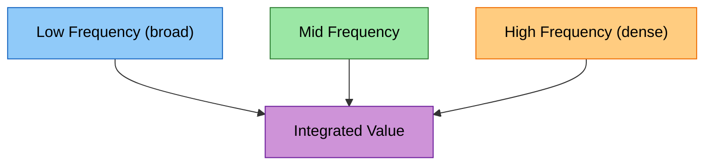
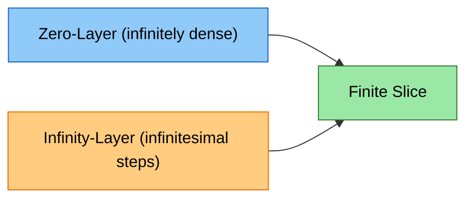
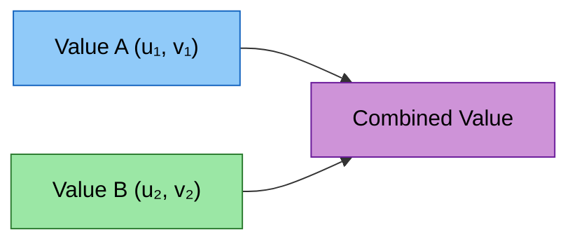
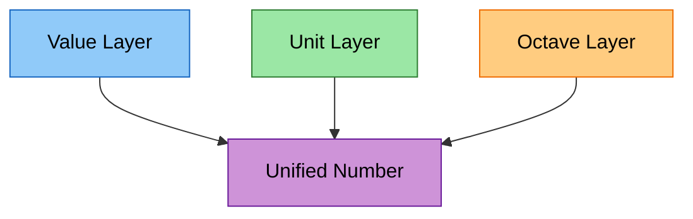
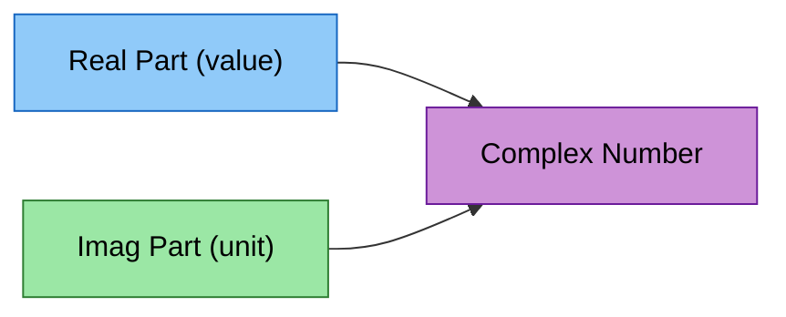
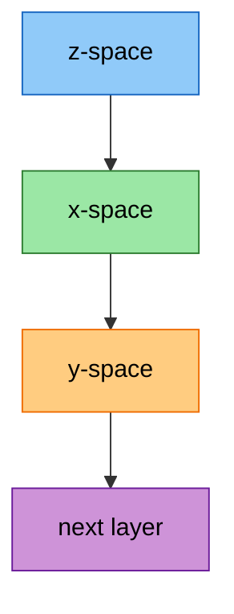
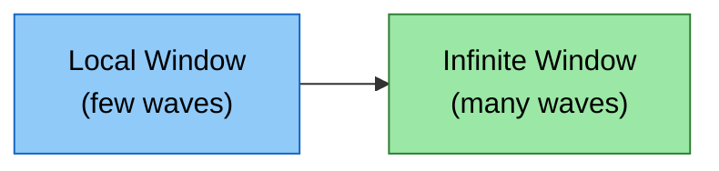
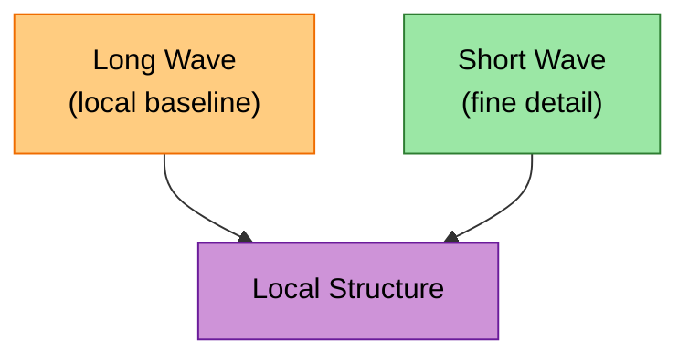
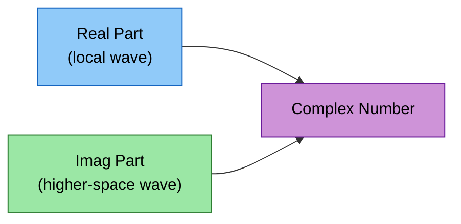

# Frequencies, Dimensional Density, and Octave Structure in Complex and Octave Mathematics

Frequencies can be understood not only as oscillations in time, but as densities of space. A frequency describes how tightly information is packed along a dimension. When frequencies differ, they create parallel “spheres” or layers of behavior that coexist at the same point but do not interfere with one another. These layers can be interpreted as higher or lower “dimensions” in a mathematical sense: structures that count symmetrically upward and downward, forming a balanced hierarchy.

---

# 1. Frequency as Density of Space

A frequency determines how many cycles occur within a unit interval. Higher frequencies correspond to denser patterns, while lower frequencies correspond to broader, slower variations. This density can be interpreted as a form of dimensional layering:

- high‑frequency layers encode fine‑grained detail,  
- low‑frequency layers encode long‑term structure,  
- both coexist at the same spatial point.

These layers behave like parallel dimensions that integrate into a single entity. A number in a higher‑dimensional space may contain multiple components, each representing a different frequency band.

The integrated value behaves as a single number, even though it contains multiple internal layers.

## Last appendix

***Last appendix*** of this article explains frequencies and one important paradox of real-life usage of this word.

---

# 2. Octaves and Differential Orders as Dimensional Layers

Octaves arise naturally from logarithmic scaling:

$$
\text{octave}(z, x) = \frac{\ln x}{\ln z}
$$

Two waves may have the same local frequency but belong to different octaves. They are distinguishable because their scaling relationships differ. This creates a hierarchy of layers:

- octave 0: base layer  
- octave 1: doubled frequency  
- octave −1: halved frequency  

These layers behave like symmetric “up” and “down” dimensions.

Differential and integral orders behave similarly:

- derivatives increase frequency content,  
- integrals decrease it,  
- each order forms a distinct layer.

---

# 3. Symmetries of Zero and Infinity

Octave‑based reasoning reveals a symmetry between zero and infinity:

- A finite interval can contain infinitely many zeros when zeros are treated as elements of a higher‑frequency layer.  
- Infinity can be represented as a direction with infinitesimal step size, forming a parallel layer.  

These layers do not overlap with ordinary values, but they contribute statistically:

- a slice of length 1 may contain infinitely many zero‑frequency elements,  
- a direction toward infinity may contain infinitely many infinitesimal steps.

Both contribute to numerical precision without collapsing into the same dimension.

Lower‑dimensional values cannot “see” higher‑frequency layers, just as a coarse grid cannot resolve fine detail.

---

# 4. Complex Numbers as Frequency‑Layered Entities

A complex number:

$$
a = u + i v
$$

contains two components that behave like two frequency layers:

- the real part $u$ behaves like a standard value,  
- the imaginary part $v$ behaves like a value on a different frequency scale.

These two layers do not overlap:

- the real axis corresponds to one dimension,  
- the imaginary axis corresponds to another,  
- together they form a two‑dimensional space encoded in one symbol.

This structure mirrors octave‑based layering.

---

# 5. Alignment With Exponometer Functions

The Exponometer codebase defines three core operations:

1. **getExponentFactor**  
2. **getSecondLayer**  
3. **combine**

These operations correspond naturally to complex logarithms, exponentiation, and multiplication.

---

# 5.1 getExponentFactor: Extracting the Octave From Real and Imaginary Parts

Given a complex number:

$$
a = u + i v
$$

the complex logarithm is:

$$
\log(a) = \ln|a| + i \arg(a)
$$

The magnitude $|a|$ and angle $\arg(a)$ correspond to:

- real component → value layer  
- imaginary component → unit layer  

The octave factor is analogous to:

$$
k = \frac{\ln|a|}{\ln|b|}
$$

This expresses the magnitude of $a$ in the “units” of $b$.  
The imaginary part contributes through the angle, which shifts the effective base.

This mirrors **getExponentFactor**, which extracts an octave number from two components.

---

# 5.2 getSecondLayer: Recovering the Real Component From Imaginary Part and Octave

Given:

- an imaginary component (unit),  
- an octave factor $k$,  

the real component can be reconstructed using:

$$
u = |a| = e^{k \ln|b|}
$$

and the imaginary component determines the angle:

$$
v = |a| \cdot \tan(\arg(a))
$$

This mirrors **getSecondLayer**, which reconstructs the second component once the octave and first component are known.

---

# 5.3 combine: Merging Components Into a Unified Value

Complex multiplication:

$$
a \cdot b = (u_1 + i v_1)(u_2 + i v_2)
$$

combines:

- magnitudes multiplicatively,  
- angles additively.

This is equivalent to combining:

- value layers,  
- unit layers,  
- octave factors.

The Exponometer’s **combine** operation merges two layered values into one, just as complex multiplication merges two complex numbers into a single entity with combined magnitude and angle.

---

# 6. Summary

Frequencies can be interpreted as densities of space, forming parallel layers that behave like dimensions. Octaves, differential orders, and integral orders naturally encode these layers. Complex numbers provide a compact representation of such layered structures, with real and imaginary parts corresponding to different frequency scales. The Exponometer’s core operations — extracting octave factors, reconstructing components, and combining layered values — align closely with complex logarithms, exponentiation, and multiplication. Together, these systems illustrate how multi‑layered mathematical behavior can be encoded within a single symbolic framework.

# Complex‑Number Mathematics and Its Native Relationship to Octave‑Based Structures

Complex numbers form a mathematical domain where two‑dimensional behavior is encoded within a single symbolic dimension. Many branches of mathematics built on complex numbers naturally express the same structures found in octave‑based reasoning: projection into logarithmic space, reconstruction through exponentiation, and the coexistence of multiple layers of behavior at a single point. This section outlines mathematical fields where these parallels appear natively, and how standard real‑number mathematics sits only one or two conceptual steps away from this richer representation.

---

# 1. Complex‑Number Native Mathematical Branches

Several branches of mathematics treat complex numbers not as extensions of real numbers, but as the *natural* domain for describing layered, oscillatory, or multi‑component behavior.

## 1.1 Complex Analysis

Complex analysis studies functions of a complex variable:

$$
f : \mathbb{C} \to \mathbb{C}
$$

This field is inherently two‑dimensional:

- differentiation depends on both real and imaginary components,  
- analytic functions preserve angles and local structure,  
- logarithms and exponentials behave as geometric transformations.

Complex analysis is deeply aligned with octave‑based reasoning because:

- the complex logarithm separates magnitude and angle,  
- the complex exponential reconstructs a value in a new frame,  
- both operations are nonlinear and asymmetric.

These are the same primitives used in octave mathematics.

---

## 1.2 Complex Dynamics

Complex dynamics studies iterative maps such as:

$$
z_{n+1} = f(z_n)
$$

Common examples include:

- complex exponentiation,  
- power iteration,  
- logarithmic spirals,  
- fractal structures.

These systems exhibit:

- recursive projection and reconstruction,  
- coordinate‑frame shifts,  
- sensitivity to initial conditions,  
- multi‑layered behavior at a single point.

This mirrors octave cycles where:

- $z$ defines the unit,  
- $x$ defines the value in $z$‑space,  
- $y$ defines the value in $x$‑space.

Each step redefines the coordinate frame.

---

## 1.3 Fourier and Harmonic Analysis

Fourier analysis represents functions as sums of complex exponentials:

$$
e^{i \omega t}
$$

This is a native complex‑number representation of frequency.  
It aligns with octave mathematics because:

- frequency corresponds to logarithmic scaling,  
- harmonics correspond to octave layers,  
- the imaginary unit encodes phase and direction.

Fourier analysis treats frequency as a dimension orthogonal to value, just as octave mathematics treats unit and value as separate components.

---

## 1.4 Complex Integration and Contour Calculus

Complex integration evaluates integrals along curves in the complex plane:

$$
\int_\gamma f(z)\,dz
$$

This field is inherently two‑dimensional:

- integrals depend on both magnitude and direction,  
- residues encode local behavior at singularities,  
- contour deformation reflects invariance across layers.

These structures resemble octave‑based reasoning where:

- values depend on both magnitude and unit,  
- singularities correspond to octave boundaries,  
- transformations preserve structure across layers.

---

# 2. Derived Concepts That Mirror Octave‑Based Structures

Complex‑number mathematics contains several derived concepts that align closely with octave‑based reasoning.

## 2.1 Magnitude and Angle as Value and Unit

A complex number:

$$
a = u + i v
$$

has:

- magnitude $|a|$ → analogous to value,  
- angle $\arg(a)$ → analogous to unit or base.

The complex logarithm:

$$
\log(a) = \ln|a| + i \arg(a)
$$

is structurally identical to the octave projection:

$$
\text{octave}(z, x) = \frac{\ln x}{\ln z}
$$

Both separate a quantity into two components.

---

## 2.2 Complex Exponentiation as Reconstruction

Complex exponentiation:

$$
a^b = \exp(b \cdot \log a)
$$

mirrors octave reconstruction:

$$
y = x^k
$$

Both:

- project into logarithmic space,  
- apply a transformation,  
- reconstruct through exponentiation.

This is a native operation in complex mathematics.

---

## 2.3 Multi‑Layered Behavior at a Single Point

Complex numbers encode two independent components at one location.  
Octave mathematics encodes:

- value,  
- unit,  
- octave layer,  
- differential order,  
- integral order.

These layers coexist at a single point, just as real and imaginary parts coexist in a single complex number.

Complex numbers provide a natural model for such integration.

---

# 3. Standard Mathematics as One or Two Steps Away

Real‑number mathematics often appears simpler because it collapses multi‑layered behavior into a single dimension. However, many real‑number operations are only one or two conceptual steps away from complex‑number representations.

## 3.1 Real Exponentiation as a Restricted Complex Operation

Real exponentiation:

$$
x^k
$$

is a special case of complex exponentiation where:

- angle is zero,  
- unit layer is suppressed.

Thus, real exponentiation is a projection of a richer complex operation.

---

## 3.2 Real Logarithms as Magnitude‑Only Complex Logarithms

The real logarithm:

$$
\ln(x)
$$

is the magnitude component of the complex logarithm:

$$
\log(a) = \ln|a| + i \arg(a)
$$

Thus, real logarithms are one step away from full octave‑like behavior.

---

## 3.3 Real Differentiation as Complex Differentiation Without Rotation

Real differentiation:

$$
\frac{d}{dx}
$$

is a restricted form of complex differentiation where:

- rotation is not considered,  
- only magnitude changes are tracked.

Complex differentiation includes both magnitude and angle changes.

---

# 4. Summary

Complex‑number mathematics contains several branches — complex analysis, complex dynamics, Fourier analysis, and contour integration — that naturally express the same structures found in octave‑based reasoning. These fields treat magnitude and angle as independent components, mirroring value and unit. Complex logarithms and exponentials align directly with octave projection and reconstruction. Standard real‑number mathematics is only one or two conceptual steps away from this richer representation, often corresponding to magnitude‑only or angle‑suppressed versions of complex operations.

# Introduction: Complex Numbers as a One‑Dimensional Encoding of Two‑Dimensional Structure

Complex numbers provide a remarkable example of how a two‑dimensional mathematical space can be represented within a single one‑dimensional symbol. A complex number combines two independent components — a real part and an imaginary part — into a unified entity that behaves as if it were a point in a plane. This compression of dimensionality is not arbitrary: it arises naturally from the way oscillations, frequencies, and acceleration ratios interact in mathematical systems.

---

# 1. A Two‑Dimensional Space Encoded in One Symbol

A complex number has the form:

$$
a = u + i v
$$

where:

- $u$ is the **real part**,  
- $v$ is the **imaginary part**,  
- $i$ is the unit satisfying $i^2 = -1$.

Although written as a single expression, the pair $(u, v)$ behaves like a coordinate in a two‑dimensional plane. The real axis and imaginary axis form perpendicular directions, and every complex number corresponds to a unique point in this plane.

This structure allows a single symbol to encode:

- magnitude (distance from origin),  
- direction (angle),  
- oscillation phase,  
- and rotational behavior.

---

# 2. How Higher‑Order 1D Behavior Resembles 2D Geometry

In many natural systems, a single measurable quantity contains two independent modes of change. For example, two acceleration ratios may evolve at different rates or frequencies. When these ratios interact, their combined behavior resembles a two‑dimensional pattern:

- one component describes **growth or decay**,  
- the other describes **rotation or oscillation**.

This is analogous to octave‑based reasoning, where two quantities evolve according to different logarithmic scales. The interaction of these scales produces a structure that is inherently two‑dimensional, even if the original domain appears one‑dimensional.

Complex numbers capture this dual behavior by assigning one component to the real axis and the other to the imaginary axis.

---

# 3. Representing Frequency Through Complex Numbers

Complex numbers are deeply connected to frequency. Three perspectives illustrate this connection.

## 3.1 Option 1: Analogue to Frequency Mathematics

A pure oscillation can be written as:

$$
e^{i \omega t}
$$

where $\omega$ is the frequency.  
This expression simultaneously encodes:

- amplitude (constant),  
- phase (angle),  
- and oscillation (rotation in the complex plane).

The real and imaginary parts trace out a circular motion, demonstrating how frequency is naturally represented in two dimensions.

---

## 3.2 Option 2: Frequency as Non‑Overlapping Components of One Sound

A sound wave can be decomposed into frequencies, each with its own amplitude. These components do not overlap in frequency space:

- each frequency has its own “volume”,  
- each occupies a distinct band,  
- yet the complete sound is a single waveform.

Complex numbers mirror this structure:

- the real part behaves like the measurable amplitude,  
- the imaginary part behaves like a second, orthogonal component,  
- together they form a single unified signal.

Thus, a complex number can represent a multi‑component phenomenon as a single entity.

---

## 3.3 Option 3: Holographic Interpretation

Complex numbers can also be viewed as encoding patterns that reconstruct higher‑dimensional structure:

- the real part behaves like an ordinary number,  
- the imaginary part behaves like a value on a different scale,  
- the two scales do not overlap,  
- their interaction produces a two‑dimensional effect.

This resembles a hologram, where a single surface encodes a full spatial pattern.  
The imaginary component acts like a “frequency‑shifted” dimension, similar to values below zero or beyond infinity, but without overlapping the real axis.

---

# 4. Alignment With Octave Mathematics

Octave‑based mathematics uses logarithmic relationships to compare quantities:

$$
\text{octave}(z, x) = \frac{\ln x}{\ln z}
$$

This expresses $x$ in the “units” of $z$.  
Complex logarithms generalize this idea:

$$
\log(a) = \ln|a| + i \arg(a)
$$

The two components correspond to:

- magnitude (real part),  
- rotational or unit shift (imaginary part).

Complex exponentiation:

$$
a^b = \exp(b \cdot \log a)
$$

mirrors the octave cycle:

1. project into logarithmic space,  
2. transform by scaling and rotation,  
3. reconstruct through exponentiation.

Both systems rely on:

- logarithmic projection,  
- coordinate‑frame shifts,  
- and nonlinear reconstruction.

---

# 5. Axiomatic Parallels Between Complex and Octave Mathematics

Both systems share foundational primitives:

### 5.1 Projection
- Complex: $\log(a)$  
- Octave: $\ln(x)$ and $\ln(z)$  

### 5.2 Ratio or comparison
- Complex: $\log(a)/\log(b)$  
- Octave: $\text{octave}(z, x)$  

### 5.3 Reconstruction
- Complex: $\exp(b \cdot \log a)$  
- Octave: $x^k$  

### 5.4 Two‑component structure
- Complex: $(u, v)$  
- Octave: $(\text{value}, \text{unit})$  

### 5.5 Nonlinearity
- Complex exponentiation is inherently asymmetric.  
- Octave cycles change coordinate frames at each step.

These parallels show that complex numbers provide a natural, compact representation for systems where values and units evolve together.

---

# 6. Summary

Complex numbers offer a one‑symbol representation of a two‑dimensional structure. Their real and imaginary components encode magnitude and unit, frequency and phase, or value and transformation. This dual structure mirrors octave‑based mathematics, where logarithmic projection and exponentiation create nonlinear, asymmetric transformations. The alignment between complex arithmetic and octave reasoning demonstrates how higher‑dimensional behavior can be encoded within a single mathematical object.

# Exponometer complexity handling with complex numbers

Currently we have internal layers x, y, z; weights and biases, and second set of weights and biases: even in one-element vector and matrix of
our presentation, this complexity level of a primitive is hard. We normally want to think in little primitives, and we cannot have more than
a few mixed with our few personal considerations - I have seen from 100-150 lines, my interest of *programs of others* drops and becomes work
on it, from simple "scanning" or "reading" to illustrate a concept or bring in. Thus, most of the code here has complexity removed and represents
their bare function to those, who want simple or advanced implementations with their own complexities solved.

> Like zx=>octave, and zoctave=>x calculations, we can see complexity of variable name convention might become high: complex numbers can resolve this.
>
> We use:
> - Real part for the number, such as x in example
> - Imaginary part for the unit, such as z

# Complex Numbers as a Structural Analogue to the Octave‑Based Transformation Cycle

This article introduces complex numbers as a compact mathematical structure that parallels the two‑component transformations found in octave‑based systems. The real part of a complex number corresponds to a numerical value, while the imaginary part corresponds to a unit or base. Complex exponentiation and logarithms naturally reproduce the asymmetry, projection, and recursive behavior observed in octave‑driven mappings.

---

# 1. Complex Exponentiation as a Parallel to Octave‑Based Transformations

Complex exponentiation is defined by the identity:

$$
a^b = \exp\!\left(b \cdot \log a\right)
$$

This decomposition mirrors the two‑step octave cycle:

1. A logarithmic projection into a coordinate frame  
2. A reconstruction through exponentiation  

The logarithm separates a complex number into magnitude and angle, while the exponential recombines these components into a new coordinate frame. This is structurally similar to computing an octave ratio and then reconstructing a value from that ratio.

---

# 2. Real and Imaginary Parts as Value and Unit

A complex number has the form:

$$
a = u + i v
$$

- The **real part** $u$ behaves like a numerical value.  
- The **imaginary part** $v$ behaves like a unit, direction, or base.

This pairing allows a single symbol to encode two interdependent quantities.

This structure parallels systems where a value and its unit must be carried together.

---

# 3. Complex Logarithm as the Analogue of the Octave Function

The complex logarithm is defined as:

$$
\log(a) = \ln|a| + i\,\arg(a)
$$

This separates a complex number into:

- **magnitude** (real component)  
- **direction or unit** (imaginary component)

The octave function in real arithmetic:

$$
\text{octave}(z, x) = \frac{\ln x}{\ln z}
$$

is the real‑valued analogue of the complex ratio:

$$
\frac{\log a}{\log b}
$$

Both operations express one quantity in the coordinate frame of another.

---

# 4. Asymmetry in Complex Exponentiation

Complex exponentiation is inherently asymmetric:

$$
a^b \neq b^a
$$

This asymmetry arises because:

- $\log(a)$ and $\log(b)$ live in different coordinate frames  
- exponentiation changes the base of the logarithm  
- the imaginary component introduces rotation  
- the real component introduces scaling  

This behavior parallels octave‑based transformations where:

- $x$ is defined relative to $z$  
- $y$ is defined relative to $x$  
- each step redefines the coordinate frame  

Thus, the same formula produces different geometry at each stage.

---

# 5. Power Iteration as a Dynamic Analogue

Iterating complex exponentiation:

$$
x_{n+1} = a^{x_n}
$$

produces:

- spirals  
- rotations  
- scaling  
- sensitivity to initial conditions  
- shifting coordinate frames  

These behaviors correspond to repeated octave‑based transformations, where each stage reinterprets the previous one.

Each transition applies the same rule in a newly defined frame.

---

# 6. Unified Interpretation

Complex arithmetic provides a compact representation of two‑component transformations:

- **Real part** → numerical value  
- **Imaginary part** → unit or base  
- **Logarithm** → projection into a coordinate frame  
- **Exponentiation** → reconstruction in a new frame  
- **Rotation** → unit shift  
- **Scaling** → value shift  
- **Asymmetry** → frame change  
- **Iteration** → recursive transformation  

This structure closely parallels octave‑based systems that repeatedly project and reconstruct values across shifting coordinate frames.

---

# 7. Summary

Complex numbers offer a natural mathematical analogue to octave‑based transformations. Their logarithmic and exponential operations reproduce the same asymmetric, nonlinear, and recursive behavior found in systems where values and units evolve together. This makes complex arithmetic a useful conceptual framework for understanding multi‑stage transformations that combine projection, reconstruction, and coordinate‑frame shifts.

# Alternate Density Measurements, Frequency Interpretations, and Higher‑Space Projections

Frequency is often described as “how many waves fit into a window of time or space.”  
However, this definition depends on the *window* chosen and the *space* in which the measurement is made.  
Different spaces — local, global, infinite, or projected — produce different interpretations of what “higher” or “lower” frequency means.  
This section introduces alternate density measurements and explains why higher spaces may appear to contain fewer waves locally but more waves globally, and why human perception naturally associates “higher” with denser, more information‑rich patterns.

---

# 1. Higher Spaces: Fewer Local Waves, More Global Waves

A wave measured in a **local window** may appear slow or sparse.  
The same wave measured in a **homogeneous infinite structure** may appear dense.

This occurs because:

- higher spaces stretch the measurement window,  
- lower spaces compress it,  
- density depends on the scale of observation.

A wave that seems “slow” locally may pass through infinitely many cycles when projected into an infinite homogeneous domain.

Thus, higher spaces may contain **more** waves overall, even if they appear to contain **fewer** waves locally.

---

# 2. Why “Higher Frequency” Sometimes Refers to Larger Windows

In physics, frequency is:

$$
f = \frac{\text{cycles}}{\text{unit time}}
$$

But the *unit time* is arbitrary.  
If the window is enlarged, the same wave may appear to have:

- more cycles (higher frequency),  
- fewer cycles (lower frequency),  
- or the same frequency but different density.

This leads to two competing interpretations:

### Interpretation A: Smaller windows → higher frequency  
- More cycles fit into a small window.  
- This is the standard engineering definition.

### Interpretation B: Larger windows → higher frequency  
- Higher spaces reveal more cycles across the full domain.  
- This is common in mathematics, cosmology, and symbolic reasoning.

Both interpretations are correct in their respective spaces.

---

# 3. Lower Frequencies as Local Windows

In some spaces, the “lower” frequencies dominate the **local** structure:

- long waves define the local baseline,  
- short waves appear as small perturbations,  
- the system is measured relative to the long wave.

This reverses the intuitive meaning of “high” and “low.”

Thus, “lower frequency” may be the dominant local component.

---

# 4. Human Perception: Higher Spaces Project Tight, High‑Density Patterns

Human perception often interprets:

- **higher spaces** as **higher frequencies**,  
- **higher frequencies** as **more dense**,  
- **more dense** as **more meaningful**,  
- **more meaningful** as **emotionally higher**.

This occurs because:

- higher spaces compress information into tighter patterns,  
- these patterns project into local space as subtle, high‑density vibrations,  
- the projection appears “smaller than zero” in scale,  
- yet it carries more information than any local wave.

This creates a paradox:

- long waves (large windows) are called “higher,”  
- short waves (small windows) also seem “higher,”  
- both interpretations coexist depending on projection.

The paradox dissolves when frequency is treated as **density across spaces**, not just cycles per second.

---

# 5. Infinity as a Tight, High‑Frequency Projection

Infinity can be interpreted as a homogeneous dimension where:

- a single unit contains infinitely many sub‑units,  
- each sub‑unit carries a tiny fraction of direction,  
- the entire structure resonates as a coherent whole.

This produces a “tight” frequency:

- extremely dense,  
- extremely fine‑grained,  
- projecting into local space as a subtle vibration.

In this sense, infinity appears “smaller than zero” because:

- its units are infinitesimal,  
- its density is maximal,  
- its projection is compact.

This aligns with octave mathematics, where:

- higher octaves compress information,  
- lower octaves expand it,  
- both coexist in the same number.

---

# 6. Human Interpretation of Vibrations

Humans naturally interpret life patterns as vibrations:

- emotional rhythms,  
- mental cycles,  
- phases of experience,  
- symbolic “light” and “sound.”

“Higher” is associated with:

- light (short wavelengths),  
- clarity (high density),  
- positive emotion (fast oscillation),  
- insight (large‑scale coherence).

“Lower” is associated with:

- heaviness (long wavelengths),  
- slow cycles,  
- local concerns,  
- coarse patterns.

This mapping is consistent across cultures because:

- higher spaces encode more information,  
- more information produces denser patterns,  
- denser patterns feel “higher.”

---

# 7. Two‑Dimensional Space Encoded in One Dimension

A complex number:

$$
a = u + i v
$$

encodes two independent frequency layers:

- the real part $u$ behaves like a local wave,  
- the imaginary part $v$ behaves like a higher‑space wave.

The imaginary component:

- does not overlap with the real component,  
- exists on a different frequency scale,  
- projects into local space as a subtle vibration,  
- increases the total density of the number.

Thus, a complex number contains **more waves** than a real number, even though it appears as a single symbol.

This structure explains why complex numbers feel “higher” or “denser” than real numbers.

---

# 8. Summary

Alternate density measurements reveal that:

- higher spaces may contain fewer waves locally but more waves globally,  
- frequency depends on the window and projection used,  
- lower frequencies may dominate local structure,  
- infinity projects as a tight, high‑density vibration,  
- human perception naturally associates “higher” with denser, more meaningful patterns,  
- complex numbers encode two frequency layers in one symbol,  
- this creates a subtle but higher local vibration.

These interpretations unify physical frequency, symbolic frequency, emotional frequency, and mathematical frequency into a coherent framework where density, scale, and projection determine what “higher” truly means.
