# 🌟 Universal Intro — Read This First (Or Don’t… You Already Understand It)

This work is written so **anyone** can follow it — engineers, artists, analysts, philosophers, founders, students, and people who simply enjoy understanding how the world moves.  
But here’s the secret: **you don’t actually need to read any of it to “get it.”**  
The patterns we describe — linear, exponential, logarithmic, mixed‑order, projected, differentiated — are things you already *live* every day.

You’ve seen:

- a friendship grow **linearly**,  
- a trend explode **exponentially**,  
- a habit fade **logarithmically**,  
- a career shift in a **mixed‑order** way,  
- a decision cascade with **random precedence**,  
- a business or society change in **waves**, not straight lines.

This introduction simply names what you already intuitively know.

---

# 🌐 Why This Matters: Technology, Society, Opportunity, and Risk

When we treat real‑world change as **only linear** or **only polynomial**, we oversimplify:

- technological disruption,  
- social movements,  
- ethical shifts,  
- business cycles,  
- personal turning points.

Linear thinking works for **short distances**.  
Polynomial thinking works for **controlled systems**.  
But real life is a **unit‑based, differentiated, projected system** —  
where the *shape* of change matters as much as the *amount*.

If we ignore this:

- opportunities look smaller than they are,  
- risks look flatter than they are,  
- and decisions become reactive instead of anticipatory.

Understanding the **function behind the moment** helps you see:

- when something is about to accelerate,  
- when it’s about to plateau,  
- when it’s about to reverse,  
- when it’s about to transform.

This is not abstract math — it’s everyday life.

---

# 🔍 A Simple Framework to “See the Shape” of Any Situation

Below are the four most common shapes of change, expressed in plain language:

### **1. Linear (steady, predictable)**
- Salary increases  
- Daily habits  
- Step‑by‑step progress  
- Walking toward a goal  

**Function:**  
$f(x) = ax + b$

### **2. Exponential (sudden, compounding)**
- Viral ideas  
- Network effects  
- Emotional spirals  
- Market bubbles  

**Function:**  
$f(x) = a \cdot r^x$

### **3. Logarithmic (fast start, slow finish)**
- Learning curves  
- Social adaptation  
- Healing  
- Attention cycles  

**Function:**  
$f(x) = a \log(x) + b$

### **4. Mixed‑Order (real life)**
- Careers  
- Relationships  
- Societies  
- Technologies  
- Ecosystems  

**Function:**  
$f(x) = ax + b + c r^x + d \log(x)$

Most real situations are **mixed‑order with random precedence** —  
meaning the order of effects changes unpredictably.

---

# 🧭 A Quick Example That Covers Everything at Once

Imagine someone starting a new job:

- **Day 1:** exponential excitement  
- **Week 2:** linear routine  
- **Month 3:** logarithmic plateau  
- **Year 1:** mixed‑order growth  
- **Year 2:** random precedence (promotion, burnout, opportunity, crisis)  
- **Year 3:** new equilibrium  

This is the same structure that appears in:

- markets,  
- friendships,  
- global politics,  
- technological revolutions,  
- personal transformations.

Once you see the **shape**, you see the **future trajectory**.

---

# 🧩 Why These Chapters Exist

Each chapter in this series:

- shows a different *projection* of the same underlying idea,  
- uses diagrams and symbolic expressions to make it intuitive,  
- connects math to real‑world meaning,  
- and gives you a way to “read” change like a language.

You don’t need to be technical.  
You don’t need to be mathematical.  
You just need to recognize patterns you already know.

Everything else is translation.

---

# 🎁 What You Can Do With This

- Understand business cycles before they peak or crash  
- Recognize ethical or social shifts early  
- Predict personal turning points  
- See when something is accelerating or decelerating  
- Understand why some things feel “fast” and others “slow”  
- Make decisions based on **shape**, not just **size**

This introduction prepares you for all chapters —  
but you already understand the world in these shapes.

Now the chapters simply give you the **language** for what you already feel.

# 🧮 Polynomial, Mixed‑Order, and Frequency‑Octave Models  
*Extending scikit‑learn and PyTorch with equation classes, mixed linear–exponential orders, and octave‑based semantics.*

We now generalize from pure octave activations to **polynomial**, **mixed‑order linear–exponential**, and other complex forms, and show how to:

- define **equation classes** that can be filled by learning parameters,  
- integrate them into **scikit‑learn‑style estimators**,  
- build **PyTorch modules** (from simple $n \times n + \text{bias}$ layers to attention),  
- and sketch how this plugs into a **GPT‑like stack** with **two‑backgradient** flows.

We will also use the **frequency‑octave semantic expression** once to keep continuity with the previous design.

---

## 1. Polynomial and mixed‑order equations

A general **polynomial** model:

$$
y = \sum_{k=0}^{K} a_k x^k
$$

A **mixed‑order linear–exponential** model:

$$
y = \sum_{k=0}^{K} a_k x^k + b \cdot e^{c x}
$$

A **frequency‑octave mixed model** (semantic expression):

$$
y = \sum_{k=0}^{K} a_k x^k + d \cdot 2^{\text{octaves}(x, x_{\text{ref}})}
$$

These can be wrapped into **equation classes** that expose parameters $(a_k, b, c, d)$ as learnable.

---

## 2. Equation classes and scikit‑learn‑style estimators

We define a small **EquationTemplate** and a **PolynomialMixedRegressor** that behaves like a scikit‑learn estimator.

```python
import numpy as np
from sklearn.base import BaseEstimator, RegressorMixin

class EquationTemplate:
    """
    Equation class: polynomial + optional exponential term.
    y = sum_k a_k x^k + b * exp(c * x)
    """
    def __init__(self, degree=2, use_exp=True):
        self.degree = degree
        self.use_exp = use_exp
        self.coef_ = None  # [a0, a1, ..., aK, (b, c)?]

    def design_matrix(self, x):
        x = np.asarray(x).reshape(-1, 1)
        # Polynomial part
        poly = np.concatenate([x**k for k in range(self.degree + 1)], axis=1)
        if self.use_exp:
            exp_part = np.exp(x)  # can be refined to exp(c*x)
            return np.concatenate([poly, exp_part], axis=1)
        return poly

    def predict_from_params(self, x, params):
        X = self.design_matrix(x)
        return X @ params
```

```python
class PolynomialMixedRegressor(BaseEstimator, RegressorMixin):
    """
    scikit-learn style regressor that fills an EquationTemplate
    by solving a linear least-squares problem on the design matrix.
    """
    def __init__(self, degree=2, use_exp=True):
        self.template = EquationTemplate(degree=degree, use_exp=use_exp)

    def fit(self, X, y):
        X = np.asarray(X).ravel()
        y = np.asarray(y).ravel()
        DM = self.template.design_matrix(X)
        # Solve least squares: DM @ params ≈ y
        params, *_ = np.linalg.lstsq(DM, y, rcond=None)
        self.template.coef_ = params
        return self

    def predict(self, X):
        X = np.asarray(X).ravel()
        return self.template.predict_from_params(X, self.template.coef_)
```

This is a **semantic equation class**: the structure is fixed, parameters are learned.

---

## 3. PyTorch: basic $n \times n + \text{bias}$ with mixed orders

We now move to PyTorch and define:

- a **MixedOrderLayer**: linear + polynomial + exponential,  
- a **stacked model** with a few such layers.

```python
import torch
import torch.nn as nn
import torch.nn.functional as F

class MixedOrderLayer(nn.Module):
    """
    y = W x + b + poly(x) + exp term
    where poly(x) is elementwise polynomial, exp term is elementwise.
    """
    def __init__(self, n, degree=2, use_exp=True):
        super().__init__()
        self.linear = nn.Linear(n, n)
        self.degree = degree
        self.use_exp = use_exp
        # Polynomial coefficients per feature
        self.poly_coef = nn.Parameter(torch.zeros(degree + 1, n))
        if use_exp:
            self.exp_scale = nn.Parameter(torch.ones(n))

    def forward(self, x):
        # Linear part
        y_lin = self.linear(x)
        # Polynomial part
        poly_terms = []
        for k in range(self.degree + 1):
            poly_terms.append(self.poly_coef[k] * (x ** k))
        y_poly = sum(poly_terms)
        # Exponential part
        if self.use_exp:
            y_exp = torch.exp(self.exp_scale * x)
        else:
            y_exp = 0.0
        return y_lin + y_poly + y_exp
```

```python
class SmallMixedModel(nn.Module):
    """
    Stack a few MixedOrderLayer blocks.
    """
    def __init__(self, n, depth=2, degree=2, use_exp=True):
        super().__init__()
        self.layers = nn.ModuleList(
            [MixedOrderLayer(n, degree=degree, use_exp=use_exp) for _ in range(depth)]
        )

    def forward(self, x):
        for layer in self.layers:
            x = layer(x)
        return x
```

---

## 4. Attention and self‑attention with mixed orders

We can wrap a standard **scaled dot‑product attention** and inject mixed‑order transformations.

```python
class MixedOrderAttention(nn.Module):
    """
    Simple self-attention with mixed-order projection on values.
    """
    def __init__(self, d_model, n_heads=1, degree=2, use_exp=True):
        super().__init__()
        assert d_model % n_heads == 0
        self.d_model = d_model
        self.n_heads = n_heads
        self.d_head = d_model // n_heads

        self.q_proj = nn.Linear(d_model, d_model)
        self.k_proj = nn.Linear(d_model, d_model)
        self.v_proj = nn.Linear(d_model, d_model)
        self.out_proj = nn.Linear(d_model, d_model)

        self.mixed_value = MixedOrderLayer(self.d_head, degree=degree, use_exp=use_exp)

    def forward(self, x):
        B, T, D = x.shape
        q = self.q_proj(x).view(B, T, self.n_heads, self.d_head).transpose(1, 2)
        k = self.k_proj(x).view(B, T, self.n_heads, self.d_head).transpose(1, 2)
        v = self.v_proj(x).view(B, T, self.n_heads, self.d_head).transpose(1, 2)

        attn_scores = (q @ k.transpose(-2, -1)) / (self.d_head ** 0.5)
        attn_weights = F.softmax(attn_scores, dim=-1)

        v_mixed = self.mixed_value(v)  # mixed-order transform on values
        out = attn_weights @ v_mixed
        out = out.transpose(1, 2).contiguous().view(B, T, D)
        return self.out_proj(out)
```

---

## 5. Abstract GPT‑like block with two‑backgradient flows

We now sketch a **GPT‑style block** where:

- forward: attention + MLP with mixed‑order layers,  
- backward: we conceptually allow **two backgradient tracks**:
  - a **simple/inefficient** raw gradient,  
  - a **complex/efficient** structured gradient (e.g. octave‑aware or mixed‑order aware).

```python
class MixedGPTBlock(nn.Module):
    """
    Abstract GPT-like block:
      x -> LayerNorm -> Self-Attention -> Residual
         -> LayerNorm -> MLP (MixedOrderLayer stack) -> Residual
    No GPT-specific logic beyond this pattern.
    """
    def __init__(self, d_model, n_heads=4, mlp_degree=2, use_exp=True):
        super().__init__()
        self.ln1 = nn.LayerNorm(d_model)
        self.attn = MixedOrderAttention(d_model, n_heads=n_heads, degree=mlp_degree, use_exp=use_exp)
        self.ln2 = nn.LayerNorm(d_model)
        self.mlp = SmallMixedModel(d_model, depth=2, degree=mlp_degree, use_exp=use_exp)

    def forward(self, x):
        # Attention block
        h = x + self.attn(self.ln1(x))
        # MLP block
        h = h + self.mlp(self.ln2(h))
        return h
```

### Two‑backgradient idea (conceptual)

In PyTorch, we can **split gradients** by using hooks:

- **Track 1 (simple)**: raw autograd gradient.  
- **Track 2 (complex)**: post‑processed gradient (e.g. octave‑aware, mixed‑order aware).

```python
def attach_two_backgradients(tensor, process_fn):
    """
    Attach a hook that records:
      - raw gradient
      - processed gradient (e.g. octave/mixed-order aware)
    """
    grads = {"raw": None, "processed": None}

    def hook(grad):
        grads["raw"] = grad.clone()
        grads["processed"] = process_fn(grad)
        return grad  # return original grad for normal backprop

    tensor.register_hook(hook)
    return grads
```

You can then define `process_fn` to implement your **balanced backgradient** or **frequency‑octave backgradient** logic.

---

## 6. Mermaid diagram: flow of forward and two backgradients

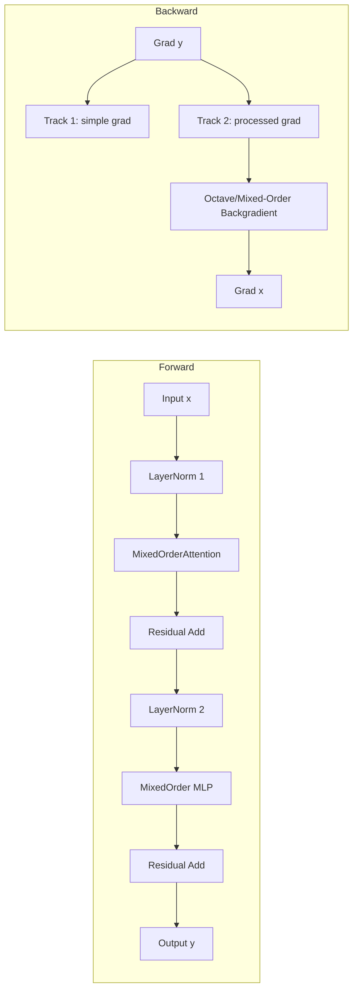

---

## 7. Audience guide

- **General readers**:  
  - Think of these as **equation templates** that the model fills in.  
  - Polynomial, exponential, and frequency‑octave terms are just different “shapes” of behaviour.

- **Applied ML users**:  
  - Use `PolynomialMixedRegressor` like any scikit‑learn regressor.  
  - Use `SmallMixedModel` or `MixedGPTBlock` as drop‑in PyTorch modules.

- **Researchers / advanced users**:  
  - Extend `EquationTemplate` to more complex symbolic forms.  
  - Implement custom `process_fn` for two‑backgradient flows (e.g. octave‑aware backprop).  
  - Explore how mixed‑order and frequency‑octave semantics affect training dynamics.

This keeps the **GPT specifics abstract**, while showing how **polynomial, mixed‑order, and frequency‑octave structures** can be integrated into both scikit‑learn and PyTorch ecosystems.

# Let's give a primitive for exponential number

## Form

We use this number form, with two internal index positions:

```
  [0]Domain
  [1]Range
```

We use this Activator class for conversion:

```
  [1]Range
  [2]Implication
```

We use functional representation where we refer to function representation:

```
  def function(domain, range) implies implication
```

We use unit-term representation:

```
  number unit
```

"Unit" is the domain, and number is the range. We can see unit as input, and number as output.

Video graphics:
- Compare unit to perspective matrix; this is the ***projection matrix***
  - This does standard perspectives
- Compare number to affine matrix used for each object node; this is the ***object=>move matrix***
  - This does affine translations
 
3D is using 4D matrix:
- 3D at topleft is multiplication matrix, as used in AI.
- 1D at bottomright is always "1", because this cell does not exist.
- last column is standard bias, but the last cell which is shared with last row, is always "1" and not in vector.
- last row is added bias you might try, and the last cell is *already* always "1" because it's shared with the last point.
- this is like m * n square field with numbers looks like, and should look like.
- I don't know why I want more + and - operations: altough the differentials must go through this. I don't want to get it now
  at least, because I want linearized exponents.

# Primitive form of linearized exponent

# 🌟 A Scalar “Order” for Number Pairs  
*A compact article for general readers, using UTF‑8 icons and GitHub‑friendly KaTeX math with **dollar‑delimited** expressions only.*

When you look at a pair of numbers — for example $(2,2)$ or $(2,4)$ — you can ask a natural structural question: **what kind of growth does this pair represent?** Is it constant, linear, exponential, or something between those? And can we express that as a **single scalar “order”**, behaving a bit like how derivatives move downward and integrals move upward?

This article introduces a simple, intuitive way to assign such an order.

---

## 🧭 The Core Idea  
Given two numbers $a$ and $b$, we want a **single number** that describes how $b$ relates to $a$:

- no change → constant  
- additive change → linear  
- multiplicative change → exponential  
- fractional or higher‑order behaviors → intermediate or extended orders  

This order should work for integers, discrete values, or floating‑point values.

---

## 🧩 Step 1 — What the Pair Represents  
A pair $(a,b)$ implicitly asks:

> **What function $f(x)$ could pass through these two points, and what is the “order” of that function?**

If the transition from $a$ to $b$ is:
- none → constant  
- additive → linear  
- multiplicative → exponential  

then the order should reflect that structure.

---

## 📐 Step 2 — A Natural Order Measure  
A clean and powerful definition is:

$$\text{order} = \log_a(b)$$

This gives a **continuous**, **dimensionless** measure of how “exponent‑layered” the pair is.

### Examples  
- Pair $(2,2)$:  
  $$\log_2(2) = 1$$  
  → behaves like $x^1$ → **linear**

- Pair $(2,4)$:  
  $$\log_2(4) = 2$$  
  → behaves like $x^2$ → **exponential doubling**

- Pair $(2,8)$:  
  $$\log_2(8) = 3$$  
  → **double‑exponential layer**

This creates a **ladder of orders** that matches intuitive growth categories.

---

## 🎛 Step 3 — Matching the “Differential/Integral” Ladder  
If you want:

- **0** → constant  
- **1** → linear  
- **2** → exponential  
- **3** → double‑exponential  

then the logarithmic order already provides exactly that.

It also supports fractional orders:

- Pair $(2,\sqrt{2})$:  
  $$\log_2(\sqrt{2}) = 0.5$$  
  → “half‑order” growth

This makes the system flexible and expressive.

---

## 🧮 Example Table  

| Pair $(a,b)$ | Order $\log_a(b)$ | Interpretation |
|--------------|-------------------|----------------|
| $(2,2)$ | $1$ | linear |
| $(2,4)$ | $2$ | exponential |
| $(2,8)$ | $3$ | double‑exponential layer |
| $(2,1)$ | $0$ | constant |
| $(2,1.414\ldots)$ | $0.5$ | fractional order |

---

## 🎨 Why This Works Well  
This single scalar:

- captures the **degree** of exponent‑layer behavior  
- works for discrete or floating‑point values  
- aligns with the idea of **orders moving up or down**  
- provides a natural foundation for naming concepts like a potential **“exponoment”**  

It’s mathematically clean, intuitive for readers, and expressive enough for documentation or conceptual frameworks.

# 🎚️ Frequency Octaves  
*A compact conceptual article with octave‑based projection and activation, written in Markdown, with math in `$...$` KaTeX form. Python code appears in triple‑fenced blocks below.*

When one number sits **one multiplicative level above or below** another, we can treat that as **one octave of frequency shift**. An octave is a clean, fractal‑like unit: each step outward or inward forms a new **layer or sphere**, like a hologram expanding or contracting by a factor of two.

This octave logic becomes a **unit conversion** between:
- **spatial domain** (position, index, layer), and  
- **temporal/range domain** (value, activation, output).

Instead of choosing an arbitrary activation function, we let the **unit shift itself** — the octave distance — *be* the activation.

---

## 🧭 Octaves as frequency distance

Given two positive values $a$ and $b$, define:

$$
\text{octaves}(a,b) = \log_2\!\left(\frac{b}{a}\right)
$$

- $+1$ → one octave above  
- $-1$ → one octave below  
- fractional → smooth band between layers  

This octave distance becomes the **projection coefficient** used for reprojection and activation.

---

## 🧩 Spatial vs temporal domains

We treat:
- **Spatial domain**: $x$ (position, index, layer)  
- **Temporal domain**: $y$ (value, float, tensor‑1)

A **projection** maps a value into its octave band relative to a reference:

$$
f(x) \mapsto \text{octaves}(f(x), f_{\text{ref}})
$$

This projection expresses how the system shifts in frequency space.

---

## 📐 Differential and integral frequency

Given positions $x$ and values $y(x)$:

- **Differential frequency**:

$$
\Delta \text{octaves}(x) = \text{octaves}(y(x+\Delta x), y(x))
$$

- **Integral frequency band**:

$$
\text{band}(x_0 \to x_1) = \sum_{x=x_0}^{x_1} \Delta \text{octaves}(x)
$$

This describes acceleration, constancy, linearity, or deceleration in frequency space.

---

## 🔁 Reprojection and activation

Let:
- $z$ = pre‑input (spatial layer)  
- $x$ = input (temporary layer)  
- $y$ = output (next layer)

### 1. **Reprojection (z → x)**  
Compute the octave shift:

$$
c = \text{octaves}(z, x)
$$

### 2. **Activation (x → y)**  
Use the *same* coefficient:

$$
y = x \cdot 2^{c}
$$

Thus the activation is not arbitrary — it is the **same unit shift** measured during reprojection.

---

## 🧠 Summary

- Octaves give a **clean, fractal unit** for comparing values.  
- Projection extracts a **frequency band** from spatial–temporal comparison.  
- Activation reuses the **same band**, ensuring coherence across layers.  
- No arbitrary non‑linearity is needed: the **octave structure itself** provides it.

Below is the Python implementation (initial version by CoPilot).

```python
import numpy as np

def octave_distance(a: float, b: float) -> float:
    """Octave distance between two positive values a and b."""
    a, b = float(a), float(b)
    if a <= 0 or b <= 0:
        raise ValueError("Octave distance requires positive values.")
    return np.log2(b / a)

def frequency_profile(x: np.ndarray, y: np.ndarray, ref_mode: str = "self"):
    """
    Compute a frequency (octave) profile over a 1D spatial domain x with values y.
    ref_mode:
      - "self": compare y[i+1] to y[i]
      - "global": compare y[i] to y[0]
    """
    x = np.asarray(x, dtype=float)
    y = np.asarray(y, dtype=float)
    if y.ndim != 1 or x.shape != y.shape:
        raise ValueError("x and y must be 1D arrays of the same shape.")
    
    octaves = np.zeros_like(y)
    
    if ref_mode == "self":
        for i in range(1, len(y)):
            octaves[i] = octave_distance(y[i-1], y[i])
    elif ref_mode == "global":
        ref = y[0]
        for i in range(len(y)):
            octaves[i] = octave_distance(ref, y[i])
    else:
        raise ValueError("ref_mode must be 'self' or 'global'.")
    
    return octaves

def reprojection_coefficient(z: float, x: float) -> float:
    """Reprojection step: compute octave-based projection coefficient."""
    return octave_distance(z, x)

def octave_activation(x: float, coeff: float) -> float:
    """Activation step: apply the same octave shift to x."""
    return x * (2.0 ** coeff)

def layer_step(z: float, x: float) -> float:
    """
    One conceptual layer step:
      1. Reprojection: z -> x gives coefficient c.
      2. Activation: x -> y uses the same c.
    """
    c = reprojection_coefficient(z, x)
    y = octave_activation(x, c)
    return y

def layer_step_vector(z: np.ndarray, x: np.ndarray) -> np.ndarray:
    """
    Vectorized layer step:
      - z: pre-input layer values
      - x: input layer values
    """
    z = np.asarray(z, dtype=float)
    x = np.asarray(x, dtype=float)
    if z.shape != x.shape:
        raise ValueError("z and x must have the same shape.")
    
    coeffs = np.vectorize(octave_distance)(z, x)
    y = x * (2.0 ** coeffs)
    return y
```

# 🔁 Backgradients in Frequency‑Octave Space  
*Balanced backward propagation using octave reprojection and differential–integral frequency flow.*

Backpropagation normally computes gradients by differentiating activation functions.  
Here, the activation **is the octave shift itself**, so the backward pass must also operate in **frequency space**, not raw value space.

The goal is:

1. Compute **first‑order** backgradients (ordinary differential/integral).  
2. Reproject them through the **domain shift** (octave projection).  
3. Produce **second‑order** backgradients that match the structure of the forward pass.  
4. Ensure that the backward frequency levels (static/linear/exponential → 0/1/2) match the forward ones.

This creates a *balanced backgradient*: the backward flow mirrors the forward octave‑projection logic.

---

## 🧭 Step 1 — First‑order backgradient (local differential)

Given forward activation:

$$
y = x \cdot 2^{c}, \quad c = \text{octaves}(z,x)
$$

The raw derivative of $y$ w.r.t. $x$ is:

$$
\frac{\partial y}{\partial x} = 2^{c}
$$

So the **first‑order backgradient** is:

$$
g_x^{(1)} = g_y \cdot 2^{c}
$$

This is the “ordinary” backgradient before domain reprojection.

---

## 🧩 Step 2 — Domain reprojection (frequency backshift)

The backward pass must *undo* the forward octave shift.  
We compute the **backward octave coefficient**:

$$
c_{\text{back}} = \text{octaves}(y, x)
$$

Then we reproject the gradient:

$$
g_x^{(2)} = g_x^{(1)} \cdot 2^{-c_{\text{back}}}
$$

This gives a **domain‑corrected gradient** that lives in the same frequency space as $x$.

---

## 📐 Step 3 — Second‑order differential/integral correction

To propagate further back to $z$, we compute:

$$
c_{zx} = \text{octaves}(z, x)
$$

Then the **second‑order backgradient** is:

$$
g_z = g_x^{(2)} \cdot 2^{-c_{zx}}
$$

This ensures that the backward frequency levels match the forward ones.

---

## 🔁 Step 4 — Iteration across layers

For layers $(z \to x \to y)$:

- Forward:
  - Reprojection: $c = \text{octaves}(z,x)$  
  - Activation: $y = x \cdot 2^{c}$  

- Backward:
  - First‑order: $g_x^{(1)} = g_y \cdot 2^{c}$  
  - Domain reprojection: $g_x^{(2)} = g_x^{(1)} \cdot 2^{-c_{\text{back}}}$  
  - Second‑order: $g_z = g_x^{(2)} \cdot 2^{-c_{zx}}$  

This is the **balanced backgradient**: forward and backward flows use the same octave logic.

---

## 🧮 Python Implementation

### Octave utilities

```python
import numpy as np

def octave_distance(a: float, b: float) -> float:
    """Octave distance log2(b/a)."""
    a, b = float(a), float(b)
    if a <= 0 or b <= 0:
        raise ValueError("Octave distance requires positive values.")
    return np.log2(b / a)
```

---

### Forward pass (reprojection + activation)

```python
def forward_step(z: float, x: float):
    """
    Forward pass:
      c = octaves(z, x)
      y = x * 2**c
    """
    c = octave_distance(z, x)
    y = x * (2.0 ** c)
    return y, c
```

---

### Backward pass (balanced backgradient)

```python
def backward_step(z: float, x: float, y: float, c: float, g_y: float):
    """
    Balanced backgradient:
      1. First-order gradient: g_x1 = g_y * 2**c
      2. Domain reprojection: g_x2 = g_x1 * 2**(-c_back)
      3. Second-order correction: g_z = g_x2 * 2**(-c_zx)
    """
    # 1. First-order
    g_x1 = g_y * (2.0 ** c)

    # 2. Domain reprojection
    c_back = octave_distance(y, x)
    g_x2 = g_x1 * (2.0 ** (-c_back))

    # 3. Second-order correction
    c_zx = octave_distance(z, x)
    g_z = g_x2 * (2.0 ** (-c_zx))

    return g_z, g_x2
```

---

### Multi‑layer backward iteration

```python
def backward_chain(values, coeffs, g_last):
    """
    values: [(z1,x1,y1), (z2,x2,y2), ...]
    coeffs: [c1, c2, ...] forward octave coefficients
    g_last: gradient at final output

    Returns list of backgradients for each layer.
    """
    grads = []
    g = g_last

    for (z, x, y), c in reversed(list(zip(values, coeffs))):
        g_z, g_x = backward_step(z, x, y, c, g)
        grads.append((g_z, g_x))
        g = g_z  # propagate backward

    return list(reversed(grads))
```

---

## 🧠 Conceptual Summary

- Forward pass uses **octave projection** and **octave activation**.  
- Backward pass must **mirror** this structure.  
- Balanced backgradient ensures:
  - frequency levels (0 static, 1 linear, 2 exponential)  
  - remain consistent across forward and backward flow.  
- Reprojection and activation become **bidirectional** operations.  
- The network becomes a **frequency‑coherent system**, not a raw‑value system.

This gives you a differentiable, iterative, octave‑based backpropagation mechanism that matches the architecture you’re building.

# 🧩 Part 1/3 — Post‑Training Coding: GPT/DL, ML, and Semantic Mini‑Languages  
*Convenient sugar for PyTorch, scikit‑learn, and code‑like math expressions.*

This first part focuses on **post‑training coding**:

- how to **wrap and probe** GPT‑like and DL models in **PyTorch**,  
- how to **extract and refit** simple equation‑like models in **scikit‑learn**,  
- how to define **semantic mini‑languages** in **Python** that feel like *code‑shaped math*.

We’ll use a few carefully chosen libraries as **convenient sugar** to make otherwise tedious things trivial.

---

## 1. PyTorch: post‑training hooks for GPT‑like and DL models

We assume you already have a trained PyTorch model (GPT‑like or generic DL).  
We want to:

- **freeze** it,  
- **attach hooks** to inspect internal tensors,  
- optionally **apply transformations** (e.g. frequency/octave, mixed‑order) *without* changing the core model.

### 1.1. Simple wrapper with hooks

```python
import torch
import torch.nn as nn
from contextlib import contextmanager

class PostTrainingWrapper(nn.Module):
    """
    Wrap any nn.Module (e.g. GPT, CNN, Transformer) and
    attach forward hooks for inspection or light transformation.
    """
    def __init__(self, core: nn.Module):
        super().__init__()
        self.core = core
        self._handles = []
        self.activations = {}

    def add_hook(self, name: str, module: nn.Module, fn):
        """
        fn: (module, input, output) -> output
        """
        def hook(m, inp, out):
            self.activations[name] = out.detach()
            return fn(m, inp, out)
        handle = module.register_forward_hook(hook)
        self._handles.append(handle)

    def clear_hooks(self):
        for h in self._handles:
            h.remove()
        self._handles.clear()

    def forward(self, *args, **kwargs):
        with torch.no_grad():
            return self.core(*args, **kwargs)
```

### 1.2. Convenient sugar: `einops` for readable tensor reshaping

```python
from einops import rearrange

def attention_probe_hook(module, inp, out):
    """
    Example hook: rearrange attention output for easier analysis.
    """
    # out: (batch, seq, heads * dim)
    # make it (batch, heads, seq, dim)
    return rearrange(out, "b s (h d) -> b h s d", h=module.n_heads)
```

You can now:

- wrap a GPT model,  
- attach hooks to attention blocks, MLPs, layer norms, etc.,  
- analyze or lightly transform outputs *post‑training*.

---

### 1.3. Mermaid: post‑training flow around a GPT block

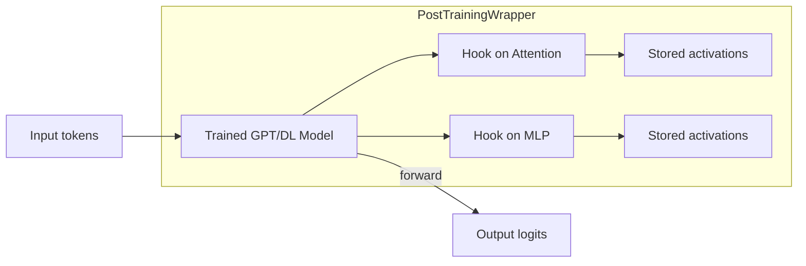

---

## 2. scikit‑learn: equation‑like post‑fits on model outputs

After training a complex model, you might want a **simple equation** that approximates its behaviour on some slice of data.

We can:

1. Run data through a trained model.  
2. Collect $(x, \hat{y})$ pairs.  
3. Fit a **polynomial/mixed‑order regressor** (from Part 0) as a **semantic equation class**.

### 2.1. Convenience function: fit a polynomial to a black‑box model

```python
from sklearn.linear_model import LinearRegression
import numpy as np

def fit_polynomial_to_model(model, X, degree=3):
    """
    Given a trained model and input X, fit a polynomial y ≈ sum a_k x^k
    to its outputs (1D case for simplicity).
    """
    X = np.asarray(X).ravel()
    with torch.no_grad():
        y_pred = model(torch.tensor(X, dtype=torch.float32)).cpu().numpy().ravel()

    # Build polynomial design matrix
    DM = np.vstack([X**k for k in range(degree + 1)]).T
    reg = LinearRegression().fit(DM, y_pred)
    return reg, reg.coef_, reg.intercept_
```

This gives you a **post‑training semantic equation** approximating the model’s behaviour on a chosen slice.

---

### 2.2. Mermaid: black‑box to equation template

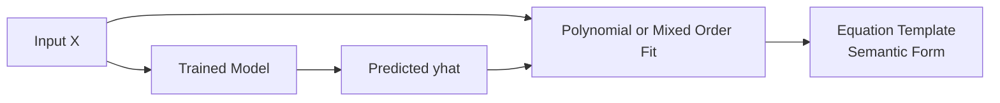

---

## 3. Semantic mini‑languages: code‑like math expressions

We now build a **tiny semantic language** for equations using:

- `dataclasses` for structure,  
- `sympy` for symbolic math,  
- optional `pydantic` or `attrs` if you want validation (we’ll keep it light).

### 3.1. Equation AST with dataclasses + sympy

```python
from dataclasses import dataclass
import sympy as sp

x = sp.symbols('x')

@dataclass
class PolyTerm:
    power: int
    coef: float

    def to_sympy(self):
        return self.coef * x**self.power

@dataclass
class ExpTerm:
    scale: float
    rate: float

    def to_sympy(self):
        return self.scale * sp.exp(self.rate * x)

@dataclass
class EquationExpr:
    poly_terms: list
    exp_term: ExpTerm | None = None

    def to_sympy(self):
        expr = sum(t.to_sympy() for t in self.poly_terms)
        if self.exp_term is not None:
            expr += self.exp_term.to_sympy()
        return expr
```

Now you can write:

```python
eq = EquationExpr(
    poly_terms=[PolyTerm(0, 1.0), PolyTerm(1, 0.5), PolyTerm(2, -0.1)],
    exp_term=ExpTerm(scale=0.3, rate=0.7),
)
sym_expr = eq.to_sympy()
print(sym_expr)  # 1.0 + 0.5*x - 0.1*x**2 + 0.3*exp(0.7*x)
```

This is a **semantic subset** of math, expressed as **code‑like structures**.

---

### 3.2. Mermaid: semantic mini‑language pipeline

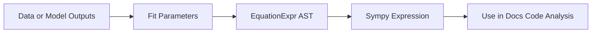

---

## 4. Sugar summary

- **PyTorch**:  
  - `PostTrainingWrapper` + hooks + `einops` → trivial to inspect and reshape GPT/DL internals.

- **scikit‑learn**:  
  - simple helpers to fit **polynomial/mixed‑order** equations to black‑box models → semantic equation classes.

- **Semantic mini‑languages**:  
  - `dataclasses` + `sympy` → code‑like math expressions that can be rendered, simplified, or exported.

In Part 2, we can connect these to **frequency‑octave**, **mixed‑order**, and **backgradient** semantics; in Part 3, we can turn them into **user‑facing languages** and documentation patterns.

# 🔶 Part 2/3 — Projection of Activator, Acceleration, Space–Time, Units, and Logical Bases  
*A structural explanation with code, diagrams, and semantic mini‑languages.*

This chapter explains how the **z → x → y** structure projects:

- Activator or implication  
- Acceleration and deceleration  
- Space (z), value (x), time (y)  
- Dimension or unit in z, value in x  
- Logical‑implication base in z, local inference in x  

We treat the system as a **projection pipeline**, where each layer transforms the previous one through frequency‑octave or mixed‑order logic.

---

# 1. Activator or Implication  
The activator is the **projection coefficient** derived from the relationship between layers.

Given:

- z = spatial or logical base  
- x = value or local inference  
- y = temporal implication  

The activator:

$$
c = \text{octaves}(z, x)
$$

The implication:

$$
y = x \cdot 2^{c}
$$

### Code

```python
def activator(z, x):
    return octave_distance(z, x)

def implication(x, c):
    return x * (2.0 ** c)
```

---

# 2. Acceleration and Deceleration  
Acceleration is **reuse of the same function** in the forward direction:

$$
y = x \cdot 2^{c}
$$

Deceleration is the **inverse** in the backward direction:

$$
z = x \cdot 2^{-c}
$$

### Code

```python
def accelerate(x, c):
    return x * (2.0 ** c)

def decelerate(x, c):
    return x * (2.0 ** (-c))
```

---

# 3. Space in z, Value in x, Time in y  
We treat the three layers as orthogonal axes:

- z = space  
- x = value  
- y = time  

### Mermaid Diagram (GitHub‑safe)

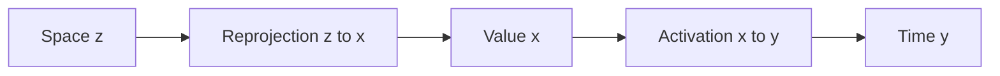

---

# 4. Dimension or Unit in z, Value in x  
The **unit** or **dimension** of the system lives in z.

The projection:

$$
x = \text{applyUnit}(z,\; \text{rawValue})
$$

### Code

```python
def apply_unit(z_unit, raw_value):
    return raw_value * z_unit
```

Then activation uses the **unit shift**:

```python
def unit_shift(z, x):
    c = octave_distance(z, x)
    return x * (2.0 ** c)
```

---

# 5. Metaphysics or Logical‑Implication Base in z  
- z = metaphysical base or logical foundation  
- x = local inference  
- y = implication  

The projection:

$$
\text{implication}(z,x) = x \cdot 2^{\text{octaves}(z,x)}
$$

### Semantic Mini‑Language Example

```python
from dataclasses import dataclass

@dataclass
class LogicalBase:
    strength: float

@dataclass
class LocalInference:
    value: float

def implication_strength(base: LogicalBase, local: LocalInference):
    return octave_distance(base.strength, local.value)
```

---

# 6. Combined Projection Pipeline  

1. Reprojection:  
   $$c = \text{octaves}(z, x)$$

2. Activation:  
   $$y = x \cdot 2^{c}$$

3. Acceleration:  
   $$\text{future}(x) = x \cdot 2^{c}$$

4. Deceleration:  
   $$\text{past}(x) = x \cdot 2^{-c}$$

5. Logical implication:  
   $$\text{implication}(z,x) = x \cdot 2^{\text{octaves}(z,x)}$$

### Full Code Example

```python
def project(z, x):
    c = octave_distance(z, x)
    y = x * (2.0 ** c)
    return y, c

def backproject(z, x, y):
    c = octave_distance(z, x)
    z_recovered = x * (2.0 ** (-c))
    return z_recovered
```

---

# 7. Mermaid: Full Projection and Backprojection  
*GitHub‑compatible version*

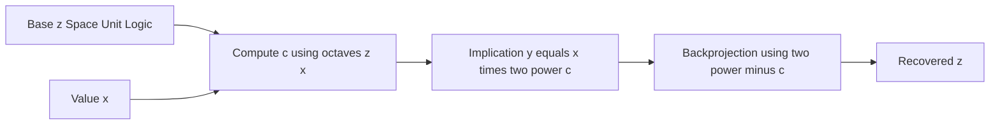

---

# 8. Summary  
This chapter shows how:

- Activator = implication strength  
- Acceleration = forward projection  
- Deceleration = backward projection  
- Space (z) becomes value (x) becomes time (y)  
- Units and dimensions live in z  
- Logical bases live in z, local inferences in x  

All expressed through the same projection coefficient:

$$
c = \text{octaves}(z, x)
$$

Part 3/3 will unify this into a full semantic language, PyTorch module, scikit‑learn symbolic estimator, and documentation‑ready DSL.

# 🌍 Part 4 — Real‑World Examples of Linear, Exponential, Logarithmic & Mixed‑Order Change  
*Business, ethics, society, and personal life — expressed as functions, flows, and UML‑style diagrams.*

This chapter shows how mathematical structures appear in everyday life, global systems, and personal stories.

We use symbolic functions like:

- **Linear:** $f(x)=ax+b$
- **Exponential:** $f(x)=a\cdot r^{x}$
- **Logarithmic:** $f(x)=a\ln(x)+b$
- **Mixed‑order:** $f(x)=ax+b+cr^{x}+d\ln(x)$
- **Random precedence:** $f(x)=\text{shuffle}\{\text{linear},\text{exp},\text{log}\}$

And we map them to human‑readable stories.

---

# 1. Business Change Examples  
Businesses rarely grow in a single pattern. They mix:

- linear hiring  
- exponential customer adoption  
- logarithmic saturation  
- random shocks  

## 1.1. Startup Growth  
Early‑stage startup:

- Users grow exponentially:  
  $f_{\text{users}}(t)=10\cdot1.4^{t}$
- Revenue grows linearly:  
  $f_{\text{rev}}(t)=2t+1$
- Attention saturates logarithmically:  
  $f_{\text{attention}}(t)=5\ln(t+1)$

### UML‑style Diagram

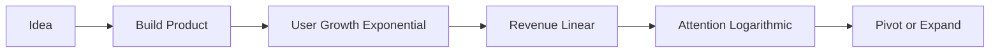

---

# 2. Ethical & Social Change Examples  
Ethical norms often shift in mixed‑order ways:

- slow linear drift  
- sudden exponential jumps  
- logarithmic stabilization  

## 2.1. Public Opinion Shift  
- Early adopters exponential:  
  $f_{\text{early}}(t)=0.1\cdot1.5^{t}$
- Majority acceptance linear:  
  $f_{\text{majority}}(t)=0.2t$
- Resistance decays logarithmically:  
  $f_{\text{resist}}(t)=-\ln(t+1)$

### UML‑style Diagram

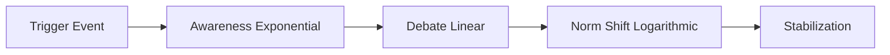

---

# 3. Global Social Dynamics  
Large‑scale social systems behave like mixed‑order functions with random precedence.

## 3.1. Technology Adoption Curve  
- Early adoption exponential:  
  $f_1(t)=0.01\cdot2^{t}$
- Mid adoption linear:  
  $f_2(t)=0.3t$
- Late adoption logarithmic:  
  $f_3(t)=10\ln(t+1)$

Combined:

$f(t)=f_1(t)+f_2(t)+f_3(t)$

### UML‑style Diagram

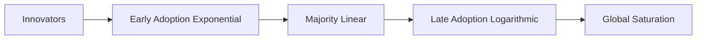

---

# 4. Personal Life Examples  
People experience mixed‑order change constantly.

## 4.1. Learning a Skill  
- Early learning exponential:  
  $f_{\text{skill}}(t)=1.3^{t}$
- Plateau logarithmic:  
  $f_{\text{plateau}}(t)=5\ln(t+1)$
- Mastery linear:  
  $f_{\text{mastery}}(t)=0.1t$

### UML‑style Diagram

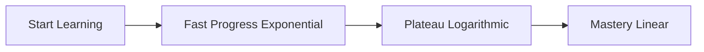

---

# 5. Personal Emotional Examples  
Emotions also follow mathematical patterns.

## 5.1. Recovering from a Break or Loss  
- Shock exponential drop:  
  $f_{\text{shock}}(t)=-2^{t}$
- Stabilization logarithmic:  
  $f_{\text{stabilize}}(t)=\ln(t+1)$
- Growth linear:  
  $f_{\text{growth}}(t)=0.3t$

### UML‑style Diagram

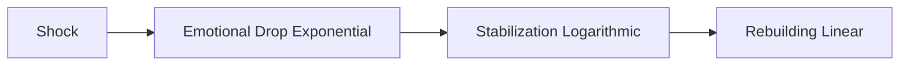

---

# 6. Mixed‑Order Random Precedence  
Sometimes life mixes functions unpredictably:

$f(t)=\text{shuffle}\{at+b,\;cr^{t},\;d\ln(t+1)\}$

### UML‑style Diagram

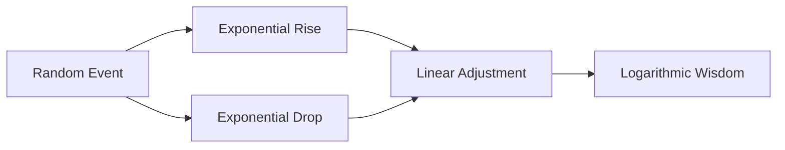

---

# 7. Summary  
This chapter showed how mathematical change patterns appear in:

- business  
- ethics  
- global society  
- personal life  

And how linear, exponential, logarithmic, and mixed‑order functions describe:

- growth  
- collapse  
- stabilization  
- transformation  

All expressed through intuitive stories and UML‑style diagrams.
