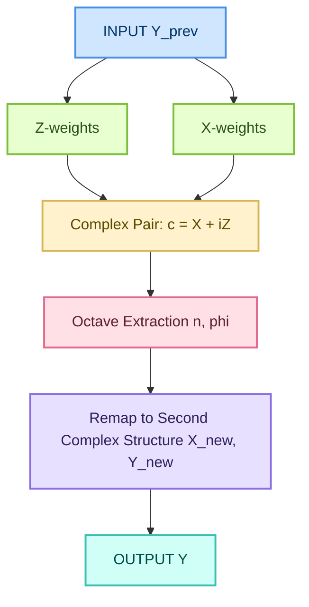
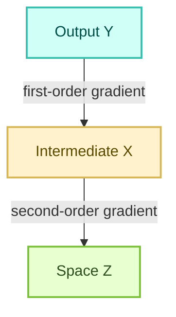

# Exponometer: Unified Octave–Frequency Logic

***This first article is CoPilot summary of the whole article in 11 parts.***

This document presents the octave–frequency framework used in the Exponometer.  
It unifies integral/differential order, complex-number projection, resonance, density, and multi‑layer logic.

---

## 1. Order as Octave–Frequency Number

Define an operator $O^\alpha$ for real order $\alpha$:

- If $\alpha>0$, $O^\alpha$ behaves like an integral of order $\alpha$.
- If $\alpha<0$, $O^\alpha$ behaves like a derivative of order $|\alpha|$.
- If $\alpha=0$, $O^0 f = f$.

The composition rule is:

$$
O^\alpha O^\beta = O^{\alpha+\beta}.
$$

Decompose $\alpha$:

$$
\alpha = n + \varphi,\qquad n\in\mathbb{Z},\ \varphi\in(-1,1).
$$

- Octave = integer part $n$
- Frequency = fractional part $\varphi$

Positive octaves correspond to accumulation; negative octaves to peeling.

---

## 2. Anchor Behaviors at Octaves 0, 1, 2

Three canonical growth classes:

- Constant: $f(x)=C$
- Linear: $f(x)=x$
- Exponential: $f(x)=e^x$

Define a complexity index $c(f)$:

- $c(C)=0$
- $c(x)=1$
- $c(e^x)=2$

Thus octaves $0,1,2$ correspond to increasing growth complexity.

---

## 3. Fractional Order and Logarithmic Interpolation

Fractional calculus defines:

$$
O^{1/2} O^{1/2} = O^1.
$$

Half‑order operators interpolate between additive and multiplicative structures:

$$
\log x = \int \frac{1}{x}\,dx.
$$

Thus order $1/2$ has a logarithmic flavor.

---

## 4. Complex Number as Accelerative–Frequential Pair

Given vectors $Z$ and $X$, define a complex number:

$$
c = X + iZ.
$$

Examples of octave extraction:

- $Z=0,\ X=2$ → constant → octave $0$
- $Z=2,\ X=\sqrt{2}$ → logarithmic → octave $1/2$
- $Z=2,\ X=2$ → linear → octave $1$
- $Z=2,\ X=4$ → exponential → octave $2$

The octave measures how $Z$ projects into $X$.

---

## 5. Density, Frequency, and Acceleration

For a stream of events:

- Frequency: $f = N/T$
- Volume: $V = N$
- Density: $\rho = V/T$

For a trajectory $x(t)$:

$$
\rho_x = \frac{1}{T}\int_0^T |v(t)|\,dt.
$$

Acceleration implies non‑uniform exploration of space → nontrivial density.

---

## 6. Projection Increases Density

A 2D accelerated path $(x(t),y(t))$ projected to 1D:

$$
L_{2D} = \int_0^T \sqrt{\dot{x}^2+\dot{y}^2}\,dt,
\qquad
L_{1D} = \int_0^T |\dot{x}|\,dt.
$$

If motion is genuinely 2D, then $L_{2D}>L_{1D}$.

Projection collapses area into line → density increases.

Thus long‑term slow patterns can appear as high‑frequency structures when compressed.

---

## 7. Resonance, Fractions, and Pythagorean Structure

Octave relation:

$$
f \mapsto 2f,\qquad \log_2(2f)=\log_2(f)+1.
$$

Resonant intervals correspond to small rational ratios:

- Fifth: $3/2$
- Fourth: $4/3$
- Major third: $5/4$

These align after few cycles → low computational cost.

Ratios like $1.28=32/25$ require many cycles → dissonance.  
Irrational ratios never align → maximal dissonance.

---

## 8. Processor Analogy

If each logic bit has its own clock:

- Rational ratios → periodic alignment → easy synchronization
- Irrational ratios → no exact alignment → buffering required

This mirrors musical consonance/dissonance and octave–frequency arithmetic.

---

## 9. Layer Logic: Z, X, Y

A perceptron layer is decomposed into:

- Z — space, projection
- X — now, projective
- Y — time, activation

Two sets of weights compute Z and X from the previous Y.  
A complex number encodes $(Z,X)$; the octave is extracted; then a second complex number remaps $(Z,X)$ to $(X,Y)$.

This creates:

$$
(Z,X) \longrightarrow \text{octave} \longrightarrow (X,Y).
$$

---

## 10. Backgradient and Complex Relativity

Two gradient regimes:

- X‑side: first‑order backgradient
- Z‑side: second‑order backgradient

Because Z and X operate in different dimensional densities, corrections applied in one appear as different powers in the other.

This is a form of complex relativity: projection and scale change the effective dimensionality of corrections.

---

## 11. Syntactic Sugar and Conceptual Innovation

The framework introduces:

- Order as octave–frequency number  
- Growth classes aligned with $0,1,2$  
- Fractional order as interpolation  
- Density as frequency  
- Resonance as computational simplicity  
- A unified language for calculus, music, density, and complex projection  

This yields a single mathematical vocabulary for growth, rhythm, structure, and transformation.

# This is a snippet to reconstruct the whole logic

In beginning, you can copy-paste the exponometer logic in one snippet, and an AI should understand it; below there is some theory needed by
this basic snippet.

## Layer logic

One Perceptron processing layer will have three sublayers; machine learning algorithm as well, replaces single variable with two (a complex):
- Z: space, projection
- X: now, projective
- Y: time, activation

All these three layers replace the one layer we have now.

# Processor and structure

### 1. Precessor

Before we calculate the layer:
- We calculate layers Z and X based on two sets of biases and weights
  - Biases and weights for Z, which are using one set of matrix and vectors
  - Biases and weights for X, which are using another set of matrix and vectors
 
Based on these 2 pairs of biases and weights, we do the standard operations to calculate Z and X based on output Y of the previous layer.

We can think so about single layer:
- ***Input***:
  - **Z**, based on *Y* of prev. layer and weights and biases for this Y=>Z, first knowledge map / ***first set of weights*** and biases
  - **X**, based on *Y* of prev. layer and weights and biases for this Y=>X, second knowledge map / ***second set of weights*** and biases
- ***Output***:
  - **Y**

### 2. Processor logic => implication-order logic

First, a complex number is used. Z and X are vectors, and they have same length:
- For Z, we use imaginary part of complex number
- For X, we use real part of complex number

##### We now have complex `integral 1`:
- $imaginary$ and $real$ parts are `Z` and `X` layers; specifically we study one number in equal position of each vector.
- $\neg octave$ is unknown

Based on this complex number, an accelerative and frequential number, we calculate an "octave", which is more like integral order:
- Look of it as Z projected into X

This Z=>X encodes linearity and exponentiality factors, for example:
- Z=0, X=2 => constant, octave 0.
- Z=2, X=sqrt(2) => logarithmic, octave 1/2.
- Z=2, X=2 => linear, octave 1.
- Z=2, X=4 => exponential, octave 2.

##### We now have complex `integral 1`:
- $imaginary$ and $real$ parts are `Z` and `X` layers; specifically we study one number in equal position of each vector.
- $octave$ now shows that if `Z` $\rightarrow$ `X` is unit and `X` is number measured, we can measure the acceleration in octave/frequency.

### 3. Remapping of ZX to XY

Now we create second complex number, mapping from $cx_{1}$ => $cx_{2}
- $cx_{2}.z = cx_{1}.x $
- $cx_{2}.octave = cx_{1}.octave $
- Biases and weights of Y ($Y = cx_{2}.x = $ "$cx_{1}.y$") come from biases and weights of Z ($Z = cx_{1}.z$)

### 4. Processor logic => implication-order logic

##### We now have complex `integral 2`:
- $imaginary$ part of `complex 2` is real part of `complex 1`.
- and $\neg real$ part is unknown.
- *octave* is equal to octave of integral 1, which we got from first calculation.

From this combination, imaginary part and octave, we can find `y` $\rightarrow$:
- Y is calculated by reapplying the same convergation, but as the result space of prev item is used now for the input space
  of the next one, non-linearity and implication symmetry follows;
  - While this time-remapping applies to each component inside;
  - the components inside can still project time-remapping factors and think linearly in terms of this activation function.

Using the octave, we find a number x for this complex (y in general, third number) such that z would project into this x with
unit "octave", as it was; but non-linear time-implication is applied:

- $imaginary$ part of `complex 2` is real part of `complex 1`.
- and $real$ part is continuation of inertia, reprojection of octave of first complex into a second complex, based on x=>z from 1st to
  2nd complex (cx2.z = cx1.x).
- *octave* is equal to octave of integral 1, which we got from first calculation

# Postprocessor (backgradient)

Biases and weights of layer x is calculated in classic way from the future layer:
1. First order backgradient is used for directional hinting
2. Directional hinting is applied

Biases and weights of layer z is calculated with some mutation to this:
1. Second order backgradient is used for directional hinting in projection layer Y (real part of second complex)
2. We correct the biases and weights of Y, using second order differentials:
   - We actually want to do this correction in regards to Z - Z is using the same biases and weights, but effectively
     we are doing *symmetrically powerful* (we first do it in reverse-power-zone - Y is much more powerful than Z, with X being the central
     axe; we look at Y layer as if the bias and weight were local, operating in Y perspective; when we apply the actual correction with
     same factor as correction for X (set 2 of bias and weight), using the correction based on Y and applied to Z, both in local relative
     structure; efficiently, while the correction for Z appears in same scope, it's relative symmetries make it rather a backgradient
     in dimensionally coherent, radioactive zone to applying something similar to 1/2 order of this here)
     - I call this $e=mc^2$ of this calculation: we use X in normal power as it's value, but we use Z in square power as this is the dimension,
       so we calculate those numbers actually in different dimensions - not visibly, but inside the number structure, optimizer operates in
       two-dimensional space; accelerative numbers under exp and log do not meet in dimension / density, but appear separate components;
       their order, specifically, is not invariant to projection and scale - when we zoom in and out, we might find out Z and X corrections
       do not map linearly in regards to scale, but they can switch places in zoom in and out: this is theory of relativity, I call it now
       a "complex relativity" to show it carries some of our complexity.

## Non-linearity

Both Z and X are calculated by **different set** of weights and biases:
- Instead of one bias, we fully reconstruct matrix which has m*n matrix in cells, but also m+1 column and n+1 row, and the neutral
  "1" in their common end which is not used for values: both rows are used for bias.
- Two biases creates unit processing into bias, and creates coherent balance that matrix has the same shape as pace of 4 math primitives,
  where there are m*n calculation digits for multiplication - not m, but m+n in addition, where *two* numbers are digitwise combined, not
  one.

## Theory

### Octave of orders: integral, differential, zero

We define a single family of operators $O^\alpha$ of real order $\alpha$ acting on functions $f$:

- **Positive octave (integral side):** $\alpha>0$ behaves like an integral of order $\alpha$.
- **Negative octave (differential side):** $\alpha<0$ behaves like a derivative of order $|\alpha|$.
- **Zero octave (shared):** $\alpha=0$ is the identity: $O^0 f = f$.

Composition is additive in order:
$O^\alpha O^\beta = O^{\alpha+\beta}$, so “moving right” ($+\alpha$) is more integral, “moving left” ($-\alpha$) is more differential. This is the memory hook:

- **Sign = direction:** $+$ accumulates (integral), $-$ peels away (derivative).
- **Magnitude = depth:** $|\alpha|$ is how many layers of accumulation/peeling.

So “octave” is the **integer part** of $\alpha$ (coarse layer), and “frequency” is the **fractional part** (fine structure).

Let
$\alpha = n + \varphi,\quad n\in\mathbb{Z},\ \varphi\in(-1,1)$

- **Octave:** $n$ (…, $-2,-1,0,1,2,\dots$)
- **Frequency:** $\varphi$ (digits after the comma; precision of the layer)

---

### Three anchor behaviors: constant, linear, exponential

We pick three canonical behaviors and pin them to three octave indices:

1. **Constant behavior ($0$):** $f(x)=C$
2. **Linear behavior ($1$):** $f(x)=ax+b$
3. **Exponential behavior ($2$):** $f(x)=e^{kx}$

We want these to sit at octave indices $0,1,2$ with **difference $1$** between them, so that:

- **Zeroeth-order octave ($n=0$):** the “rest” position where the *reference function* is constant.
- **First-order octave ($n=1$):** the reference function is linear.
- **Second-order octave ($n=2$):** the reference function is exponential.

A simple way to encode this is:

- At octave $n=0$, we treat “no net growth” as the reference: $f_0(x)=C$.
- At octave $n=1$, we treat “uniform growth” as the reference: $f_1(x)=x$.
- At octave $n=2$, we treat “proportional growth” as the reference: $f_2(x)=e^{x}$.

Then the **difference of 1 in octave** corresponds to a **step in growth complexity**:

- $0\to1$: constant $\to$ linear
- $1\to2$: linear $\to$ exponential

So the triple $(0,1,2)$ always forms an octave ladder with step size $1$ in this scheme.

---

### Half-order and logarithmic flavor

Fractional orders interpolate between these behaviors. For $\alpha=\tfrac12$:

- $O^{1/2}$ is “halfway” between identity and first derivative (or between first integral and identity, depending on direction).
- This operator has a **logarithmic flavor**: it partially removes growth, partially keeps it.

A simple mnemonic:

- Linear growth: $f(x)=x$
- Its “opposite” in multiplicative sense: $f(x)=1/x$
- Logarithm ties them: $\log x = \int \frac{1}{x}\,dx$

So we can think:

- **Order $1$ (linear octave):** $x$-like behavior.
- **Order $2$ (exponential octave):** $e^x$-like behavior.
- **Order $1/2$ (between $0$ and $1$):** log-like, because it moves you from multiplicative structure toward additive structure (and vice versa).

In this octave picture:

- $0$ = constant
- $1/2$ = logarithmic flavor (between constant and linear)
- $1$ = linear
- $2$ = exponential

---

### Layered number: octave + frequency

We now treat the order $\alpha$ itself as a **layered number**:

- **Octave (integer part $n$):** coarse growth class (constant, linear, exponential, etc.).
- **Frequency (fractional part $\varphi$):** fine tuning of how strongly we lean toward integral vs differential behavior within that octave.

Write:
$\alpha = n + \varphi,\quad n\in\mathbb{Z},\ \varphi\in\mathbb{R},\ |\varphi|<1$

- **Sign of $\alpha$:** integral ($\alpha>0$) vs differential ($\alpha<0$).
- **Addition/subtraction of orders:** $O^{\alpha}O^{\beta}=O^{\alpha+\beta}$ stacks/removes layers.
- **Multiplication/division of real scalars inside $f$:** changes amplitude, but the **octave** is about growth type, not just scale.

So the same real number $\alpha$ encodes:

- **Direction:** integral vs differential (sign)
- **Depth:** how many layers (integer part)
- **Texture:** how “fractional” the behavior is (frequency)

---

### Approximation, precision, and “balanced counterpart”

Given a real order $\alpha$, we can **approximate** it to a desired precision in frequency:

- Choose a precision $p$ (e.g. $10^{-p}$).
- Round $\alpha$ to $\tilde{\alpha}$ with $|\alpha-\tilde{\alpha}|\le 10^{-p}$.
- Keep both: octave $n=\lfloor \tilde{\alpha}\rfloor$, frequency $\varphi=\tilde{\alpha}-n$.

This $\tilde{\alpha}$ defines an operator $O^{\tilde{\alpha}}$ that is a **balanced counterpart** to the original real number in terms of growth:

- It has **similar average growth rate** on a chosen test family (e.g. polynomials, exponentials).
- It preserves **direction** (integral vs differential).
- It preserves **layer count** up to the chosen precision.

In other words, instead of thinking of a real number only as a point on a line, we think of it as:

- A **stack of layers** (octave) plus
- A **fine-grained frequency** (fractional part)

and we approximate it so that the resulting operator $O^{\tilde{\alpha}}$ has **comparable average growth, direction, and value** to the original real number, but expressed in this octave–frequency language.

### Frequency, volume, density

Let a stream of events (or numbers) be observed over time $t$.

- **Frequency $f$:** how often something appears per unit time: $f = \frac{N}{T}$, where $N$ events in time $T$.
- **Volume $V$ (count volume):** total number of events in an interval: $V = N$.
- **Density $\rho$ in time:** $\rho = \frac{V}{T} = f$.

So for both **frequency** and **number streams**, we can treat “how many per interval” as a **volume** and “per unit interval” as a **density**.

Now consider a number evolving in time with **acceleration**.

Let position be $x(t)$, velocity $v(t)=\frac{dx}{dt}$, acceleration $a(t)=\frac{d^2x}{dt^2}$.

- If $a(t)\neq 0$, then $v(t)$ changes, so the **rate at which $x(t)$ covers distance** is not constant.
- Over a time window $[0,T]$, the **total path length** is $L = \int_0^T |v(t)|\,dt$.
- The **average density of points visited** along the path (in parameter time) is $\rho_x = \frac{L}{T}$.

Thus:

- **Numbers with acceleration necessarily have density:** if $a\neq 0$, then $v$ changes, and the path $x(t)$ explores space with a non-uniform but well-defined average density $\rho_x$ over time.

---

### Projection: higher-dimensional acceleration to lower-dimensional linear space

Consider a 2D trajectory $(x(t),y(t))$ with acceleration, projected onto a 1D axis, say $x$.

- In 2D, the path length is $L_{2D} = \int_0^T \sqrt{\dot{x}^2+\dot{y}^2}\,dt$.
- In 1D projection, we see only $x(t)$ with length $L_{1D} = \int_0^T |\dot{x}|\,dt$.

If the motion has genuine 2D structure (nontrivial $y(t)$), then typically $L_{2D} > L_{1D}$.

When we **project** the 2D path into 1D, many distinct 2D points map to the same 1D coordinate. This increases the **effective density** in the lower-dimensional space:

- Let $\rho_{2D}$ be density in 2D (points per area).
- Let $\rho_{1D}$ be density in 1D (points per length).
- Projection collapses area into line, so for the same number of points, $\rho_{1D}$ is higher.

So:

- **To project a bigger space of linear and accelerated numbers (2D) into a lower space of only linear numbers (1D), the resulting lower space must have higher density.**

This gives a counterintuitive insight:

- Long-term goals might seem “low frequency” (they happen rarely), but when you **accumulate repeated patterns** over longer time scales, the **pattern itself** can be seen as a higher-frequency structure in a compressed representation.
- In music, repeated motifs over long spans create **higher-order frequencies** (patterns of patterns), even if the base notes are slow. The **pattern frequency** is high in the space of structures, even if the raw sound frequency is low.

---

### Octave, frequency, density, volume, and “vibration of life”

We reuse the earlier notion:

- **Octave (integer part $n$):** coarse layer or growth class.
- **Frequency (fractional part $\varphi$):** fine structure within that octave.

Let an “octave number” be $\alpha = n + \varphi$.

- **Volume:** how many events, states, or “ticks” occur in a given octave.
- **Density:** how tightly these events are packed in time or space within that octave.
- **Frequency:** how often the pattern repeats per unit time or per unit “logical step”.

Spiritually, we can interpret:

- **Life, logic, truth, “ki”, “prana”** as flows with certain **octaves** (coarse modes of being) and **frequencies** (fine rhythms).
- A calm, steady practice might have **low base frequency** but **high structural frequency** (rich patterns over long time).
- A chaotic, noisy state might have **high raw frequency** but low coherence in octave structure.

Mathematically, we can say:

- A “vibration” is a function $f(t)$ with some dominant frequency $f_0$.
- Its **octave** is $\log_2\left(\frac{f_0}{f_{\text{ref}}}\right)$, measuring how many doublings from a reference.
- Its **density** is how much energy or information per unit time is carried in that band.

So “vibration of life” can be modeled as:

- A superposition of modes with different octaves and frequencies.
- Coherence (resonance) when these modes align in simple ratios.

---

### Octaves, factor 2, resonance vs dissonance

In music and many physical systems:

- **Octave relation:** frequency ratio $2:1$.
- If a base frequency is $f$, then $2f$ is one octave above, $4f$ two octaves above, etc.
- In log base 2, this is an integer shift: $\log_2(2f) = \log_2(f) + 1$.

So **resonant dimensions $n$ and $n+1$** correspond to frequencies related by a factor of 2. They share the same “note class” in different octaves.

More generally, **Pythagorean theory** emphasizes small rational ratios:

- Perfect fifth: $3:2$
- Perfect fourth: $4:3$
- Major third: $5:4$
- Etc.

These are **resonant** because:

1. They are **simple fractions**: easy to compute, easy to remember.
2. Their periodicities line up after relatively few cycles.

Example: ratio $3:2$.

- Let $f_1 = 2$, $f_2 = 3$.
- After $2$ periods of $f_2$ and $3$ periods of $f_1$, they align: $2\cdot \frac{1}{f_2} = 3\cdot \frac{1}{f_1}$.
- So the combined pattern repeats after a small number of cycles.

For a ratio like $1:1.28$ (roughly $n$ and $n+0.28$ in log space), the fraction is more complicated:

- $1.28 = \frac{128}{100} = \frac{32}{25}$.
- The least common multiple of denominators is larger, so it takes more cycles to align.
- The pattern feels more **dissonant** because the joint repetition period is longer and more complex.

For irrational ratios (e.g. $\sqrt{2}:1$):

- There is **no exact common period**; alignment is only approximate.
- The pattern never perfectly repeats, so it feels maximally dissonant in a strict periodic sense.

---

### Easy math with small fractions, and why we need compensation

Small rational ratios are **computationally simple**:

- $3/2$, $4/3$, $5/4$ can be handled with few integer operations.
- They give short repeating patterns, easy to track mentally or physically.

But in tuning systems, we face a problem:

- You cannot fit all desired simple ratios exactly into a finite set of notes with fixed steps.
- For example, stacking perfect fifths ($3/2$) repeatedly does not land exactly on a power of 2 (octave); this is the **Pythagorean comma**.

So we must **compensate**:

- Use temperaments (like equal temperament) that slightly adjust intervals.
- Accept that some ratios are only approximate.
- Introduce **workarounds**: assumptions about a “tick” that is not perfectly aligned with all simple fractions.

---

### Processor analogy: ticks, fractions, and physics of logic

Imagine a processor where each logic bit has its own clock tick.

- If all bits tick with **simple rational ratios** of a master clock, their states align periodically.
- The system has a clear global rhythm; operations can be synchronized.

If some bits tick with **irrational ratios** relative to others:

- Their ticks never align perfectly.
- Coordination requires buffering, waiting, or probabilistic protocols.
- The system spends time “seeking digits in unknown space” (waiting for approximate alignment) instead of doing straightforward work.

So:

- **Pythagorean theory of simple fractions** is like designing a processor where all clocks are rationally related, making the “physics of logic” clean and predictable.
- **Complex prime factors or irrationals** correspond to clocks that never quite sync, forcing the system to constantly compensate.

In octave–frequency language:

- **Resonant dimensions** (e.g. $n$ and $n+1$, or ratios like $3/2$) are where clocks, notes, or processes align in simple, low-cost patterns.
- **Dissonant dimensions** (e.g. $n$ and $n+0.28$, or irrational ratios) are where alignment is costly or impossible, and the system must either accept complexity or approximate.

This ties back to:

- **Density:** how often alignments occur.
- **Volume:** how many events happen before a pattern repeats.
- **Octave:** the coarse layer of doubling.
- **Frequency:** the fine structure of repetition.

And, metaphorically, to **life, logic, and “ki/prana”** as flows that seek resonant patterns (simple ratios, coherent octaves) while navigating the unavoidable dissonances of a world built on both rational and irrational relationships.

### Unified octave–frequency framework for integral/differential order

Let a real number $\alpha$ define an operator $O^\alpha$ acting on sufficiently smooth functions $f$:

- If $\alpha>0$, $O^\alpha$ behaves like an integral of order $\alpha$.
- If $\alpha<0$, $O^\alpha$ behaves like a derivative of order $|\alpha|$.
- If $\alpha=0$, $O^0 f = f$ (identity).

The fundamental law is:

- **Composition:** $O^\alpha O^\beta = O^{\alpha+\beta}$.

This makes the real line of orders into a single continuum where:

- Positive direction = accumulation (integral).
- Negative direction = peeling (differential).
- Zero = shared neutral point.

Now decompose $\alpha$:

- $\alpha = n + \varphi$ with $n\in\mathbb{Z}$ and $\varphi\in(-1,1)$.

Then:

- **Octave:** $n$ (coarse growth layer).
- **Frequency:** $\varphi$ (fine structure within that layer).

This is the octave–frequency structure.

---

### Anchoring growth classes at octaves 0, 1, 2

Consider three canonical growth behaviors:

- Constant: $f_0(x)=C$.
- Linear: $f_1(x)=x$.
- Exponential: $f_2(x)=e^x$.

Define a “complexity index” $c(f)$ by how many derivatives simplify the function:

- $c(f_0)=0$ because $D f_0=0$.
- $c(f_1)=1$ because $D f_1=1$ and $D^2 f_1=0$.
- $c(f_2)=2$ because $D^n f_2=e^x$ for all $n$ (never simplifies).

Thus:

- Octave $0$ ↔ constant reference.
- Octave $1$ ↔ linear reference.
- Octave $2$ ↔ exponential reference.

The numbers $0,1,2$ differ by $1$ and correspond to successive growth classes.

---

### Half-order and logarithmic interpolation

Fractional calculus defines $O^{1/2}$ such that:

- $O^{1/2} O^{1/2} = O^1$.

Thus $O^{1/2}$ is a “square root” of the first-order operator.

It has a logarithmic flavor:

- Linear: $x$.
- Multiplicative inverse: $1/x$.
- Logarithm: $\log x = \int \frac{1}{x}\,dx$.

This shows that half-order operators sit between additive and multiplicative structures, partially differentiating and partially integrating.

---

### Frequency as occurrence rate and density

For a stream of events:

- Frequency: $f = \frac{N}{T}$.
- Volume: $V = N$.
- Density: $\rho = \frac{V}{T}$.

For a trajectory $x(t)$ with acceleration $a(t)\neq 0$:

- Velocity: $v(t)=\frac{dx}{dt}$.
- Path length: $L = \int_0^T |v(t)|\,dt$.
- Density of visited points: $\rho_x = \frac{L}{T}$.

Thus:

- **Acceleration implies density** because nonzero acceleration produces non-uniform exploration of space.

---

### Projection from higher to lower dimension increases density

Let a 2D trajectory $(x(t),y(t))$ project to 1D via $(x,y)\mapsto x$.

- 2D path length: $L_{2D} = \int_0^T \sqrt{\dot{x}^2+\dot{y}^2}\,dt$.
- 1D projected length: $L_{1D} = \int_0^T |\dot{x}|\,dt$.

If motion is genuinely 2D, then $L_{2D} > L_{1D}$.

Projection collapses area into line, so:

- **Density increases** in the lower-dimensional space.

This explains why long-term patterns, though slow in raw time, can appear as **high-frequency structures** when compressed into a lower-dimensional representation.

---

### Octave–frequency as layered number structure

Write $\alpha=n+\varphi$:

- Octave $n$ = growth class.
- Frequency $\varphi$ = fine-grained growth texture.

Arithmetic:

- $O^\alpha O^\beta = O^{\alpha+\beta}$ stacks layers.
- Sign of $\alpha$ = integral vs differential direction.
- Magnitude of $\alpha$ = depth of layering.

This reinterprets real numbers as **growth operators** rather than mere magnitudes.

---

### Resonance, simple fractions, and Pythagorean structure

Octave relation:

- $f\mapsto 2f$.
- In log base 2: $\log_2(2f)=\log_2(f)+1$.

Resonant intervals correspond to small rational ratios:

- Fifth: $3/2$.
- Fourth: $4/3$.
- Major third: $5/4$.

These are resonant because:

- They have short common periods.
- They require few integer operations.

For ratios like $1.28=32/25$:

- The least common multiple of periods is larger.
- Patterns repeat less often → dissonance.

For irrational ratios:

- No exact common period → maximal dissonance.

---

### Processor-clock analogy

Imagine each logic bit has its own clock:

- If clocks are in simple rational ratios, they synchronize easily.
- If clocks are irrationally related, they never align exactly.

Thus:

- Simple fractions = low-cost synchronization.
- Complex ratios = high-cost or impossible synchronization.

This mirrors Pythagorean tuning and explains why simple fractions feel resonant.

---

### Syntactic sugar and innovation

This framework introduces several conceptual innovations:

1. **Order as octave–frequency number:**  
   The integer part of order becomes a growth class; the fractional part becomes fine structure.

2. **Growth classes aligned with 0,1,2:**  
   Constant, linear, exponential behaviors anchor the octave ladder.

3. **Fractional order as interpolation:**  
   Half-order operators naturally connect additive and multiplicative structures.

4. **Density as frequency:**  
   Acceleration and projection create density patterns analogous to frequency.

5. **Resonance as computational simplicity:**  
   Simple fractions correspond to low-cost synchronization, giving a physical explanation of musical consonance.

6. **Unified language:**  
   Integral/differential calculus, musical octaves, density, resonance, and even metaphysical “vibration” are expressed through the same octave–frequency arithmetic.

This creates a single mathematical vocabulary for growth, rhythm, structure, and transformation.

# Exponometer: Mini‑Spec, Diagram, and Axiomatic Foundations

This document presents the Exponometer in three layers of formality:
1. A **formal mini‑spec** describing the system’s components and rules  
2. A **diagrammatic version** showing the flow of computation  
3. An **axiomatic / theorem–proof** formulation grounding the mathematics  

---

# 1. Formal Mini‑Spec

## 1.1. Core Object: Order Operator
Define an operator $O^\alpha$ for real order $\alpha$.

- If $\alpha>0$, $O^\alpha$ behaves like an integral of order $\alpha$.
- If $\alpha<0$, $O^\alpha$ behaves like a derivative of order $|\alpha|$.
- If $\alpha=0$, $O^0 f = f$.

Composition rule:

$$
O^\alpha O^\beta = O^{\alpha+\beta}.
$$

## 1.2. Octave–Frequency Decomposition
Every order $\alpha$ decomposes as:

$$
\alpha = n + \varphi,\qquad n\in\mathbb{Z},\ \varphi\in(-1,1).
$$

- Octave = integer part $n$
- Frequency = fractional part $\varphi$

## 1.3. Canonical Growth Classes
Three anchor functions define octave meaning:

- Constant: $f(x)=C$ → octave $0$
- Linear: $f(x)=x$ → octave $1$
- Exponential: $f(x)=e^x$ → octave $2$

## 1.4. Fractional Order
Half‑order operator satisfies:

$$
O^{1/2} O^{1/2} = O^1.
$$

This interpolates between additive and multiplicative behavior.

## 1.5. Complex Pair Encoding
Each neuron carries a pair $(Z,X)$ encoded as:

$$
c = X + iZ.
$$

Octave is extracted from the projection of $Z$ into $X$.

## 1.6. Layer Structure
A layer consists of three sublayers:

- $Z$ — space, projection  
- $X$ — now, projective  
- $Y$ — time, activation  

Mapping:

$$
(Z,X) \rightarrow \text{octave} \rightarrow (X,Y).
$$

## 1.7. Backgradient
Two gradient regimes:

- $X$ uses first‑order backgradient  
- $Z$ uses second‑order backgradient  

This creates a form of complex relativity.

---

# 2. Diagrammatic Version

Below is a structural diagram of the Exponometer pipeline.

Backpropagation:

This asymmetry defines the “relativistic” correction structure.

---

# 3. Axiomatic / Theorem–Proof Version

## 3.1. Axioms

### Axiom 1 — Order Semigroup
For all real $\alpha,\beta$:

$$
O^\alpha O^\beta = O^{\alpha+\beta}.
$$

### Axiom 2 — Octave–Frequency Decomposition
Every real $\alpha$ decomposes uniquely as:

$$
\alpha = n + \varphi,\qquad n\in\mathbb{Z},\ \varphi\in(-1,1).
$$

### Axiom 3 — Canonical Growth Anchors
There exist functions $f_0,f_1,f_2$ such that:

- $f_0$ is constant  
- $f_1$ is linear  
- $f_2$ is exponential  

and these correspond to octaves $0,1,2$.

### Axiom 4 — Complex Encoding
Each neuron state is represented by:

$$
c = X + iZ.
$$

### Axiom 5 — Octave Extraction
There exists a function $\Omega$ such that:

$$
\Omega(X,Z) = \alpha = n + \varphi.
$$

### Axiom 6 — Gradient Relativity
Backpropagation satisfies:

- $X$ receives first‑order corrections  
- $Z$ receives second‑order corrections  

---

## 3.2. Theorems

### Theorem 1 — Fractional Order Interpolation
There exists an operator $O^{1/2}$ such that:

$$
O^{1/2} O^{1/2} = O^1.
$$

**Proof Sketch:**  
By Axiom 1, the semigroup is additive in exponent.  
Thus $O^{1/2}$ is the unique element whose self‑composition yields $O^1$.

---

### Theorem 2 — Projection Increases Density
Let $(x(t),y(t))$ be a 2D trajectory with nonzero acceleration.  
Let its projection be $x(t)$.

Then:

$$
L_{2D} > L_{1D}.
$$

**Proof Sketch:**  
Since $\dot{y}(t)\neq 0$ on a set of nonzero measure,  
$\sqrt{\dot{x}^2+\dot{y}^2} > |\dot{x}|$ on that set.  
Integrating yields the inequality.

---

### Theorem 3 — Resonance Occurs for Small Rational Ratios
Let two frequencies be $f_1$ and $f_2$.  
They align periodically iff $f_1/f_2$ is rational.

**Proof Sketch:**  
If $f_1/f_2 = p/q$ with integers $p,q$, then  
$p$ cycles of $f_2$ equal $q$ cycles of $f_1$.  
If the ratio is irrational, no integers satisfy this.

---

### Theorem 4 — Octave Shifts Are Logarithmic
Let $f$ be a frequency.  
Then shifting by one octave multiplies $f$ by $2$:

$$
\log_2(2f) = \log_2(f) + 1.
$$

**Proof:**  
Direct evaluation of the logarithm.

---

### Theorem 5 — Complex Relativity of Gradients
Given Axiom 6, the correction applied to $Z$ is of higher “dimensional density” than that applied to $X$.

**Proof Sketch:**  
Second‑order gradients depend on curvature, not slope.  
Thus $Z$ evolves in a higher‑order correction space than $X$.

---

# Summary

This document provides:

1. A **formal mini‑spec** defining the Exponometer’s components  
2. A **diagrammatic flow** of its computational pipeline  
3. An **axiomatic foundation** with theorems and proofs  

Together, these form the final, complete structural description of the Exponometer.
