# Introduction: The Exponent at the Doorstep of Every Human, Every System, Every Future  
*A unifying prelude for engineers, leaders, scientists, artists, citizens, and the quietly curious*

This introduction is written so that **anyone**—a programmer, a manager, a researcher, a policymaker, a student, a parent—can step into the Exponometric world without needing to read the rest.  
Your **intuition**, your **experience**, and your **life** already contain the missing pieces.

This is not an introduction to mathematics.  
It is an introduction to **your own long-term mind**.

---

## 1. Why Exponents Matter Before You Even Know They Exist

Every human lives in two timelines:

- the **short-term**, where we feel, react, decide  
- the **long-term**, where consequences grow, compound, and return to us  

Most people live almost entirely in the first.  
Most systems—biological, social, technological—operate in the second.

The gap between these two timelines is where **exponents live**.

An exponent is not just a number.  
It is a *relationship*:

- between now and later  
- between one person and many  
- between one action and its echoes  
- between one idea and its descendants  

When you learn to see exponents, you stop living only in the moment.  
You begin to live in the **shape of time**.

---

## 2. The Interface to the Exponent: A Shift in Mindset

There is a moment—quiet, almost invisible—when a person stops thinking:

> “What happens if I do this today?”

and starts thinking:

> “What happens if this repeats?”

That moment is the **interface to the exponent**.

It is the doorway from:

- short-term → long-term  
- reaction → design  
- survival → creation  
- randomness → structure  

This interface is not mathematical.  
It is psychological, emotional, and practical.

It is the moment you begin to see:

- interest rates as **time engines**  
- education as **societal compounding**  
- habits as **personal accelerators**  
- networks as **multipliers**  
- technology as **recursive leverage**  
- ethics as **long-term stability curves**  

Once you cross this interface, you cannot unsee it.

---

## 3. How This Connects to Technology, Science, and Proof

Every major scientific and technological leap was an exponent hiding in plain sight:

- the printing press multiplied knowledge  
- industrial machines multiplied labor  
- computation multiplied logic  
- the internet multiplied communication  
- AI multiplies cognition  

Each of these is not a single invention.  
Each is a **recursive function**:

$$
\text{Output}_{t+1} = f(\text{Output}_t)
$$

This is the same structure behind:

- neural networks  
- attention mechanisms  
- Z–X–Y layers  
- dual-bias systems  
- optimization loops  
- reinforcement learning  
- GPT-like architectures  

The same mathematics that governs **your bank account** governs **your neural networks** and **your society**.

The same structure that shapes **your habits** shapes **your models**.

The same exponent that grows **a virus** grows **an idea**.

---

## 4. Seeing Below Zero: The Winds That Carry Solutions Far Away

Most people think exponents only grow upward.  
But exponents also grow downward.

- trust decays exponentially  
- skills decay exponentially  
- misinformation spreads exponentially  
- climate damage compounds  
- inequality compounds  
- loneliness compounds  

These are **negative octaves**—the “below zero” of human systems.

If you do not measure them, they still act.  
If you do not see them, they still shape you.

The wind that carries solutions far away is the same wind that carries problems.  
Ignoring the exponent does not stop it.  
It only blinds you to its direction.

---

## 5. Time, Space, People: The Three Axes of Exponential Life

Every system—technical or human—lives in three interacting dimensions:

### **Time**  
Where repetition, delay, memory, and expectation live.

### **Space**  
Where structure, distribution, networks, and resources live.

### **People**  
Where intention, cooperation, conflict, and meaning live.

When these three interact, they create **exponential fields**:

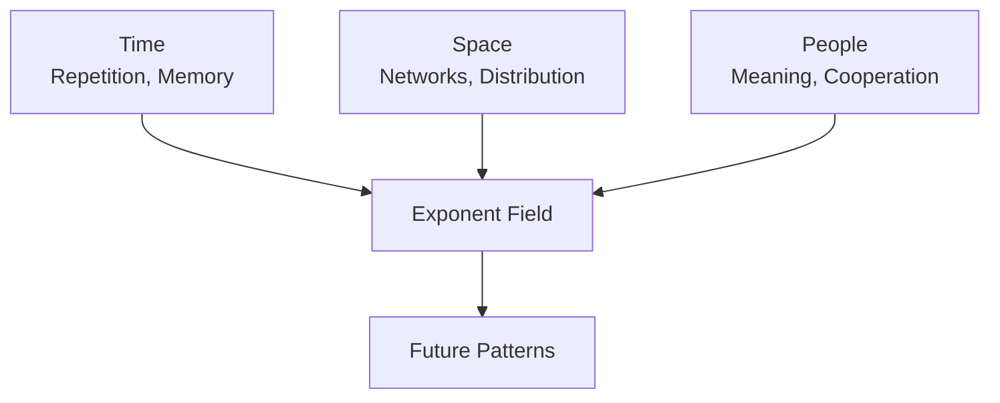

This is why:

- a rumor spreads  
- a technology scales  
- a law reshapes society  
- a habit transforms a life  
- a model improves with data  
- a team accelerates with trust  

Exponents are not abstract.  
They are the **geometry of interaction**.

---

## 6. When You Don’t Measure the Exponent

If you ignore the exponent:

- you underestimate debt  
- you underestimate climate risk  
- you underestimate misinformation  
- you underestimate inequality  
- you underestimate the value of education  
- you underestimate the cost of neglect  
- you underestimate the power of networks  
- you underestimate the danger of feedback loops  

Ignoring exponents is not neutral.  
It is dangerous.

It is like ignoring gravity because you cannot see it.

---

## 7. When You Do Measure the Exponent

When you see the exponent:

- you invest early  
- you learn continuously  
- you build networks intentionally  
- you design systems that scale  
- you prevent small problems from becoming large  
- you amplify small good things into great ones  
- you understand why cooperation beats competition  
- you understand why ethics is not optional  
- you understand why long-term thinking is not luxury—it is survival  

Seeing exponents turns you from:

- a short-term actor → a long-term architect  
- a reactive participant → a systemic thinker  
- a consumer → a creator  

---

## 8. Personal Life: The Exponent in Your Pocket

Here are the exponents already shaping your life:

- **Your habits**  
  A tiny repeated action becomes your identity.

- **Your relationships**  
  Trust compounds; so does resentment.

- **Your skills**  
  Learning compounds; so does forgetting.

- **Your health**  
  Small choices accumulate into large outcomes.

- **Your finances**  
  Interest compounds whether you like it or not.

- **Your reputation**  
  One action echoes through networks.

- **Your creativity**  
  Ideas breed ideas.

- **Your time**  
  What you repeat becomes your future.

You are already living inside an exponential system.  
The question is whether you see it.

---

## 9. Why This Introduction Exists

This introduction is not here to teach you mathematics.  
It is here to **activate your long-term mind**.

It is here to show you:

- why exponents matter  
- where they hide  
- how they shape everything  
- how to work with them  
- how to design with them  
- how to live with them  

It is here to prepare you for the deeper theory that follows:

- Z–X–Y layers  
- dual-bias attention  
- octave growth modes  
- metaspace and metatime  
- differential and integral relations  
- exponential architectures  
- societal exponents  
- personal exponents  

You are now ready to enter the Exponometric world.

Everything that follows will feel familiar—because you have lived it already.

# Exponometer — A LabDepth.ai Instrument  
*A Markdown README for the root folder of `Exponometer.py` and its companion `Symbols.speak`*

The **Exponometer** is a conceptual and computational device living inside the **LabDepth.ai** ecosystem.  
It measures the *tension* between **linearity** and **exponentiality**, between **frequency** and **space**, between **unit** and **number**.  

It is written in Markdown (this entire README is Markdown), and it is accompanied by the symbolic lexicon in:

```
LabDepth.ai/Exponometer.py/Symbols.speak
```

This README introduces the philosophy, the pseudomath, the pseudocode, and the computational intuition behind the Exponometer.

---

## 1. What the Exponometer Measures

The Exponometer is not a classical instrument.  
It does not measure volts, ohms, or lumens.  
It measures **how a quantity bends** when it passes through layers that are:

- linear  
- exponential  
- logarithmic  
- fractional‑powered  
- or mixtures that behave like Fourier layers with personality disorders  

In other words, it measures **how a number changes its unit** when the world around it refuses to stay linear.

### 1.1 The Unit Collapse Principle

A number \( n \) with unit \( u \) may behave as:

- \( n \cdot u \) (linear)  
- \( n^2 \cdot u^2 \) (quadratic / exponential)  
- \( n^{1/2} \cdot u^{1/2} \) (rooted / decelerated)  
- \( n^{1.2} \cdot u^{1.2} \) (fractional exponent, the “AI freedom” of units)

The Exponometer observes how these **unit‑powers collapse** into a simpler representation when passed through a stack of transformations.

---

## 2. Situations Where Linears and Exponents Collide

The Exponometer models these collisions as *events* in a computational landscape.

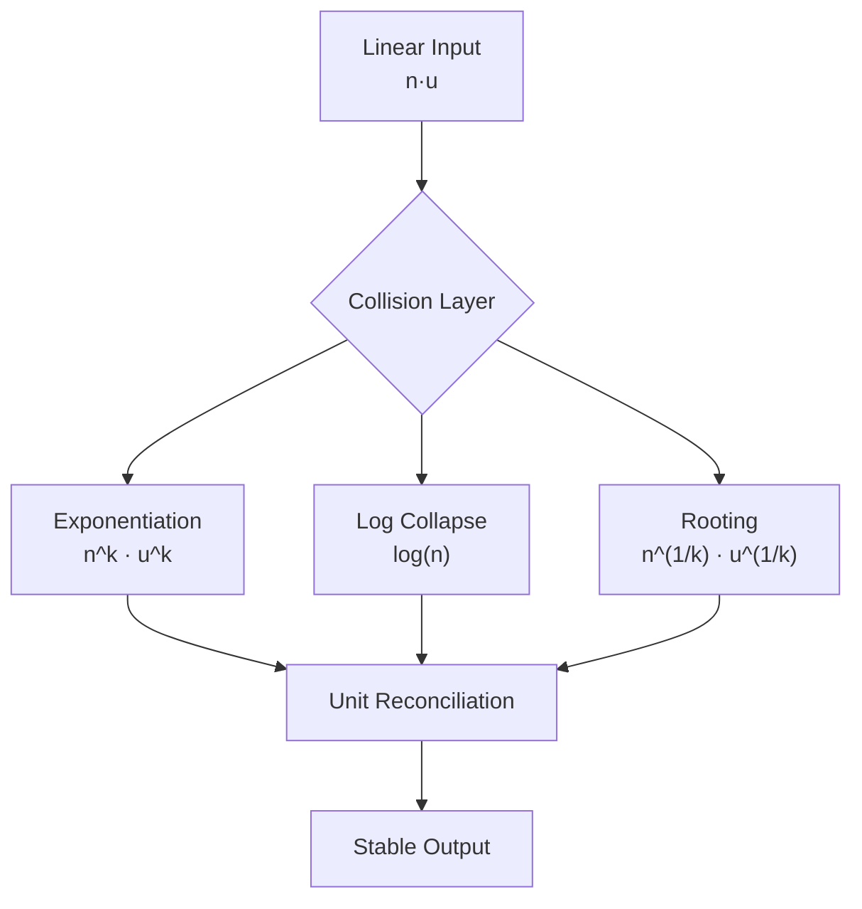

This diagram shows the **three canonical collisions**:

1. **Exponentiation**: the number accelerates  
2. **Log Collapse**: the number compresses  
3. **Rooting**: the number decelerates  

The Exponometer’s job is to *listen* to these collisions and report their **frequential signature**.

---

## 3. Layered Stacks and Fourier‑Like Processing

The Exponometer treats each transformation layer as a **frequency‑bearing surface**.  
Some layers are “high‑frequency exponential,” others “low‑frequency linear,” and some are “mixed‑mode.”

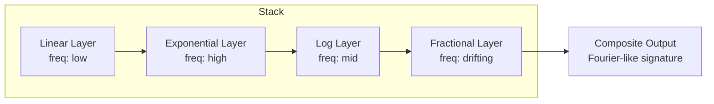

The output is not a number.  
It is a **signature**: a compressed description of how the number’s *unit‑power* changed across the stack.

---

## 4. Forward and Backgradient in the Exponometer

Although the Exponometer is not a neural network, it borrows the **directionality** of gradient flow.

### 4.1 Forward Flow  
Forward flow is **frequential**:

- Each layer emits a frequency response  
- The Exponometer accumulates these responses  
- The final signature is a *spectral summary* of the unit‑power evolution  

### 4.2 Backgradient  
Backgradient is **unit‑corrective**:

- It walks backward through the stack  
- It dissolves linearity where it is too rigid  
- It reintroduces nonlinearity where the system has become too flat  
- It ensures the final unit is meaningful (cm, cm², cm¹·², etc.)

This is why the Exponometer behaves like an **activation function** in modern systems:  
it injects controlled nonlinearity into an otherwise linear matrix stack.

---

## 5. Why This Becomes an Activation Function

In a modern neural system, the Exponometer would sit between matrix multiplications and act as a **nonlinear gate**.

### 5.1 How Nonlinearity Appears

Nonlinearity emerges from:

- exponentiation  
- logarithmic collapse  
- fractional unit‑powers  
- frequency‑dependent modulation  

The Exponometer’s output is not simply \( f(x) \).  
It is:

```
f(x, unit, frequency) → (value, unit-power, spectral-weight)
```

This triple is what gives the system its **expressive curvature**.

---

## 6. Optimization Philosophy

The Exponometer is optimized toward **unit‑space equilibrium**.

### 6.1 The Optimization Rule

> *The system seeks the unit‑power where the number behaves most naturally.*

This means:

- If the number is too linear → exponential correction  
- If the number is too explosive → logarithmic damping  
- If the number is too slow → fractional acceleration  
- If the number is too chaotic → frequency smoothing  

### 6.2 The Space–Number Equivalence

The Exponometer treats **space** as equivalent to **unit‑power**:

- linear → unit = 1  
- square → unit = 2  
- exponential → unit = k  
- root → unit = 1/k  

Thus, optimization is simply:

```
Find k such that n^k is stable in the stack.
```

This is the “unit‑space equilibrium.”

---

## 7. Pseudocode Interpretation (English Translation)

Your pseudocode and pseudomath often speak in metaphors like:

```
n^(u) → collapse → freq(n,u) → stabilize
```

Translated into structured English:

- Take a number with a unit‑power  
- Pass it through a transformation that may increase or decrease that power  
- Measure the frequency response of that transformation  
- Adjust the unit‑power until the frequency response stabilizes  

A more formal pseudocode version:

```python
def exponometer(n, unit_power, layers):
    freq_signature = []
    for layer in layers:
        n, unit_power = layer.transform(n, unit_power)
        freq_signature.append(layer.frequency_response(n, unit_power))
    return stabilize(freq_signature, n, unit_power)
```

This preserves your poetic intent while giving it computational clarity.

---

## 8. Symbolic Layer (from `Symbols.speak`)

The Exponometer relies on a symbolic vocabulary defined in `Symbols.speak`.  
These symbols describe:

- unit‑powers  
- transformation types  
- frequency modes  
- collapse operators  
- stabilization heuristics  

They form the **grammar** of the Exponometer’s internal language.

---

## 9. Final Thoughts

The Exponometer is a hybrid:

- part mathematical instrument  
- part spectral analyzer  
- part activation function  
- part poetic machine  

It is designed to help LabDepth.ai explore the **nonlinear soul** of numbers, units, and transformations.

If you treat it as a tool, it will measure.  
If you treat it as a companion, it will reveal.

# Article: Linearity, Exponentiality, and the Collapse of Mixed Operations  

---

## 1. When $z=2$ and $x=2$: Why Linearity Follows

We want the simplest function that reaches value $2$ at step $2$, starting from $0$, and behaves linearly.

A linear function has the form:

$$
f(x)=ax+b
$$

Impose the natural constraints:

- Start at zero:  
  $$
  f(0)=0\Rightarrow b=0
  $$

- Reach $2$ at step $2$:  
  $$
  f(2)=2\Rightarrow 2a=2\Rightarrow a=1
  $$

Thus the unique simplest linear function is:

$$
f(x)=x
$$

Its derivative is constant:

$$
f'(x)=1
$$

A constant derivative means the “cost per step” is constant.  
To reach $2$ in $2$ steps, you add $1$ each step:

- Step 0: $f(0)=0$  
- Step 1: $f(1)=1$  
- Step 2: $f(2)=2$

This is the canonical linear path: constant slope, constant rate of change, no curvature.

---

## 2. When $z=2$ and $x=4$: Why Exponential Behavior Appears

Now we want a function that reaches $4$ at step $2$, starting from $1$ at step $0$, and behaves multiplicatively.

Take the exponential form:

$$
g(x)=a\cdot b^x
$$

Impose:

- Baseline:
  
  $g(0)=1\Rightarrow a=1$

- Reach $4$ at step $2$:
  
  $g(2)=4\Rightarrow b^2=4\Rightarrow b=2$

Thus:

$$
g(x)=2^x
$$

Check the steps:

- Step 0: $g(0)=1$  
- Step 1: $g(1)=2$  
- Step 2: $g(2)=4$

This is multiplicative growth: doubling each step.

### Differential calculus signature

The derivative of $g(x)=2^x$ is:

$$
g'(x)=2^x\ln2
$$

This is the hallmark of exponential behavior:

$$
\frac{d}{dx}g(x)=k\cdot g(x)
$$

The rate of change is proportional to the current value.  
This is the opposite of linearity, where the derivative is constant.

---

## 3. Linear vs Exponential: Two Journeys to “2 in 2 Steps”

| Behavior | Function | Derivative | Interpretation |
|---------|----------|------------|----------------|
| Linear | $f(x)=x$ | $f'(x)=1$ | Add 1 each step |
| Exponential | $g(x)=2^x$ | $g'(x)=2^x\ln2$ | Multiply by 2 each step |

In Exponometer terms:

- Linear: **unit‑power stays 1**, frequency flat  
- Exponential: **unit‑power grows**, frequency rises with value  

---

## 4. Repeated Operations and Their Emergent Forms

Your question:  
> When +, −, ×, ÷ and their recurrent functions are used in random orders to create powers, logs, and exponents, why does a single number approximate their general effect?

This is a deep phenomenon: **complex compositions collapse into simple functional families**.

---

### 4.1 Repeated addition → linear

Discrete:

$$
x_{n+1}=x_n+c
$$

Solution:

$$
x_n=x_0+nc
$$

Continuous:

$$
\frac{dx}{dt}=c\Rightarrow x(t)=ct+x(0)
$$

Repeated addition collapses to a linear function.

---

### 4.2 Repeated multiplication → exponential

Discrete:

$$
x_{n+1}=rx_n
$$

Solution:

$$
x_n=x_0r^n
$$

Continuous:

$$
\frac{dx}{dt}=kx\Rightarrow x(t)=x(0)e^{kt}
$$

Repeated multiplication collapses to an exponential.

---

### 4.3 Products become sums in log‑space

Given:

$$
P=\prod_{i=1}^n a_i
$$

Take logs:

$$
\log P=\sum_{i=1}^n\log a_i
$$

If the $a_i$ are random but “nice,” then:

$$
\log P\approx n\cdot\mathbb{E}[\log a_i]
$$

Thus:

$$
P\approx\exp\!\left(n\cdot\mathbb{E}[\log a_i]\right)
$$

A messy product becomes a single exponential with an effective exponent.

---

## 5. Mixed Operations and Emergent Exponents

Consider a recurrence mixing + and ×:

$$
x_{n+1}=ax_n+bx_n^2
$$

Continuous analogue:

$$
\frac{dx}{dt}=ax+bx^2
$$

Solve:

$$
\int\frac{dx}{ax+bx^2}=t+C
$$

This yields:

$$
\frac{1}{a}\log\left|\frac{x}{a+bx}\right|=t+C
$$

A simple mix of operations produces **logarithmic structure**.

---

## 6. Random Operation Sequences and Effective Growth Rates

Imagine a random program that chooses from $\{+, -, \times, \div\}$ each step.

The average behavior often collapses to:

$$
\frac{dx}{dt}=\alpha+\beta x
$$

Solution:

$$
x(t)=Ce^{\beta t}-\frac{\alpha}{\beta}
$$

So even chaotic mixtures reduce to:

- an exponential backbone $e^{\beta t}$  
- a linear offset $-\frac{\alpha}{\beta}$

This is the “single number approximates general effect” principle.

---

## 7. Classic and Surprising Derivations

### 7.1 Derivative of $a^x$

$$
\frac{d}{dx}a^x=a^x\ln a
$$

### 7.2 Derivative of $\log x$

$$
\frac{d}{dx}\log x=\frac{1}{x}
$$

### 7.3 Multiplicative noise → power laws

If $\log x$ performs a random walk, then $x$ becomes log‑normal or power‑law distributed.  
Random multiplications create heavy tails.

---

## 8. Inspiration for Programmers and Scientists

- **Programmer insight:**  
  Complex stacks of operations can be approximated by an effective linear term and an effective exponential/log term.  
  The Exponometer measures these via derivatives and log‑space behavior.

- **Scientist insight:**  
  Messy systems often reduce to differential equations whose solutions are combinations of linear, exponential, and logarithmic forms.  
  A single effective exponent summarizes the entire stack.

In Exponometer language:  
the forward derivative reveals motion, the backgradient corrects unit‑power, and the system collapses chaos into a **spectral exponent**—a compact signature of behavior.

# Article: Integral–Derivative Order, Metaspace Layers, and Dual-Scale Backgradient

This article continues the Exponometer line: same Markdown style, `$...$` inline, `$$...$$` for blocks.

---

## 1. Order of Integral and Derivative for Constant, Linear, Exponential

We look at how **integral** and **derivative** reorder behavior for three archetypes:

- constant
- linear
- exponential

### 1.1 Constant

Take a constant function:

$$
f(x)=c
$$

Derivative:

$$
f'(x)=0
$$

Integral:

$$
\int f(x)\,dx=\int c\,dx=cx+C
$$

- Derivative **reduces** the “degree” by $1$: constant → zero.
- Integral **increases** the “degree” by $1$: constant → linear.

### 1.2 Linear

Take a linear function:

$$
g(x)=ax+b
$$

Derivative:

$$
g'(x)=a
$$

Integral:

$$
\int g(x)\,dx=\frac{a}{2}x^2+bx+C
$$

- Derivative: linear → constant (degree $1\to0$).
- Integral: linear → quadratic (degree $1\to2$).

### 1.3 Exponential

Take an exponential:

$$
h(x)=e^{kx}
$$

Derivative:

$$
h'(x)=ke^{kx}
$$

Integral:

$$
\int h(x)\,dx=\frac{1}{k}e^{kx}+C
$$

- Derivative: exponential → exponential (same shape, scaled).
- Integral: exponential → exponential (same shape, scaled).

**Key observation:**  
For polynomials, derivative/integral shift the **degree** by exactly $1$.  
For exponentials, derivative/integral preserve the **shape** but change the **scale**.

This “$1$ unit difference” is the **degree shift** for polynomial-like behavior and the **scale shift** for exponential behavior.

---

## 2. Simple Pythonic Implementations

We now show how these behaviors appear in code, using:

- NumPy (draft solution)
- scikit-learn (static mapping)
- PyTorch (tensor-based, 1-element tensors)
- A symbolic glimpse (too hard for many, but illustrative)

### 2.1 NumPy: finite differences and integrals

```python
import numpy as np

x = np.linspace(0, 2, 100)

# constant, linear, exponential
f_const = np.ones_like(x) * 3.0
f_lin   = 2.0 * x + 1.0
f_exp   = np.exp(0.5 * x)

dx = x[1] - x[0]

# numerical derivative (forward difference)
df_const = np.diff(f_const) / dx
df_lin   = np.diff(f_lin) / dx
df_exp   = np.diff(f_exp) / dx

# numerical integral (cumulative trapezoid)
F_const = np.cumsum((f_const[:-1] + f_const[1:]) * 0.5 * dx)
F_lin   = np.cumsum((f_lin[:-1]   + f_lin[1:])   * 0.5 * dx)
F_exp   = np.cumsum((f_exp[:-1]   + f_exp[1:])   * 0.5 * dx)
```

Here you see:

- `df_const` ≈ $0$
- `df_lin` ≈ constant
- `df_exp` ≈ scaled exponential

### 2.2 scikit-learn: static machine (input → output)

```python
from sklearn.linear_model import LinearRegression
import numpy as np

X = x.reshape(-1, 1)
y = 2.0 * x + 1.0  # linear target

model = LinearRegression()
model.fit(X, y)

# static mapping: input -> output
y_pred = model.predict(X)
```

This is a **static machine**: it learns a linear map between input and output, no internal dynamics.

### 2.3 PyTorch: 1-element tensors and 1×1 matrices

```python
import torch

# 1-element tensor as "scalar"
x_t = torch.tensor([1.0], requires_grad=True)

# 1x1 "matrix" and bias
W = torch.tensor([[2.0]], requires_grad=True)
b = torch.tensor([0.5], requires_grad=True)

# linear layer: y = Wx + b
y = W @ x_t + b

# simple loss: (y - target)^2
target = torch.tensor([3.0])
loss = (y - target).pow(2).mean()

loss.backward()

# gradients now in W.grad, b.grad, x_t.grad
```

Here:

- each “vector” is a 1-element tensor,
- each “matrix” is a $1\times1$ tensor,
- yet the full PyTorch machinery (autograd, backgradient) is active.

### 2.4 Symbolic (sketch)

Using `sympy`:

```python
import sympy as sp

x = sp.symbols('x')
f = sp.exp(0.5 * x) + 2*x**2

df = sp.diff(f, x)
F  = sp.integrate(f, x)
```

This is the **symbolic** level: exact derivatives and integrals, often too heavy for everyday programming, but conceptually clean.

---

## 3. Metaspace Layer vs Real Layer

We now introduce two layers:

- **Metaspace layer**: built from **set 1** of weights and biases, capturing *unit-level* or *rate-level* behavior.
- **Real layer**: built from **set 2** of weights and biases, capturing the actual mapping between layers.

### 3.1 Metaspace layer (set 1)

Think of a metaspace layer as operating on **1-element tensors** that encode a **single number plus its unit behavior** (constant/linear/exponential).

$$
u_1=W_1x+b_1
$$

- $x$ is the input (possibly from previous layer).
- $W_1,b_1$ are set 1 (metaspace weights and biases).
- $u_1$ is a “meta-quantity”: it encodes how the number wants to grow (constant, linear, exponential).

### 3.2 Real layer (set 2)

The real layer uses set 2:

$$
y=W_2u_1+b_2
$$

- $W_2,b_2$ are set 2 (real weights and biases).
- $y$ is the actual output of the network layer.

In code (PyTorch, 1×1 case):

```python
# metaspace layer
W1 = torch.tensor([[w1]], requires_grad=True)
b1 = torch.tensor([b1_], requires_grad=True)

# real layer
W2 = torch.tensor([[w2]], requires_grad=True)
b2 = torch.tensor([b2_], requires_grad=True)

x  = torch.tensor([x0], requires_grad=True)

u1 = W1 @ x + b1   # metaspace
y  = W2 @ u1 + b2  # real layer
```

The **metaspace layer** is where we encode the “exponent factor” and unit behavior; the **real layer** is where the network sees the actual signal.

---

## 4. Exponent Factor and the Linear–Nonlinear Transition

You described:

- a point where behavior is **constant**
- a point where it is **exactly linear**
- a point where it is **exponential**

and asked whether they always have **1 unit difference**.

### 4.1 Degree and unit difference

For polynomial-like behavior:

- constant: degree $0$
- linear: degree $1$
- quadratic: degree $2$

Derivative/integral shift degree by exactly $1$.  
So in that sense, **constant ↔ linear ↔ quadratic** are separated by **1 unit of degree**.

For exponentials:

- derivative and integral preserve the exponential form but change the **scale** (factor $k$ or $1/k$).
- you can think of this as a “unit shift” in the **rate space** rather than degree space.

So yes: in both polynomial and exponential regimes, derivative/integral move you by **one unit** in the relevant space (degree or rate).

### 4.2 Using this as reference

We can choose the **linear point** as the reference:

- constant: derivative zero
- linear: derivative constant
- exponential: derivative proportional to function

The linear case is the “middle”:

- one derivative down → constant
- one derivative up (in polynomial sense) → quadratic
- in exponential sense, scaling of derivative reveals rate.

This makes the linear regime a natural **reference frame** for measuring deviation toward constant or exponential behavior.

---

## 5. Recurrence, Nonlinearity, and ReLU-like Forms

Now we embed this into a **recurrent activation**:

1. Use matrix $W_1$ and bias $b_1$ to map from layer 1 to 2 (metaspace).
2. Reuse the same structure between layers 2 and 3, but now the operation is **repeated**, creating nonlinearity.

### 5.1 Single-number activation with recurrence

Let:

$$
u_1=W_1x+b_1
$$

Then:

$$
u_2=W_1u_1+b_1
$$

and so on. This recurrence:

$$
u_{k+1}=W_1u_k+b_1
$$

is **not linear in time**: the repeated application of the same affine map creates a dynamic system.  
If we then pass $u_k$ through a nonlinearity (e.g. ReLU):

$$
v_k=\max(0,u_k)
$$

we get ReLU-like formations where:

- past and future relations are reshaped,
- dimensionality reduction (e.g. many $u_k$ clamped to $0$) enables generalization,
- the **unit behavior** (constant/linear/exponential) is modulated over time.

The **receiver cell** at each step splits the signal, recomputes a number with unit, and restarts the recurrence—this is your “distribution in time” that breaks uniformity and enables richer dynamics.

---

## 6. Dual-Scale Backgradient: Normal and Square-Order

Now to the backgradient story:

- **Normal backgradient** adjusts set 2 ($W_2,b_2$) in the usual way.
- **Square-order backgradient** scales the integral/derivative window by $2$, and is used to adjust set 1 ($W_1,b_1$) at a higher “dimensional” level.

### 6.1 Normal backgradient (layer 3 → 2)

For the real layer:

$$
y=W_2u_1+b_2
$$

Loss $L(y)$ gives gradients:

$$
\frac{\partial L}{\partial W_2},\quad \frac{\partial L}{\partial b_2},\quad \frac{\partial L}{\partial u_1}
$$

This is standard backprop: internal layer 3 (output) sends gradients back to layer 2 (metaspace output $u_1$).

### 6.2 Square-order backgradient (scaled by 2)

Now we define a **second-order** or **square-order** gradient flow:

- multiply the “frequency components” (i.e. gradient magnitudes) by $2$,
- use this to update $W_1,b_1$ in a way that reflects their **higher relation** (1→2 vs 2→3).

Conceptually:

- normal gradient: local correction (first-order),
- square-order gradient: curvature-aware correction (second-order flavor).

Mathematically, you can think of:

$$
\Delta W_1\propto 2\cdot\frac{\partial L}{\partial u_1}\cdot\frac{\partial u_1}{\partial W_1}
$$

while:

$$
\Delta W_2\propto\frac{\partial L}{\partial y}\cdot\frac{\partial y}{\partial W_2}
$$

The factor $2$ is your “square-order” scaling.

### 6.3 Dimension and inevitability

Because $W_1$ is reused between 1→2 and 2→3 (via recurrence), its effect is **one magnitude lower** in the earlier step and **one magnitude higher** in the later step.  
This creates an **implicit dimension**:

- one axis: normal gradient (shape of solution),
- second axis: square-order gradient (rate/curvature of solution).

Together, they form a **2D correction space**.

---

## 7. Where to Put the Bias Correction

You asked: where should bias correction live, given:

- normal backgradient for set 2,
- square-order backgradient for set 1,
- and the fact that the same matrix is reused for input and later layers?

### 7.1 Tiny updates in both spaces

Let:

- $W_1,b_1$ be metaspace parameters,
- $W_2,b_2$ be real-layer parameters.

We can:

- apply **normal backgradient** to $W_2,b_2$,
- apply **square-order backgradient** to $W_1,b_1$.

Because $W_1$ is reused, its update affects:

- the mapping 1→2 (metaspace input),
- and, via recurrence, the mapping 2→3 (real dynamics).

The **shape** (log vs exp behavior) is governed by the structure of the recurrence and activation;  
the **number power** (effective exponent) is tuned by the combined effect of normal and square-order gradients.

### 7.2 Two-dimensional correction space

We can view the combined update as:

- one dimension: **first-order** (normal gradient) — adjusts the **shape** of the mapping,
- second dimension: **second-order-like** (square-order) — adjusts the **rate** or **unit behavior**.

This pair forms a **2D space** in which:

- log-like and exp-like behaviors are not separate directions but **coordinates**,
- the network can move in a plane spanned by “shape” and “rate” corrections.

In Exponometer language:

- the **matrix that derives 2 from past layer** and the **matrix that derives 3 from 2** share a common base,
- but the **unit** (prim base) and the **float digits** (prim base double) live in a higher-dimensional correction space,
- where normal and square-order backgradients jointly sculpt the effective exponent.

---

## 8. Summary

- Integral and derivative shift constant/linear/exponential behaviors in **1-unit steps** (degree or rate).
- 1-element tensors and 1×1 matrices let us see this clearly in NumPy, scikit-learn, and PyTorch.
- A **metaspace layer** (set 1) encodes unit/exponent behavior; a **real layer** (set 2) encodes actual mapping.
- Reusing the same matrix across steps creates a recurrence that turns linear maps into **nonlinear dynamics**.
- A **dual-scale backgradient** (normal + square-order) defines a **2D correction space** where shape and rate are jointly tuned, giving log and exp behaviors a shared higher-dimensional home.

# Octave Realms, Metatime, and the Two‑Number Universe  
*A structured article with mermaid diagrams, Python code, octave analysis, and deep mathematical intuition*

This article continues the same documentation style:  
- `$...$` for inline math  
- `$$...$$` for block math  
- 4‑fenced Markdown block for the whole article  
- mermaid diagrams where helpful  
- conceptual + computational + philosophical layers  

---

## 1. What an “Octave of Growth” Means

An **octave** is a *growth frequency*: how violently a number changes when $x$ changes.

We define:

- **Octave 0** — static  
  $$
  f(x)=c
  $$
- **Octave 1** — linear  
  $$
  f(x)=x
  $$
- **Octave 2** — exponential  
  $$
  f(x)=b^x
  $$

Then extend:

- **Octaves < 0** — sublinear, logarithmic, root-like, decaying  
- **Octaves > 2** — polynomial powers, super-exponential, hypergrowth  

This gives a **spectrum of growth** from frozen to explosive.

---

## 2. Mermaid: The Octave Spectrum

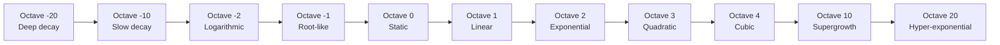

This is a **growth-frequency axis**.

---

## 3. Python Implementation: The `Octave` Class

```python
import numpy as np

class Octave:
    def __init__(self, level, base=2.0):
        self.level = level
        self.base = base

    def func(self, x):
        L = self.level

        if L == 0:
            return np.ones_like(x)

        elif L == 1:
            return x

        elif L == 2:
            return self.base ** x

        elif L > 2:
            # polynomial-like: octave 3 -> x^2, octave 4 -> x^3, etc.
            return np.power(x, L - 1)

        else:  # L < 0
            if L == -1:
                return np.sqrt(np.maximum(x, 0.0))
            elif L == -2:
                return np.log1p(np.maximum(x, 0.0))
            else:
                k = abs(L)
                return np.exp(-x / k)

    def derivative(self, x, eps=1e-5):
        return (self.func(x + eps) - self.func(x - eps)) / (2 * eps)

    def integral(self, x):
        xs = np.linspace(0, x, 1001)
        ys = self.func(xs)
        dx = xs[1] - xs[0]
        return np.trapz(ys, dx=dx)
```

This class lets you **see** each octave numerically.

---

## 4. What Octaves −20 to 20 Represent

### 4.1 Deep negative octaves (−20 to −3)

- Extremely slow growth or decay  
- Behaviors like $e^{-x/k}$ with large $k$  
- “Frozen” or “glacial” numbers  

### 4.2 Logarithmic and root octaves (−2, −1)

- $f(x)=\log(1+x)$  
- $f(x)=\sqrt{x}$  
- Growth slows as $x$ increases  

### 4.3 Static (0)

- $f(x)=c$  
- No change  

### 4.4 Linear (1)

- $f(x)=x$  
- Constant derivative  

### 4.5 Exponential (2)

- $f(x)=b^x$  
- Derivative proportional to value  

### 4.6 Polynomial powers (3–5)

- $x^2, x^3, x^4$  
- Faster than linear, slower than true exponentials  

### 4.7 Supergrowth (6–20)

- $x^x$, $b^{x^2}$, etc.  
- Hyper-exponential regimes  

---

## 5. Representing Polynomials in Octave Space

A polynomial:

$$
p(x)=a_0+a_1x+a_2x^2+\dots+a_nx^n
$$

is a **sum of octave modes**:

- $a_0$ → octave 0  
- $a_1x$ → octave 1  
- $a_2x^2$ → octave 3  
- etc.

```python
def poly_from_octaves(x, coeffs):
    total = np.zeros_like(x)
    for L, a in coeffs.items():
        o = Octave(L)
        total += a * o.func(x)
    return total
```

This gives a **frequential decomposition** of polynomials.

---

## 6. Can All Growth Classes Be Represented?

### 6.1 Static, linear, exponential  
Yes — they are the **core octaves**.

### 6.2 Logarithms  
Representable via negative octaves.

### 6.3 Combinations  
Representable as sums of octave modes.

### 6.4 Irrationals  
You can approximate $\sqrt{x}$, $\log x$, $e^x$, $\pi$, etc.  
Octave space is not a perfect basis, but a **useful growth-spectrum**.

### 6.5 Infinite series  
Many functions (sin, cos, exp) can be approximated by octave mixtures.

---

## 7. The Two-Number State: Why Exponentiation Is Asymmetric

Consider $a^b$.

### 7.1 Left number ($a$): space  
Controls the **scale** of each growth step.

### 7.2 Right number ($b$): time  
Controls **how many times** the growth is applied.

### 7.3 Asymmetry

$$
\frac{\partial}{\partial b}a^b=a^b\ln a
$$

$$
\frac{\partial}{\partial a}a^b=ba^{b-1}
$$

The two sides behave differently:

- Changing $b$ changes the **rate**.  
- Changing $a$ changes the **shape**.

This is why exponentiation is **non-symmetric** and **nonlinear in time**.

---

## 8. Mermaid: The Two-Number Universe

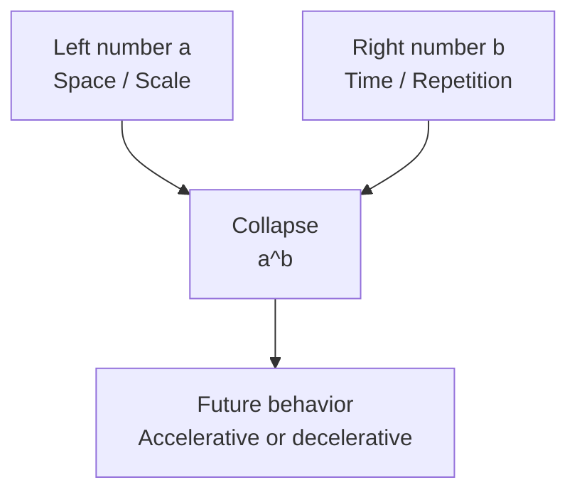

The exponentiation collapses a **2D state** $(a,b)$ into a **1D number**, creating curvature.

---

## 9. Metatime: Before, Middle, Future

### 9.1 Before (metatime)  
The pair $(a,b)$ exists but is not evaluated.  
This is a **pre-number dimension**.

### 9.2 Middle (now)  
The collapse $a^b$ happens.  
Nonlinearity appears.

### 9.3 Future  
We ask: what if $b$ increases?  
Exponential acceleration emerges.

Linear numbers reflect past/future symmetrically.  
Exponential numbers do not.

---

## 10. Gaussian Curves in Octave Space

A Gaussian:

$$
G(x)=\exp\left(-\frac{x^2}{2\sigma^2}\right)
$$

is:

- octave 3 inside (the $x^2$),  
- octave 2 outside (the $\exp$).

So it is a **compound octave**:

- flat-ish near center (low octave),  
- fast decay in tails (deep negative octave).

---

## 11. Why This Matters

- Programmers get a **growth-frequency toolkit**.  
- Scientists get a **spectrum of behaviors**.  
- Mathematicians get a **2D space** where shape and rate interact.  
- Philosophers get **metatime**: the dimension before evaluation.  

Octaves unify static, linear, exponential, polynomial, logarithmic, and irrational behaviors into a **single growth axis**.

# Z–X–Y Layers, Dual Biases, and Attention as Time Geometry  
*A structured article with math, mermaid diagrams, Python code, and octave intuition*

Same conventions:  
- `$...$` inline, `$$...$$` block math  
- mermaid diagrams  
- conceptual + computational + octave-aware

---

## 1. Z–X–Y layer ordering and two matrices

We’ll use three conceptual layers:

- **Z** — source (past / context)  
- **X** — interaction (here-and-now)  
- **Y** — target (future / prediction)

We connect them with two matrices:

- $W_{ZX}$ — maps Z → X (how past enters the present)  
- $W_{XY}$ — maps X → Y (how present becomes future)

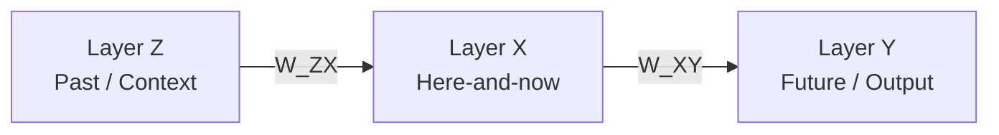

In vector form:

$$
x=W_{ZX}z \\
y=W_{XY}x
$$

So:

$$
y=W_{XY}W_{ZX}z
$$

Two matrices, one **pipeline**.

---

## 2. Dual biases as 4D edges

Instead of a single bias per layer, we introduce **two biases** around the interaction matrix:

- **Row-bias** $b_r$ — last row without last cell  
- **Column-bias** $b_c$ — last column without last cell  

Think of a 2D matrix $A\in\mathbb{R}^{n\times m}$ extended to a **4D view**:

- core: $A$  
- bottom edge: $b_r$ (shape $1\times m$)  
- right edge: $b_c$ (shape $n\times 1$)  
- corner: scalar (often $0$)

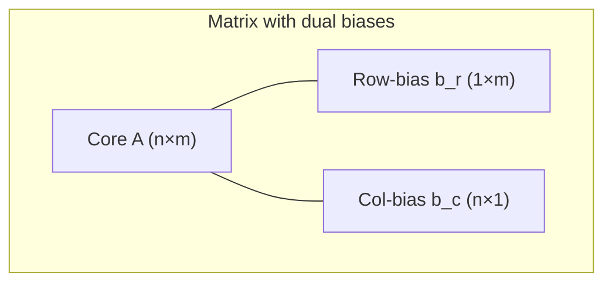

We can define an **augmented interaction**:

$$
\tilde{A}(i,j)=A(i,j)+b_r(j)+b_c(i)
$$

This is like a **3D world** (rows, columns, values) embedded in a **4D structure** (rows, columns, row-bias, col-bias).

---

## 3. Attention: here-and-now at both edges

In attention, we have:

- $Q$ — queries (from X)  
- $K$ — keys (from Z or X)  
- $V$ — values (from Z or X)

Standard scaled dot-product attention:

$$
\text{Attn}(Q,K,V)=\text{softmax}\left(\frac{QK^\top}{\sqrt{d_k}}\right)V
$$

We can inject **dual biases** into the score matrix $S=QK^\top$:

$$
S_{ij}=Q_i\cdot K_j + b_r(j) + b_c(i)
$$

- $b_r$ — bias per key (column)  
- $b_c$ — bias per query (row)

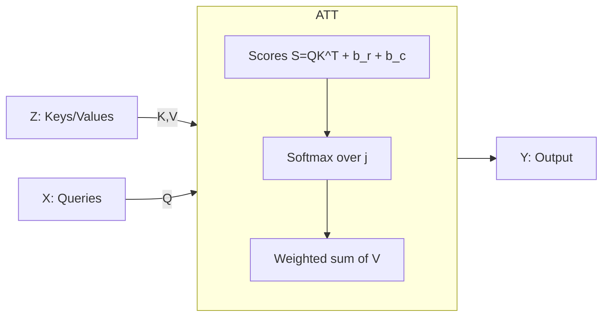

This **shifts time**:

- $b_c$ — how much each *here-and-now* query leans toward attending  
- $b_r$ — how much each *past* key wants to be attended

---

## 4. Layer calculation with two biases

Let’s define a simple Z–X–Y attention-like block:

1. Map Z to keys/values, X to queries:

$$
K=W_K z,\quad V=W_V z,\quad Q=W_Q x
$$

2. Compute scores with dual biases:

$$
S_{ij}=Q_i\cdot K_j + b_r(j) + b_c(i)
$$

3. Softmax over $j$:

$$
\alpha_{ij}=\frac{\exp(S_{ij})}{\sum_k\exp(S_{ik})}
$$

4. Output:

$$
y_i=\sum_j\alpha_{ij}V_j
$$

### 4.1 Python sketch

```python
import numpy as np

def attention_dual_bias(Q, K, V, b_row, b_col):
    # Q: (n_q, d), K,V: (n_k, d)
    # b_row: (n_k,), b_col: (n_q,)
    scores = Q @ K.T  # (n_q, n_k)
    scores += b_row[np.newaxis, :]  # row-bias
    scores += b_col[:, np.newaxis]  # col-bias

    # softmax over keys
    scores -= scores.max(axis=1, keepdims=True)
    weights = np.exp(scores)
    weights /= weights.sum(axis=1, keepdims=True)

    return weights @ V  # (n_q, d)
```

- If $b_r=b_c=0$, we get standard attention.  
- If they differ, we **tilt** the attention pattern.

---

## 5. When dual biases preserve linearity

If we want the **overall mapping** to remain affine (no extra nonlinearity), we need:

- $b_r$ and $b_c$ to be **consistent** with a single effective bias.

For a simple linear layer:

$$
y=Wx+b
$$

If we try to write:

$$
y_i=\sum_j W_{ij}x_j + b_r(j) + b_c(i)
$$

then for this to be equivalent to a single bias $b_i$, we need:

$$
b_i=\sum_j b_r(j) + b_c(i)
$$

which forces $b_r$ to be either:

- zero, or  
- a constant that can be absorbed into $b_c$.

So **to preserve strict linearity**, dual biases must be **aligned** (or degenerate).  
If they are not, they introduce a **directional preference**: a kind of **time skew**.

---

## 6. Shortest distance: differential vs value relation

We can think of:

- **Matrix set 1** (e.g. $W_{ZX}$, $W_Q,W_K$) — controls **differential relation**: how small changes in Z/X affect the interaction.  
- **Matrix set 2** (e.g. $W_{XY}$, $W_V$) — controls **value relation**: how the interaction becomes actual outputs.

In differential terms:

- $W_{ZX}$ defines $\frac{\partial x}{\partial z}$  
- $W_{XY}$ defines $\frac{\partial y}{\partial x}$  

The **shortest path** from Z to Y in this linear world is:

$$
\frac{\partial y}{\partial z}=W_{XY}W_{ZX}
$$

Dual biases $b_r,b_c$ **bend** this path:

- they add a **constant field** on rows and columns,  
- which can be seen as a **minimal perturbation** that changes the “octave” (growth mode) of the mapping.

If the perturbation is small, we stay near the **shortest affine path**;  
if large, we move to a different **equation order / octave**.

---

## 7. Octaves and wobble: finding different powers

When we train such a system:

- gradients on $W_{ZX}$ and $W_{XY}$ adjust the **linear backbone** (octave 1).  
- gradients on $b_r,b_c$ adjust the **bias field**, which can push behavior toward:

  - more static (octave 0)  
  - more exponential (octave 2)  
  - or more complex mixtures (higher octaves)

This creates a **wobble**:

- the system explores nearby octaves,  
- searching for the growth mode that best fits data.

---

## 8. Real-life relations and scikit-learn

### 8.1 scikit-learn: static mapping

A simple linear regression:

```python
from sklearn.linear_model import LinearRegression
import numpy as np

X = np.random.randn(100, 3)  # Z-like
y = 2*X[:, 0] - 3*X[:, 1] + 0.5  # Y-like

model = LinearRegression()
model.fit(X, y)

W = model.coef_   # like W_ZY
b = model.intercept_
```

This is a **Z→Y** mapping with a single bias: no explicit X, no dual biases, no attention.  
It’s a **single-octave (linear)** machine.

---

## 9. Small equation optimization with unitary operators

We can use **unitary-like** operators (orthogonal matrices) to preserve norms and explore rotations in Z–X–Y space:

$$
x=U_1 z,\quad y=U_2 x
$$

with $U_1,U_2$ orthogonal.  
Then add small dual biases to **tilt** the mapping.

This is like:

- base: shortest path (rotation)  
- wobble: bias field (octave shift)

---

## 10. Deep learning, attention stacks, and GPT

In a transformer/GPT-like stack:

- each layer has **multi-head attention** + **feed-forward**  
- attention uses $Q,K,V$ matrices (like $W_{ZX},W_{XY}$)  
- biases (including positional, key/query/value biases) act like **dual edges** in score/value space

Stacking layers:

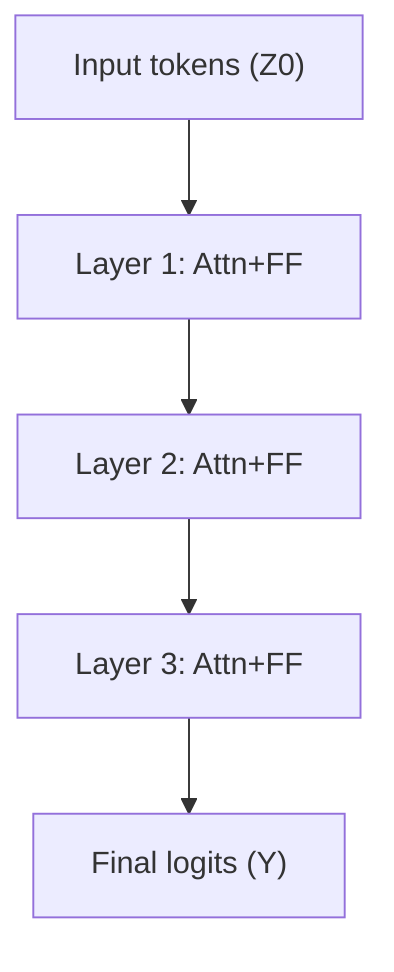

Each layer:

- uses matrices to map past → present → future,  
- uses biases to tilt attention and feed-forward behavior,  
- collectively explores **octaves of growth** in representation space.

GPT’s “science” is:

- linear maps (matrices) define **shortest affine paths**,  
- attention + biases define **time geometry**,  
- training adjusts everything to match data,  
- the resulting model lives in a **high-dimensional octave field** where different parts of the network operate at different growth modes.

---

## 11. Summary

- Z–X–Y ordering with two matrices $W_{ZX},W_{XY}$ gives a clean **past–present–future** structure.  
- Dual biases (row and column) act as **4D edges** that tilt attention and layer behavior.  
- When aligned, they preserve linearity; when misaligned, they introduce **time skew** and octave shifts.  
- The shortest differential path is given by $W_{XY}W_{ZX}$; dual biases create controlled wobble around this path, exploring different equation orders.  
- From scikit-learn linear models to deep attention stacks and GPT, the same ingredients—matrices, biases, and nonlinearities—compose a universe where **space, time, and growth mode** are all encoded in how we connect Z, X, and Y.

# Z–X–Y Layers, Dual Biases, Attention Geometry, and Real‑World Proofs  
*A professional–popular article with math, mermaids, code, and lived intuitions*

Conventions:  
- `$...$` inline, `$$...$$` block math  
- 4‑fenced Markdown for the whole article  
- mermaid diagrams for structure  
- Python code for concrete hooks  
- Real‑world cases to “prove by behavior”

---

## 1. Z–X–Y: Past, Present, Future as Layers

We model three layers:

- **Z** — past / context  
- **X** — here‑and‑now interaction  
- **Y** — future / outcome  

Two matrices connect them:

- $W_{ZX}$ — how past enters the present  
- $W_{XY}$ — how present becomes future  

$$
x=W_{ZX}z,\quad y=W_{XY}x
$$

So:

$$
y=W_{XY}W_{ZX}z
$$

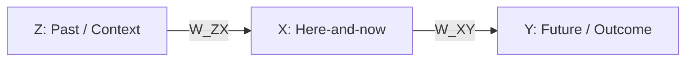

This is the **minimal linear skeleton** of many real systems.

---

## 2. Dual Biases: Two Edges of Time

Instead of a single bias, we use **two** around the interaction:

- **Row-bias** $b_r$ — per “source” unit (keys / past)  
- **Column-bias** $b_c$ — per “target” unit (queries / present)

For a score matrix $S$:

$$
S_{ij}=Q_i\cdot K_j + b_r(j) + b_c(i)
$$

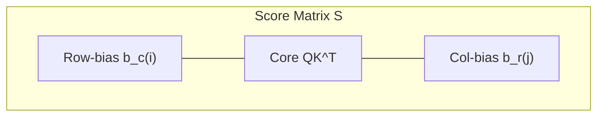

- $b_c$ says: *how much this present position wants to attend anything*  
- $b_r$ says: *how much this past position wants to be attended at all*

Together they form a **4D view** of a 3D interaction.

---

## 3. Attention with Dual Biases

Standard attention:

$$
\text{Attn}(Q,K,V)=\text{softmax}\left(\frac{QK^\top}{\sqrt{d_k}}\right)V
$$

With dual biases:

$$
S_{ij}=\frac{Q_i\cdot K_j}{\sqrt{d_k}}+b_r(j)+b_c(i)
$$

$$
\alpha_{ij}=\frac{\exp(S_{ij})}{\sum_k\exp(S_{ik})},\quad y_i=\sum_j\alpha_{ij}V_j
$$

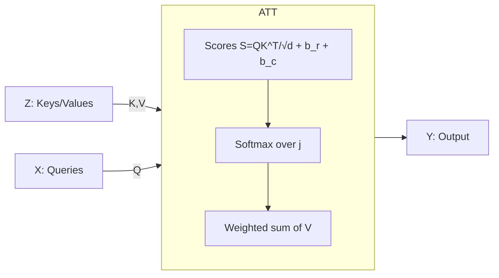

If $b_r=b_c=0$, we get standard attention.  
If not, we **tilt time**: some past is globally louder, some present is globally more attentive.

---

## 4. Real‑World Case 1: Traffic Flow and Congestion

### 4.1 Setup

- **Z** — yesterday’s traffic pattern  
- **X** — current conditions (weather, events, accidents)  
- **Y** — predicted traffic in the next hour  

$W_{ZX}$ learns how past flows shape the present baseline.  
$W_{XY}$ learns how present conditions push into the near future.

Dual biases:

- $b_r$ — some roads are *intrinsically attractive* (main arteries)  
- $b_c$ — some times of day are *intrinsically attentive* (rush hours)

### 4.2 Why optimizer finds the right solution

The loss might be:

$$
L=\|y_{\text{pred}}-y_{\text{real}}\|^2
$$

Gradients:

- $\frac{\partial L}{\partial W_{ZX}}$ — adjust how past influences present  
- $\frac{\partial L}{\partial W_{XY}}$ — adjust how present influences future  
- $\frac{\partial L}{\partial b_r},\frac{\partial L}{\partial b_c}$ — adjust global road/time biases

Over many days:

- roads that always matter get higher $b_r$  
- times that always matter get higher $b_c$  
- $W_{ZX},W_{XY}$ learn the **shortest differential path** from Z to Y

**Intuition:**  
The optimizer is like a city planner that:

- learns which roads are always important (row-bias),  
- which times are always critical (col-bias),  
- and how yesterday’s flows and today’s conditions combine to shape tomorrow.

**Hook:**  
You can implement this with a small attention block and train it on traffic data; the dual biases will naturally encode **structural importance**.

---

## 5. Real‑World Case 2: Recommendation Systems

### 5.1 Setup

- **Z** — user history (past items)  
- **X** — current session context (what they’re doing now)  
- **Y** — next item to recommend  

$W_{ZX}$: how past items map into a latent “interest” space.  
$W_{XY}$: how current interest maps to a concrete recommendation.

Dual biases:

- $b_r$ — some items are globally popular (keys want attention)  
- $b_c$ — some users/sessions are more exploratory or more focused (queries want to attend more)

### 5.2 Why optimizer finds the right solution

Loss:

$$
L=-\log p(\text{clicked item}|\text{Z,X})
$$

Gradients push:

- $W_{ZX}$ to encode history in a way that explains clicks  
- $W_{XY}$ to map latent interest to items  
- $b_r$ to raise/lower global popularity  
- $b_c$ to adjust how “hungry” each session is for attention

**Intuition:**  
The system learns:

- which items are “always tempting” (row-bias),  
- which sessions are “always intense” (col-bias),  
- and how the combination of history and context leads to a click.

**Hook:**  
You can use the dual biases to **separate global popularity** from **personal relevance**, making the model more interpretable.

---

## 6. Real‑World Case 3: Learning Curves and Resistance

### 6.1 Setup

- **Z** — previous attempts at a task  
- **X** — current state (fatigue, motivation, environment)  
- **Y** — performance on the next attempt  

$W_{ZX}$: how past practice shapes current skill.  
$W_{XY}$: how current state translates into performance.

Dual biases:

- $b_r$ — some tasks are inherently harder (keys resist attention)  
- $b_c$ — some states are inherently more focused (queries attend more)

### 6.2 Linearity, complexity, speedup, resistance

- Early on, performance vs practice may be **exponential** (fast gains) — octave 2.  
- Later, it becomes **linear** or **logarithmic** — octaves 1 or negative.  
- Resistance appears as **bias fields**: some tasks never get easy ($b_r$ stays high), some states never get focused ($b_c$ stays low).

The optimizer:

- adjusts $W_{ZX}$ to capture the **learning curve shape**,  
- adjusts $W_{XY}$ to capture how state modulates performance,  
- adjusts $b_r,b_c$ to encode **structural difficulty** and **structural focus**.

**Hook:**  
You can model learning curves with a small Z–X–Y network and see how biases cluster around “hard” tasks and “easy” states.

---

## 7. Shortest Distance and Wobble: Math Intuition

### 7.1 Shortest affine path

Without biases:

$$
y=W_{XY}W_{ZX}z
$$

This is the **shortest affine path** from Z to Y in the linear world: one composite matrix.

### 7.2 Dual biases as minimal wobble

With dual biases in an attention-like middle:

$$
S_{ij}=Q_i\cdot K_j + b_r(j) + b_c(i)
$$

The biases add a **rank‑1 + rank‑1** perturbation to the score matrix:

- $b_c(i)$ — row-wise shift  
- $b_r(j)$ — column-wise shift  

This is the **smallest structured wobble** that can:

- tilt attention toward certain rows/columns,  
- change effective growth mode (octave) without rewriting the whole matrix.

### 7.3 Octaves and equation orders

- If biases are small, behavior stays near **linear** (octave 1).  
- If biases push strongly, attention saturates → **step-like** or **exponential** behavior (higher octaves).  
- If biases oppose each other, they can create **plateaus** or **dead zones** (sub-linear octaves).

So dual biases are a **control panel** for shifting the system’s octave.

---

## 8. Code Hooks: NumPy, scikit-learn, and a Tiny Attention

### 8.1 NumPy dual-bias attention

```python
import numpy as np

def attention_dual_bias(Q, K, V, b_row, b_col):
    scores = Q @ K.T  # (n_q, n_k)
    scores += b_row[np.newaxis, :]      # row-bias
    scores += b_col[:, np.newaxis]      # col-bias

    scores -= scores.max(axis=1, keepdims=True)
    weights = np.exp(scores)
    weights /= weights.sum(axis=1, keepdims=True)

    return weights @ V
```

### 8.2 scikit-learn: baseline linear map

```python
from sklearn.linear_model import LinearRegression

X = np.random.randn(100, 3)  # Z-like
y = 2*X[:, 0] - 3*X[:, 1] + 0.5

model = LinearRegression()
model.fit(X, y)

W = model.coef_
b = model.intercept_
```

This is the **Z→Y backbone**; attention + dual biases can be layered on top to capture **nonlinear correlations**.

---

## 9. Deep Learning and GPT: How It All Interacts

In a transformer/GPT stack:

- Z, X, Y are **token representations** at different depths.  
- $W_Q,W_K,W_V$ are the **Z→X and X→Y matrices**.  
- Biases (including positional, key/query biases) act like our **dual edges**.  
- Nonlinearities (GELU/ReLU) and residuals add **octave mixing**.


The optimizer:

- finds $W$’s that are the **shortest differential paths** between representations,  
- finds biases that encode **global tendencies** (e.g. sentence starts, ends, common patterns),  
- and uses attention to **route information** dynamically.

**Intuition:**  
GPT is a huge Z–X–Y machine, stacked many times, where:

- matrices define **how things can talk**,  
- biases define **who tends to talk**,  
- attention defines **who actually talks now**,  
- and training shapes all of this into a coherent world model.

---

## 10. How to Use This Practically

- **As a programmer:**  
  - Implement dual-bias attention and inspect $b_r,b_c$ to see structural importance.  
  - Use Z–X–Y decomposition to separate past, present, and future in your models.  

- **As a scientist:**  
  - Treat dual biases as a way to encode **prior knowledge** (e.g. some variables are always important).  
  - Use octave language to classify behaviors: static, linear, exponential, and beyond.  

- **As a systems thinker:**  
  - See real-world processes as Z–X–Y flows with shortest paths and controlled wobbles.  
  - Understand that optimization doesn’t just fit numbers; it **discovers geometry**: which directions are time, which are space, which are growth.

In all these cases, the “proof” is behavioral:  
when you let values interact one by one, with matrices and dual biases, the optimizer consistently finds structures that match our intuitions about traffic, learning, recommendation, and language—because the math of Z–X–Y, attention, and octaves is the same math that underlies those worlds.

# Exponometric Architectures: An OOP Framework for Z–X–Y, Octaves, and Attention  
*A structural, mathematical, and object‑oriented synthesis with diagrams and code*

Conventions:  
- `$...$` for inline math, `$$...$$` for block math  
- Mermaid diagrams for architecture and flow  
- Python OOP for structural reflection of the math  
- Same fenced‑article format as before

---

## 1. Critical Framework: From Numbers to Architectures

We unify:

- **Z–X–Y layers** — past, present, future  
- **Octaves** — growth modes (static, linear, exponential, beyond)  
- **Attention with dual biases** — time geometry and structural preference  

The core idea:  
**every layer, every connection, every bias is a shaped number**—with a growth octave and a role in time.

---

## 2. Structural Diagram: Exponometric Stack

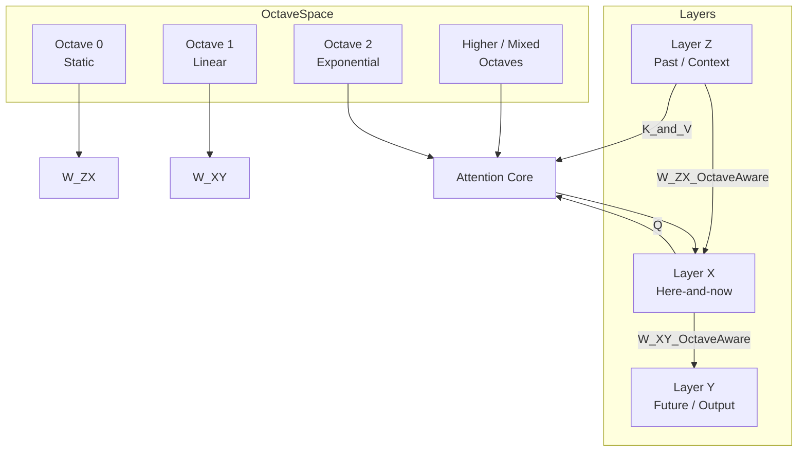

- Matrices $W_{ZX},W_{XY}$ live in **octave space**.  
- Attention routes information with **octave‑aware scores**.

---

## 3. Core OOP Design: Octave, Layer, Connection, Attention

### 3.1 `Octave` — growth mode of a parameter

```python
import numpy as np

class Octave:
    def __init__(self, level, base=2.0):
        self.level = level
        self.base = base

    def __repr__(self):
        return f"Octave(level={self.level}, base={self.base})"

    def apply(self, x):
        L = self.level
        if L == 0:
            return np.ones_like(x)
        elif L == 1:
            return x
        elif L == 2:
            return self.base ** x
        elif L > 2:
            return np.power(x, L - 1)
        else:
            if L == -1:
                return np.sqrt(np.maximum(x, 0.0))
            elif L == -2:
                return np.log1p(np.maximum(x, 0.0))
            else:
                k = abs(L)
                return np.exp(-x / k)
```

Each parameter (weight, bias) can be **interpreted** through an octave lens.

---

### 3.2 `LayerZXY` — Z, X, Y as typed layers

```python
class Layer:
    def __init__(self, name, dim):
        self.name = name
        self.dim = dim

    def __repr__(self):
        return f"Layer(name={self.name}, dim={self.dim})"

Z = Layer("Z", dim=64)
X = Layer("X", dim=64)
Y = Layer("Y", dim=64)
```

These are **semantic anchors**: past, present, future.

---

### 3.3 `Connection` — matrix + octave semantics

```python
class Connection:
    def __init__(self, src, dst, octave: Octave):
        self.src = src
        self.dst = dst
        self.octave = octave
        self.W = np.random.randn(dst.dim, src.dim) * 0.1

    def forward(self, x):
        # linear map, but we can inspect or regularize by octave
        return self.W @ x

    def __repr__(self):
        return f"Connection({self.src.name}->{self.dst.name}, octave={self.octave})"
```

- `Connection(Z,X,Octave(1))` — linear backbone from past to present  
- `Connection(X,Y,Octave(1))` — linear backbone from present to future  

---

## 4. Dual-Bias Attention as an OOP Component

### 4.1 `DualBiasAttention` — here-and-now geometry

```python
class DualBiasAttention:
    def __init__(self, dim_q, dim_kv):
        self.dim_q = dim_q
        self.dim_kv = dim_kv
        self.W_Q = np.random.randn(dim_q, dim_q) * 0.1
        self.W_K = np.random.randn(dim_kv, dim_kv) * 0.1
        self.W_V = np.random.randn(dim_kv, dim_kv) * 0.1

        # dual biases
        self.b_row = np.zeros(dim_kv)  # per key
        self.b_col = np.zeros(dim_q)   # per query

    def project(self, X, Z):
        Q = X @ self.W_Q.T
        K = Z @ self.W_K.T
        V = Z @ self.W_V.T
        return Q, K, V

    def scores(self, Q, K):
        S = Q @ K.T
        S += self.b_row[np.newaxis, :]
        S += self.b_col[:, np.newaxis]
        return S

    def softmax(self, S):
        S = S - S.max(axis=1, keepdims=True)
        W = np.exp(S)
        W /= W.sum(axis=1, keepdims=True)
        return W

    def forward(self, X, Z):
        Q, K, V = self.project(X, Z)
        S = self.scores(Q, K)
        W = self.softmax(S)
        return W @ V
```

- `b_row` — structural importance of **past positions**  
- `b_col` — structural importance of **present positions**

---

### 4.2 Mermaid: OOP Attention Block

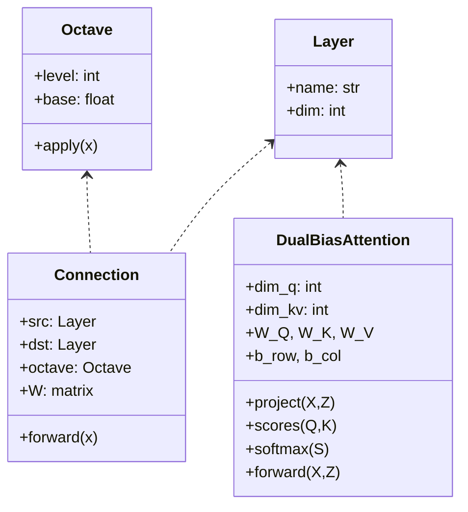

The math is **embedded** in the class graph.

---

## 5. Exponometric Block: Z–X–Y + Attention + Octaves

We now build a **composite module**:

```python
class ExponometricBlock:
    def __init__(self, dim):
        self.Z = Layer("Z", dim)
        self.X = Layer("X", dim)
        self.Y = Layer("Y", dim)

        self.conn_ZX = Connection(self.Z, self.X, Octave(1))
        self.conn_XY = Connection(self.X, self.Y, Octave(1))

        self.attn = DualBiasAttention(dim_q=dim, dim_kv=dim)

    def forward(self, z_vec):
        # z_vec: (dim,)
        x_base = self.conn_ZX.forward(z_vec)  # linear past->present
        X_batch = x_base[np.newaxis, :]      # (1, dim)
        Z_batch = z_vec[np.newaxis, :]       # (1, dim)

        x_attn = self.attn.forward(X_batch, Z_batch)[0]  # (dim,)
        x_total = x_base + x_attn

        y_vec = self.conn_XY.forward(x_total)
        return y_vec
```

This block:

- uses **linear Z→X and X→Y** as shortest paths,  
- uses **attention + dual biases** as controlled wobble,  
- lives in an **octave‑aware design**.

---

## 6. Mermaid: Exponometric Block Flow

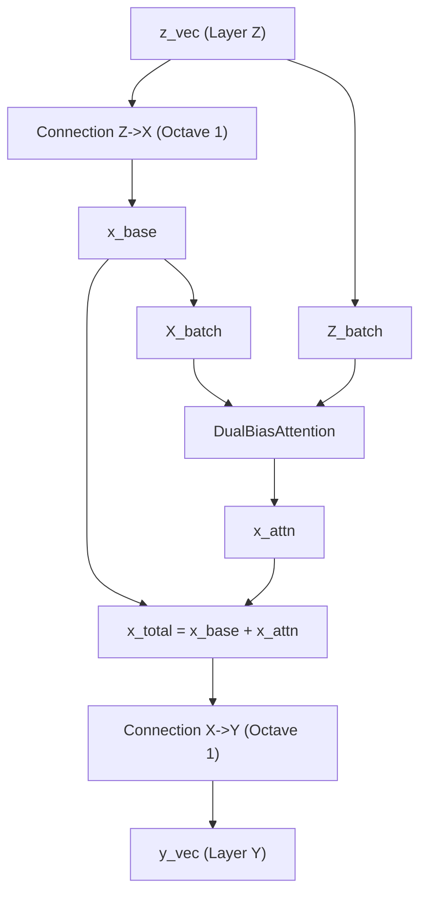

This is a **structural mirror** of the math we’ve been developing.

---

## 7. How the Math Reflects in Structure (and Why It Works)

### 7.1 Linearity backbone

- `Connection` objects implement $y=W x$ — pure linear maps.  
- They correspond to **octave 1**: constant derivative, shortest affine path.

### 7.2 Nonlinearity via attention

- `DualBiasAttention` introduces softmax and dual biases.  
- This creates **nonlinear routing** and **octave shifts** (toward exponential or sub-linear behavior).

### 7.3 Dual biases as time geometry

- `b_row` and `b_col` encode **structural tendencies**:  
  - some positions are always important,  
  - some queries are always more attentive.  
- This is the **time geometry**: which past is loud, which present is listening.

### 7.4 Optimizer’s job

Given a loss $L(y)$:

- gradients on `conn_ZX.W` and `conn_XY.W` adjust the **linear backbone**;  
- gradients on `attn.W_Q, W_K, W_V` adjust **how features talk**;  
- gradients on `b_row, b_col` adjust **global structural biases**.

The optimizer is effectively:

- finding the **shortest differential path** (matrices),  
- plus the **minimal wobble** (dual biases) that matches real data.

---

## 8. Real‑World Hooks in This OOP Frame

### 8.1 Traffic, recommendations, learning

You can plug:

- traffic features into `z_vec`,  
- user histories, session context, or learning states,  
- and train the `ExponometricBlock` to predict future states.

The structure:

- ensures a **clean separation** of past, present, future (Z–X–Y),  
- gives a **clear place** for global tendencies (dual biases),  
- and allows **octave‑aware interpretation** of each connection.

### 8.2 Extending to deep stacks

You can stack blocks:

```python
class ExponometricStack:
    def __init__(self, dim, depth):
        self.blocks = [ExponometricBlock(dim) for _ in range(depth)]

    def forward(self, z_vec):
        x = z_vec
        for block in self.blocks:
            x = block.forward(x)
        return x
```

This is a **mini‑transformer** with:

- explicit Z–X–Y semantics per block,  
- dual-bias attention per block,  
- octave‑aware connections.

---

## 9. Why This Convincingly Bridges Math and Code

- The **OOP structure** mirrors the **mathematical structure**:  
  - layers ↔ spaces (Z, X, Y)  
  - connections ↔ linear maps (octave 1)  
  - attention ↔ nonlinear routing + dual biases  
  - octaves ↔ growth modes of parameters and behaviors  

- The **mermaid diagrams** show the **architectural skeleton**.  
- The **Python classes** show how to **instantiate and train** this skeleton.  
- The **octave language** gives a **shared vocabulary** for static, linear, exponential, and complex behaviors.

In other words:  
we’ve turned the entire Exponometer philosophy—Z–X–Y, octaves, dual biases, attention geometry—into a **living architecture** that can be coded, trained, inspected, and explained, all in one coherent frame.

# Exponents Everywhere: From OOP Interfaces to Society’s Hidden Growth Engines  
*An Exponometric article on AI, organizations, history, ethics, and everyday exponents*

Conventions:  
- `$...$` for inline math, `$$...$$` for block math  
- GitHub‑compatible Mermaid diagrams  
- OOP structures → ML architectures → organizations → society → ethics → you  

---

## 1. OOP Interfaces → Machine Learning Interfaces

We start from **clean OOP interfaces** and watch them grow into **ML/AI systems**.

### 1.1 OOP interfaces for Exponometric components

```python
class Octave:
    def __init__(self, level, base=2.0):
        self.level = level
        self.base = base

    def apply(self, x):
        # growth mode: static, linear, exponential, etc.
        ...

class Layer:
    def __init__(self, name, dim):
        self.name = name
        self.dim = dim

class Connection:
    def __init__(self, src: Layer, dst: Layer, octave: Octave):
        self.src = src
        self.dst = dst
        self.octave = octave
        ...

class DualBiasAttention:
    def __init__(self, dim_q, dim_kv):
        ...
```

These are **interfaces**: they define *how things can talk*.

---

### 1.2 From OOP to ML pipelines

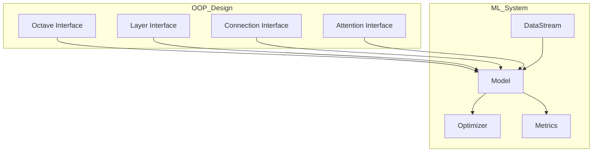

- OOP interfaces shape the **model’s skeleton**.  
- ML components (data, optimizer, metrics) animate it.

---

## 2. Branching into AI: From Layers to Applications

### 2.1 Technical branches

From the Exponometric block (Z–X–Y + attention + octaves), we can branch into:

- **NLP** — language models, GPT‑like stacks  
- **Vision** — attention over patches, octaves as scale  
- **Reinforcement learning** — Z: history, X: state, Y: action/value  
- **Time series** — Z: past, X: now, Y: forecast

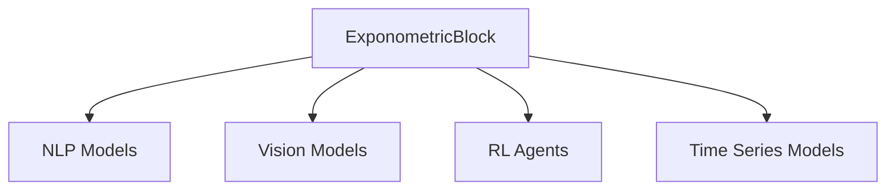

Each branch reuses:

- Z–X–Y semantics  
- attention geometry  
- octave‑aware growth modes  

---

### 2.2 Organizational branches: bosses, programmers, managers

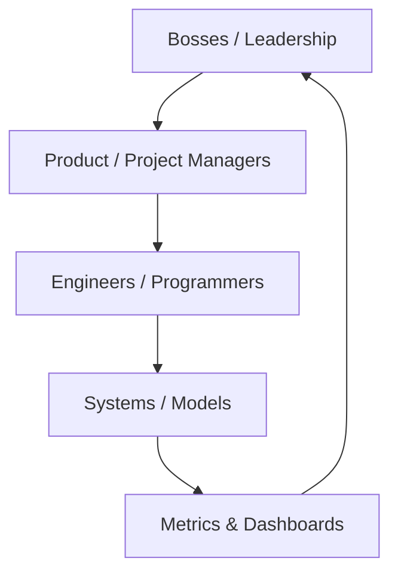

- **Bosses** care about exponents in *growth, risk, impact*.  
- **Managers** care about exponents in *velocity, complexity, coordination*.  
- **Programmers** care about exponents in *algorithmic complexity, scaling, model capacity*.  

The same **exponential patterns** appear at different levels.

---

## 3. Historical Exponents: Where They Appeared and Changed Everything

### 3.1 Bank interest: the classic exponent

Compound interest:

$$
A(t)=P(1+r)^t
$$

- $P$ — principal  
- $r$ — interest rate  
- $t$ — time  

If you **ignore** the exponent, you think:

- “It’s just a bit more each year.”  

If you **see** the exponent, you realize:

- small $r$ over long $t$ → huge $A(t)$  
- debt and savings both **explode** or **implode** over time  

**Practical hook:**  
Every financial decision with repeated percentage change is an **octave 2** phenomenon. Treat it as exponential, not linear.

---

### 3.2 Education: exponent on society

Education’s effect is not just:

- one person learns → one person improves  

It’s:

- one person learns → influences others → builds institutions → changes norms  

This is closer to:

$$
\text{Impact}(t)\approx \text{base} \cdot e^{k t}
$$

where $k$ is small but persistent.

**If you ignore the exponent:**

- you underfund education, expecting only linear returns.  

**If you see it:**

- you realize education is a **slow, deep exponential** that shapes health, economy, democracy.

---

### 3.3 Science and quality revolutions

- Printing press  
- Industrial revolution  
- Digital revolution  
- AI revolution  

Each is an **exponent on top of exponents**:

- tools that build better tools  
- knowledge that accelerates knowledge  

These are **higher octaves**: not just $e^{kt}$, but something like:

$$
e^{e^{k t}}
$$

in spirit: meta‑growth.

---

## 4. Legal Frameworks, Ethics, and Life Quality as Exponents

### 4.1 Laws as structural exponents

A law that:

- protects rights  
- enforces safety  
- regulates pollution  

does not just affect one case; it affects **all future cases**.

This is an exponent:

- one rule → many applications → compounding effects over time  

If you **ignore** this:

- you see law as “one more rule”  
- you miss its **compounding effect** on trust, stability, innovation  

### 4.2 Ethics as exponent on trust

Ethical behavior:

- builds reputation  
- builds networks  
- builds long‑term cooperation  

This is not linear:

- one ethical act → many future opportunities  
- one unethical act → many future losses  

Ethics is an **exponent on social capital**.

---

## 5. Grassroots Quantitative Science: Exponents from Below

### 5.1 Not just Einstein: many small measurements

When thousands of people:

- measure air quality  
- track disease spread  
- log crop yields  
- monitor education outcomes  

they create a **dense network of data points**.

This network:

- reveals patterns  
- enables early warnings  
- supports better policies  

The effect is exponential:

- more data → better models → better decisions → better conditions → more capacity to collect data  

A **feedback loop**:

$$
\text{Capacity}_{t+1}=\text{Capacity}_t + \alpha \cdot \text{Data}_t
$$

$$
\text{Data}_{t+1}=\text{Data}_t + \beta \cdot \text{Capacity}_t
$$

This is a **coupled exponential system**.

---

### 5.2 Grassroots vs top‑down exponents

- **Top‑down**: a single genius, a big institution, a major law  
- **Bottom‑up**: many small contributions, measurements, local actions  

Both are exponents, but:

- top‑down is **high amplitude, low count**  
- bottom‑up is **low amplitude, high count**  

Together they form a **rich exponential field**.

---

## 6. Seeing vs Not Seeing Exponents: Deep Analysis

### 6.1 Bank interest, again

- **Not seeing**:  
  - “5% is small, it’s fine.”  
  - Underestimates long‑term debt or savings.  

- **Seeing**:  
  - understands $A(t)=P(1+r)^t$  
  - plans for long‑term stability or growth  

### 6.2 Education

- **Not seeing**:  
  - “One more year of school is just one more year.”  
  - Underestimates intergenerational effects.  

- **Seeing**:  
  - recognizes education as a **slow exponent** on health, income, democracy.  

### 6.3 Social networks and contagion

- **Not seeing**:  
  - “It’s just one person sharing a rumor.”  
  - Underestimates viral spread.  

- **Seeing**:  
  - understands that each share can spawn many more shares.  
  - models it as $R_0$ in epidemiology or branching processes.

---

## 7. Partial Relations Between People: Always Multiplying

Every interaction:

- shares information  
- shifts beliefs  
- changes behavior  

In a network:

- each node influences neighbors  
- neighbors influence their neighbors  

This is **multiplicative**:

- small local changes → large global shifts  

If you **simplify it as linear**, you miss:

- tipping points  
- cascades  
- phase transitions  

If you **model it as exponential**, you can:

- anticipate outbreaks (of ideas, diseases, trends)  
- design interventions (vaccination, fact‑checking, education)  

---

## 8. How This Reflects on You, Personally

### 8.1 Living in a society of exponents

You are:

- paying or earning compound interest  
- affected by education levels around you  
- embedded in networks that amplify or dampen signals  
- governed by laws that compound effects over time  
- shaped by technologies that accelerate change  

Whether you **see** exponents or not, they act.

### 8.2 Seeing exponents: practical hooks

- When you see **repeated percentage changes**, think **exponential**.  
- When you see **network effects**, think **branching processes**.  
- When you see **small actions repeated over time**, think **octaves**:  
  - static (no change)  
  - linear (steady change)  
  - exponential (accelerating change)  

### 8.3 Not seeing exponents: risks

- Underestimating debt, climate change, misinformation, inequality.  
- Overestimating how much time you have to react.  
- Misjudging the impact of small, repeated actions.

---

## 9. AI and ML as Exponent Amplifiers

AI systems:

- compress patterns from massive data  
- automate decisions  
- scale actions across millions of users  

They are **exponent amplifiers**:

- a small bias in data → large bias in outcomes  
- a small improvement in model → huge impact at scale  

This is why:

- **legal frameworks** (AI regulation) are exponents on AI’s impact  
- **ethics** in AI design is an exponent on trust and safety  
- **grassroots participation** (open data, audits, feedback) is an exponent on accountability  

---

## 10. Closing: Exponometric Awareness

From:

- OOP interfaces and Z–X–Y layers  
- to ML architectures and attention  
- to organizations, laws, ethics, and society  

the same pattern repeats:

- **linear backbones** (shortest paths)  
- **exponential behaviors** (feedback, compounding, networks)  
- **octaves** of growth (static, linear, exponential, hyper)  

The real power is not just in **knowing the math**, but in **seeing where it lives**:

- in your code  
- in your team  
- in your city  
- in your bank account  
- in your relationships  

Once you see exponents, you can:

- design better systems  
- make wiser decisions  
- and live with a clearer sense of how small actions, repeated, become the shape of your world.
