# Deep Lab of AI — LabDepth.ai

The **Deep AI lab** (`LabDepth.ai`) is the experimental corner of  
[Laegna AI Basics](https://github.com/tambetvali/LaegnaAIBasics).  
This is where we play with *small* neural pieces: perceptrons, tiny networks,  
activation tests, tensor tricks, and other miniature experiments.

It is intentionally simple:  
- small PyTorch or scikit‑learn snippets  
- isolated behaviours  
- little abstractions  
- toys, widgets, curiosities  
- things that help you *see* how a neural idea behaves  

These experiments are not meant to become applications.  
They are not tools, assistants, or products.  
They are **just experiments** — a sandbox for understanding.

---

## How It Relates to the Other Labs


- **LabDepth.ai** — where we test ideas in their smallest form and introduce innovation or unique solutions to Perceptrons and Digital Neurals  
- **LaegnaAIExperiments** — where real AI applications are built, fine‑tuned, explored, taught  
- **LaegnaAIHooksAndBones** — where applications have become end‑user bundles with graphical hooks  

LabDepth.ai stays at the beginning of this chain:  
a quiet place for experiments, not a place for finished AI.

---

## What You’ll Find Here

- perceptron pieces and micro‑networks  
- tensor behaviour tests  
- activation and gradient experiments  
- tiny datasets and visualizations  
- code that explains itself by being small  

This lab is for curiosity, clarity, and exploration —  
a place to understand *why* something works before turning it into anything larger.

# Deep Lab of AI

We have numerous places to test and experiment, or practice:
- ***Deep AI lab***: [Deep AI lab](https://github.com/tambetvali/LaegnaAIBasics/LabDepth.ai) is part of
  [Laegna AI Basics](https://github.com/tambetvali/LaegnaAIBasics) - while this is dedicated to useful
  knowledge, it won't create so certain practical solutions: here we study perceptron inside, do all
  kinds of tests, get into toys and widgets, but those are ***not*** full-featured, full-blown AI applications
  or packages, which would enable that you feel like you interact with real AI.
  - ***Machine Learning***: the lab for sake of expression and *equation linearization* and ***rational AI***.
    - ***Countability***: being small and bounded enough for
      - *Countable in infinite scale*: it basically converges to ***End of Syntax***.
        - Mathematically, it will ever end.
      - *Countable in finite scale*: you make some statistics to gain *how much syntax of output size and complexity*
        for *it's metadescription / input size and complexity* to estimate it's finite behaviour in your system.
        - Practically, it keeps association or gravity to be finely bounded, while some runs take longer - the
          other runs compensate this.
      - *Countable in zero scale*: at zero and below zero is your real time behaviour of ***extemely linear*** area;
        what I call *linearity factor*, paraphrasing *exponent factor*, is real-time latency such as 1/60 seconds for
        gamer's video, which is ruled out into zero: for example, if game's clock is wrong by 1/120 seconds to calculate
        frames, this might *visually* fit below linearity factor: 1/60 for gamer's experience, 1/20, 1/18, 1/30 for different
        movie experiences: under this, the frame might contain many basically exponent qualities, but if their implications
        are invisible in approximatin of eighteenth fractions, we say they won't bound zero.
        - Practically, we can call something uncountable if it provides lag or latency, and runs out of our *counted* rather
          than *countable* area: we say the area *under* this latency flag is *linear*, and we might linearize it with exponent
          factor removed, so that 1, 2, 4, 16.. in this scope, if elegant calculus actually does each in one real operation
          of optimized program, also the inside component has linear factor such as n^(1/2), n in power of half or square root,
          and this linear factor when applied to component turns this into 1, 2, 3, 4.., because it's not an exponent factor
          if there is no lag or loss of "linearity" qualities in the ration system you project inside.
    - **Machine Learning**: equation templates with unknowns and their solutions on database.
      - ***Rational***, because *equation to tune* consists of countable syntax.
    - **Imperative**, **functional**, **logical** ***paradigms*** of programming inside, around and except an AI.
      - ***Program code*** is countable tree.
  - ***Machine Proving***: the lab for sake of expression and *equation **form** linearization* and ***semirational AI***.
    - **Agda***, ***Coq*** and ***Isabelle***; prover paradigm of mataprocessing can be seen *semirational*:
      - Syntax is rather finite, countable listing of syntax. Very often, it can be divided to rations, meaningful
        pieces, and for AI sake it's copied to it's code such as block in question or answer, and divided
        into meaningfully small parts: expressions, sentences.
      - Notice that running the program, in naïve thinking, would mean each line is *executed* already in exponential
        complexity space of visible input when interpreted as code - each combination is played through to prove it's
        proven - for computer program, you track one path, and for Prolog you have highly optimized, seemingly linear
        basis for your optimized apps as needed; in prover systems: the same algorithm naïvely *tries all it's combinations*,
        or if it's optimized then it still looks like this. Sometimes you can cache the result and use the proof for your
        lifetime, in which case exponential resource need appears in meta-time or "precompiled time".
        - Where these provers are kind of *not countable*: they have to track the whole, imaginative mathematical space
          to have slight inspiration to your proofs, and because it looks exponential even compiled to their running,
          we can simplistically call this a "quadratic" space - for 2 operations, the heuristic might need 2\*2\*2
          operations - this is not true as a fact, but such model looks very similar to provers, which needs
          exponential resources compared to syntax size to run, quadratic to prove the programs.
      - Basic program fits the countable size by it's syntax and proving rules, AI can look at the whole program at whole,
        and you together can prove.
        - To test whether it "works" is not so trivial for an AI as gaining output of normal program, because the prover
          might be less efficient than an AI.
        - To learn to see itself, whether it's a proof, might be efficient for some cases.
        - In all cases
          - Complexity of strict proof programmer is exponential compared to executable program programmer
            - *Programmer*: generalize the first case, a scientist who has profession for working code and syntax.
          - Complexity of achieving any results with such proving, for a human, is same way higher than complexity of
            writing a program with same syntax complexity.
  - ***Deep Learning***: the lab for sake of basic *elements of perceptron* and ***irrational AI***.
    - Any program, which uses clouds or fields, networks of variables with similar behaviour, and genetic mutation,
      will be able to show it in *unbounded expressional or analytic complexity* - this process of optimization
      is rather *irrational*.
      - To create fine codes and methods for such AI to work might resemble *irrational programming*, and matrix is
        very precise simulation of something, which resembles rather continuous field of information, than bounded
        syntex tree with small latency and finite countability of elements.
    - This algorithm is often implemented in imperative languages:
      - It's own code remains at low expression complexity, such as 200 lines for already-perceptron.
      - Execution, still, uses field-like amount of memory and while the first-order logic of program is simple,
        we do not understand the second-order logic directly: we do not understand 2 billions of parameters,
        but we rather *study it like we study irrational systems*.
        - See Carl Custav Jung for proper definitions of rational and irrational, I think given in dictionary of
          "the portable Jung", for example.
- ***Application AI***: [Laegna AI Experiments](https://github.com/tambetvali/LaegnaAIExperiments) works with
  AI applications: GPT is a large ecosystem of simple perceptron tests and assets, and as an Application, it
  rather serves Q&A, configurations and tools or "itself as a tool" - it does not expose you simple perceptrons,
  but ready-made large models where you change nothing essential.
- ***Packaged "bundle" AI***: [https://github.com/tambetvali/LaegnaAIHooksAndBones] works with bundles: graphical user interfaces and installation
  bundles gather together the applications into bundled ecosystem /bunny/ in client's AI.

# The Three Complexities of AI: Rational, Semirational, Irrational

Artificial intelligence can be classified into three conceptual “complexity classes” based on how its **syntax**, **execution**, and **countability** behave. These classes are:

- **Rational AI** — finite, discrete, syntactic, fully countable  
- **Semirational AI** — finite syntax but unbounded execution behaviour  
- **Irrational AI** — continuous, tensorial, field‑like, effectively uncountable  

This article formalizes these distinctions.

---

# 1. Rational Complexity  
### 🧩 *Finite Syntax, Finite Trees, Fully Countable*

Rational systems are those whose **syntax** is a finite, well‑formed, countable tree.  
Examples include:

- imperative programs  
- functional programs  
- logical programs  
- simple machine‑learning equations with a few unknowns  

### 1.1 Syntax  
A rational system has a syntactic form like:

```
f(x, y, z) = ax + by + cz
```

The number of unknowns is finite.  
The number of constants is finite.  
The number of syntactic nodes is finite.

Thus the syntax belongs to a **countable** set.

### 1.2 Execution  
Execution of rational systems is also **countable**, because:

- the program’s execution tree is finite  
- each branch is traceable  
- the system can be fully enumerated  

### 1.3 Countability Scales  
Rational systems behave well under all three scales of countability:

- **Infinite scale**: the syntax converges to an *end of syntax*  
- **Finite scale**: output complexity is proportional to input complexity  
- **Zero scale**: real‑time behaviour remains linear (no latency explosions)

### Diagram: Rational Space  


---

# 2. Semirational Complexity  
### 🧮 *Finite Syntax, Unbounded Execution, Proof‑Like Behaviour*

Semirational systems have **finite syntax**, but their **execution** may require exploring an exponentially large or even conceptually unbounded space.

Examples:

- Agda  
- Coq  
- Isabelle  
- Prolog with backtracking  
- any proof‑search system  

### 2.1 Syntax  
The syntax is still rational:

- expressions  
- sentences  
- proof terms  
- inference rules  

All of these are **finite and countable**.

### 2.2 Execution  
Execution, however, is **not** rational:

- proof search explores combinatorial spaces  
- heuristics may require exponential branching  
- meta‑time (precompiled proof time) may be enormous  
- the system may need to “scan” a conceptual mathematical universe

This makes execution **semirational**:  
finite syntax, but **execution complexity is unbounded**.

### 2.3 Quadratic / Exponential Heuristic Space  
A prover may need something like:

- $2 \times 2 \times 2$ operations for two steps  
- $n^2$ or $2^n$ behaviour for larger proofs  

Not literally, but **structurally similar**.

### Diagram: Semirational Space  


---

# 3. Irrational Complexity  
### 🧠 *Continuous Fields, Tensors, Uncountable‑Like Behaviour*

Irrational systems include:

- deep learning  
- tensor networks  
- field‑like optimization systems  
- genetic algorithms with continuous mutation spaces  

### 3.1 Syntax  
The *code* of a deep learning model is small — maybe 200 lines.  
But the **object** it defines is not syntactic:

- billions of parameters  
- continuous tensors  
- high‑dimensional fields  
- nonlinear flows  

This is no longer a **countable syntax tree**.  
It behaves like an **irrational object**.

### 3.2 Execution  
Execution is also irrational:

- matrix multiplications over continuous values  
- gradient flows  
- optimization trajectories  
- stochastic processes  

These are not enumerations of discrete syntax.  
They are **flows in continuous space**.

### 3.3 Why It Feels “Uncountable”  
Even though the memory is finite, the **behavioural space** is effectively unbounded:

- continuous values  
- chaotic sensitivity  
- nonlinear attractors  
- emergent representations  

This resembles irrational numbers:  
finite representation, infinite behaviour.

### Diagram: Irrational Space  


---

# 4. Countability Framework  
### 🔢 *Three Scales of Countability*

AI systems can be evaluated on three scales:

## 4.1 Countable in Infinite Scale  
The system converges to a finite syntactic end.  
This is typical for **rational** and **semirational** syntax.

## 4.2 Countable in Finite Scale  
We can measure:

- output complexity  
- input complexity  
- metadescription complexity  

This is where rational and semirational systems remain analyzable.

## 4.3 Countable in Zero Scale  
This is the **real‑time linearity** zone:

- 1/60 s frame time  
- 1/20, 1/18, 1/30 for film  
- latency below perceptual threshold  

If a system stays within this zone, it is **linearizable**.  
If it escapes this zone (lag, latency, nonlinear explosion), it becomes **uncountable in practice**.

### Mathematical Note  
A nonlinear component with a linearizing factor such as $n^{1/2}$ can behave like:

- $1, 2, 3, 4, \dots$  

instead of:

- $1, 2, 4, 16, \dots$

if the exponent factor is removed by real‑time constraints.

---

# 5. Summary Table

| Class | Syntax | Execution | Countability | Example |
|------|--------|-----------|--------------|---------|
| **Rational** | Finite, discrete | Finite, traceable | Fully countable | Imperative, functional, logical programs |
| **Semirational** | Finite, discrete | Exponential, heuristic | Partially countable | Coq, Agda, Isabelle |
| **Irrational** | Continuous, tensorial | Field‑like, nonlinear | Effectively uncountable | Deep learning, genetic algorithms |

---

# 6. Final Synthesis  
Rational AI is **syntax‑bounded**.  
Semirational AI is **execution‑unbounded**.  
Irrational AI is **representation‑unbounded**.

Together they form a spectrum:


This spectrum describes not only how AI systems behave, but how humans **understand**, **debug**, and **co‑create** them.

---

# Advanced Labs and Conceptual Frameworks

## 🧩 Meta‑Rational Lab  
A laboratory for studying **AI systems that reason about reasoning**, where the object of analysis is not the equation or the proof, but the *meta‑structure* that governs them.

### Purpose  
- To explore how AI can **self‑evaluate**, **self‑refactor**, and **self‑diagnose** its own reasoning chains.  
- To understand the transition from  
  - rational → semirational → irrational  
  - and the meta‑rules that bind them.

### Conceptual Model  

```mermaid
flowchart TD
    A[Rational Layer<br>Countable Syntax] --> B[Semirational Layer<br>Proof Forms]
    B --> C[Irrational Layer<br>Continuous Fields]
    C --> D[Meta‑Rational Layer<br>Self‑Reflection]
    D --> B
    D --> A
```


### Mathematical Insight  
Meta‑rationality studies the mapping  
$f : \mathcal{R} \to \mathcal{R}$  
where $\mathcal{R}$ is the space of reasoning processes.  
This is a **second‑order transformation**, not of values but of *methods*.

---

## 🧠 Cognitive Geometry Lab  
A lab dedicated to **geometric interpretations of AI behaviour**, where reasoning is treated as a shape, a manifold, or a flow.

### Why Geometry  
- Neural networks behave like **vector fields**.  
- Provers behave like **discrete topologies**.  
- Programs behave like **trees**.  
- Meta‑systems behave like **fiber bundles**.

### Diagram: Cognitive Spaces  


### Key Idea  
Every AI system has a **geometry of cognition**, and transitions between paradigms correspond to **geometric morphisms**.

---

## 🧬 Evolutionary Semantics Lab  
A lab for studying how meaning evolves under mutation, selection, and drift — similar to genetic algorithms, but applied to **semantics**.

### Core Principles  
- Meaning is not static; it **evolves**.  
- Semantic units behave like **genes**.  
- Context acts as **environmental pressure**.  
- AI training is a form of **semantic natural selection**.

### Evolution Cycle  


### Mathematical Note  
Semantic evolution can be approximated by  
$M_{t+1} = M_t + \Delta M_t$  
where $\Delta M_t$ is a mutation operator influenced by user context.

---

## 🏗️ Structural AI Engineering Lab  
A lab for designing **AI architectures as modular, inspectable systems**, focusing on clarity, composability, and human‑AI co‑engineering.

### Goals  
- Build AI systems like **cathedrals**: structured, layered, symbolic.  
- Provide **hooks**, **bones**, and **interfaces** for human understanding.  
- Enable **transparent debugging** and **explainable flows**.

### Architecture Diagram  


### Engineering Principle  
Every layer must be:  
- **Countable** in syntax  
- **Traceable** in behaviour  
- **Composable** in design  
- **Replaceable** in evolution

---

## 🔮 Irrational‑Rational Interface Lab  
A lab for studying the **boundary** between rational and irrational AI — the “event horizon” where discrete meets continuous.

### Why This Matters  
This interface is where:  
- proofs meet gradients  
- syntax meets tensors  
- logic meets flow  
- determinism meets probability

### Boundary Diagram  


### Mathematical Boundary  
The transition resembles a **limit process**:  
$\lim_{n \to \infty} \frac{1}{n} \sum_{i=1}^n x_i \to \int f(x)\,dx$  
where discrete samples converge toward continuous fields.

---

## 🧭 AI Navigation Lab  
A lab for exploring how AI systems **navigate** large conceptual spaces, including:  
- search  
- heuristics  
- optimization  
- exploration vs. exploitation  
- meta‑navigation

### Navigation Map  

```mermaid
graph TD
    A[Search Space] --> B[Heuristic Layer]
    B --> C[Optimization Layer]
    C --> D[Exploration]
    C --> E[Exploitation]
    D --> F[Meta‑Navigation]
    E --> F
```


### Insight  
Navigation is not just movement — it is **strategy**, **memory**, and **anticipation**.

---

## 🌀 Chaos & Stability Lab  
A lab for studying **chaotic behaviours** in AI systems and how stability emerges from them.

### Concepts  
- Sensitivity to initial conditions  
- Gradient explosion/vanishing  
- Semantic drift  
- Proof divergence  
- Model collapse

### Diagram  


### Mathematical Frame  
Chaos is characterized by positive Lyapunov exponent:  
$\lambda > 0$  
Stability requires  
$\lambda \le 0$  

---

## 🧱 Symbolic‑Subsymbolic Fusion Lab  
A lab for integrating symbolic reasoning with subsymbolic fields — the holy grail of hybrid AI.

### Fusion Model  


### Principle  
Symbolic systems provide **precision**,  
Neural systems provide **intuition**,  
Fusion provides **intelligent coherence**.

---
