```mermaid
flowchart LR
    subgraph Input_Tension[Input‑Tension]
        I1[Inference Mode] --> I2[Controls Output]
        I3[Teaching Mode] --> I4[Follows Input Tensor]
    end

    subgraph Output_Tension[Output‑Tension]
        O1[Training Mode] --> O2[Optimizes Input Tension]
        O3[Learning Mode] --> O4[Trial‑Based Adaptation]
    end

    I2 <-- Interaction --> O1
    I4 <-- Interaction --> O3
```

```mermaid
graph LR
    M[Math: Matrix Level]
    T[Math: Tensor Level]

    M -->|Short‑Term| C1[Local Combinatorics]
    M -->|Short‑Term| F1[Stepwise Feedback]

    T -->|Long‑Term| C2[Evolutionary Optimization]
    T -->|Long‑Term| F2[Global Convergence Guarantees]

    C1 --> C2
    F1 --> F2
```

# 🌌 **Introduction to the Speedup–Slowdown Series**  
### *A unified, visual, intuitive, and scientific preface to the entire folder*

This folder — **NewIdeas/SpeedupSlowdown** — explores one of the deepest questions in modern AI understanding:

> **How do linear and exponential contributions interact inside neural networks, human cognition, and evolving systems?**

Across these files, three complementary paradigms appear again and again:

- **Matrix / Programming / Rational** — step-by-step, local, linear  
- **Tensor / Scientific / Evolutionary** — field-based, emergent, exponential  
- **Intuitive / Secretary / Emotional** — experiential, habitual, sense-making  

Together, they form a **triangular lens** through which intelligence becomes understandable to all audiences.

This introduction prepares the reader for the entire series, giving a **visual map**, a **conceptual overview**, and a **narrative bridge** into the first README chapter.

---

# 🌐 **1. The Whole Field in One Glance**

```
🧩 micro-steps → 🌪️ tension → ✨ breakthrough → 🌱 new stability
```

This pattern governs:
- neural network training  
- human learning  
- evolution  
- creativity  
- programming  
- scientific discovery  

The Speedup–Slowdown series studies how **linear steps** accumulate into **exponential insights**,  
and how **exponential complexity** can be tamed back into **linear structure**.

---

# ⚙️ **2. The Core Problem: Linear–Exponential Contribution**

Neural networks live in two worlds:

### **Linear world (matrix math)**
- predictable  
- local  
- step-by-step  
- token-by-token  

### **Exponential world (tensor fields)**
- emergent  
- global  
- multi-dimensional  
- holistic  

The challenge — and the purpose of this series — is to understand how these two worlds interact,  
and how they shape:
- inference  
- training  
- creativity  
- memory  
- reasoning  
- context windows  
- RAG systems  
- human-like behaviour  

This folder provides a **conceptual toolkit** for navigating these interactions.

---

# 🧱 **3. The Structure of This Folder**

Below is a short introduction to each file, its purpose, and how it fits into the whole.

---

## **📘 1. README.md — Part 1: Table of Contents**  
**Link:** `README.md`

This file provides:
- the **TOC**  
- the **entry point**  
- the **navigation structure**  

It is the “map” of the entire project.

---

## **📗 2. README.md — Part 2: *Atom***  
**Link:** `README.md` (after TOC)

This chapter introduces the foundational concept:

### **Atom = the smallest meaningful computational unit**
- a vector element  
- a local interaction  
- a single step of reasoning  
- a single token  
- a single habit  

Atoms represent **linear complexity** — the building blocks of intelligence.

```
⚛️ Atom = local, small, linear, immediate
```

This chapter explains how Atoms behave, interact, and scale.

---

## **📙 3. READMECh2EtomsMolecules.md — *Molecule***  
**Link:** `READMECh2EtomsMolecules.md`

This chapter introduces the second concept:

### **Molecule = structured combination of Atoms**
- multi-step reasoning  
- layer interactions  
- memory chains  
- multi-token structures  
- early emergence  

Molecules represent **quadratic complexity** —  
the space where interactions begin to matter.

```
🧬 Molecule = structured, relational, quadratic
```

This chapter explains how Molecules form, how they scale, and how they bridge linear and exponential behaviour.

---

## **📕 4. glossaryofthreeparadigms.md — *Three Paradigms Glossary***  
**Link:** `glossaryofthreeparadigms.md`

This glossary introduces the **tri-paradigm model**:

### **Scientific / Tensor / Evolutionary**
- convergence  
- tension resolution  
- epochs  
- emergent structure  

### **Programming / Matrix / Rational**
- optimization  
- chunking  
- ordering  
- predictable behaviour  

### **Secretary / Intuitive / Emotional**
- habits  
- sense-making  
- attention limits  
- pedagogical intuition  

```
🔬 Science ↔ ⚙️ Programming ↔ 👩‍💼 Secretary
```

This glossary is the **translation engine** between:
- mathematics  
- engineering  
- human cognition  

It allows all readers to understand the same concepts through their own lens.

---

# 🌄 **4. Why These Files Matter Together**

The Speedup–Slowdown series forms a **complete conceptual arc**:

1. **Atom** — smallest unit  
2. **Molecule** — structured interactions  
3. **Three Paradigms** — unified interpretation  
4. **Speedup–Slowdown** — how complexity grows and collapses  

Together, they explain:
- why neural networks behave like biological systems  
- why humans and AI share similar limitations  
- how creativity emerges  
- how context windows saturate  
- how RAG systems fail and succeed  
- how tensor fields shape meaning  
- how linear and exponential contributions coexist  

This introduction prepares the reader to see the entire project as a **single, coherent field of study**.

---

# 🌈 **5. Finalization Before Entering README.md**

Before entering the main README, keep this mental map:

```
⚛️ Atom → 🧬 Molecule → 🌐 Paradigms → 🔄 Speedup–Slowdown
```

And remember the universal pattern:

```
🧩 small steps  
    ↓  
🌪️ accumulated tension  
    ↓  
✨ breakthrough  
    ↓  
🌱 new stability
```

With this introduction, the reader is ready to begin the journey —  
starting with the **TOC** and the first concept: **Atom**.

# Intro to this folder

We are going to analyze some mathematical properties of smallest unit we can see in DL, I would call an Atom:
- From vectors, one Atom has one element of a vector: input vector, output vector, tranfrormation result on hidden layer.
- From weight matrices, each connects two vectors in all-to-all connections, so for single connection we cannot associate a single vector
  component to single matrix combination: rather, an Atom has *one side of combination, which combines two vector elements in
  process of matrix multiplication or storage in weight*. This corresponds to multiplication and division parts in knowledge about
  vectors.
- From bias matrices, the addition and negation parts form bias vector, which is one-dimensional: when applied to two-dimensional
  structure, for example each bias factor component connects to *whole row or column of matrix elements*, and rather than having
  *one side share*, which equals 1/2 share of matrix combinatoric component or fragment, for vector of size n the share in bias
  component or fragment is 1/n.

We might do discrete and continuous analysis:
- In discrete analysis, each number where an Atom has share, is brought as full number, and the share factor is given.
- In continuous analysis, we try to remap it into more complex element, which unifies the share and number into one component, mathematically elegant,
  with same properties: for simplicity, we rather do this based on some properties, than trying to express all.

As last chapter in this introduction readme, I guess you might need to be introduced to specific kind of matrix thinking rather than tensors: based on this,
you see at least that weight+bias is not only meaningless component of grand tensor orchestration, but inside it has clear mathematical elegance, forming
homogeneous symmetric components of transformation: based on local math, you can already measure that this can shift in each direction of calculation field
under symmetric basis, and thus has natural tendency to get out of local optimae - another solution would tend to see solutions only in one direction, and
often get stuck in this dimension even with good optimizer. In homogeneous space, we do not try to project single element to matrix, but we provide many
samples and there forms a sample space: matrix does not project the sample space directly, in which case we would rather have one sample, but it creates a
space which resolves tension between many samples by it's structure, and projects higher realm of "tension fields", a complex projection between set of
input samples to set of output; indeed, the variable change of input and output space suggests this higher "tensor" structure already: the structure in
between does not know single n-dimensional vector as input, and other as output, but indeed in this complex space input and output can be very different.

# AI Atom — Introduction  
*A conceptual and mathematical exploration of the perceptron’s smallest meaningful unit*

This folder begins with the **general form of the Atom**, the smallest analyzable unit of perceptron computation.  
The Atom is defined first in its **generalized mathematical form**, before the more specific structural form introduced later.

---

# General Form of the Atom

An **Atom** is a *single calculation unit* extracted from a perceptron’s weight–bias–vector interaction.  
It is defined by decomposing the perceptron’s components into fractional or discrete contributions:

---

## 1. Vector Participation  
If the perceptron processes an input vector of size \(n\), e.g. \(n = 20\):

- The Atom represents **1 of the 20 vector components**.  
- In the fractional view, this is \(1/20\) of the vector’s contribution.  
- In the discrete view, the Atom “sees” the entire vector component as a whole, not a fraction.

---

## 2. Bias Participation  
If the bias vector has \(m = 30\) components:

- Each Atom corresponds to **1 of the 30 bias partitions**.  
- In the fractional view, the Atom receives **\(1/30\)** of the bias’s total effect.  
- In the discrete view, the bias component is **not divided**; instead, the same bias value is repeated 30 times, and the Atom uses the full value.

This distinction is important:

- **Discrete mode:**  
  - Bias is a whole number repeated across 30 neurons.  
  - The Atom uses the full bias value.

- **Continuous mode:**  
  - Bias is treated as a distributed quantity.  
  - The Atom receives only its fractional share \(1/30\).  
  - This expresses partial influence without invoking holistic tensor behavior.

---

## 3. Weight Matrix Participation  
For a weight matrix connecting \(n_1\) inputs to \(n_2\) outputs:

- Each matrix cell represents a **multiplicative interaction** between one input and one output.
- The Atom corresponding to an output neuron \(n_2\) is considered to “consume” **half of the matrix cell**, because:
  - One half belongs to the input side (input tension).
  - One half belongs to the output side (output tension).

Thus:

- **Discrete mode:**  
  - The Atom uses the *entire* weight value for its computation.  
  - The matrix cell is indivisible.

- **Continuous mode:**  
  - The Atom is assigned **1/2 of the cell’s functional role**, representing its share of the multiplicative interaction.  
  - This expresses partial influence without invoking full tensor decomposition.

---

## 4. Discrete vs. Continuous Atom Modes

### Discrete Mode  
Atoms are treated as indivisible units:

- The full vector component is used.  
- The full bias component is used.  
- The full weight cell is used.  
- The Atom is a **logical unit**, not a fractional one.  
- This mode is used for implementation, reasoning, and architectural analysis.

### Continuous Mode  
Atoms are treated as fractional contributors:

- Vector contribution: \(1/n\)  
- Bias contribution: \(1/m\)  
- Weight contribution: \(1/2\) of a matrix cell  
- This mode is used for mathematical modeling of:
  - partial effects  
  - distributed tension  
  - continuous optimization  
  - long‑term tensor behavior  

We avoid going fully holistic; the continuous mode is only used to express partial effects, not to dissolve the Atom into a field.

---

# Mermaid Diagrams

## Atom Decomposition (General Form)

```mermaid
flowchart LR
    V[Vector of size n] -->|1/n share| A((Atom))
    B[Bias of size m] -->|1/m share| A
    W[Weight Matrix n1×n2] -->|1/2 cell| A
```



## Discrete vs Continuous Modes


---

# AI Atom — (Original Introduction Continues)

## Mermaid Overview Diagrams

### Atom inside a Perceptron (Structural View)


### Dual‑Tension Model of an Atom



### Matrix vs Tensor Math (Conceptual)



---

# AI Atom — Introduction  
*A conceptual and mathematical exploration of the perceptron’s smallest meaningful unit*

This folder contains the foundational chapter of the **AI Atom** project.  
An **Atom** is the term used here for the smallest analyzable structure inside a perceptron: a micro‑unit that participates simultaneously in matrix‑level computation (short‑term, local, combinatorial) and tensor‑level behavior (long‑term, global, evolutionary).  
The goal of this chapter is to formalize the Atom, describe its mathematical properties, and prepare the ground for deeper architectural analysis.

---

## Mermaid Overview Diagrams

### Atom inside a Perceptron (Structural View)


### Dual‑Tension Model of an Atom


### Matrix vs Tensor Math (Conceptual)


---

## What is an Atom?

An **Atom** is a conceptual decomposition of a perceptron into two tightly coupled aspects:

### 1. **Matrix–Vector Aspect**  
This is the classical view from basic neural‑network theory.

- Each Atom participates in the **incoming and outgoing multiplication/division structure** of a weight matrix.  
- Weight matrices are treated as **all‑to‑all combinators of vectors**, a simplified but powerful abstraction of neural connectivity.  
- In the context of 1‑ and 2‑tensors, these matrices form **projective expressions** that influence long‑term tensor behavior.
- Bias is shared across Atoms:
  - In standard perceptrons, bias is a vector.
  - In affine homogeneous coordinates, bias becomes part of a **block upper‑triangular matrix**, with dedicated slots for translation.
  - An Atom’s “size” can be interpreted as the fraction of bias contribution distributed across the relevant row/column.

### 2. **Aspectual Number with Two‑Directional Tension**  
Each Atom carries a *tension* that behaves differently depending on the mode:

- **Input‑tension (Inference leader)**  
  - During inference, the Atom follows the input tensor and determines the output.
  - During teaching (forward learning), the Atom aligns with the input to produce the desired output.

- **Output‑tension (Training leader)**  
  - During training and fine‑tuning, the Atom follows the output gradient and adjusts the input‑tension slightly.
  - During learning (trial‑based adaptation), the Atom modifies itself to enforce the output’s corrective influence.

This dual‑tension model helps explain why perceptrons behave like *conflict‑resolution systems* that gradually prefer successful past resolutions.

---

## Why Analyze the Atom?

Understanding Atoms allows us to:

- Separate **short‑term matrix behavior** from **long‑term tensor behavior**.
- Understand how local combinatorics scale into global optimization.
- See how tension‑based adaptation resembles physical, biological, and emotional learning processes.
- Prepare for architectural analysis, where entire networks exhibit “learning habits” and “cognitive styles” analogous to human differences in quality vs. quantity processing.

---

## Matrix Math vs. Tensor Math  
Before diving into the tables, we clarify terminology:

- **Matrix math**  
  - Used by engineers, ML practitioners, and implementers.  
  - Describes *short‑term*, local, computational behavior.  
  - Focuses on combinatorics, resource cost, and stability of optimizers.

- **Tensor math**  
  - Used in theoretical physics, differential geometry, and deep mathematical analysis.  
  - Describes *long‑term*, global, evolutionary behavior.  
  - Explains why optimizers converge, why tensions resolve, and why large systems stabilize.

### Table 1 — Short‑Term vs. Long‑Term Properties

| Property       | Matrix Math (Short‑Term) | Tensor Math (Long‑Term) |
|----------------|---------------------------|---------------------------|
| **Combinatorics** | Local all‑to‑all vector mixing; stable homogeneous projective space | Evolutionary optimization across millions of samples; tension‑driven structure formation |
| **Feedback** | Differential backprop improves solution step‑by‑step | Guarantees of convergence for complex spaces; optimizer behavior in high‑dimensional manifolds |

### Table 2 — Extended Explanations  
(Each row corresponds 1‑to‑1 with Table 1.)

| X (Property) | Y (Domain) | Explanation |
|--------------|------------|-------------|
| Combinatorics | Matrix Math | Matrix multiplication describes local information flow; resource analysis and symmetry ensure stable optimization without tensor machinery. |
| Combinatorics | Tensor Math | Randomized long‑term optimization forms tension‑based interactions; heavy mathematics explains why convergence is not just possible but expected. |
| Feedback | Matrix Math | Backpropagation modifies weights and biases predictably; each step improves the solution in a homogeneous network. |
| Feedback | Tensor Math | Tensor‑level analysis provides deeper guarantees and reveals whether optimizers truly implement the intended mathematics. |

---

## Affine Transformation Matrix in Homogeneous Coordinates  
This chapter also introduces the affine matrix as a unifying structure for weights and biases.

### Standard Form (2D → 3×3)


\[
\begin{bmatrix}
a_{11} & a_{12} & t_x \\
a_{21} & a_{22} & t_y \\
0 & 0 & 1
\end{bmatrix}
\]


- The upper‑left block \(A\) is the **weight matrix**.  
- The rightmost column \(t\) is the **bias vector**.  
- The bottom row enforces homogeneous linearity.

### Example Computation (GitHub‑Renderable)

```python
import numpy as np

A = np.array([
    [1.2, -0.3],
    [0.4,  0.9]
])

t = np.array([0.5, -1.0])

# Homogeneous affine matrix
M = np.array([
    [A[0,0], A[0,1], t[0]],
    [A[1,0], A[1,1], t[1]],
    [0,      0,      1   ]
])

x = np.array([2.0, 3.0, 1.0])  # homogeneous input
y = M @ x
print(y)
```

### Why 3D Uses 4×4  
- Translation becomes representable as matrix multiplication.  
- Rotation, scale, shear, and translation unify into a single pipeline.  
- GPUs exploit the uniformity for SIMD acceleration.  
- A 3D frame is fully described by two basis vectors + translation.

### Related Representations  
- **Homogeneous Affine Transformation Matrix**  
- **Block Upper‑Triangular Matrix**  
- **Augmented Matrix Representation**  
- **Semidirect Product Matrix Representation** (\(GL(n) \ltimes \mathbb{R}^n\))

---

## Analogy to Neural Networks  
Affine geometry and neural networks share the same core structure:


\[
y = Ax + b
\]


Homogeneous coordinates rewrite this as:


\[
\tilde{y} = M \tilde{x}
\]


This mirrors how neural networks often fold bias into an extended weight matrix for computational uniformity.

---

## What Comes Next  
The next chapter will cover:

**Origins and Structure of the Homogeneous Affine Transformation Matrix**

Including:

1. Historical emergence  
2. Extension from 2D to 3D  
3. Mathematical coherence  
4. Benefits for 3D computation  
5. Analogy to weights and biases  
6. Why the analogy holds  

This README sets the conceptual foundation for that deeper exploration.

---

# Origins and Structure of the Homogeneous Affine Transformation Matrix  
*A unified view across mathematics, 2D/3D geometry, and AI computation*

This chapter explains how the homogeneous affine transformation matrix emerged historically, why it generalizes cleanly from 2D to 3D, how its mathematical structure remains coherent and uniform, and why it mirrors the structure of neural‑network layers and attention mechanisms.  
The same structure appears between **any two layers**, **any two vectors combined by attention**, and even **a vector attending to itself**.  
It is the connective tissue of both geometry and learning.

---

# 1. Historical Emergence  
*From 19th‑century geometry to modern AI pipelines*

The homogeneous affine matrix is the result of a long evolution:

- Early linear algebra formalized matrices as tools for solving equations.  
- Affine geometry (Euler, Möbius, Grassmann) introduced transformations preserving parallelism and ratios.  
- Möbius (1827) introduced **homogeneous coordinates**, adding one extra coordinate to make translations linear.  
- Projective geometry (Poncelet, Plücker, Klein) adopted this representation for perspective and infinity.  
- Computer graphics (1960s–1980s) used homogeneous matrices to unify rotation, scale, shear, and translation.  
- AI later adopted the same structure for **weights + bias** as a single affine map.

### Mermaid — Historical Flow

```mermaid
timeline
    title Evolution of Homogeneous Coordinates
    1820s : Linear Algebra Foundations
    1827 : Möbius Introduces Homogeneous Coordinates
    1850s : Projective Geometry Formalization
    1960s : Early Computer Graphics
    1980s : GPU Pipelines Adopt Affine Matrices
    2010s : Deep Learning Uses Affine Layers
```



### Research Questions  
- How does adding one coordinate make translation linear?  
- Why did projective geometry need homogeneous coordinates before computers existed?  
- How does this historical structure reappear in neural networks?

---

# 2. Extension from 2D to 3D  
*Why adding one dimension simplifies everything*

Affine transformations in \(n\) dimensions use an \((n+1)\times(n+1)\) matrix:

- 2D → **3×3**  
- 3D → **4×4**  
- n → **(n+1)×(n+1)**  

This extra dimension allows:

- Translation to become matrix multiplication  
- Rotation, scale, shear, and translation to unify  
- Deterministic pipelines in graphics and AI  
- A single structure to represent a coordinate frame

### Mermaid — 2D → 3D → nD


### Research Questions  
- Why does translation require an extra dimension to become linear?  
- How does a 4×4 matrix encode a 3D frame?  
- Can you visualize how a 3D point becomes a 4D homogeneous vector?

---

# 3. Mathematical Coherence and Uniformity  
*Why the structure is stable, closed, and predictable*

The homogeneous affine matrix has the form:


\[
\begin{bmatrix}
A & t \\
0 & 1
\end{bmatrix}
\]


This is a **block upper‑triangular matrix**, with powerful properties:

- **Semidirect product:**  
  

\[
  GL(n) \ltimes \mathbb{R}^n
  \]

  
  combining linear transforms and translations.

- **Closed under multiplication**  
  (composition of transforms stays affine)

- **Closed under inversion**  
  (invertible affine transforms have affine inverses)

- **Homogeneous coordinates ensure linearity**  
  even though translation is nonlinear in standard coordinates.

- **Preserves affine properties:**  
  - parallelism  
  - ratios along lines  
  - convexity  

This uniformity is exactly what neural networks exploit:  
a stable, composable structure that can be stacked layer by layer.

### Mermaid — Block Structure


### Research Questions  
- What does “semidirect product” mean geometrically?  
- Why does the bottom row \([0\ 0\ 0\ 1]\) matter so much?  
- How does closure under multiplication relate to stacking neural layers?

---

# 4. Why 3D Benefits from This Representation  
*The geometry of space meets the geometry of computation*

In 3D graphics:

- A single 4×4 matrix encodes all rigid and affine transforms  
- You multiply once, apply many times  
- GPUs exploit uniformity for SIMD pipelines  
- A 3D frame is described by:
  - three basis vectors  
  - one translation vector  

This is exactly how neural networks operate:

- A layer is a **frame** in vector space  
- Weights define the **basis vectors**  
- Bias defines the **translation**  
- Activations define the **local geometry** of the space  

### Mermaid — 3D Frame as Matrix


### Research Questions  
- How does a 4×4 matrix encode a camera transform?  
- Can you map each part of a 3D transform to a neural‑network concept?  
- Why is SIMD efficiency relevant to both graphics and AI?

---

# 5. Analogy to Weights and Biases  
*The same structure appears in neural networks*

The affine matrix:


\[
\begin{bmatrix}
A & t \\
0 & 1
\end{bmatrix}
\]


corresponds directly to a neural layer:

- **Linear block \(A\)** → weights  
- **Translation vector \(t\)** → bias  
- **Homogeneous coordinate \(1\)** → bias injection trick  
- **Entire matrix** → one linear layer in extended space  

This is not a metaphor — it is the **same mathematical object**.

In AI:

- Between layers, this affine structure is the **connection**  
- In attention, it is the **mapping between vectors**  
- In self‑attention, it is the **mapping of a vector to itself**  
- During training, it becomes **knowledge**  
- During inference, it becomes **deterministic transformation**

### Mermaid — Neural Layer as Affine Map


### Research Questions  
- How does adding a constant “1” mimic homogeneous coordinates?  
- Why do neural networks use affine maps instead of pure linear maps?  
- Can you rewrite a neural layer as a 4×4 matrix for intuition?

---

# 6. Why the Analogy Holds  
*Because both systems are built on the same affine foundation*

Both geometry and neural networks use:


\[
y = Ax + b
\]


Homogeneous coordinates rewrite this as:


\[
\tilde{y} = M \tilde{x}
\]


where:

- \(\tilde{x}\) is the extended vector  
- \(M\) is the homogeneous affine matrix  
- The computation becomes **pure matrix multiplication**

This yields:

- **Uniform computation**  
- **Uniform composition**  
- **Uniform memory**  

Between every two layers, every two attention vectors, and every self‑attention step, the same structure appears:  
a **homogeneous affine connection** that transforms, remembers, and adapts.

### Mermaid — Affine Map as Knowledge


### Research Questions  
- Why does rewriting \(Ax + b\) as a matrix multiplication matter computationally?  
- How does this uniformity help optimizers learn stable structures?  
- Can you identify affine‑like behavior in attention mechanisms?

# Bonus Chapter — Tensor Fields, Tension, Evolution, and Experience  
*A unified view of physics, neurology, emotion, and AI learning*

This chapter explores the idea of **tension** as a universal phenomenon:  
- In **physics**, tension is a force field.  
- In **neurology**, tension is neural activation and imbalance.  
- In **emotion**, tension is anticipation, conflict, or unresolved pattern.  
- In **AI**, tension is gradient, loss, or optimization pressure.  

Across all these domains, the mathematical structure that describes tension is the **tensor field**.  
Across all these domains, the process that resolves tension is **iteration**, **adaptation**, or **evolution**.  
Across all these domains, the stable result of repeated resolution is **habit**, **knowledge**, or **inference**.

This chapter unifies these perspectives.

---

# 1. Tensor Fields and Tension  
*How physics, neurology, and emotion share the same structural idea*

A **tensor field** is a mathematical object that assigns a tensor (a multi‑dimensional quantity) to every point in space.  
In physics, this describes:

- stress  
- strain  
- curvature  
- electromagnetic fields  
- gravitational fields  

In neurology, the same structure describes:

- activation patterns  
- synaptic strengths  
- directional flows of neural signals  
- distributed processing across the cortex  

In emotion, tension appears as:

- unresolved expectation  
- conflict between impulses  
- anticipation of resolution  
- pattern‑based imbalance  

In AI, tension is:

- loss  
- gradient  
- optimization pressure  
- mismatch between prediction and target  

### Mermaid — Tension Across Domains


All four domains use the same underlying structure:  
a **field of directional forces** that seeks equilibrium.

---

# 2. Resolution: Iteration, Evolution, Experience  
*How systems reduce tension and form stable patterns*

Every system that experiences tension also performs **resolution**:

- **Physics:**  
  - materials deform until forces balance  
  - fields settle into stable configurations  

- **Biology / Evolution:**  
  - organisms adapt through generations  
  - each step reduces mismatch with environment  

- **Neurology:**  
  - neurons fire to reduce prediction error  
  - synapses strengthen or weaken  

- **Emotion:**  
  - tension resolves through action, insight, or acceptance  
  - the mind seeks equilibrium  

- **AI:**  
  - gradient descent reduces loss  
  - each iteration is a micro‑evolutionary step  

### Mermaid — Resolution Cycle


This cycle is universal:  
**tension → iteration → adaptation → stability**.

---

# 3. Habit, Knowledge, and Inference  
*How repeated resolutions become stable structures*

Once tension has been resolved many times:

- **Physics:**  
  - materials develop elastic or plastic behavior  
  - stable field configurations emerge  

- **Biology:**  
  - instincts form  
  - species develop stable traits  

- **Neurology:**  
  - habits form  
  - neural pathways strengthen  

- **Emotion:**  
  - coping strategies develop  
  - personality traits stabilize  

- **AI:**  
  - weights converge  
  - the model forms “knowledge”  
  - inference becomes habitual  

Inference is the **habitual phase** of AI:  
the system no longer evolves; it **reacts** based on learned structure.

### Mermaid — Habit Formation Across Domains


All these are the same phenomenon:  
**stable patterns formed by repeated tension resolution**.

---

# 4. Tensor ↔ Tension  
*Why the same word describes both math and emotion*

The connection is not metaphorical — it is structural.

- A **tensor** describes directional forces.  
- **Tension** is the subjective or physical experience of directional forces.  
- In neurology, tension is a **prediction error signal**.  
- In AI, tension is **loss**.  
- In physics, tension is **force per unit area**.  
- In emotion, tension is **anticipation of resolution**.

Thus:

| Domain | Tensor | Tension |
|--------|--------|---------|
| Physics | Stress tensor | Force imbalance |
| Neurology | Activation tensor | Neural conflict |
| Emotion | Pattern tensor | Emotional conflict |
| AI | Gradient tensor | Loss signal |

### Mermaid — Tensor ↔ Tension Mapping


This loop shows how **tensors generate tension**, tension drives **resolution**, and resolution forms **patterns**, which become new tensors.

---

# 5. Iteration ↔ Evolution ↔ Experience  
*How learning steps mirror biological and emotional processes*

Every iteration in AI is structurally equivalent to:

- a **biological evolutionary step**  
- a **psychological experience**  
- a **physical relaxation step**  

All three share:

- tension  
- adaptation  
- memory  
- stabilization  

### Mermaid — Unified Adaptation Model


Adaptation is the universal mechanism.

---

# 6. Inference, Habit, and RAG  
*The second phase of evolution: stable reaction*

Once a system has adapted enough:

- **Physics:**  
  - fields respond predictably  
- **Biology:**  
  - instincts guide behavior  
- **Neurology:**  
  - habits dominate  
- **Emotion:**  
  - patterns of response stabilize  
- **AI:**  
  - inference becomes deterministic  
  - RAG (Retrieval‑Augmented Generation) becomes memory‑guided reaction  

Inference is the **habitual phase** of AI:  
the system reacts based on stored patterns, not active evolution.

### Mermaid — Two Phases of Learning


---

# Summary  
This chapter unifies:

- **Tensor fields** (math, physics)  
- **Tension** (emotion, neurology)  
- **Iteration** (AI training, evolution, experience)  
- **Habit** (inference, instinct, stable fields)  

Across all domains, the same structure appears:

1. A **tensor** defines directional forces.  
2. These forces create **tension**.  
3. Tension drives **adaptation**.  
4. Adaptation forms **stable patterns**.  
5. Stable patterns become **knowledge or habit**.  
6. Habit governs **inference or reaction**.

This is the universal cycle of learning, evolution, and experience.

---


# Bonus Chapter — Tensor Fields, Tension, Evolution, and Experience  
*A unified view of physics, neurology, emotion, and AI learning*

This chapter explores the idea of **tension** as a universal phenomenon:  
- In **physics**, tension is a force field.  
- In **neurology**, tension is neural activation and imbalance.  
- In **emotion**, tension is anticipation, conflict, or unresolved pattern.  
- In **AI**, tension is gradient, loss, or optimization pressure.  

Across all these domains, the mathematical structure that describes tension is the **tensor field**.  
Across all these domains, the process that resolves tension is **iteration**, **adaptation**, or **evolution**.  
Across all these domains, the stable result of repeated resolution is **habit**, **knowledge**, or **inference**.

This chapter unifies these perspectives.

---

# 1. Tensor Fields and Tension  
*How physics, neurology, and emotion share the same structural idea*

A **tensor field** is a mathematical object that assigns a tensor (a multi‑dimensional quantity) to every point in space.  
In physics, this describes:

- stress  
- strain  
- curvature  
- electromagnetic fields  
- gravitational fields  

In neurology, the same structure describes:

- activation patterns  
- synaptic strengths  
- directional flows of neural signals  
- distributed processing across the cortex  

In emotion, tension appears as:

- unresolved expectation  
- conflict between impulses  
- anticipation of resolution  
- pattern‑based imbalance  

In AI, tension is:

- loss  
- gradient  
- optimization pressure  
- mismatch between prediction and target  

### Mermaid — Tension Across Domains

```mermaid
flowchart LR
    P[Physics<br>Tension/Stress Field] --> T((Tensor Field))
    N[Neurology<br>Activation/Imbalance] --> T
    E[Emotion<br>Conflict/Anticipation] --> T
    A[AI Training<br>Loss/Gradient] --> T
```

All four domains use the same underlying structure:  
a **field of directional forces** that seeks equilibrium.

---

# 2. Resolution: Iteration, Evolution, Experience  
*How systems reduce tension and form stable patterns*

Every system that experiences tension also performs **resolution**:

- **Physics:**  
  - materials deform until forces balance  
  - fields settle into stable configurations  

- **Biology / Evolution:**  
  - organisms adapt through generations  
  - each step reduces mismatch with environment  

- **Neurology:**  
  - neurons fire to reduce prediction error  
  - synapses strengthen or weaken  

- **Emotion:**  
  - tension resolves through action, insight, or acceptance  
  - the mind seeks equilibrium  

- **AI:**  
  - gradient descent reduces loss  
  - each iteration is a micro‑evolutionary step  

### Mermaid — Resolution Cycle

```mermaid
flowchart TB
    Tension --> Iteration
    Iteration --> Adaptation
    Adaptation --> NewState
    NewState -->|If unresolved| Tension
    NewState -->|If stable| Habit
```

This cycle is universal:  
**tension → iteration → adaptation → stability**.

---

# 3. Habit, Knowledge, and Inference  
*How repeated resolutions become stable structures*

Once tension has been resolved many times:

- **Physics:**  
  - materials develop elastic or plastic behavior  
  - stable field configurations emerge  

- **Biology:**  
  - instincts form  
  - species develop stable traits  

- **Neurology:**  
  - habits form  
  - neural pathways strengthen  

- **Emotion:**  
  - coping strategies develop  
  - personality traits stabilize  

- **AI:**  
  - weights converge  
  - the model forms “knowledge”  
  - inference becomes habitual  

Inference is the **habitual phase** of AI:  
the system no longer evolves; it **reacts** based on learned structure.

### Mermaid — Habit Formation Across Domains

```mermaid
flowchart LR
    Phys[Physics<br>Stable Fields] --> H((Habit/Knowledge))
    Bio[Biology<br>Instincts] --> H
    Neuro[Neurology<br>Neural Pathways] --> H
    Emo[Emotion<br>Coping Patterns] --> H
    AI[AI<br>Trained Weights] --> H
```

All these are the same phenomenon:  
**stable patterns formed by repeated tension resolution**.

---

# 4. Tensor ↔ Tension  
*Why the same word describes both math and emotion*

The connection is not metaphorical — it is structural.

- A **tensor** describes directional forces.  
- **Tension** is the subjective or physical experience of directional forces.  
- In neurology, tension is a **prediction error signal**.  
- In AI, tension is **loss**.  
- In physics, tension is **force per unit area**.  
- In emotion, tension is **anticipation of resolution**.

Thus:

| Domain | Tensor | Tension |
|--------|--------|---------|
| Physics | Stress tensor | Force imbalance |
| Neurology | Activation tensor | Neural conflict |
| Emotion | Pattern tensor | Emotional conflict |
| AI | Gradient tensor | Loss signal |

### Mermaid — Tensor ↔ Tension Mapping

```mermaid
flowchart TB
    Tensor[Math Structure] --> Tension[Directional Force]
    Tension --> Resolution[Adaptation]
    Resolution --> Pattern[Stable Structure]
    Pattern --> Tensor
```

This loop shows how **tensors generate tension**, tension drives **resolution**, and resolution forms **patterns**, which become new tensors.

---

# 5. Iteration ↔ Evolution ↔ Experience  
*How learning steps mirror biological and emotional processes*

Every iteration in AI is structurally equivalent to:

- a **biological evolutionary step**  
- a **psychological experience**  
- a **physical relaxation step**  

All three share:

- tension  
- adaptation  
- memory  
- stabilization  

### Mermaid — Unified Adaptation Model

```mermaid
flowchart LR
    AI[AI Iteration<br>Gradient Step] --> A((Adaptation))
    Bio[Biological Evolution<br>Generational Change] --> A
    Psy[Psychological Experience<br>Emotional Resolution] --> A
    Phys[Physical Relaxation<br>Energy Minimization] --> A
```

Adaptation is the universal mechanism.

---

# 6. Inference, Habit, and RAG  
*The second phase of evolution: stable reaction*

Once a system has adapted enough:

- **Physics:**  
  - fields respond predictably  
- **Biology:**  
  - instincts guide behavior  
- **Neurology:**  
  - habits dominate  
- **Emotion:**  
  - patterns of response stabilize  
- **AI:**  
  - inference becomes deterministic  
  - RAG (Retrieval‑Augmented Generation) becomes memory‑guided reaction  

Inference is the **habitual phase** of AI:  
the system reacts based on stored patterns, not active evolution.

### Mermaid — Two Phases of Learning

```mermaid
flowchart TB
    subgraph Phase1[Phase 1: Evolution / Training]
        T1[Tension] --> I1[Iteration]
        I1 --> A1[Adaptation]
        A1 --> K1[Knowledge Formation]
    end

    subgraph Phase2[Phase 2: Habit / Inference]
        K1 --> R1[Reaction]
        R1 --> H1[Habitual Output]
        H1 -->|Optional| RAG[Memory Retrieval]
    end
```

---

# Summary  
This chapter unifies:

- **Tensor fields** (math, physics)  
- **Tension** (emotion, neurology)  
- **Iteration** (AI training, evolution, experience)  
- **Habit** (inference, instinct, stable fields)  

Across all domains, the same structure appears:

1. A **tensor** defines directional forces.  
2. These forces create **tension**.  
3. Tension drives **adaptation**.  
4. Adaptation forms **stable patterns**.  
5. Stable patterns become **knowledge or habit**.  
6. Habit governs **inference or reaction**.

This is the universal cycle of learning, evolution, and experience.

---

# Three intuitive relations by AI (1., 2., 3. / add your own)

We are going to analyze some mathematical properties of the smallest unit we can see in deep learning, which we call an **Atom**.

- From **vectors**, one Atom corresponds to one element of a vector:  
  input vector, output vector, or hidden‑layer transformation result.

- From **weight matrices**, each Atom corresponds to *one side* of a combinatoric interaction:  
  a single multiplication between two vector elements.  
  The Atom represents **one half** of this interaction (the other half belongs to the other vector element).

- From **bias vectors**, each bias component connects to an entire row or column of matrix elements.  
  Thus, for a vector of size \(n\), the Atom’s share of a bias component is **1/n**.

We analyze Atoms in two modes:

- **Discrete mode:**  
  The Atom carries the *full number* (full weight, full bias, full vector element), and we annotate the share factor separately.

- **Continuous mode:**  
  The Atom carries a *fractional component* that unifies number + share into a single mathematically elegant object.

Finally, this introduction prepares you for a specific kind of **matrix thinking**:  
weights + bias are not arbitrary parameters but form a **homogeneous, symmetric transformation structure**.  
This structure resolves tension between many samples, forming a higher‑order “tension field” that maps input sample space to output sample space.  
This is already a tensor‑like behavior: the intermediate structure does not know a single input vector and a single output vector, but a **space of possible inputs and outputs**, and it adapts to tensions between them.

---

# Chapter 1 — Atom ↔ Tensor ↔ Emotion  
*A unified view of micro‑structure, field‑structure, and experiential structure*

The Atom is the smallest unit of computation in a neural network.  
A tensor is the field‑level structure that emerges when many Atoms interact.  
Emotion is the experiential analogue of tension and resolution in biological and psychological systems.

These three domains share a common structure:

- **Atom:**  
  local, discrete, combinatoric, immediate  
- **Tensor:**  
  global, continuous, field‑based, long‑term  
- **Emotion:**  
  experiential, intuitive, tension‑based, adaptive  

### Mermaid — Atom ↔ Tensor ↔ Emotion

```mermaid
flowchart LR
    A[Atom<br>Local Unit] --> T[Tensor<br>Field Structure]
    T --> E[Emotion<br>Tension & Resolution]
    E --> A
```

This loop shows:

- Atoms combine to form tensors  
- Tensors generate tensions  
- Tensions produce emotional‑like adaptation  
- Adaptation modifies Atoms  

This is the same cycle across physics, neurology, psychology, and AI.

---

# Chapter 2 — How Tension Propagates Through Layers  
*From local imbalance to global adaptation*

Tension in a neural network is the mismatch between:

- what the network predicts  
- what the target requires  

This mismatch propagates through layers as:

1. **Forward tension:**  
   - Each Atom receives input tension from the previous layer.  
   - It transforms this tension into output tension.

2. **Backward tension:**  
   - Gradients propagate backward.  
   - Each Atom receives corrective tension from the next layer.  
   - It adjusts its weights and biases accordingly.

3. **Field‑level tension:**  
   - Across many samples, the network forms a **tension field**.  
   - This field shapes the long‑term tensor structure of the model.

### Mermaid — Tension Propagation

```mermaid
flowchart TB
    In[Input Layer<br>Initial Tension] --> H1[Hidden Layer 1<br>Atom Tension]
    H1 --> H2[Hidden Layer 2<br>Field Tension]
    H2 --> Out[Output Layer<br>Resolution Attempt]

    Out --> Grad[Backward Gradient<br>Corrective Tension]
    Grad --> H2
    Grad --> H1
    Grad --> In
```

This diagram shows tension flowing **forward** as activation and **backward** as gradient.

### Interpretation Across Domains

- **Physics:**  
  tension propagates through materials  
- **Neurology:**  
  prediction error propagates through cortical layers  
- **Emotion:**  
  unresolved conflict propagates through thought patterns  
- **AI:**  
  loss propagates through layers as gradient  

All four systems use the same structural mechanism.

---

# Chapter 3 — Self‑Attention as Emotional Self‑Reflection  
*How a vector examines itself, resolves tension, and forms identity*

Self‑attention is the mechanism by which a vector:

- looks at itself  
- compares its components  
- weighs its internal relationships  
- resolves internal tension  
- forms a coherent representation  

This is structurally identical to:

- **psychological self‑reflection**  
- **emotional introspection**  
- **neurological self‑modulation**  
- **physical systems stabilizing internal forces**

### Mermaid — Self‑Attention as Self‑Reflection

```mermaid
flowchart LR
    X[Vector x] --> Q[Query<br>What do I focus on?]
    X --> K[Key<br>What patterns do I contain?]
    X --> V[Value<br>What do I offer?]

    Q --> A[Attention Weights<br>Internal Tension Map]
    K --> A
    A --> R[Refined Representation<br>Self-Understanding]
    V --> R
```

Self‑attention is the **internal tension map** of a vector.  
It identifies:

- which parts of itself matter  
- which parts conflict  
- which parts reinforce each other  
- how to resolve internal imbalance  

### Emotional Analogy

- Query = “What am I trying to understand about myself?”  
- Key = “What patterns do I have?”  
- Value = “What meaning do these patterns carry?”  
- Attention = “Where is my internal tension strongest?”  
- Output = “What coherent identity emerges from this reflection?”

### Mathematical Analogy

- Query = projection direction  
- Key = basis structure  
- Value = transformed content  
- Attention = tensor contraction  
- Output = new vector in learned space  

### Physical Analogy

- Query = force direction  
- Key = material structure  
- Value = deformation response  
- Attention = stress distribution  
- Output = new equilibrium state  

Self‑attention is the **universal mechanism of self‑alignment**.

---

# Summary of the Three Chapters

1. **Atom ↔ Tensor ↔ Emotion**  
   - Atoms form tensors  
   - Tensors generate tension  
   - Tension produces emotional‑like adaptation  
   - Adaptation modifies Atoms  

2. **Tension Propagation Through Layers**  
   - Forward tension = activation  
   - Backward tension = gradient  
   - Field tension = long‑term structure  

3. **Self‑Attention as Emotional Self‑Reflection**  
   - A vector examines itself  
   - Identifies internal tensions  
   - Resolves them  
   - Forms a coherent representation  

These chapters unify:

- physics  
- neurology  
- psychology  
- deep learning  
- tensor mathematics  

into a single conceptual framework centered on **tension, resolution, and adaptation**.

---

Readme is continued [here](READMECh2EtomsMolecules.md)!
