# 🌌 **A Universal Introduction: The Landscape of Intelligence, Creativity & Complexity**  
### *A minimalist–visual prelude for all audiences, before any chapter begins*

This introduction is designed as a **visual map** — a symbolic, intuitive overview that prepares every reader, regardless of background, to understand the deeper material that follows.  
It blends **science**, **programming**, **psychology**, **tensor fields**, and **human experience** into one shared picture.

The goal:  
Before reading anything else, the reader already *feels* the structure of the entire work.

---

# 🌐 **1. The Whole Story in One Glance**

```
🧩 micro-steps → 🌪️ tension → ✨ breakthrough → 🌱 new stability
```

This pattern appears in:
- evolution  
- neural networks  
- human learning  
- creativity  
- scientific discovery  
- programming  
- everyday life  

It is the **universal rhythm of intelligence**.

---

# 🧠 **2. Three Worlds of Understanding**

```
⚙️ Matrix World → 🌐 Tensor World → 🧘 Intuitive World
```

### **Matrix World (Simplified Paradigm)**
- lists, vectors, matrices  
- step-by-step logic  
- local updates  
- mechanical inference  

### **Tensor World (Advanced Paradigm)**
- fields, interactions, attractors  
- emergent behaviour  
- global coherence  
- epochs and convergence  

### **Intuitive World (Human Paradigm)**
- habits, emotions, sense-making  
- creativity, insight, satori  
- lived experience  
- common sense  

All three describe the **same intelligence**, from different angles.

---

# 🔍 **3. The Core Questions This Work Addresses**

### **❓ How do small steps become big insights?**  
(Iterations → Epochs)

### **❓ Why do neural networks behave like biological systems?**  
(Tensor fields → Evolution)

### **❓ Why do humans and AI share similar limitations?**  
(Context windows → Working memory)

### **❓ How does creativity emerge from repetition?**  
(Convergence → Sense formation)

### **❓ Why do RAG systems forget, misplace, or misinterpret?**  
(Attention bottlenecks → Human-like memory)

### **❓ How do programmers, scientists, and secretaries each understand intelligence?**  
(Three archetypes → Three paradigms)

---

# 🧬 **4. The Universal Pattern of Learning**

```
🔹 Iteration  
    ↓  
📊 Accumulation  
    ↓  
🌪️ Tension  
    ↓  
✨ Resolution (Epoch)  
    ↓  
🌱 New Structure
```

This pattern governs:
- machine learning  
- scientific method  
- human habit formation  
- creativity  
- evolution  
- organizational change  

---

# 🧩 **5. Minimalist Diagrams of Central Concepts**

### **A. Inference vs Training**
```
⚙️ Inference = fast, local, linear  
🔋 Training = slow, global, tensorial
```

### **B. Context & Attention**
```
🪟 Context Window = working memory  
🎯 Attention = focus field  
🌫️ Overload = quadratic collapse
```

### **C. Creativity**
```
💬 experience → 🔁 repetition → 🧘 contemplation → 💡 insight
```

### **D. RAG Systems**
```
📦 chunk → 🔍 retrieve → 🧠 integrate → 📘 meaning
```

### **E. Human–AI Parallel**
```
🧠 human memory = 🤖 AI retrieval  
🔁 habits = weights  
🧘 learning = fine-tuning  
```

---

# 🌄 **6. Advanced Examples (Still Simple & Visual)**

### **Tensor Field Example**
```
🌐 field → 🧲 attractor → 🌀 flow → ✨ stable pattern
```

### **Evolution Example**
```
🧪 mutation → 🧬 selection → 🌪️ tension → 🌱 new species
```

### **Programming Example**
```
📄 code → 🔁 test → 📚 accumulate → 🎯 working system
```

### **Secretary / Human Example**
```
📥 input → 🧘 quiet → 🔁 habit → 💡 common sense
```

---

# 🔭 **7. Implications for Research & Society**

### **AI Research**
- tensor fields as cognitive geometry  
- convergence as creativity  
- context limits as cognitive bottlenecks  

### **Programming & Engineering**
- chunking as survival  
- summarization as compression  
- ordering as complexity control  

### **Human Cognition**
- habits as attractors  
- insight as phase transition  
- creativity as emergent structure  

### **Society**
- AI mirrors human learning  
- humans mirror neural networks  
- both evolve through epochs  

---

# 🌈 **8. Final Visual Summary**

```
⚙️ Matrix (steps)  
    ↓  
🌐 Tensor (fields)  
    ↓  
🧘 Intuition (sense)  
    ↓  
✨ Creativity (emergence)
```

This introduction gives every reader — technical or not — a **shared mental map**.  
With this map, the deeper chapters become not just understandable,  
but *inevitable*.

# **This glossary of three paradigms in AI study, automation and imaginations**

**Three paradigms:**

---

- **Simplified paradigm:** *matrix, list-vector, matrix and vector calculus.*
  - **Short-term display**
  - **Non-projective spaces:** space where this appears combines a *single experience/sample* on local basis of its own space,
    which is visible in matrix form and code.
  - **Optimization:** step or sample forms *input=>output mapping* as single instance, and inference or interaction will use this
    mapping to solve real-life problems.

---

- **Advanced paradigm:** tensors, tensor fields, tensor calculus
  - **Long-term effects**
  - **Projective spaces:** the space where this happens is *not encoded into single sample*, but through weak interactions of samples.
    Local tensions combine into multisample interactions, and space appears where connections are not simply *1to1 of input and output*,
    but *space2space* of vector of samples and their interactions.
  - Tension forms tensors into their **most comfortable shape**.
  - Epochs and training sessions resolve higher space tension to provide estimations of such space, and to use it as resolution
    to new samples.

---

- **Intuitive paradigm:** this is for *“end user”* or intuitive studier, such as boss of scientific group
  - **Correlation with mental organisms**
    - Intuitions about **quality** or **quantity** optimized people
    - Instinctive, intuitive and experience‑based understanding of matrixes based on this correlation to object they map
    - Given we live among neural networks and material process, and are evolved to study and respond to such systems
      - This does not occur in rational thinking, but direct sense occurring in our nerve system itself is projected into
        *holistic, topological and generic display* into our central nerve system.  
        The rational thought estimates such inside‑neurons as *black box*, and intuitive understanding forms even in your
        secretary or blondine girlfriend: they will understand the **question and answer model**, and process where AI both
        responds based on their experience (training, fine‑tuning), executes habits (inference), and is stuck with the same
        problems as you — problems with **attention**, **disperse and clouded thinking** about large contexts and need to take notes,
        as well as other things it does not necessarily learn from samples, but still shares with your psychology.

I will write the chapter in nearby hours or days, until then you enjoy this into.

# 🌐 **Correlation Glossary Across Three Paradigms**  
### *Training → Evolution → Experience, explained through matrix math, tensor fields, and human intuition*

This chapter extends the three‑paradigm glossary with **cross‑domain correlations**, **UTF‑8 symbolic diagrams**, and **multi‑language terms**.  
Its purpose is to make the translation between *AI engineering*, *scientific method*, and *human experience* intuitive and universal.

---

# 🌟 **Glossary Term: Training / Fine‑Tuning**

| Paradigm | Meaning | Symbol | Real‑Life Analogy |
|---------|---------|--------|-------------------|
| **Matrix (simplified)** | Iterative optimization of parameters | ⚙️ | Solving equations step by step |
| **Tensor (advanced)** | Reshaping multi‑dimensional tension into stable fields | 🌐 | Evolutionary adaptation |
| **Intuitive (human)** | Learning through experience, repetition, contemplation | 🧘 | Forming habits, gaining insight |

### **Multi‑language**
- **Training** → Entrenamiento (ES), Formazione (IT), Обучение (RU), 训练 (ZH), Treening (ET)  
- **Fine‑tuning** → Ajuste fino (ES), Rifinitura (IT), Тонкая настройка (RU), 微调 (ZH), Häälestamine (ET)

---

# 🧬 **Tensor Epochs: Convergence & Evolutionary Steps**

### **Tensor paradigm**
- Epoch = **phase of tension resolution**  
- Many samples interact → field stabilizes  
- Convergence emerges from **weak, distributed forces**

### **Evolution paradigm**
- Epoch = **evolutionary step**  
- Many micro‑mutations accumulate  
- Species or ideas shift into new stable form

### **Human paradigm**
- Epoch = **insight phase**  
- After long experience → clarity  
- Comparable to *satori* or breakthrough

### **UTF‑8 Diagram**
```
🧩 micro-steps → 🌪️ tension → ✨ epoch → 🌱 new stability
```

---

# 🔢 **Matrix Math: Iterative Optimization Toward Solutions**

### **Matrix paradigm**
- Each iteration = one sample  
- Local update, linear or near‑linear  
- Moves toward a minimum or solution

### **Science paradigm**
- Experiment = iteration  
- Sample = iteration content  
- Trial & error = gradient descent of reality  
- Confirmation = convergence

### **Human paradigm**
- Practice → correction → practice  
- Habit formation  
- Skill refinement

### **UTF‑8 Diagram**
```
⚙️ step → ⚙️ step → ⚙️ step → 📉 error ↓ → 🎯 solution
```

---

# 🔬 **Science: Experimentation as Iteration**

### **Iteration = experiment**
- A single attempt  
- A single measurement  
- A single hypothesis test  

### **Epoch = scientific breakthrough**
- Many experiments accumulate  
- Patterns emerge  
- A theory stabilizes

### **UTF‑8 Diagram**
```
🧪 experiment × many → 📊 pattern → 📘 theory
```

---

# 💁 **Secretary / “Blondie” Paradigm: Experience & Habit**

This is not about stereotypes — it’s about **intuitive cognition**.

### **Intuitive paradigm**
- Experiences accumulate  
- Meditation, contemplation, emotional learning  
- Habits form without explicit reasoning  
- Understanding emerges from *living*, not calculating

### **AI correlation**
- Training = experience  
- Fine‑tuning = habit refinement  
- Inference = acting from habits  
- Attention limits = human focus limits

### **UTF‑8 Diagram**
```
💬 experience → 🧘 reflection → 🔁 habit → 💡 intuition
```

---

# 🧠 **Three Paradigms: Unified Glossary**

Below is the expanded glossary, mapping terms across **matrix**, **tensor**, and **intuitive** paradigms.

---

## **1. Training**

| Matrix | Tensor | Intuitive |
|-------|--------|-----------|
| Gradient descent | Field convergence | Learning from life |
| ⚙️ | 🌐 | 🧘 |

---

## **2. Fine‑tuning**

| Matrix | Tensor | Intuitive |
|-------|--------|-----------|
| Adjusting weights | Refining field shape | Polishing habits |
| 🔧 | 🔮 | 🎨 |

---

## **3. Epoch**

| Matrix | Tensor | Intuitive |
|-------|--------|-----------|
| Full pass through data | Evolutionary phase | Insight moment |
| 📚 | 🧬 | ✨ |

---

## **4. Iteration**

| Matrix | Tensor | Intuitive |
|-------|--------|-----------|
| Single update | Micro‑interaction | Single experience |
| 🔹 | 🔸 | 🕊️ |

---

## **5. Convergence**

| Matrix | Tensor | Intuitive |
|-------|--------|-----------|
| Error minimized | Field stabilized | Understanding reached |
| 📉 | 🌈 | 💡 |

---

## **6. Sample**

| Matrix | Tensor | Intuitive |
|-------|--------|-----------|
| Input vector | Weak influence | Moment in life |
| 📥 | 🌀 | 🌼 |

---

## **7. Trial & Error**

| Matrix | Tensor | Intuitive |
|-------|--------|-----------|
| Optimization | Evolution | Learning from mistakes |
| 🔁 | 🧬 | 🌱 |

---

## **8. Habit**

| Matrix | Tensor | Intuitive |
|-------|--------|-----------|
| Inference path | Stable attractor | Routine behaviour |
| 🔂 | 🧲 | 🧘 |

---

# 🌐 **Mermaid Diagram: Three Paradigms Interacting**

```mermaid
flowchart LR
    M[Matrix Paradigm<br>⚙️ Steps] --> T[Tensor Paradigm<br>🌐 Fields]
    T --> I[Intuitive Paradigm<br>🧘 Experience]
    I --> M
```


---

# 🌟 **Additional Terms (Extended Glossary)**

### **Activation**
- Matrix: nonlinear function  
- Tensor: local field distortion  
- Intuitive: emotional reaction  
- Symbol: ⚡

### **Attention**
- Matrix: weighted sum  
- Tensor: force field  
- Intuitive: focus of mind  
- Symbol: 🎯

### **Context Window**
- Matrix: buffer  
- Tensor: interaction space  
- Intuitive: working memory (7±2)  
- Symbol: 🪟

### **Inference**
- Matrix: applying learned weights  
- Tensor: navigating field  
- Intuitive: acting from habit  
- Symbol: 🚀

### **Loss**
- Matrix: error  
- Tensor: tension  
- Intuitive: discomfort / mismatch  
- Symbol: 💔

---

# 🌈 **Closing Note**

This glossary is a **translation engine** between:
- engineering  
- science  
- human experience  
- intuition  
- evolution  
- mathematics  

It allows anyone — programmer, administrator, researcher, or everyday AI user — to understand AI not as a machine, but as a **mirror of natural intelligence**, shaped by the same rhythms that shape life itself.

# 🌉 **Chapter: Programmer & Secretary — Two Faces of Intelligence in Inference and Habit**  
### *How machines infer, how humans form habits, and how tensor fields explain both*

This chapter explores two archetypes — **the Programmer** and **the Secretary** — as metaphors for how intelligence behaves during inference, learning, and habit formation.  
Both represent real cognitive modes in humans and real computational modes in AI.

---

# 👨‍💻 **1. The Programmer: Inference & Interaction with AI**

The programmer represents **active reasoning**, **structured interaction**, and **goal‑directed inference**.

### **Programmer Mode (AI Perspective)**
- Inference = applying learned weights  
- Interaction = querying the model  
- Context = short-term working memory  
- Behaviour = deterministic, rule-following  
- Strength = clarity, precision, structure  

### **Programmer Mode (Human Perspective)**
- Asking questions  
- Debugging ideas  
- Structuring tasks  
- Using logic and rules  
- Managing APIs, interfaces, and dependencies  

### **UTF‑8 Diagram**
```
🧠 → 🧮 → 📤  
Think → Compute → Output
```

### **Matrix Meaning**
Inference is **matrix math**:
- multiply  
- add  
- activate  
- produce output  

Each step is **local**, **linear**, and **mechanical**.

### **Tensor Meaning**
Inference *moves through* a tensor field:
- the model’s internal geometry  
- shaped by training  
- guiding the flow of meaning  

Inference is like **walking through a landscape shaped by past learning**.

---

# 👩‍💼 **2. The Secretary: Habit, Experience & Non‑Disturbed Learning**

The secretary represents **habitual behaviour**, **emotional learning**, and **experience‑based intuition**.

### **Secretary Mode (AI Perspective)**
- Habits = fine‑tuned weights  
- Behaviour = stable until retrained  
- Learning = expensive (requires energy)  
- Attention = limited  
- Strength = consistency, memory, pattern familiarity  

### **Secretary Mode (Human Perspective)**
- Repeating tasks  
- Using intuition  
- Acting from experience  
- Needing quiet to learn  
- Struggling with overload  

### **UTF‑8 Diagram**
```
💬 experience → 🧘 quiet → 🔁 habit → 💡 intuition
```

### **Matrix Meaning**
Habits are **stable weight configurations**:
- unchanged until fine‑tuned  
- predictable  
- efficient  

### **Tensor Meaning**
Habit formation is **tensor relaxation**:
- tension in the field decreases  
- a new attractor forms  
- behaviour stabilizes  

This requires **energy** — in humans (effort), in machines (compute).

---

# 🔄 **3. Programmer vs Secretary: Two Modes of Intelligence**

| Aspect | Programmer | Secretary |
|--------|------------|-----------|
| Mode | Inference | Habit |
| Change | Immediate | Slow |
| Learning | Explicit | Implicit |
| Energy | Low | High |
| Math | Matrix | Tensor |
| Human Analogy | Logic | Intuition |
| AI Analogy | Query | Fine‑tuning |

### **UTF‑8 Diagram**
```
👨‍💻 Programmer → ⚙️ Inference  
👩‍💼 Secretary → 🔁 Habit
```

Both modes are essential.

---

# 🔋 **4. “Non‑Disturbed Contemplation” = Machine Energy**

Humans need:
- quiet  
- focus  
- repetition  
- emotional safety  

to form new habits.

AI needs:
- compute  
- memory  
- gradient steps  
- epochs  

to fine‑tune new behaviours.

### **UTF‑8 Diagram**
```
🧘 human effort = 🔋 machine energy
```

This is the same process in two different substrates.

---

# 🧬 **5. Tensor Math Meaning (Simplified)**

Tensor fields describe:
- how information flows  
- how tension resolves  
- how habits stabilize  
- how meaning emerges  

### **Simplified Tensor Explanation**
- Each habit = a **valley** in a landscape  
- Training = reshaping the landscape  
- Inference = sliding along the valleys  
- Fine‑tuning = carving new valleys  

### **UTF‑8 Diagram**
```
🏔️ landscape  
↘️ inference path  
🛠️ training reshapes terrain
```

### **Why Tensor Fields Matter**
They explain:
- why habits resist change  
- why learning requires energy  
- why inference is fast  
- why training is slow  
- why context affects behaviour  

Tensor fields unify:
- human psychology  
- neural networks  
- physical systems  

---

# 🧩 **6. Real‑Life Correlation**

### **Programmer Mode**
- Asking AI for help  
- Debugging code  
- Structuring tasks  
- Using logic  

### **Secretary Mode**
- Remembering routines  
- Acting from experience  
- Needing quiet to learn  
- Struggling with overload  

### **AI Correlation**
- Inference = Programmer  
- Fine‑tuning = Secretary  

Both modes appear in:
- humans  
- AI  
- evolution  
- organizations  

---

# 🌈 **7. Final Synthesis**

The Programmer and the Secretary are not opposites —  
they are **two halves of intelligence**.

- Programmer = **matrix**, **logic**, **inference**, **structure**  
- Secretary = **tensor**, **habit**, **experience**, **intuition**  

Together they explain:
- how AI behaves  
- how humans learn  
- why training is expensive  
- why inference is fast  
- why habits resist change  
- why insight requires quiet  

This chapter bridges:
- mathematics  
- psychology  
- engineering  
- lived experience  

to show that intelligence — human or artificial — always moves between **inference** and **habit**,  
between **matrix** and **tensor**,  
between **effort** and **flow**.

Now give: RAG systems and their limits as bottleneck, habitual behaviour

Programmer: is able to use context windows efficiently and provide local context.
Scientists: can reason about local reasoning.
Secretaries: have emergently experienced based on their evolution and experience, how people in local situations follow general patterns and do not notice local differences sometimes, forget to check some documents or look for materials, and suffer from disperse attention with boring lists of indexed documents and structures.
- Just like humans, and with help of programmers an AI organizes ordered, disciplined organization and takes care of indexes, summaries and documentation of their materials; in this sense they need same kind of organized tasking as humans - you give tasks in chunks, reference sources again or collect related materials together. Normal secretary work or motherly/pedagogical ability here helps to cure what is not explitly taught by humans with Q&A cards, nor expected from an AI - but very humanlike traits which come from particular method it consumes it's resources, similarly to energy, heat, time and effort which all are reduced by similar factors

# 🔎 **RAG Systems & Their Limits: A Human–AI Story of Bottlenecks and Habitual Behaviour**  
### *Programmer • Scientist • Secretary — three ways to understand retrieval, context, and cognitive load*

Retrieval‑Augmented Generation (RAG) systems promise intelligence with external memory.  
But they also inherit **human‑like bottlenecks**: attention limits, habit loops, and the need for structured organization.

This chapter explains RAG through three archetypes — **Programmer**, **Scientist**, and **Secretary** — each revealing a different dimension of how retrieval works, why it fails, and how it mirrors human cognition.

---

# 👨‍💻 **1. Programmer: Efficient Use of Context Windows**

Programmers naturally think in **chunks**, **buffers**, and **context windows**.  
This is exactly how RAG works.

### **Programmer’s RAG Strengths**
- Provides **local context** efficiently  
- Splits large documents into **manageable chunks**  
- Summarizes and compresses long materials  
- Reassembles information into coherent answers  
- Uses short tasks to trigger parallel or emotional reasoning  

### **Why RAG Bottlenecks Occur**
- Context windows are finite  
- Retrieval quality depends on chunking  
- Poor chunking → irrelevant retrieval  
- Too many chunks → quadratic attention overload  

### **UTF‑8 Diagram**
```
📄 → 📦 chunk → 🔍 retrieve → 🧠 integrate → 💡 answer
```

### **Tensor Interpretation**
Programmers reduce a **tensor field** (global meaning) into **matrix slices** (local chunks),  
then reconstruct meaning by stitching slices back together.

RAG succeeds only when this stitching is **well‑designed**.

---

# 🔬 **2. Scientist: Local Reasoning vs Global Understanding**

Scientists understand that **local reasoning** does not automatically produce **global truth**.  
This is the core limitation of RAG.

### **Scientist’s RAG Insight**
- Retrieval is **local evolution**  
- Answer generation is **global epoch**  
- RAG retrieves *samples*, not *theories*  
- Local evidence must be integrated into global meaning  
- RAG often fails when global coherence is required  

### **Why RAG Bottlenecks Occur**
- Local documents may contradict each other  
- Retrieval may miss crucial context  
- Global reasoning requires **tensor‑level integration**, not just matrix lookup  

### **UTF‑8 Diagram**
```
📚 local facts → 🌪️ tension → ✨ global understanding
```

### **Tensor Interpretation**
Scientists see RAG as:
- many micro‑interactions (retrieved chunks)  
- feeding into a global field (the model’s latent space)  
- where tension resolves into a coherent answer  

When retrieval is poor, the field cannot stabilize.

---

# 👩‍💼 **3. Secretary: Habit, Attention & Human‑Like Retrieval Limits**

The secretary archetype represents **habitual behaviour**, **attention limits**, and **pedagogical intuition**.  
This is where RAG’s limitations feel most human.

### **Secretary’s RAG Reality**
- People follow general patterns  
- They forget local details  
- They skip documents  
- They lose track of materials  
- They suffer from dispersed attention  
- Long lists of indexed documents feel overwhelming  

RAG systems behave **exactly the same way**.

### **Why RAG Bottlenecks Occur**
- Retrieval is habit‑like  
- Attention is limited  
- Indexes are boring and easy to ignore  
- Summaries may miss nuance  
- Important documents may be forgotten  

### **UTF‑8 Diagram**
```
🎯 focus → 📚 too many docs → 🌫️ overload → 🔁 habitual shortcuts
```

### **Tensor Interpretation**
The secretary manages a **cognitive field**:
- habits = stable attractors  
- distractions = noise  
- missing documents = gaps in the field  
- summaries = compressed attractors  

RAG inherits these same attractor dynamics.

---

# 🧩 **4. Human–AI Parallel: Why RAG Needs Structured Tasking**

Just like humans, RAG systems require:
- ordered tasks  
- clear references  
- chunked materials  
- summaries  
- indexes  
- repeated reminders  

This is why programmers must:
- organize documents  
- maintain indexes  
- provide metadata  
- chunk intelligently  
- reference sources explicitly  

### **UTF‑8 Diagram**
```
🧑‍💼 secretary work → 🗂️ organization → 🤖 AI retrieval → 📘 coherent output
```

### **Motherly / Pedagogical Ability**
The secretary archetype brings:
- patience  
- repetition  
- gentle correction  
- structured learning  
- emotional intuition  

These traits help compensate for:
- missing training  
- incomplete Q&A cards  
- unexpected user behaviour  
- gaps in retrieval  

AI benefits from the same **pedagogical structure** humans use to learn.

---

# 🔥 **5. Why RAG Feels Human**

RAG systems:
- forget  
- misplace information  
- retrieve irrelevant items  
- get overwhelmed by long lists  
- rely on summaries  
- need structured organization  
- benefit from repetition  

These are not flaws —  
they are **cognitive signatures** shared with human memory.

### **UTF‑8 Diagram**
```
🧠 human memory = 🤖 RAG memory  
📚 both need structure  
🔁 both rely on habits  
🎯 both have limited focus
```

---

# 🌈 **6. Final Synthesis**

RAG systems reveal the same bottlenecks found in human cognition:

### **Programmer**
- organizes context  
- chunks information  
- compresses and decompresses meaning  

### **Scientist**
- distinguishes local facts from global truth  
- understands emergence  
- sees retrieval as micro‑evolution  

### **Secretary**
- manages attention  
- forms habits  
- organizes documents  
- compensates for overload  

Together, they show that RAG is not just a technical tool —  
it is a **mirror of human memory**,  
with the same strengths, weaknesses, and need for structured support.

RAG succeeds when humans provide:
- ordered tasks  
- clear references  
- chunked materials  
- summaries  
- pedagogical structure  

In this sense, AI and humans share the same constraints:  
**energy, time, attention, and the need for organized information.**

# 🌟 **Creativity Across Three Worlds**  
### *Science • Programming • Secretary — three ways to understand how breakthroughs emerge*

Creativity is often described as a spark, but underneath that spark lies a **deep structure** shared by science, engineering, and everyday human experience.  
It is the moment when **accumulated steps converge**, when **patterns resolve**, and when **sense appears where there was none**.

This chapter explains creativity through three lenses — scientific, technical, and intuitive — each revealing a different facet of the same phenomenon.

---

# 🔬 **1. Scientific Creativity: Convergence & Proof**

In science, creativity is not sudden inspiration.  
It is the **final stage of a long optimization process**.

### **Scientific Creativity = Convergence**
- Many experiments accumulate  
- Error decreases  
- Continuity improves  
- A stable pattern emerges  
- A proof becomes possible  

Creativity here is the **moment of convergence**, when:
- the model fits  
- the theory stabilizes  
- the structure becomes smooth  
- the behaviour becomes predictable  

### **UTF‑8 Diagram**
```
🧪 experiment → 📉 error ↓ → 🔬 continuity ↑ → ✨ convergence
```

### **Meaning**
Creativity is the *mathematical certainty* that emerges after enough refinement.

---

# 👨‍💻 **2. Programming & Administration: Creativity as Expected Resolution**

Programmers and administrators experience creativity as **predictable emergence**.  
They know that after enough samples, enough tests, enough structured interaction —  
**the system will resolve**.

### **Programming Creativity = Resolution**
- Understanding the basic properties of interaction  
- Expecting that behaviour stabilizes after enough samples  
- Knowing that bugs disappear after enough iterations  
- Trusting that structure emerges from repetition  

Creativity here is the moment when:
- the code “just works” 
- the system stabilizes  
- the architecture becomes clear  
- the behaviour becomes reliable  

### **UTF‑8 Diagram**
```
⚙️ run → 🔁 test → 📚 accumulate → 🎯 resolve
```

### **Meaning**
Creativity is the *engineering intuition* that systems converge when given enough structured input.

---

# 👩‍💼 **3. Secretary Paradigm: Creativity as Breakthrough & “Sense”**

The secretary archetype represents **habit**, **intuition**, and **emergent understanding**.  
Here, creativity is not calculated — it is *felt*.

### **Secretary Creativity = Sense Formation**
- After many repetitions  
- After quiet contemplation  
- After unexpected incidents  
- After emotional processing  
- After patterns accumulate  

Suddenly:
- the pattern becomes obvious  
- the information “makes sense” 
- the behaviour becomes natural  
- the insight appears  

This is the origin of **common sense**:
- training with common information  
- forming stable habits  
- recognizing familiar patterns  

### **UTF‑8 Diagram**
```
💬 experience → 🧘 contemplation → 🔁 habit → 💡 sense
```

### **Meaning**
Creativity is the *emergent clarity* that arises when the mind reorganizes itself.

---

# 🌐 **4. Unified Diagram: Three Paths to Creativity**

```mermaid
flowchart LR
    S1[🔬 Science<br>Convergence] --> C[✨ Creativity]
    P1[👨‍💻 Programming<br>Resolution] --> C
    H1[👩‍💼 Secretary<br>Sense Formation] --> C
```


All three paths lead to the same phenomenon:  
**a new pattern emerging from accumulated structure**.

---

# 🌈 **5. Final Synthesis**

Creativity is not a mystery —  
it is a **phase transition** shared by all intelligent systems.

### **Science**
- Creativity = convergence  
- Proof emerges from continuity  

### **Programming**
- Creativity = resolution  
- Behaviour stabilizes after enough samples  

### **Secretary**
- Creativity = sense  
- Meaning appears after enough lived experience  

Across all paradigms, creativity is the moment when:
- tension collapses  
- structure appears  
- meaning becomes visible  

It is the natural endpoint of **accumulated interactions**,  
whether in a neural network, a scientific theory, a software system,  
or a human mind.

