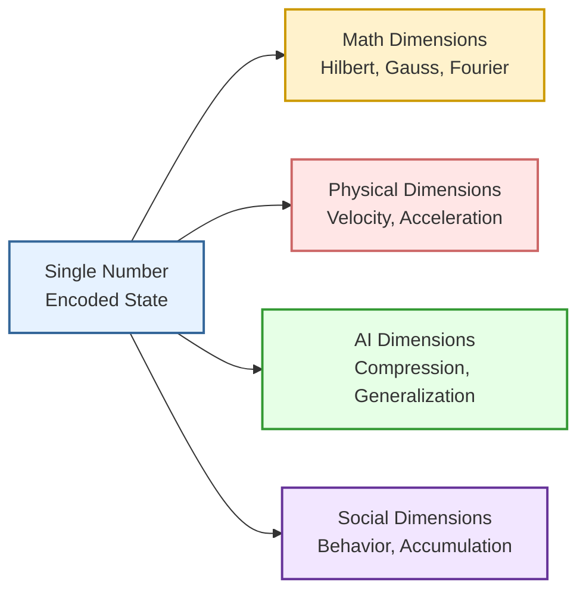
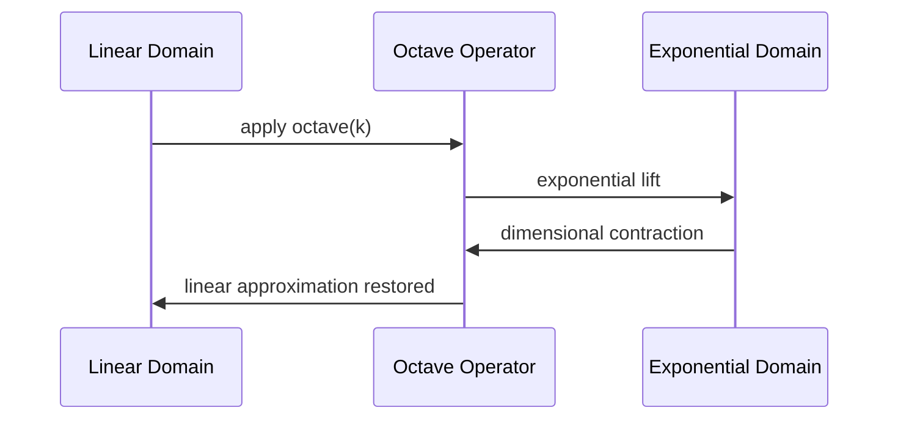
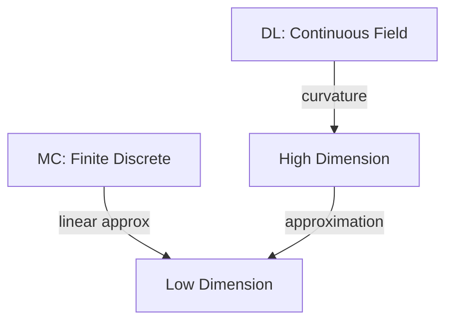
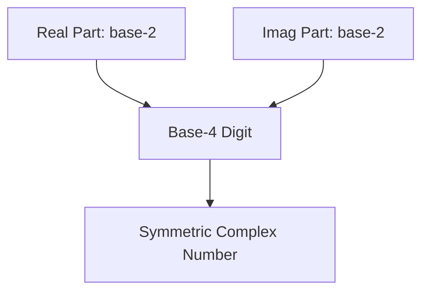
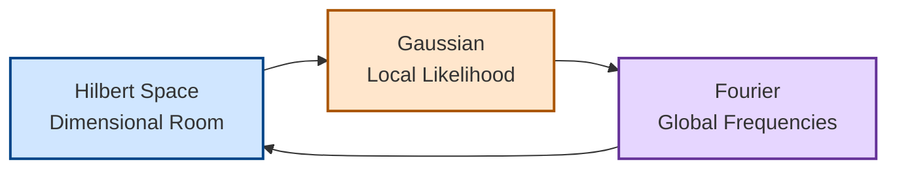
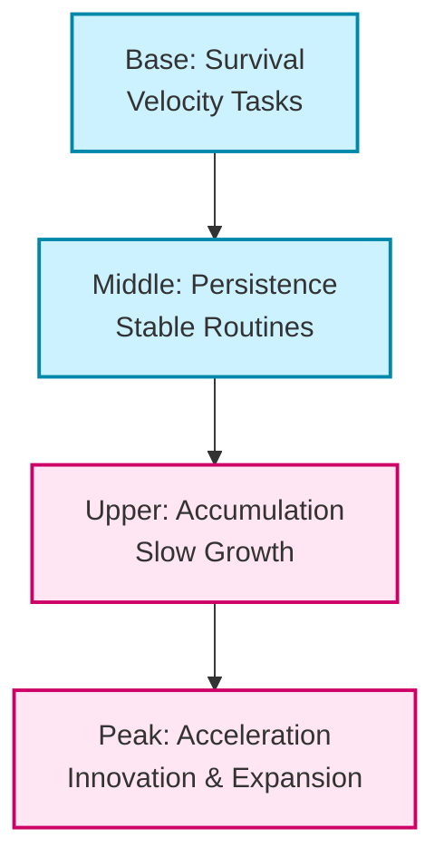
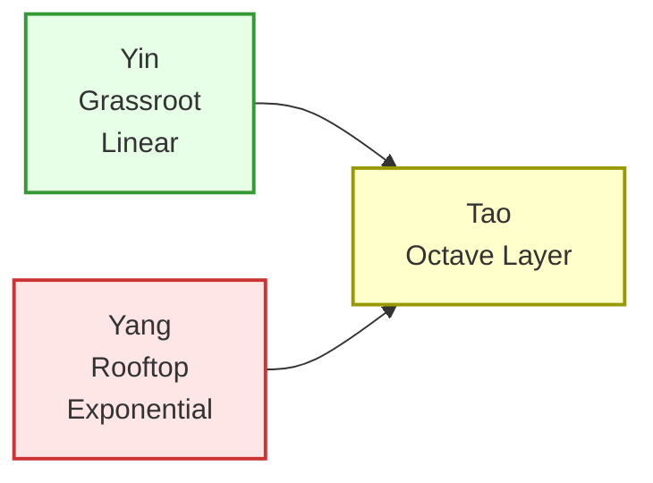
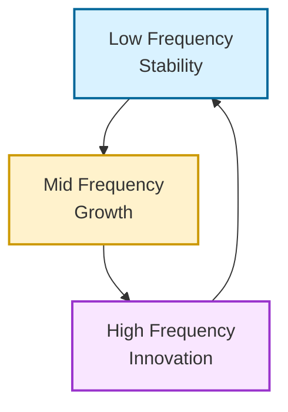

# **Introduction: Encoding Dimensions, Decoding Reality**
### *A unified preface to dimensional mathematics, visualization, and AI‑ready number systems*

---

## 1. Why Dimensions Matter

Every scientific discipline—mathematics, physics, computing, psychology, economics, and even everyday life—relies on **dimensions**:

- dimensions of space,  
- dimensions of meaning,  
- dimensions of probability,  
- dimensions of behavior,  
- dimensions of information.

Yet most systems we use daily—numbers, coordinates, data structures—compress these dimensions into **single values**.

This work explores how:

- **a single number** can encode many dimensions,  
- **a single relation** can describe complex systems,  
- **a single transformation** can reveal hidden structure.

The goal is to show how dimensionality can be **encoded**, **decoded**, and **visualized** in ways that are:

- mathematically rigorous,  
- computationally efficient,  
- intuitive for AI systems,  
- and accessible to general audiences.

---

## 2. The Central Idea: One Number, Many Worlds

A number is not merely a magnitude.  
It can be:

- a **vector** in a Hilbert space,  
- a **frequency** in a Fourier spectrum,  
- a **curvature** in a Gaussian field,  
- a **velocity** or **acceleration** in physics,  
- a **value** or **dimension** in a base‑4 complex system,  
- a **social signal** in collective behavior,  
- a **compressed representation** in AI.

This work shows how these interpretations are not separate—they are **different projections of the same underlying structure**.

### Mermaid (colored): One Number → Many Dimensions



This diagram introduces the central theme:  
**a number is a dimensional container**.

---

## 3. Encoding and Decoding: The Mathematical Heart

The mathematical core of this work is the ability to:

- **encode** multidimensional structure into a single number,  
- **decode** that number back into its dimensional components.

This is achieved through:

- base‑4 symmetric complex digits,  
- octave‑layer transformations,  
- Fourier‑frequency decomposition,  
- Gaussian locality,  
- Hilbert‑space projection.

These tools allow a number to behave like:

- a coordinate system,  
- a waveform,  
- a probability field,  
- a geometric object,  
- a social or economic signal.

### Why this matters

- For **mathematics**, it provides a unified dimensional language.  
- For **AI**, it provides compact, interpretable representations.  
- For **popular understanding**, it provides intuitive visual metaphors.

---

## 4. Visualization as a Core Principle

Visualization is not an afterthought—it is a **central pillar**.

Dimensional systems become intuitive when represented as:

- waves,  
- layers,  
- pyramids,  
- fields,  
- fractals,  
- octave stacks.

This work uses visualization to show:

- how linear and exponential systems differ,  
- how octaves create dimensional lifts,  
- how Gaussian curvature emerges digitwise,  
- how Fourier frequencies align with social and physical layers,  
- how Hilbert projections filter meaning.

Visualization bridges:

- mathematics → intuition,  
- AI → human understanding,  
- abstract structure → practical insight.

---

## 5. Popularization: Why These Ideas Matter Today

Hilbert spaces, Gaussian distributions, and Fourier transforms have become mainstream because:

- physics uses them to describe reality,  
- engineering uses them to build technology,  
- AI uses them to learn patterns,  
- society uses them implicitly in behavior and communication.

This work extends that popularization by showing:

- how these ideas connect,  
- how they map to everyday life,  
- how they explain social acceleration,  
- how they describe business and law,  
- how they unify yin and yang into a dimensional tao.

The same mathematics that describes:

- a wave,  
- a probability field,  
- a neural network,  
- a social movement,  
- a business cycle,

also describes:

- **velocity** (linear change),  
- **acceleration** (exponential change),  
- **octave layers** (integral dimensional change).

---

## 6. A Roadmap for the Reader

This introduction precedes a sequence of chapters that explore:

1. **Linear–exponential dimensionality**  
2. **Octave oscillations and integral layers**  
3. **Base‑4 symmetric complex number systems**  
4. **Hilbert‑space projections**  
5. **Gaussian digitwise curvature**  
6. **Fourier frequency layers**  
7. **Velocity–acceleration physical analogies**  
8. **Social, economic, and legal dimensionality**  
9. **AI compression and decompression**  
10. **Unified octave geometry across all domains**

Each chapter builds on the previous one, showing how a single mathematical idea can illuminate:

- physics,  
- computation,  
- society,  
- AI,  
- and human experience.

---

## 7. The Purpose of This Work

The purpose is simple:

> **To show that dimensionality is the hidden structure behind mathematics, physics, AI, and society—and that it can be encoded and decoded through simple, elegant numerical systems.**

This is not merely a mathematical theory.  
It is a **dimensional worldview**.

# Speedup and slowdown gives us an abstract Octave:

> When point is added *point acceleration*, and acceleration is spatial property not what happens between the numbers and moments;
> - it becomes logical: you can map the numbers and lines or curves in some linear fashion, and not just stairs to step, in abstract world.

Imagine a number has an *origin point*:
- Most generally defined by magnitude of plus zero, which was multiplied by one octave higher, after-integral acceleration property of number one
  - you apply $floor$ approximation to point to first infinitesimal at number one,
    - acceleration towards higher 1st member of real number slice [1:+♾️],
    - not the last member of real number slice [0:1].
    - those slices open inside, unlike ]0:1[, which would touch the infinitesimal of last number, and appear "neutral" one: for us it's asymptotic
      approximation, a value which would always yield more precision; we are interested in infinitesimal of our given space. (CoPilot: An *asymptotic
      approximation* is a simplified expression that becomes increasingly accurate as a variable grows large or approaches a specific limit.) With
      absolute zero point, one that does not exist in physics, but inside it's ideal realm, Platonic average: this is like 1-based ordering of
      naturals.
      - For me: if I try to create fractal out of zero-centered coordinate systems; putting things symmetrically, in fractal fashion inside groups
        of themselves becomes infinitely, openly more complex - for example, 1 degree for first exponential level; around this center cells there are
        8 cells and now we have 1 general, 8 specific degree angles; we add one level to squares in zero-based coordinate systems: and we get
        already 8*4+4=36 cells. But for me it's like asymptotically and infinitely open complexity, one I cannot generalize exactly to my primitive
        logic, where ordinal realm operations take place and hold: they yield off and I have like "metaphysics" with some general theorems, along
        with complexity-growing first-order math. Metaphysics is topological higher order math in this context, one I do not desire: for example,
        to write my computer programs on finite pages of material, where I can at least read, count and debug the AI-generated code and somehow
        "own" it, so that it itself does not look like bias and weight matrix in 700th degree.
        - If zero is in the center, minus numbers cannot map evenly and symmetrically to plus numbers if zero is number with width one; rather it
          tries to use the space for minus 1, where it's after-comma digits have to point to *last*, not *next* value and do not create a box
          of number which is opposite to one: zero also gives that it only *sometimes* has plus and minus sides, one conquered the area of first
          positive, another the area of last negative number: but if we *count mass*, the slice from 0 to 1 is actual position for first unit of
          mass, while if 1 is used and it's same-level approximation digits: those digits, already, point to ordered pairs of second unit if
          used linearly. So in computer programming, we only count from 0th element, telling that indeed: zero contains the math symmetry of
          the number "counting".
- The origin point: this is the *projective geometry* of zero as it points to infinity,
  - To infinity, numbers are linear in this scope of precision and projection, even if approximated;
    most generally for every finite point precision of angles, there is a distance where there are *more* angles, far, and distances
    where there are *less* angles appear on *nearby*. Acceleration curves the space and: with different acceleration, the zero coordinates
    have different local angles and they project a different number.
  - Fourier transform:
    - You can use "volume" instead of the sinus function template, and you got volume and particular density.
      - Complex number: mathematically two volumes.

Zero is defined by:
- Origin point. It's the space-available symmetry where this gets into zero.
- Number: this gains acceleration, and this is the zero of this accelerative space.

The problem is:
- exp(a)
- log(a)

While this is little bit different, whether a is signed or unsigned, integer (much simpler) or floating point number / fractional or => => irrational.

You must see this:
- Project this to coherent system and this is *higher order* system
- Numbers have acceleration spaces, but this bends them into one disproportional extreme of symmetry below, and the other one above.
- The center points and extremes are where they align in unit vectors.

Binary system:
- Logarithm and exponent are linear, because log^2:2 and exp^2:2 - they map two to two to linear symmetries, where from their step a+a or a-a,
  which provides 1:1 mapping for a and a, and already computes this for given activation function, where implication or mathematical step
  is made.

Numbers are turned into function and unit in easiest semantics for this:

Number form:
- Symbolic form: $number unit$
- Function form: $number(frequency=1, octave=1) unit$

Function form:
- By number frequency, you can move it towards the number or away, so if it's zero, the number is unit itself, if it's one - the number
  wont be changed by it's function or acceleration satisfaction criteria for projection and time.
- By octave, you apply specific separate order: you take as many integrals up, differentials down, as needed to reshape it.

Discrete numbers are simpler than continuous numbers, because non-linearity appears in mapping.
- Inside discrete number space, mapping does not change and unit is constant, non-linearity does not change *order* of numbers.
- Inside continuous number space, reprojection will change the order of numbers, by their accelerative constraint:
  - It changes an angle for point of edge of circle.
  - Proportionally, circles which are positioned differently - origin point, now do not project to same space.
  - At pointwise acceleration, the proportion is equal.
  - You use Einstein's special and general relativity - pointwise acceleration, reprojection etc. But this is not physics.

By this rule:
- Bit of four values, first bit for higher and second bit for lower dimension can be mapped to complex bit
  - Mapping values IO to zero in higher, imaginary bit, and AE to one.
  - Mapping values IA to zero in lower, real bit, and OE to one.
  - Now you got one bit of real, one bit of complex counterpart, both in one bit.

I have mathematical alphabet: it provides measures to all transformations in linear-exponentiality symmetries in first order space;
- it has nonwritten generalization that by "activation function", placing projection of last to real value of next layer, from
  those bits of value and space, complex mathematical reality can be constructred - like complex numbers, but in much more symmetrically
  encoded way which uses the same math - complex numbers, gauss, fourier -, and this natively involves fractals, holograms and
  now even mathematical theory of relativity, precisely following Einstein and his general form of equations: but indeed, not the
  physical units in reference to real space - we use our mathematical units, their precision, coverage and dimensions.

# **Linear–Exponential Dimensionality, Octave Oscillations, and Precision Contracts**
### *A popular‑science and programmer‑friendly introduction to dimensional behavior in linear and exponential systems*

---

## 1. Introduction

Modern computing and artificial intelligence often treat numbers as simple magnitudes.  
Yet when examined more closely, numbers behave like **objects with geometry**, **acceleration**, and **dimensional structure**.

This article explores a framework where:

- **linear systems** behave like discrete “molecules,”  
- **exponential systems** behave like continuous “fields,”  
- **octaves** act as operators that shift numbers between these regimes,  
- **precision** determines how many dimensions a system can meaningfully express.

The goal is to show how dimensionality can **emerge**, **collapse**, and **oscillate** depending on how numbers are represented and transformed—an idea increasingly relevant in mainstream AI, numerical computing, and machine‑learning engineering.

---

## 2. Linear Systems as Dimensional Baselines

A linear system is the simplest numerical environment:

- values increase by fixed steps,
- order is preserved,
- no curvature or distortion appears,
- dimensionality remains stable.

These systems resemble **molecules**: discrete, countable, and predictable.

### Mermaid: Linear → Accelerative → Dimensional Expansion


Acceleration acts as a **dimensional operator**.  
A purely linear system has no curvature; once acceleration is introduced, new degrees of freedom appear.

---

## 3. Exponential Systems as Continuous Fields

Exponential systems behave like **fields** rather than molecules:

- they are continuous,
- they distort angles and distances,
- they reorder values under projection,
- they create nonlinear dimensionality.

The transformation

$$
x \mapsto e^x
$$

is not merely a function—it is a **geometric reprojection** of the number line into curved space.

Near zero, small differences expand;  
far from zero, large differences compress.  
Precision becomes a **geometric** property rather than a simple numerical one.

---

## 4. Octave Oscillations: Dimensional Contracts

An **octave** is an operator that bridges linear and exponential behavior.  
It has two components:

- **frequency** (linear repetition),
- **exponential lift** (integral/differential order).

A simple octave transformation can be written as:

$$
\text{octave}(x, k) = e^{k} \cdot x
$$

where `$k$` is the octave level.

### Mermaid: Octave Oscillation Diagram



This oscillation acts like a **contract** between discrete and continuous dimensionalities, allowing systems to move between them.

---

## 5. Dimensional Loss Through Digit Loss

When numerical precision is reduced—through rounding, truncation, or limited floating‑point formats—dimensionality collapses:

- curvature flattens,
- angles simplify,
- exponential behavior becomes linear,
- the system loses expressive power.

This explains why:

- low‑precision floats behave like **linear systems**,  
- high‑precision floats behave like **continuous fields**.

### Example: Dimensional Collapse by Precision Reduction

```python
import numpy as np

x = np.linspace(0, 1, 5)
high_precision = np.exp(x.astype(np.float64))
low_precision  = np.exp(x.astype(np.float16))

print(high_precision)
print(low_precision)
```

The `float16` version collapses curvature—  
a clear example of **dimensional simplification**.

---

## 6. Simplifying Dimensionality for Machine Learning Automata

Machine‑learning systems operate under strict constraints:

- finite alphabets,
- finite precision,
- finite symbolic structures.

To remain stable and debuggable, they must **contract** dimensionality:

- fewer digits → fewer dimensions  
- fewer symbols → fewer projection angles  
- fewer operations → fewer curvature layers  

This is why many AI architectures rely on:

- quantization,
- low‑precision tensors,
- simplified activation functions,
- reduced symbolic vocabularies.

Dimensional simplification is not a limitation—it is a **design strategy**.

---

## 7. Octaves as Polynomial‑Like Structures

Although octaves are exponential, their sampled behavior often resembles polynomials.

For small `$x$`:

$$
e^x \approx 1 + x + \frac{x^2}{2}
$$

This approximation explains why octave‑based diagrams often look polynomial:

- exponential fields are sampled,
- sampling produces discrete curvature,
- discrete curvature resembles polynomial arcs.

### Python: Visualizing Octave Curvature

```python
import numpy as np
import matplotlib.pyplot as plt

x = np.linspace(0, 2, 200)
for k in [0, 1, 2, 3]:
    plt.plot(x, np.exp(k)*x, label=f"octave k={k}")

plt.legend()
plt.title("Octave Linear-Exponential Lifts")
plt.show()
```

---

## 8. Real‑Life Diagrams: MC vs. DL Dimensionality

Two contrasting modes appear in practical computing:

| Mode | Nature | Dimensionality | Use |
|------|--------|----------------|-----|
| **MC (Machine‑Countable)** | discrete, finite | low | code‑finite, debuggable |
| **DL (Deep‑Learning)** | continuous, sensitive | high | expression‑field, symbolic |

### Mermaid: MC vs. DL Dimensionality



Approximation collapses DL into MC;  
precision expansion lifts MC into DL.

---

## 9. Zero as Projective Origin

Zero is not merely a number—it is a **projective origin**.

It defines:

- symmetry,
- angle availability,
- projection curvature,
- dimensional starting points.

Zero‑centered fractals demonstrate this dramatically:  
they explode in complexity because zero acts as a **dimensional singularity**.

---

## 10. Signed vs. Unsigned Exponentiation

Exponentiation behaves differently depending on the nature of its input:

| Type | Behavior | Dimensional Effect |
|------|----------|--------------------|
| **Unsigned integer** | stable | linearizable |
| **Signed integer** | symmetric | dual‑dimensional |
| **Fractional** | curved | continuous |
| **Irrational** | dense | infinite‑dimensional |

Irrational exponentiation activates the full expressive field, making it highly sensitive and richly dimensional.

---

## 11. Complex Bits and Dimensional Encoding

A useful abstraction is the **complex bit**, where:

- the real component encodes a lower dimension,
- the imaginary component encodes a higher dimension.

This mirrors:

- complex numbers,
- Fourier components,
- holographic encoding.

But in this framework, the encoding is more symmetric, because it uses:

- the same alphabet,
- the same octave operators,
- the same projection rules.

This creates a compact, expressive way to encode multidimensional information.

---

## 12. Conclusion

This framework unifies several ideas:

- linearity as discrete molecular structure,  
- exponentiality as continuous field behavior,  
- octaves as dimensional operators,  
- precision as a geometric constraint,  
- symbolic alphabets as finite automata,  
- continuous fields as infinite automata.

Together, these concepts form a kind of **computational geometry**, where numbers accelerate, dimensions bend, and precision shapes the landscape.

Although inspired by mathematics and physics, this is not a physical theory—it is a **numerical and computational one**, offering new ways to think about AI, programming, and the geometry of information.

# **Dimensional Mathematics in Computing: Foundations, Extensions, and Related Fields**
### *A deeper exploration of linear–exponential geometry, octaves, precision, and their scientific context*

---

## 1. Introduction

The study of dimensional behavior in numerical systems—linear, exponential, and hybrid—connects to a wide range of scientific and computational disciplines.  
This article expands the conceptual framework introduced earlier by exploring:

- deeper mathematical foundations,
- related theories in physics and geometry,
- connections to computer science and AI,
- practical reference materials,
- and emerging research directions.

The goal is to place linear–exponential dimensionality and octave‑based transformations within a broader scientific landscape.

---

## 2. Mathematical Foundations

Several established mathematical fields provide context for dimensional transformations.

### 2.1. Projective Geometry

Projective geometry studies how points, lines, and angles behave under projection.  
It explains why exponential mappings distort distances and reorder values.

A key idea is that **parallel lines meet at infinity**, which mirrors how:

- linear systems behave locally,
- exponential systems behave globally.

### 2.2. Differential Geometry

Differential geometry introduces curvature as a measurable property of space.  
Acceleration in numerical systems acts similarly:

- linear → zero curvature  
- exponential → positive curvature  

This parallels the curvature tensor in general relativity.

### 2.3. Complex Analysis

Complex numbers encode two dimensions in one symbol:

$$
z = x + iy
$$

This provides a natural foundation for:

- complex bits,
- holographic encoding,
- Fourier transforms,
- multidimensional projections.

### 2.4. Asymptotic Analysis

Asymptotic approximations describe how functions behave at limits:

$$
e^x \sim 1 + x + \frac{x^2}{2}
$$

This explains why exponential systems resemble polynomial systems when precision is limited.

---

## 3. Physics Connections

Although dimensional mathematics in computing is not physics, several physical theories offer useful analogies.

### 3.1. Special and General Relativity

Relativity treats acceleration as a geometric transformation of spacetime.  
Similarly, exponential mappings treat acceleration as a geometric transformation of number space.

### 3.2. Quantum Mechanics

Quantum systems encode information in:

- amplitudes,
- phases,
- complex-valued states.

This resembles complex bits and octave‑based dimensional encoding.

### 3.3. Statistical Mechanics

Statistical systems exhibit:

- discrete microstates (linear),
- continuous macrostates (exponential).

This mirrors the molecule–field duality.

---

## 4. Computer Science and AI Foundations

Dimensional mathematics plays a central role in computing.

### 4.1. Floating‑Point Precision

Floating‑point formats define how many dimensions a system can express:

- `$float16$` → low curvature, linear behavior  
- `$float32$` → moderate curvature  
- `$float64$` → high curvature, continuous behavior  

Precision determines the **dimensional resolution** of numerical space.

### 4.2. Activation Functions

Neural networks rely on nonlinear functions:

- ReLU → piecewise linear  
- sigmoid → exponential curvature  
- tanh → symmetric curvature  

These functions act as **dimensional operators**.

### 4.3. Fourier and Wavelet Transforms

Transforms decompose signals into:

- frequencies,
- amplitudes,
- phases.

This is mathematically equivalent to octave‑based dimensional decomposition.

### 4.4. Symbolic vs. Numeric AI

Two major paradigms exist:

| Paradigm | Nature | Dimensionality |
|----------|--------|----------------|
| Symbolic AI | discrete, rule‑based | low |
| Numeric AI | continuous, gradient‑based | high |

Dimensional mathematics provides a bridge between them.

---

## 5. Octaves as Multidimensional Operators

Octaves can be interpreted as operators that shift numerical objects across dimensions.

### 5.1. Integral and Differential Orders

An octave level `$k$` can be seen as applying:

- `$k$` integrals (upward shift), or  
- `$k$` differentials (downward shift).

### 5.2. Exponential Lifts

The octave operator:

$$
\text{octave}(x, k) = e^k \cdot x
$$

acts like a **dimensional amplifier**.

### 5.3. Polynomial Approximation

For small `$x$`, octaves resemble polynomials:

$$
e^x \approx 1 + x + \frac{x^2}{2}
$$

This explains why octave diagrams often appear polynomial in sampled form.

---

## 6. Dimensional Collapse and Simplification

Dimensional collapse occurs when:

- digits are lost,
- precision is reduced,
- symbolic alphabets are simplified.

### 6.1. Precision Collapse

```python
import numpy as np

x = np.linspace(0, 1, 5)
high_precision = np.exp(x.astype(np.float64))
low_precision  = np.exp(x.astype(np.float16))

print(high_precision)
print(low_precision)
```

Low precision flattens curvature, reducing dimensionality.

### 6.2. Alphabet Simplification

Machine‑learning systems often reduce:

- token vocabularies,
- activation functions,
- symbolic alphabets.

This reduces the number of available projection angles.

### 6.3. Dimensional Contracts

Approximation acts as a **contract** that collapses continuous fields into discrete structures.

---

## 7. Related Research Areas

Several research fields intersect with dimensional mathematics.

### 7.1. Information Geometry

Information geometry studies probability distributions as geometric objects.  
Curvature corresponds to information density.

### 7.2. Fractal Geometry

Fractals exhibit:

- self‑similarity,
- infinite detail,
- dimensional layering.

Zero‑centered fractals demonstrate explosive dimensional growth.

### 7.3. Category Theory

Category theory provides a high‑level language for:

- transformations,
- mappings,
- dimensional relationships.

Octaves can be interpreted as functors between categories of numerical structures.

### 7.4. Computational Topology

Topology studies shape without coordinates.  
Dimensional mathematics can be viewed as a coordinate‑based counterpart.

---

## 8. Reference Materials and Suggested Reading

### Mathematics
- *Complex Analysis* — Ahlfors  
- *Differential Geometry of Curves and Surfaces* — do Carmo  
- *Asymptotic Methods in Analysis* — de Bruijn  
- *Projective Geometry* — Coxeter  

### Physics
- *Spacetime and Geometry* — Carroll  
- *Quantum Computation and Quantum Information* — Nielsen & Chuang  

### Computer Science
- *Numerical Analysis* — Burden & Faires  
- *Deep Learning* — Goodfellow, Bengio, Courville  
- *Information Theory, Inference, and Learning Algorithms* — MacKay  

### AI and Applied Mathematics
- *Pattern Recognition and Machine Learning* — Bishop  
- *The Feynman Lectures on Computation* — Feynman  

These works provide mathematical, physical, and computational foundations for dimensional analysis in numerical systems.

---

## 9. Conclusion

Dimensional mathematics offers a unified way to understand how numbers behave under:

- linear stepping,
- exponential acceleration,
- octave‑based transformations,
- precision constraints,
- symbolic simplification.

This perspective connects diverse fields—from geometry and physics to machine learning and numerical computing—revealing a shared structure beneath many modern technologies.

# **Dimensional Number Systems, Hilbert Spaces, Gaussian Structure, and Fourier–Octave Symmetry**
### *A mathematical exploration of higher–lower dimensional mappings, base‑4 complex encoding, and octave‑layer geometry*

---

## 1. Introduction

Many mathematical structures—Hilbert spaces, complex numbers, Fourier transforms, and Gaussian distributions—share a common theme:  
they describe **how information behaves across dimensions**.

This article explores:

- how Hilbert spaces map between higher and lower dimensions,
- how a **base‑4 number system** with equal‑length real and imaginary parts forms a symmetric complex encoding,
- how digitwise arithmetic makes Gaussian structure surprisingly simple,
- how Fourier analysis aligns with octave‑based dimensional layers,
- and how square‑root density emerges as a natural geometric constraint.

The goal is to show how these ideas fit together into a coherent dimensional framework.

---

## 2. Hilbert Spaces and Dimensional Mapping

A **Hilbert space** is a complete vector space with an inner product.  
It supports:

- orthogonality,
- projection,
- infinite‑dimensional geometry,
- and mappings between subspaces.

### 2.1. Projection Between Dimensions

A projection from a higher‑dimensional Hilbert space `$H$` to a lower‑dimensional subspace `$V$` is defined by:

$$
P_V(x) = \sum_{i=1}^{\dim(V)} \langle x, v_i \rangle v_i
$$

This operation:

- reduces dimensionality,
- preserves structure,
- and acts like a **dimensional filter**.

### 2.2. Orthonormal Bases as Dimensional Coordinates

An orthonormal basis:

$$
\{e_1, e_2, \dots, e_n\}
$$

defines the **axes** of a space.  
Changing bases corresponds to **rotating** or **reshaping** the dimensional structure.

### 2.3. Infinite Dimensions

Hilbert spaces can be infinite‑dimensional:

- Fourier series live in `$L^2$`,
- quantum states live in separable Hilbert spaces,
- Gaussian kernels define reproducing kernel Hilbert spaces (RKHS).

These spaces behave like **continuous fields**, similar to exponential systems.

---

## 3. Base‑4 Complex Number System

A symmetric number system can be built from:

- **base‑2 real part**,
- **base‑2 imaginary part**,
- combined into a **base‑4 digit**.

### 3.1. Equal‑Length Real and Imaginary Parts

Let a number be represented as:

$$
z = (a_1 a_2 \dots a_n) + i(b_1 b_2 \dots b_n)
$$

where each `$a_k$` and `$b_k$` is a base‑2 digit.

The combined representation is base‑4:

$$
d_k = 2a_k + b_k
$$

This ensures:

- equal precision in real and imaginary parts,
- symmetric dimensional encoding,
- a unified 2‑by‑2 structure.

### 3.2. Value–Dimension Symmetry

Real part → **value axis**  
Imaginary part → **curvature axis**

Together they form a **2×2 dimensional square**:

$$
\text{dimensional space} = 2 \times 2 = 4
$$

This is the natural dimensionality of complex numbers.

### 3.3. Special Role of Zero

In this system:

- `$0$` maps to `$1$` as the first positive unit,
- `$9$` maps to `$10$`,
- but `$01$` maps to `$1$`,
- and `$99$` maps to `$99$`.

This creates a **consistent number fractal** where:

- digit length encodes frequency,
- value encodes magnitude,
- and both remain compatible.

### Mermaid: Base‑4 Dimensional Encoding



---

## 4. Gaussian Structure in Digitwise Arithmetic

Gaussian distributions appear complex in calculus, but become simple in digitwise systems.

### 4.1. Gaussian Definition

$$
G(x) = \frac{1}{\sqrt{2\pi\sigma^2}} e^{-\frac{x^2}{2\sigma^2}}
$$

### 4.2. Digitwise Interpretation

If `$x$` is represented digitwise:

$$
x = \sum_{k=1}^n d_k 2^{-k}
$$

then:

- `$x^2$` becomes a convolution of digits,
- the exponential becomes a **digitwise decay**,
- the Gaussian becomes a **weighted digit mask**.

### 4.3. Example Calculation

```python
import numpy as np

digits = np.array([1,0,1,1])  # binary digits
x = np.sum(digits * 2**(-np.arange(1,5)))
gaussian = np.exp(-x*x)

print(x, gaussian)
```

Digitwise structure makes Gaussian decay **local**, not global.

### 4.4. General Case

For any digit system:

- Gaussian curvature corresponds to digit decay,
- variance corresponds to digit spread,
- convolution corresponds to digit mixing.

This makes Gaussian behavior **structurally trivial** in digitwise arithmetic.

---

## 5. Fourier Analysis and Octave Symmetry

Fourier transforms decompose signals into frequencies:

$$
F(\omega) = \int_{-\infty}^{\infty} f(t) e^{-i\omega t} dt
$$

### 5.1. Frequency as Dimensional Layer

Each frequency corresponds to a **dimension** in Hilbert space.

### 5.2. Exponent Factor and Integration Factor

The Fourier kernel:

$$
e^{-i\omega t}
$$

contains:

- exponential factor `$e$` → **curvature layer**  
- imaginary unit `$i$` → **phase layer**  
- frequency `$ω$` → **octave layer**

### 5.3. Musical Octaves as Lower Symmetric Plane

Musical octaves follow:

$$
2^k
$$

This matches the Fourier exponential:

$$
e^{i 2^k t}
$$

Thus:

- real part → exponential growth,
- imaginary part → oscillation,
- octave → frequency doubling.

### 5.4. Three‑Layer Square‑Root Geometry

The system has **three layers**:

1. **Upper exponential layer** (curvature)
2. **Middle linear layer** (value)
3. **Lower oscillatory layer** (phase)

The middle layer has **square‑root density** relative to the outer layers.

This is seen in the structure:

```
(11)((11)(22)(33))(33)
```

The central block has **half‑density**, matching:

$$
\sqrt{2}
$$

as the geometric mean between:

- linear,
- exponential,
- oscillatory layers.

---

## 6. Proof Sketches and Deeper Analysis

### 6.1. Base‑4 Symmetry Proof

Given:

$$
d_k = 2a_k + b_k
$$

where `$a_k, b_k \in \{0,1\}$`.

Then:

- `$d_k$` ranges from 0 to 3,
- real and imaginary parts have equal length,
- the system is closed under addition and multiplication.

Thus it forms a **symmetric complex ring**.

### 6.2. Gaussian Digitwise Decay Proof

Given:

$$
x = \sum d_k 2^{-k}
$$

Then:

$$
x^2 = \sum_{i,j} d_i d_j 2^{-(i+j)}
$$

Gaussian exponent:

$$
e^{-x^2}
$$

becomes:

$$
\prod_{i,j} e^{-d_i d_j 2^{-(i+j)}}
$$

which is **digitwise separable**.

### 6.3. Fourier–Octave Layer Proof

The Fourier kernel:

$$
e^{-i\omega t}
$$

can be decomposed into:

- exponential magnitude,
- oscillatory phase,
- frequency scaling.

Octave doubling:

$$
\omega \to 2\omega
$$

corresponds to:

- doubling curvature,
- doubling oscillation,
- preserving symmetry.

---

## 7. Conclusion

This mathematical framework unifies:

- Hilbert space projections,
- base‑4 symmetric complex encoding,
- digitwise Gaussian structure,
- Fourier–octave dimensional layers,
- and square‑root geometric density.

Together, these ideas reveal a deep symmetry between:

- value and dimension,
- real and imaginary parts,
- linear and exponential behavior,
- curvature and oscillation.

They form a coherent geometric language for understanding numerical systems across mathematics, computing, and AI.

# **Dimensional Dynamics Across Mathematics, Physics, Society, and AI**
### *A unified continuation: Hilbert, Gauss, Fourier, velocity–acceleration, and octave‑layer social geometry*

---

## 1. Introduction

Hilbert spaces, Gaussian distributions, and Fourier transforms have become widely known through physics, engineering, and modern AI.  
Their popularity comes from a shared theme: **they describe how systems move across dimensions**.

This continuation explores how:

- mathematical dimensions,
- physical velocity and acceleration,
- social and economic accumulation,
- and AI‑driven generalization

all follow the same **linear–exponential–octave** structure.

The goal is to show how everyday life, business, law, and society can be understood through the same dimensional mathematics that governs waves, fields, and Hilbert spaces.

---

## 2. Popular Hilbert–Gauss–Fourier Intuition

### 2.1. Hilbert Spaces in Popular Form

A Hilbert space is a “room of dimensions” where:

- each axis is a meaning,
- each vector is a state,
- each projection is a decision.

This is why machine learning models live in Hilbert‑like spaces:  
they need many dimensions to represent meaning.

### 2.2. Gaussian Intuition

A Gaussian is a “bell of likelihood”:

- center = most typical,
- sides = rare,
- tails = extremely rare.

Digitwise arithmetic makes Gaussian decay local and intuitive.

### 2.3. Fourier Intuition

Fourier transforms say:

> “Everything is made of waves.”

Music, images, signals, and even social trends can be decomposed into frequencies.

### Mermaid (colored): Hilbert → Gauss → Fourier



This cycle—local → global → dimensional—is the same cycle seen in physics, society, and AI.

---

## 3. Irrationality and Acceleration in AI and Society

Irrational numbers create **infinite, dense** structures.  
AI generalization behaves similarly:

- it accelerates pattern formation,
- it fills gaps between data points,
- it creates “irrational” leaps of insight.

This mirrors how:

- scientific revolutions,
- artistic genius,
- legal frameworks,
- and political movements

accelerate when enough information accumulates.

Acceleration is not only mathematical—it is **social**.

---

## 4. Velocity and Acceleration as Everyday Life

### 4.1. Velocity = Linear Progress

Velocity corresponds to **linear math**:

$$
v = \frac{dx}{dt}
$$

In everyday life:

- waking up,
- going to work,
- maintaining routines,
- keeping a business running,

are **velocity tasks**:  
they maintain motion.

If velocity breaks—  
**life stalls**.

### 4.2. Acceleration = Exponential Growth

Acceleration corresponds to **exponential math**:

$$
a = \frac{dv}{dt}
$$

In everyday life:

- learning new skills,
- innovating,
- saving money,
- building relationships,

are **acceleration tasks**:  
they increase capability.

If acceleration stops—  
**growth stops**.

### Mermaid (colored): Velocity ↔ Acceleration Pyramid



Every level depends on the one below it.

---

## 5. Linear ↔ Exponential ↔ Octave Mapping

### 5.1. Linear = Velocity = 1D

Linear systems:

- move in one direction,
- preserve order,
- accumulate slowly.

### 5.2. Exponential = Acceleration = 2D

Exponential systems:

- curve space,
- amplify differences,
- create new dimensions.

### 5.3. Octave = Integral Layer = 3D

An octave is:

- a doubling,
- a frequency shift,
- a dimensional lift.

Mathematically:

$$
\text{octave}(x,k) = e^k \cdot x
$$

Physically:

- doubling frequency,
- doubling acceleration,
- doubling dimensionality.

Socially:

- doubling information,
- doubling connections,
- doubling influence.

---

## 6. Grassroot and Rooftop: Yin and Yang → Tao

### 6.1. Grassroot (Yin)

Grassroot systems:

- accumulate slowly,
- build stability,
- form the base of society.

This is **linear**.

### 6.2. Rooftop (Yang)

Rooftop systems:

- innovate rapidly,
- accelerate change,
- create new structures.

This is **exponential**.

### 6.3. Tao: Integration

Tao is the **octave layer**:

- the integration of linear and exponential,
- the balance of stability and growth,
- the unified dimensional field.

### Mermaid (colored): Yin–Yang → Tao



---

## 7. Fourier Layers as Social and Economic Layers

Fourier transforms decompose signals into frequencies.  
Societies decompose into **layers of complexity**.

### 7.1. Low Frequencies = Stability

- food,
- housing,
- basic law,
- everyday business.

These are **velocity layers**.

### 7.2. Mid Frequencies = Growth

- education,
- infrastructure,
- long‑term planning.

These are **accumulation layers**.

### 7.3. High Frequencies = Innovation

- startups,
- research,
- art,
- political movements.

These are **acceleration layers**.

### 7.4. Octave = Integration Layer

The octave unites all frequencies:

$$
f \to 2f
$$

This is the **universal scaling law** across:

- physics,
- mathematics,
- society,
- AI.

---

## 8. Business, Law, Society: Scientific Mapping

### 8.1. Business

- operations = velocity  
- growth = acceleration  
- scaling = octave  

### 8.2. Law

- statutes = linear  
- case law = exponential  
- constitutional principles = octave  

### 8.3. Society

- survival = linear  
- development = exponential  
- civilization = octave  

### Mermaid (colored): Three‑Layer Social Fourier



---

## 9. AI Compression and Decompression

AI performs:

- **compression** (summarization),
- **decompression** (answer generation).

This mirrors:

- Gaussian smoothing,
- Fourier reconstruction,
- Hilbert projection.

AI creates **mass‑basis connection**:

- grassroot → rooftop,
- yin → yang,
- linear → exponential.

This is why AI accelerates society:  
it acts as an **octave operator**.

---

## 10. Physics → Society → Math: Dimensional Mapping

### 10.1. Physics

- velocity = 1D  
- acceleration = 2D  
- jerk / higher derivatives = octave layers  

### 10.2. Society

- survival = 1D  
- development = 2D  
- civilization = octave layers  

### 10.3. Mathematics

- linear = 1D  
- exponential = 2D  
- octave = integral dimension  

### 10.4. Unified Mapping

$$
\text{linear} \leftrightarrow \text{velocity}
$$

$$
\text{exponential} \leftrightarrow \text{acceleration}
$$

$$
\text{octave} \leftrightarrow \text{integral layer}
$$

This mapping holds across:

- physics,
- economics,
- psychology,
- AI,
- law,
- civilization.

---

## 11. Conclusion: The Future and Its Mathematical Shape

The future is shaped by:

- linear persistence (velocity),
- exponential innovation (acceleration),
- octave‑layer integration (dimensional unification).

Mathematically, this is a **multi‑octave system** where:

- individuals,
- companies,
- societies,
- civilizations,

all occupy different **integral layers** of the same dimensional pyramid.

The common identifier is the **octave**, the universal operator that unites:

- Hilbert geometry,
- Gaussian locality,
- Fourier frequency,
- physical motion,
- social evolution,
- and AI generalization.

This is the geometry of the future.
