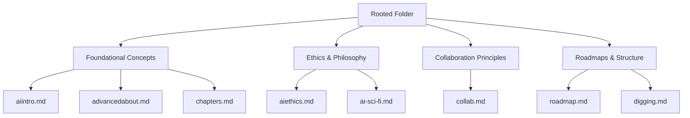
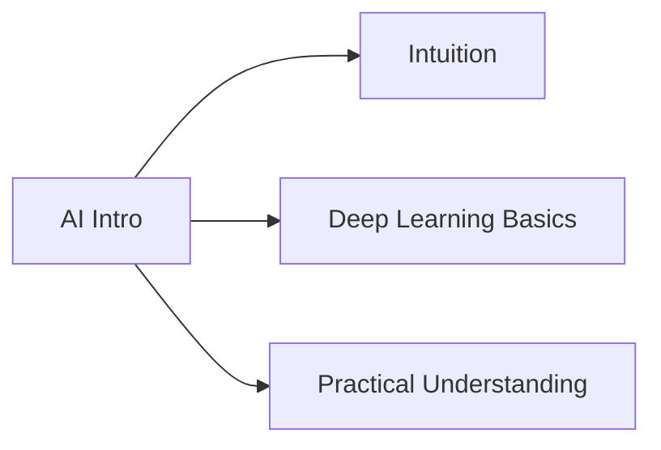
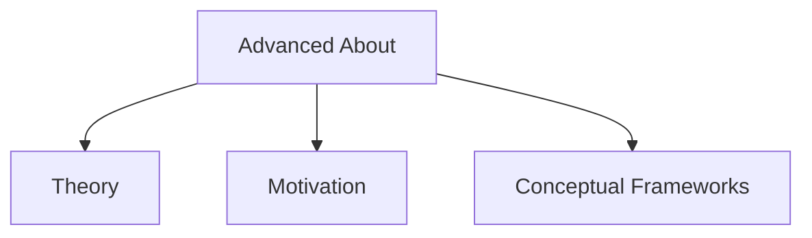
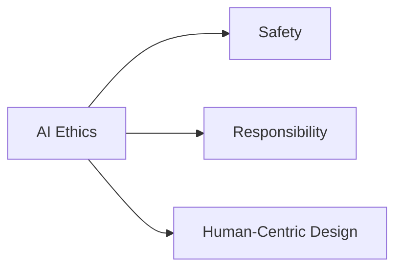
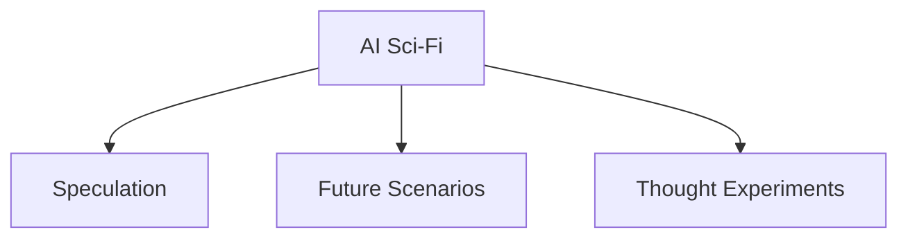
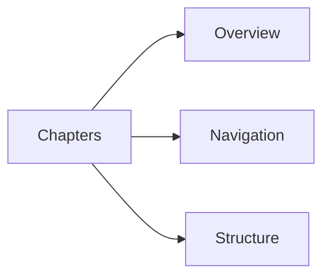
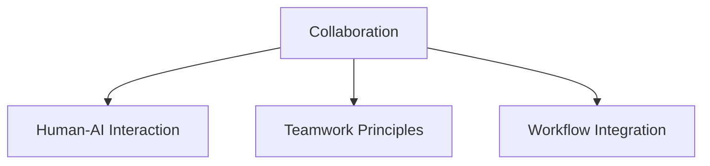
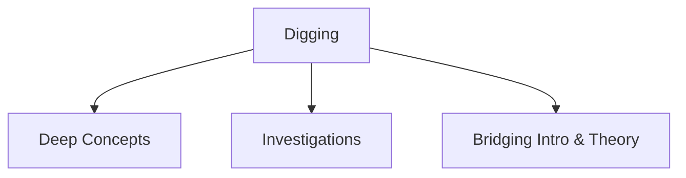
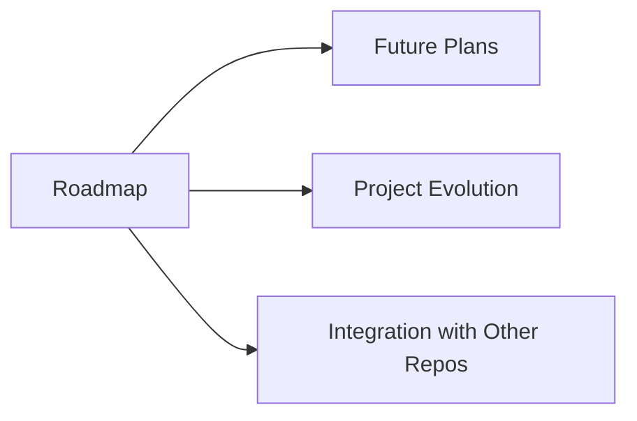
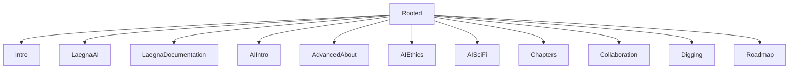

# Rooted — Deep Foundations of Laegna AI Basics

The files in **Rooted** — together with the files in the **Intro** folder (which sits next to Rooted in the repository structure) — were originally located in the **main folder** of the repository.  
However, the main folder became crowded, the file list grew long, and the explanatory text below the file list became difficult to see.  
To restore clarity and structure, these foundational texts were moved into this **Rooted** folder.

This folder contains the *deep‑root* chapters of the Laegna AI Basics project: conceptual foundations, philosophical grounding, ethics, collaboration principles, and long‑term roadmaps.  
They complement the more introductory materials in the **Intro** folder and the more experimental or modular repository structures such as **LaegnaAI**, **LaegnaDocumentation**, and **LaegnaMath**.

---

## 📚 Overview Diagram

---

# 📖 Chapters

Below each file is introduced with:
- **Chapter title**
- **Relative link**
- **Summary**
- **Explanation**
- **A mermaid diagram** illustrating its conceptual role

---

## 1. **AI Intro — Foundations & Intuition**
### File: [`aiintro.md`](./aiintro.md)

**Summary:**  
A simplified, intuitive introduction to AI and Deep Learning, written to help programmers and non‑mathematicians understand the core ideas without heavy formalism.

**Explanation:**  
This chapter reflects the philosophy seen across Laegna AI repositories: *clarity over complexity*.  
It introduces tensors, layers, training, and intuition‑based reasoning — the same spirit found in LaegnaAI and LaegnaDocumentation, where accessibility and modularity are emphasized.

---

## 2. **Advanced About — Deeper Theoretical Roots**
### File: [`advancedabout.md`](./advancedabout.md)

**Summary:**  
A deeper dive into the theoretical motivations behind the Laegna approach to AI, including conceptual frameworks and philosophical underpinnings.

**Explanation:**  
This chapter connects to the broader Laegna ecosystem (e.g., LaegnaAI, LaegnaMath) by outlining the “why” behind the system — the deeper layers of reasoning, structure, and abstraction.

---

## 3. **AI Ethics — Responsibility & Alignment**
### File: [`aiethics.md`](./aiethics.md)

**Summary:**  
A reflection on ethical considerations in AI development, including safety, responsibility, and human‑centric design.

**Explanation:**  
This chapter aligns with the philosophical tone found in the author’s other AI‑related repositories.  
It emphasizes grounded, practical ethics rather than abstract academic frameworks.

---

## 4. **AI Sci‑Fi — Speculative Thought Experiments**
### File: [`ai-sci-fi.md`](./ai-sci-fi.md)

**Summary:**  
A creative exploration of AI through speculative scenarios and science‑fiction‑style thought experiments.

**Explanation:**  
This chapter serves as a conceptual sandbox — a place to explore future possibilities, risks, and imaginative models.  
It complements the more grounded chapters by expanding the horizon of what AI *could* become.

---

## 5. **Chapters — Structural Overview**
### File: [`chapters.md`](./chapters.md)

**Summary:**  
A structural map of the entire Laegna AI Basics project, outlining how the chapters relate to each other.

**Explanation:**  
This file acts as a table of contents and conceptual index.  
It mirrors the modular design philosophy seen in LaegnaDocumentation — where structure and clarity are essential.

---

## 6. **Collaboration — Working With AI & Humans**
### File: [`collab.md`](./collab.md)

**Summary:**  
Guidelines for collaborating with AI systems and with other humans in AI‑assisted workflows.

**Explanation:**  
This chapter reflects the collaborative ethos of the Laegna ecosystem:  
AI is not a replacement for human creativity but a partner in reasoning, exploration, and documentation.

---

## 7. **Digging — Investigating Concepts More Deeply**
### File: [`digging.md`](./digging.md)

**Summary:**  
A set of deeper investigations into specific AI concepts, encouraging readers to “dig” into the layers beneath the surface.

**Explanation:**  
This chapter is a bridge between introductory material and advanced theory.  
It encourages curiosity and exploration — a theme consistent with Laegna’s modular, exploratory design.

---

## 8. **Roadmap — Long‑Term Vision**
### File: [`roadmap.md`](./roadmap.md)

**Summary:**  
A forward‑looking roadmap describing how the Laegna AI Basics project may evolve.

**Explanation:**  
This chapter outlines future directions, potential expansions, and how the Rooted materials connect to other Laegna repositories such as LaegnaAI and LaegnaDocumentation.

---

# 🌱 Final Structure Diagram

---

# ✔️ End of README

