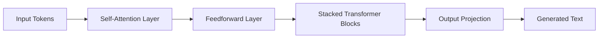

# Mathematics Made Simple for AI: A Gentle Introduction

_Note: this is the AI‑generated article based on the structure of mine_, with some basic math you can use in PyTorch or LitGPT.

This article explores the essential math behind artificial intelligence using simple, intuitive ideas, metaphors, and minimal formal notation. Think of AI as a "brain" built from layers of mathematical operations. Just as our human brain processes sensory inputs and produces thoughts without exposing every hidden detail, AI models use tensors, matrices, activation functions, and attention to transform raw data into meaningful results.

---

## 1. The AI Brain: Components and Process

Imagine setting up a deep learning system like assembling a brain. First, we need the hardware—computing platforms, processing cores, and specialized libraries (like PyTorch or TensorFlow). Then we create the *model* or *brain*, which is composed of multiple layers:

- **Input tensor** → holds text, numbers, or images  
- **Hidden layers** → process the input step by step  
- **Output layer** → produces the final result  

We can think of the entire process as a chain of functions.  
If `f1`, `f2`, and `f3` are operations, then:

```
o = f3( f2( f1(i + ib) + h1b ) + h2b )
```

Where:

- `i` = input  
- `ib`, `h1b`, `h2b` = biases (small adjustments)  

This chain resembles how our subconscious processes raw feelings and turns them into coherent thoughts.

### 🧠 Conceptual Flow Diagram


---

## 2. Data Structures: Tensors and Matrices

### Tensors  
Tensors are multidimensional lists of numbers:

- 1D tensor → `[1, 2, 3]`
- 2D tensor → matrix  
- 3D+ tensors → images, videos, feature stacks  

During training, tensors “heat up” (values change rapidly) and later “cool down” (stabilize), similar to how experiences shape our understanding.

### Matrices  
A matrix is a 2D grid of numbers used for linear transformations.

A common operation:

```
v_out = W × v_in + b
```

Where:

- `W` = weight matrix  
- `b` = bias vector  
- `v_in` = input vector  
- `v_out` = output vector  

Matrix multiplication is like applying a rotation, scaling, or shift to a point in space.

### 🔢 Tensor/Matrix Operation Diagram


---

## 3. The Simplest Network and Generalization

A basic neural network (perceptron) uses:

- Input: `i`
- Weight matrix: `W`
- Bias vector: `b`
- Output: `o`

```
o = W × i + b
```

The network learns by adjusting `W` and `b` through **backpropagation**—tiny updates over many iterations.

### Activation Functions  
ReLU (Rectified Linear Unit):

```
ReLU(x) = x   if x > 0
ReLU(x) = 0   if x ≤ 0
```

ReLU creates a “free variable space” for positive values and zeroes out negatives, helping the network form meaningful patterns.

---

## 4. Attention, GPT, and the Exponential Effect

### Attention Mechanisms  
Attention helps the network decide what matters most.

- **Self‑Attention:** a layer looks at itself  
- **Cross‑Attention:** layers look at each other  

This forms a web of relationships—like lateral thinking.

### GPT and Scaling  
GPT models process language through many hidden layers.

A simple conceptual expression:

```
Answer = BrainWithKnowledge(Question)
```

Fine‑tuning (tiny adjustment):

```
BrainWithKnowledge^(0.001)(Question) → Answer
```

Scaling cost grows roughly with `n²` when vector sizes grow by `n`.  
This quadratic growth is why large models require massive compute.

### 🧬 Attention & GPT Structure Diagram


---

## Conclusion

By blending simple arithmetic with creative metaphors, we uncover the magic behind modern AI. Tensors hold data in many dimensions, matrices transform these data points like rotations and translations in space, and activation functions introduce the non‑linearity necessary for genuine learning. Attention mechanisms provide a way to focus on what matters most, and fine‑tuning refines the model to perform almost magically.

Each mathematical operation is a small building block in the vast architecture of machine intelligence—simple on its own, profound in combination.

